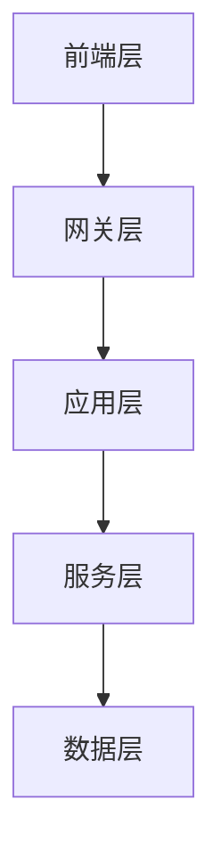
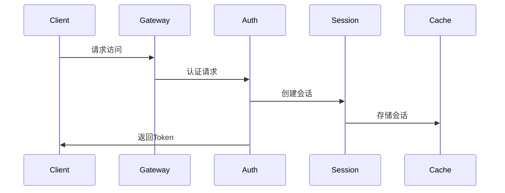
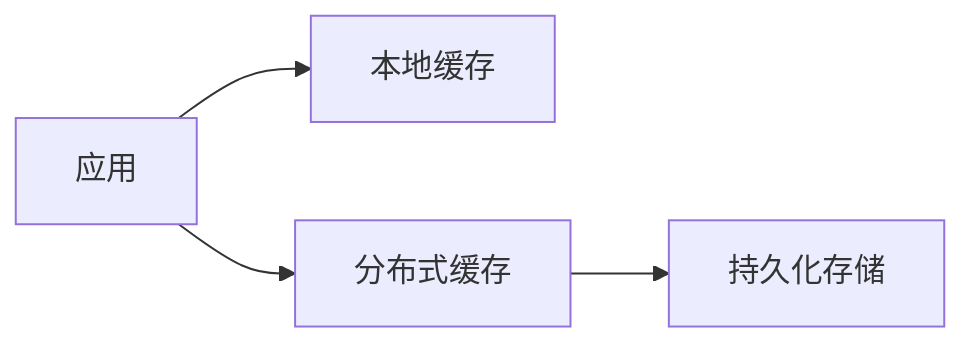
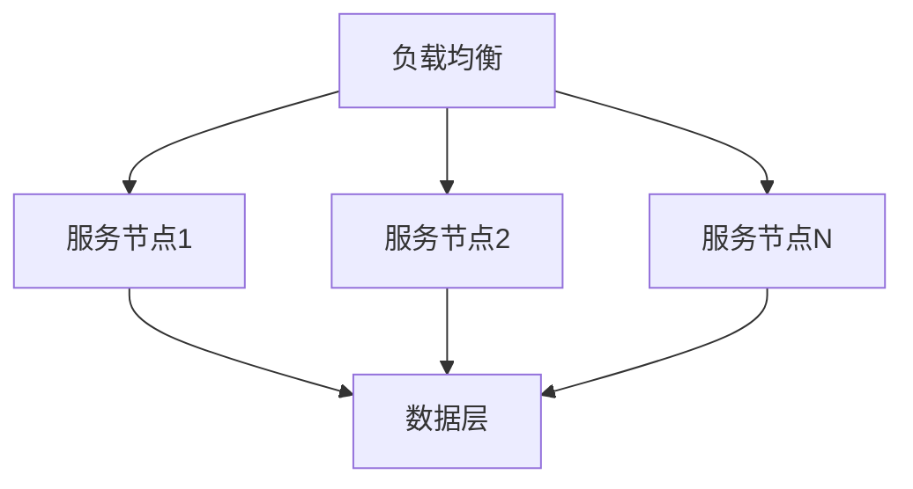
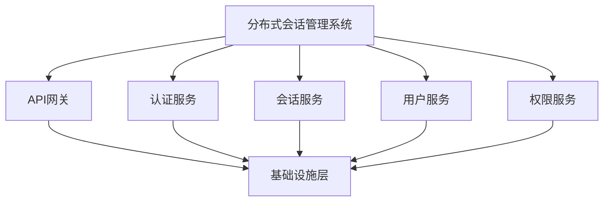

我将为您提供一个落地这个分布式系统架构的最佳实践执行流程。

# 分布式系统架构落地执行流程

## 1. 前期准备阶段

### 1.1 团队组建
- 组建核心架构团队
  - 架构师˜
  - 技术负责人
  - DevOps工程师
  - 安全专家
- 组建开发团队
  - 按服务模块划分团队
  - 明确团队职责和分工
- 组建运维团队
  - 系统运维
  - 监控告警
  - 数据库管理

### 1.2 技术栈确定
- 开发框架选型
- 中间件选型
- 工具链选型
- 制定技术规范文档

### 1.3 基础设施规划
- 资源评估
  - 服务器配置需求
  - 网络带宽需求
  - 存储容量规划
- 环境规划
  - 开发环境
  - 测试环境
  - 预生产环境
  - 生产环境

## 2. 基础设施搭建阶段

### 2.1 Kubernetes集群搭建
1. 搭建Master节点
2. 配置Worker节点
3. 网络插件部署
4. 存储系统配置

### 2.2 中间件部署
1. 消息中间件
   - 部署MQ集群
   - 配置事件总线
2. 数据存储
   - Redis集群部署
   - MariaDB集群部署
   - Elasticsearch集群部署

### 2.3 监控系统搭建
1. 部署监控组件
2. 配置日志收集
3. 部署链路追踪
4. 配置告警系统

## 3. 核心功能实现阶段

### 3.1 认证授权系统
1. 实现OAuth2.0服务
2. 实现JWT服务
3. 完成认证服务
4. 实现授权服务

### 3.2 分布式会话管理
1. 实现会话服务
2. 集成Redis存储
3. 会话同步机制
4. 会话清理机制

### 3.3 网关层实现
1. API网关部署
2. 配置路由规则
3. 实现Token验证
4. 配置限流规则

## 4. 业务服务实现阶段

### 4.1 优先级划分
1. P0核心服务
   - 用户服务
   - 项目服务
   - 问题服务
2. P1重要服务
   - 工作流服务
   - 看板服务
3. P2辅助服务
   - 通知服务
   - 报表服务

### 4.2 迭代实现
- Sprint 1: 核心服务基础功能
- Sprint 2: 核心服务完善
- Sprint 3: 重要服务开发
- Sprint 4: 辅助服务开发

## 5. 服务治理实现阶段

### 5.1 服务注册与发现
1. 部署服务注册中心
2. 服务注册机制
3. 服务发现机制

### 5.2 配置中心
1. 部署配置中心
2. 配置管理策略
3. 配置热更新机制

### 5.3 熔断与限流
1. 实现熔断器
2. 配置限流规则
3. 降级策略实现

## 6. 测试与优化阶段

### 6.1 测试计划
1. 单元测试
2. 集成测试
3. 性能测试
4. 安全测试

### 6.2 性能优化
1. 服务性能优化
2. 数据库优化
3. 缓存策略优化
4. 网络传输优化

## 7. 部署上线阶段

### 7.1 部署策略
1. 制定部署计划
2. 准备回滚方案
3. 灰度发布策略

### 7.2 上线流程
1. 预发布验证
2. 灰度发布
3. 全量发布
4. 运行监控

## 8. 运维保障阶段

### 8.1 运维制度
1. 建立运维规范
2. 制定应急预案
3. 建立值班制度

### 8.2 持续优化
1. 性能监控分析
2. 问题跟踪改进
3. 容量规划调整

## 9. 关键成功要素

### 9.1 技术要素
- 技术栈的统一性
- 代码规范的执行
- 自动化程度
- 监控的完整性

### 9.2 管理要素
- 团队协作效率
- 需求管理流程
- 变更控制流程
- 风险管理机制

### 9.3 进度控制
- 里程碑规划
- 定期进度审查
- 风险预警机制
- 资源调配机制

## 10. 注意事项

1. 循序渐进
   - 分阶段实施
   - 保证核心功能优先
   - 逐步完善功能

2. 标准规范
   - 统一开发规范
   - 统一部署标准
   - 统一监控指标

3. 安全保障
   - 定期安全评估
   - 漏洞扫描修复
   - 应急预案演练

4. 文档管理
   - 架构设计文档
   - 开发规范文档
   - 运维手册
   - 故障处理手册


是的,在实现系统之前,我们需要做好详细的系统设计。我来为您列出系统设计的关键步骤和内容:

# 分布式系统详细设计方案

## 1. 系统架构设计

### 1.1 技术架构设计


1. 技术选型
   - 前端框架: React/Vue
   - 后端框架: Spring Cloud
   - 数据库: MariaDB
   - 缓存: Redis
   - 消息队列: RabbitMQ/Kafka
   - 搜索引擎: Elasticsearch

2. 系统分层
   - 展现层设计
   - 网关层设计
   - 应用层设计
   - 服务层设计
   - 数据层设计

### 1.2 数据架构设计

1. 数据模型设计
   - 实体关系图(ER图)
   - 数据字典
   - 数据流图

2. 存储方案设计
   - 数据分片策略
   - 读写分离方案
   - 分库分表方案
   - 缓存策略

## 2. 详细设计

### 2.1 核心模块设计

1. 认证授权模块


2. 分布式会话设计
   - 会话存储结构
   - 会话同步机制
   - 会话清理策略
   - 会话安全机制

3. 业务服务设计
   - 服务接口定义
   - 服务交互流程
   - 数据访问层设计
   - 业务逻辑层设计

### 2.2 接口设计

1. API设计规范
```json
{
    "api": {
        "version": "v1",
        "path": "/api/v1/resource",
        "method": "POST",
        "request": {
            "headers": {},
            "body": {}
        },
        "response": {
            "code": 200,
            "data": {}
        }
    }
}
```

2. 接口文档
   - RESTful API规范
   - 请求/响应格式
   - 错误码规范
   - 接口版本控制

### 2.3 数据库设计

1. 表结构设计
```sql
CREATE TABLE user (
    id BIGINT PRIMARY KEY,
    username VARCHAR(50),
    password VARCHAR(100),
    status INT,
    created_time TIMESTAMP,
    updated_time TIMESTAMP
);
```

2. 索引设计
   - 主键索引
   - 唯一索引
   - 普通索引
   - 复合索引

### 2.4 缓存设计

1. 缓存策略
   - 缓存粒度
   - 缓存更新策略
   - 缓存失效策略
   - 缓存预热机制

2. 缓存架构


## 3. 安全设计

### 3.1 安全架构
1. 认证机制
   - OAuth2.0流程
   - JWT token设计
   - SSO设计

2. 授权机制
   - RBAC模型设计
   - 权限控制粒度
   - 动态权限策略

### 3.2 数据安全
1. 数据加密
   - 传输加密
   - 存储加密
   - 敏感数据处理

2. 访问控制
   - API访问控制
   - 数据访问控制
   - 操作审计日志

## 4. 性能设计

### 4.1 性能优化
1. 系统性能目标
   - 响应时间
   - 并发能力
   - 吞吐量

2. 优化策略
   - 代码层优化
   - 数据库优化
   - 缓存优化
   - 网络优化

### 4.2 扩展性设计


1. 水平扩展
   - 服务无状态设计
   - 集群扩展机制
   - 数据分片策略

2. 垂直扩展
   - 服务拆分原则
   - 模块解耦设计
   - 接口版本控制

## 5. 可用性设计

### 5.1 高可用架构
1. 故障转移
   - 服务熔断策略
   - 失败重试机制
   - 降级策略

2. 灾备方案
   - 多活部署
   - 数据备份策略
   - 恢复机制

### 5.2 监控设计
1. 监控指标
   - 系统指标
   - 业务指标
   - 性能指标

2. 告警策略
   - 告警级别
   - 告警规则
   - 告警通知

## 6. 设计文档

### 6.1 文档清单
1. 架构设计文档
   - 系统架构图
   - 部署架构图
   - 数据架构图

2. 详细设计文档
   - 模块设计文档
   - 接口设计文档
   - 数据库设计文档

3. 规范文档
   - 开发规范
   - 接口规范
   - 安全规范

这些设计文档和规范将指导后续的开发实现工作,确保系统实现符合预期目标。在实际开发过程中,还需要根据具体情况对设计进行适当调整和优化。


是的，我们已经完成了分布式会话管理系统的详细技术架构设计。这个架构设计文档包含了以下关键部分：
整体架构
分层架构设计
各层职责划分
系统整体结构
技术架构图及说明
详细的组件关系图
各组件功能说明
组件间交互关系
关键流程说明
用户认证流程
会话管理流程
数据访问流程
监控告警流程
服务治理流程
应用架构
微服务架构设计
组件详细说明
数据架构设计
部署架构设计
服务划分
接入层服务
核心业务服务
基础支撑服务
数据服务
技术选型
基础框架选型
存储方案选型
中间件选型
监控运维选型
安全、高可用和扩展性设计
安全技术方案
高可用策略
扩展性设计
这个架构设计文档为后续的详细设计和实现提供了完整的指导框架。下一步可以基于这个架构开始进行：
数据库详细设计
API接口设计
服务接口设计
部署方案设计
测试方案设计
您觉得需要在哪个方面进行更详细的设计？





# 每个组件的设计要素：
## A. 功能设计
- 核心功能
- 业务流程
- 异常处理
- 扩展点
## B. 接口设计
- API定义
- 接口规范
- 参数校验
- 返回格式
## C. 数据设计
- 数据模型
- 存储方案
- 缓存策略
- 数据流转
## D. 性能设计
- 并发处理
- 响应时间
- 资源使用
- 扩展机制
## E. 安全设计
- 访问控制
- 数据加密
- 安全审计
- 风险控制\


# 5. 设计文档输出：
每个组件需要输出：
详细设计文档
接口文档
数据模型文档
部署文档
测试用例