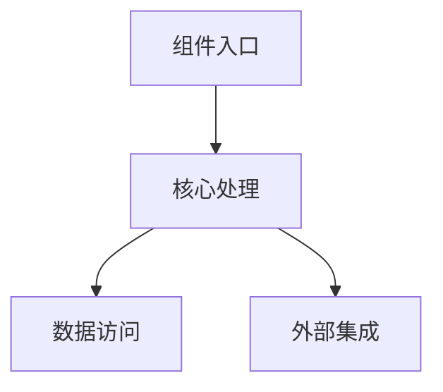

# 组件详细设计文档模板 (Component Detailed Design Document Template)

## 概述
本组件详细设计文档模板旨在提供一个全面的框架，用于详细描述组件的设计细节，涵盖从文档信息到运维设计的各个方面，确保组件的设计和开发过程的透明度和可维护性。

## 1. 文档信息 (Document Information)
记录文档的基本信息，方便文档的管理和追溯。
```markdown
- 文档版本：1.0.0
- 作者：[具体作者姓名]
- 审核人：[审核人姓名]
- 更新日期：2025-02-23
- 状态：[草稿/已审核/已发布]
```

## 2. 修订历史 (Revision History)
记录文档的修订记录，便于查看文档的变更情况。
```markdown
| 版本  | 日期       | 作者 | 修订说明 |
|-----|----------|-------|---------|
| 1.0 | 2025-02-23 | [作者姓名]  | 初始版本，创建组件详细设计文档模板 |
```

## 3. 组件概述 (Component Overview)
### 3.1 组件名称 (Component Name)
[组件的具体名称]

### 3.2 组件定位 (Component Position)
描述组件在整个系统中的位置和角色，例如是核心组件、辅助组件等。

### 3.3 组件职责 (Component Responsibilities)
详细列出组件的主要职责和功能，明确其在系统中的作用。

### 3.4 组件边界 (Component Boundaries)
界定组件与其他组件或系统模块之间的交互边界，明确输入和输出。

### 3.5 关键假设 (Key Assumptions)
列出在设计组件时所基于的关键假设，如环境假设、数据假设等。

## 4. 架构设计 (Architecture Design)
使用Mermaid图展示组件的架构关系。


### 4.1 内部架构 (Internal Architecture)
详细描述组件的内部架构，包括模块划分、层次结构等。

### 4.2 依赖关系 (Dependencies)
列出组件所依赖的其他组件、库或服务，并说明依赖的版本和用途。

### 4.3 部署要求 (Deployment Requirements)
说明组件的部署环境要求，如操作系统、服务器配置等。

### 4.4 技术栈选择 (Technology Stack)
说明组件开发所采用的技术栈，包括编程语言、框架、数据库等。

## 5. 功能设计 (Functional Design)
### 5.1 核心功能 (Core Functions)
详细描述组件的核心功能，包括功能的输入、输出和处理过程。

### 5.2 业务流程 (Business Processes)
使用流程图或文字描述组件所涉及的主要业务流程。

### 5.3 处理逻辑 (Processing Logic)
详细说明组件的处理逻辑，包括算法、数据处理规则等。

### 5.4 异常处理 (Exception Handling)
描述组件在遇到异常情况时的处理机制，确保系统的稳定性。

### 5.5 扩展点设计 (Extension Points)
标识组件的扩展点，方便后续的功能扩展和定制。

## 6. 接口设计 (Interface Design)
### 6.1 对外接口 (External Interfaces)
```markdown
接口名称：用户登录接口
- 请求方式：POST
- 请求路径：/api/user/login
- 请求参数：
  * username: string - 用户的用户名
  * password: string - 用户的密码
- 响应格式：
  * code: number - 状态码，200表示成功，其他表示失败
  * message: string - 消息，如"登录成功"或"用户名或密码错误"
  * data: object - 用户信息，如用户ID、用户名等
```

### 6.2 内部接口 (Internal Interfaces)
#### 6.2.1 服务间接口 (Service Interfaces)
描述组件与其他服务之间的接口，包括接口名称、请求方式、请求参数和响应格式。

#### 6.2.2 回调接口 (Callback Interfaces)
说明组件提供的回调接口，用于接收其他组件或服务的回调请求。

#### 6.2.3 事件接口 (Event Interfaces)
描述组件发布和订阅的事件接口，用于实现组件之间的事件驱动通信。

## 7. 数据设计 (Data Design)
### 7.1 数据模型 (Data Models)
```markdown
用户模型：
- id: string - 主键，唯一标识用户
- username: string - 用户名，用于用户登录
- status: enum - 用户状态，如"活跃"、"禁用"等
```

### 7.2 存储设计 (Storage Design)
#### 7.2.1 数据库表结构 (Database Schema)
详细描述数据库表的结构，包括表名、字段名、数据类型、约束等。

#### 7.2.2 索引设计 (Index Design)
说明数据库表的索引设计，提高数据查询的效率。

#### 7.2.3 缓存策略 (Cache Strategy)
描述组件的数据缓存策略，如缓存的数据类型、缓存的有效期等。

## 8. 性能设计 (Performance Design)
### 8.1 性能指标 (Performance Metrics)
定义组件的性能指标，如响应时间、吞吐量、并发数等。

### 8.2 并发处理 (Concurrency Handling)
说明组件的并发处理机制，如线程池、异步处理等。

### 8.3 资源估算 (Resource Estimation)
估算组件所需的资源，如CPU、内存、磁盘空间等。

### 8.4 优化方案 (Optimization Plans)
提出组件的性能优化方案，如算法优化、缓存优化等。

## 9. 安全设计 (Security Design)
### 9.1 访问控制 (Access Control)
描述组件的访问控制机制，如用户认证、授权等。

### 9.2 数据安全 (Data Security)
说明组件的数据安全措施，如数据加密、数据备份等。

### 9.3 传输安全 (Transport Security)
描述组件的数据传输安全机制，如HTTPS协议、SSL/TLS加密等。

### 9.4 审计日志 (Audit Logging)
说明组件的审计日志记录机制，用于记录用户的操作和系统的运行情况。

## 10. 测试设计 (Test Design)
### 10.1 测试策略 (Test Strategy)
制定组件的测试策略，如单元测试、集成测试、性能测试等。

### 10.2 测试用例 (Test Cases)
编写详细的测试用例，覆盖组件的各种功能和场景。

### 10.3 测试数据 (Test Data)
准备测试所需的数据，包括正常数据和异常数据。

### 10.4 测试工具 (Test Tools)
选择合适的测试工具，如自动化测试框架、性能测试工具等。

## 11. 部署设计 (Deployment Design)
### 11.1 部署架构 (Deployment Architecture)
描述组件的部署架构，如单机部署、集群部署等。

### 11.2 环境要求 (Environment Requirements)
说明组件的部署环境要求，如操作系统、数据库、中间件等。

### 11.3 配置管理 (Configuration Management)
描述组件的配置管理方式，如配置文件、环境变量等。

### 11.4 监控方案 (Monitoring Plan)
制定组件的监控方案，如性能监控、日志监控等。

## 12. 运维设计 (Operation Design)
### 12.1 运维指标 (Operation Metrics)
定义组件的运维指标，如系统可用性、故障恢复时间等。

### 12.2 告警策略 (Alert Strategy)
制定组件的告警策略，如异常告警、性能告警等。

### 12.3 备份方案 (Backup Plan)
描述组件的数据备份方案，如定期备份、增量备份等。

### 12.4 应急预案 (Emergency Plan)
制定组件的应急预案，如故障处理流程、容灾方案等。

## 13. 附录 (Appendix)
### 13.1 术语表 (Glossary)
列出文档中使用的专业术语及其解释。

### 13.2 参考文档 (References)
列出文档编写过程中参考的相关文档和资料。

### 13.3 相关资料 (Related Documents)
列出与组件相关的其他文档和资料，如需求文档、设计文档等。

## 14. 评审记录 (Review Records)
```markdown
| 评审日期 | 评审人 | 评审结果 | 主要意见 |
|---------|--------|----------|----------|
```
