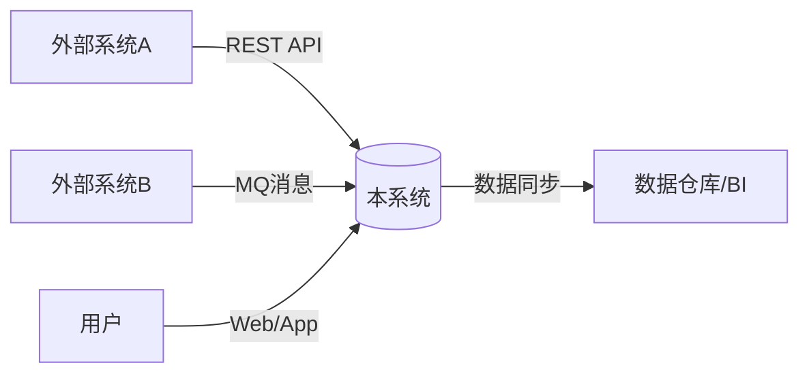

# 系统架构设计文档

# 中文版（Chinese Version）

## 1. 简介（Introduction）

### 1.1 目的（Purpose）
- 本文档用于描述系统的总体架构，包括业务需求、技术选型、微服务拆分、数据库布局、前后端分离方案等
- 主要受众：开发团队、架构师、项目经理、运维团队、业务干系人等

### 1.2 范围（Scope）
- 系统（或项目）覆盖的业务边界、功能范围、技术范围
- 明确哪些模块/功能在本次系统设计或实施范围内，哪些不在范围内

### 1.3 背景（Background）
- 简要说明业务背景、市场环境、现有系统或竞品分析
- 业务目标与痛点：需要解决的核心问题、要达成的指标或价值
- 约束条件：预算、时间周期、人员、合规/法律等

### 1.4 参考资料（References）
- 内部文档或外部链接（行业规范、技术文档、调研报告、现有系统文档等）

## 2. 架构原则（Architecture Principles）

### 2.1 技术栈选型（Technology Stack Selection）
#### 编程语言
- Java、Go、Python、Node.js 等
- 选择依据（团队熟悉度、生态支持、性能需求等）

#### 框架/运行环境
- 后端：Spring Boot/Spring Cloud、Express、Django、NestJS 等微服务框架
- 前端：React、Vue、Angular 等

#### 数据库/缓存
- MySQL、PostgreSQL、MongoDB、Redis、Elasticsearch 等

#### 消息中间件
- Kafka、RabbitMQ、RocketMQ 等

#### 容器与编排
- Docker、Kubernetes、Helm、Istio 等

#### 第三方服务或组件
- 日志采集（ELK/EFK）
- 监控（Prometheus/Grafana）
- API 网关（Kong、Nginx、Traefik）等

#### 评估与选用
- 简要说明每项技术或组件的评估标准（成熟度、社区生态、兼容性、成本等）与最终决策依据

### 2.2 高可用（High Availability）
- 系统可用性的目标（SLA，如 99.9% 或 99.99% 等）
- 容错、降级、熔断、自动恢复机制

### 2.3 可扩展性（Scalability）
- 水平扩展（微服务、容器集群）或垂直扩展（加大单机资源）的策略
- 弹性伸缩、负载均衡、缓存等设计

### 2.4 安全性（Security）
- 合规性要求（GDPR、PCI-DSS、HIPAA 等）
- 数据加密、访问控制、审计等

### 2.5 可维护性（Maintainability）
- DevOps 流程
- 自动化测试与部署
- 代码规范
- 架构文档化

### 2.6 其他原则（Others）
- 性能（Performance）
- 可观测性（Observability）
- 灾备（Disaster Recovery）等

## 3. 系统目标与需求（Business & Technical Requirements）

### 3.1 业务目标（Business Objectives）
- 系统需实现的核心功能或业务场景，以及其所带来的业务价值
- 量化目标（如交易处理量、用户增长、客户满意度提升等）

### 3.2 功能性需求（Functional Requirements）
- 按优先级列出主要功能，例如：
  - 用户管理
  - 订单处理
  - 支付对接
  - 报表分析
  - 权限系统等
- 可使用简单用例或功能列表进行说明

### 3.3 非功能性需求（Non-functional Requirements）
#### 性能
- 最大并发量
- 响应时间指标（P95、P99 等）
- 吞吐量（TPS/QPS）等

#### 安全
- 认证授权
- 数据加密
- 防护策略

#### 可靠性
- RPO、RTO
- 故障恢复策略

#### 可扩展性
- 水平扩展
- 微服务或分布式架构规划

#### 可维护性
- 自动化运维
- 日志监控
- 配置管理等

#### 可观察性
- Tracing
- Metrics
- Logging 要求等

### 3.4 约束与假设（Constraints & Assumptions）
- 预算、人员配比、项目时间进度等
- 外部系统依赖、第三方服务可用性、关键业务流程等

## 4. 系统上下文（System Context）

### 4.1 系统上下文图（System Context Diagram）

### 4.2 外部系统与集成（External Systems & Integration）
- 列出需对接的第三方服务或内部系统
  - 支付网关
  - 短信服务
  - ERP
  - CRM
  - 数据分析平台等
- 协议、数据格式、调用频次、SLA、认证方式等

### 4.3 用户角色（User Roles）
- 系统主要用户类型及其权限范围（如前台用户、管理员、合作伙伴等）

## 5. 逻辑架构（Logical Architecture）

### 5.1 逻辑分层（Layered Architecture）
- 前端层（或表现层）：Web、移动端，或者 BFF 层
- 业务逻辑层（或服务层）：核心业务流程与领域逻辑
- 数据层：数据访问、缓存、数据库交互
- 集成层：外部系统或第三方服务接口、消息队列等
- 公共组件：如认证授权、日志、配置中心、监控工具等

### 5.2 模块与组件（Modules & Components）
- 按业务领域或功能划分：
  - 用户模块
  - 订单模块
  - 库存模块
  - 支付模块
  - 营销模块等
- 定义模块间依赖与通信方式（REST、gRPC、消息等）

### 5.3 微服务拆分思路（Microservice Decomposition）
- 拆分原则：
  - 基于领域驱动设计（DDD）
  - 数据所有权
  - 团队边界
  - 功能耦合度等
- 通信模式：
  - REST
  - gRPC
  - 消息队列（异步事件驱动）
  - 是否需要 API Gateway/BFF
- 服务治理：
  - 服务注册
  - 配置管理
  - 熔断
  - 限流
  - 负载均衡等

### 5.4 前后端分离框架（Frontend-Backend Separation）
- 前端技术栈：React、Vue、Angular，SSR、SPA 或混合模式
- BFF 模式：不同终端（Web、移动、小程序）可对应不同 BFF
- 跨域处理：CORS 或网关代理

### 5.5 主要业务流程（Major Business Flows）
[此处可添加具体业务流程图]

## 6. 物理架构（Physical Architecture）

### 6.1 部署方案与高可用/扩展性规划（Deployment & Scalability）
- 部署环境：
  - 本地机房
  - 私有云
  - 公有云或混合云
- 容器与编排：
  - Docker
  - Kubernetes
  - 弹性伸缩（HPA/Auto Scaling）
- 多环境架构：
  - 开发
  - 测试
  - 预发
  - 生产等环境的部署策略
- 高可用策略：
  - 多副本
  - 集群
  - 主备
  - 多可用区或跨机房部署

### 6.2 网络与安全分区（Network & Security Zones）
- DMZ、内网区、数据库区、容器集群安全组等
- 防火墙、VPN、零信任架构等安全设计

### 6.3 硬件/云资源规划（Hardware/Cloud Resource Planning）
- 虚拟机/容器规格
- 存储类型（SSD/HDD/对象存储）
- 负载均衡器
- CDN
- 消息队列集群
- 日志/监控服务等资源选型与规模

## 7. 数据架构（Data Architecture）

### 7.1 数据架构初步设计（Data Modeling & Design）
- 主要数据实体：
  - 用户
  - 订单
  - 商品
  - 库存
  - 支付记录等
- 实体关系图（ERD）：或领域模型示意图，展示关键表/集合的关系
- 数据分层：
  - OLTP
  - OLAP
  - 缓存层
  - NoSQL
  - 数据仓库等

### 7.2 数据库选择与部署（Database Choice & Deployment）
- 数据库选型：
  - MySQL
  - PostgreSQL
  - MongoDB
  - Redis
  - Elasticsearch 等
- 分库分表策略
- 读写分离
- 多副本集群
- 跨区域复制
- 备份与恢复
- 数据一致性与延迟策略（CAP 定理等）

### 7.3 数据治理与质量（Data Governance & Quality）
- 数据标准化
- 元数据管理
- 数据血缘分析
- 数据加密
- 脱敏
- 审计及合规要求（GDPR、PCI-DSS 等）

### 7.4 数据库布局（Database Layout）
- 库与表的划分：
  - 基于业务域或访问频率
  - 避免"大表"效应
- 分片与索引：
  - 水平或垂直拆分
  - 分区表
  - 索引策略
- 命名规范：
  - 库名
  - 表名
  - 字段名
  - 索引名

## 8. 集成与接口设计（Integration & Interfaces）

### 8.1 集成方式/接口协议（Integration Method/Protocols）
- 与外部系统或内部模块对接方案：
  - RESTful
  - gRPC
  - GraphQL
  - 消息队列
  - 文件传输
- 同步 vs. 异步
- 事件驱动架构的适用场景与优劣

### 8.2 接口规范（API Contracts）
- URI 命名
- 版本管理（/api/v1/…）
- 数据格式（JSON/XML/Protobuf 等）
- 错误码体系
- 鉴权方式（JWT、OAuth2、Token）
- 安全和流控策略
- 接口文档维护方式（Swagger/OpenAPI、Postman Collection 等）

### 8.3 消息与事件（Messaging & Eventing）
- 消息中间件选型：
  - Kafka
  - RabbitMQ
  - RocketMQ 等
- 消费模式（Pub/Sub、点对点）
- 重试与补偿
- 幂等处理
- 死信队列机制

### 8.4 第三方服务（Third-party Services）
- 需接入的外部服务：
  - 支付
  - 短信
  - 地图
  - 社交登录等
- SLA
- 限流
- 熔断
- 重试与降级方案

## 9. 安全架构（Security Architecture）

### 9.1 身份认证与授权（Authentication & Authorization）
- SSO
- OAuth2
- SAML
- JWT 等方案的选型与实现
- 用户、角色、权限模型
- 是否支持多租户（Multi-Tenant）

### 9.2 数据安全（Data Security）
- 传输加密（TLS/SSL）
- 数据库加密
- 密钥管理策略
- 敏感数据脱敏
- 日志中屏蔽敏感信息

### 9.3 应用安全（Application Security）
- 常见安全威胁的防御措施：
  - SQL 注入
  - XSS
  - CSRF
  - SSR 等
- 安全审计
- 日志留存
- 异常告警机制

### 9.4 基础设施安全（Infrastructure Security）
- 主机加固
- 容器安全
- Kubernetes RBAC
- 网络安全组/ACL
- IDS/IPS
- WAF
- 防火墙策略

## 10. 性能与容量规划（Performance & Capacity Planning）

### 10.1 性能目标（Performance Targets）
- 最大并发
- 吞吐量（TPS/QPS）
- 响应时间目标（如 P95、P99）
- 高峰期、促销活动的性能要求

### 10.2 性能分析与优化策略（Performance Analysis & Optimization）
- 缓存（Redis/Memcached）
- CDN
- 页面静态化/SSR 等
- 异步处理（消息队列）
- 分布式锁
- 负载均衡策略
- 压力测试
- APM（Application Performance Monitoring）工具

### 10.3 弹性伸缩（Elastic Scaling）
- 自动扩缩容：
  - Kubernetes HPA
  - 云厂商 Auto Scaling 等
  - 触发条件（CPU、内存、队列长度等）
- 蓝绿部署
- 灰度发布
- 避免大规模中断风险

## 11. 运维与监控（Operations & Observability）

### 11.1 监控（Monitoring）
- 监控平台：
  - Prometheus
  - Grafana
  - Zabbix
  - CloudWatch 等
- 监控维度：
  - 基础资源（CPU、内存、磁盘）
  - 应用指标（接口延迟、错误率）
  - 业务指标（订单成功率、PV/UV）
- 分布式追踪（Jaeger、Zipkin）与日志聚合配合

### 11.2 日志与告警（Logging & Alerting）
- 日志采集与分析：
  - ELK/EFK
  - Splunk
  - 云日志服务等
- 告警规则
- 阈值设置
- 通知渠道（邮件、短信、IM、Webhook 等）

### 11.3 故障处理与恢复（Incident Management & Disaster Recovery）
- 故障分级
- 应急响应流程
- SLA/SLO/SLI
- 灾备策略（主备、多活、异地容灾）
- 定期演练与回切机制

### 11.4 持续集成与持续交付（CI/CD）
- 版本管理（Git Flow、Trunk-based Development 等）
- 构建与部署流水线：
  - Jenkins
  - GitLab CI
  - GitHub Actions
  - Argo CD 等
- 自动化测试（单元、集成、验收）
- 质量门禁
- 灰度发布等

## 12. 风险评估与缓解（Risk Assessment & Mitigation）

### 12.1 风险清单（Risk List）
- 技术风险
- 业务风险
- 合规风险等
- 以等级（高/中/低）标注

### 12.2 缓解策略（Mitigation Strategies）
- 针对不同风险的预防与应对措施
- 侦测机制
- 应急预案

### 12.3 关键成功因素（Key Success Factors）
- 项目成功的里程碑
- 资源配合
- 沟通机制等

## 13. 项目实施与迁移计划（Implementation & Migration Plan）

### 13.1 里程碑（Milestones）
- 需求确认
- 设计评审
- 开发
- 测试
- 预发布
- 正式上线等阶段

### 13.2 迁移策略（Migration Strategy）
- 如需替换旧系统：
  - 数据迁移
  - 流量切换
  - 并行或蓝绿部署等
- 回滚与应急方案

### 13.3 培训与支持（Training & Support）
- 团队培训
- 内部文档
- 知识转移
- 运维和支持团队的分工与职责

## 14. 成本与效益分析（Cost & Benefit Analysis）

### 14.1 成本估算（Cost Estimation）
- 硬件/云资源
- 软件许可
- 人力成本
- 第三方服务费用
- 短期实施成本 vs. 长期 TCO（Total Cost of Ownership）

### 14.2 效益评估（Benefit Evaluation）
- ROI：
  - 运营效率提升
  - 用户满意度提高
  - 市场竞争力增强等
- 定量或定性评价系统上线所带来的收益和价值

## 15. 结论（Conclusion）
- 对系统总体架构进行总结，重申重点和挑战
- 列出未在当前阶段解决或需深入研究的议题（如安全专项、数据专项、AI 模块等）
- 为后续详细设计、排期、运维方案等提供指导

## 附录（Appendix）
- 详细接口定义：API 文档、Swagger/OpenAPI、gRPC Proto 文件等链接
- 数据库表结构：表字段、索引、主外键、字段说明等
- 关键配置示例：微服务注册中心、配置中心、消息队列的配置文件示例
- 术语表/缩写表：解释专业术语或内部约定名称