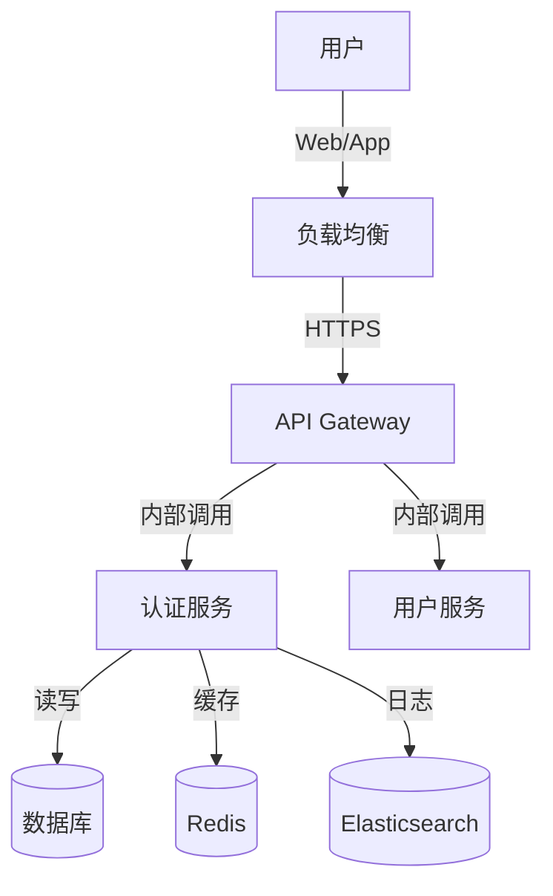
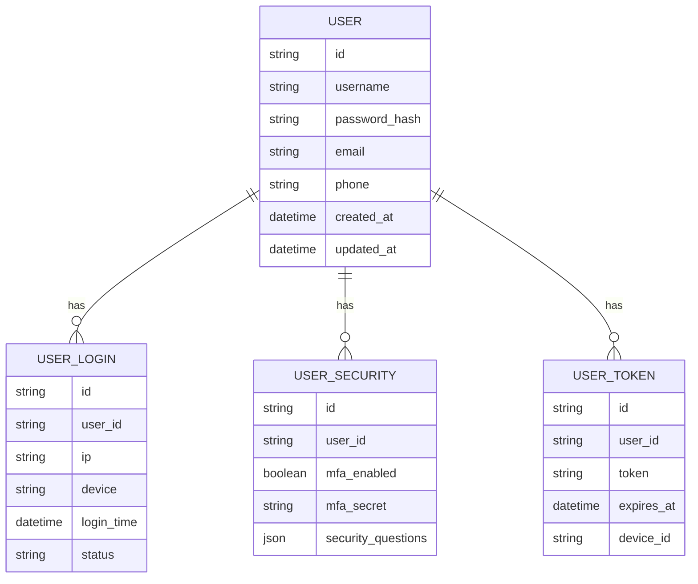

# Dove 登录系统 - 高阶设计文档 (HLD)

## 1. 简介（Introduction）

### 1.1 目的（Purpose）
本文档旨在提供 Dove 登录系统的高阶技术设计方案，包括：
- 系统架构设计
- 技术选型
- 微服务拆分
- 数据库设计
- 安全方案等

### 1.2 范围（Scope）
- 登录系统所有核心功能的技术实现
- 支持 2 亿用户规模的架构设计
- 8000 万并发访问的性能保障方案
- 全球化部署和多语言支持

### 1.3 背景（Background）
基于 BRD 文档中的业务需求，我们需要构建一个企业级的登录认证系统：
- 参考 JIRA Web 登录的功能特性
- 采用 Spring Cloud + Spring Cloud Alibaba 微服务架构
- 支持全球化部署和多语言服务

### 1.4 参考资料（References）
- BRD_Dove_Login_System.md
- Spring Cloud 官方文档
- Spring Cloud Alibaba 官方文档
- JIRA 登录系统参考实现

## 2. 架构原则（Architecture Principles）

### 2.1 技术栈选型（Technology Stack Selection）

#### 2.1.1 后端技术栈
- **微服务框架**
  - Spring Cloud Hoxton.SR12
  - Spring Cloud Alibaba 2.2.9.RELEASE
  - Spring Boot 2.3.12.RELEASE

- **服务治理**
  - Nacos：注册中心和配置中心
  - Sentinel：限流熔断
  - Seata：分布式事务

- **数据存储**
  - MariaDB 10.11 LTS：主数据库
  - Redis 7.0：缓存和会话存储
  - Elasticsearch 8.x：日志和审计数据

- **消息队列**
  - RocketMQ 5.x：异步消息处理

#### 2.1.2 前端技术栈
- React 18
- Ant Design Pro
- TypeScript 5.x

#### 2.1.3 基础设施
- Kubernetes 1.26+
- Docker
- Istio 服务网格
- ELK 日志栈

### 2.2 高可用（High Availability）
- 系统可用性目标：99.999%
- 多活数据中心部署
- 服务自动容错和恢复
- 限流、熔断、降级策略

### 2.3 可扩展性（Scalability）
- 微服务水平扩展
- 数据库分库分表
- 多级缓存架构
- 异步处理机制

### 2.4 安全性（Security）
- OAuth2 + JWT 认证
- HTTPS 传输加密
- 密码 PBKDF2 加密存储
- 防暴力破解机制
- WAF 防护

### 2.5 可维护性（Maintainability）
- 统一的日志收集和分析
- 全链路监控
- 自动化部署和回滚
- 灰度发布支持

## 3. 系统目标与需求（System Requirements）

### 3.1 业务目标（Business Objectives）
- 支持 2 亿用户规模
- 峰值并发 8000 万
- 登录响应时间 < 500ms (P95)
- 安全事件发生率 < 0.001%

### 3.2 功能性需求（Functional Requirements）
- 用户认证
  - 用户名密码登录
  - 多因素认证（MFA）
  - 社交账号登录
  - 企业 SSO

- 账号安全
  - 密码规则管理
  - 登录保护
  - 异常检测
  - 审计日志

### 3.3 非功能性需求（Non-functional Requirements）
- 性能指标
  - 单机 10000 QPS
  - 响应时间 < 500ms (P99)
  - 服务启动时间 < 30s

- 可靠性
  - 服务可用性 99.999%
  - 数据一致性保证
  - 故障自动恢复

## 4. 系统上下文（System Context）

### 4.1 系统上下文图


### 4.2 外部系统集成
- 短信服务
- 邮件服务
- 社交登录
- 企业 IdP
- 风控系统

## 5. 逻辑架构（Logical Architecture）

### 5.1 微服务拆分
- **认证服务（auth-service）**
  - 登录认证
  - Token 管理
  - 会话维护

- **用户服务（user-service）**
  - 用户信息管理
  - 密码管理
  - 安全设置

- **安全服务（security-service）**
  - MFA 管理
  - 风险控制
  - 审计日志

- **通知服务（notification-service）**
  - 邮件通知
  - 短信通知
  - 消息推送

### 5.2 数据模型


## 6. 物理架构（Physical Architecture）

### 6.1 部署架构
- **多活数据中心**
  - 3个主要区域：亚太、欧洲、美洲
  - 每个区域 2+ 数据中心
  - 跨区域数据同步

- **Kubernetes 集群**
  - 生产环境每区域 3+ 集群
  - 测试环境 1+ 集群
  - 开发环境 1 集群

### 6.2 网络架构
- **四层网络隔离**
  - 接入层：CDN + WAF
  - 应用层：API Gateway + 微服务
  - 数据层：数据库 + 缓存
  - 管理层：运维和监控

### 6.3 存储架构
- **数据库集群**
  - MariaDB: 主从架构，每区域独立部署
  - Redis: 哨兵模式，跨区域复制
  - Elasticsearch: 集群模式，分区存储

## 7. 数据架构（Data Architecture）

### 7.1 数据分层
- **业务数据**
  - 用户基本信息
  - 认证信息
  - 安全设置

- **操作数据**
  - 登录日志
  - 审计记录
  - 统计数据

### 7.2 数据库设计
- **分库策略**
  - 按用户 ID 范围分库
  - 每库 500 万用户
  - 支持在线扩容

- **分表策略**
  - 用户表：按 ID 范围分表
  - 日志表：按时间分表
  - 每表限制 1000 万行

### 7.3 缓存策略
- **多级缓存**
  - L1: 本地缓存（Caffeine）
  - L2: 分布式缓存（Redis）
  - L3: 数据库

- **缓存同步**
  - 写穿透
  - 异步更新
  - 定时刷新

## 8. 接口设计（Interface Design）

### 8.1 API 设计
- **认证接口**
```yaml
POST /api/v1/auth/login
Request:
  username: string
  password: string
  captcha: string
Response:
  token: string
  expires_in: number
  refresh_token: string
```

- **MFA 接口**
```yaml
POST /api/v1/auth/mfa/verify
Request:
  token: string
  code: string
Response:
  access_token: string
  expires_in: number
```

### 8.2 内部服务接口
- gRPC 服务定义
- 事件消息格式
- 异步通知接口

## 9. 安全架构（Security Architecture）

### 9.1 认证机制
- OAuth2 + JWT
- 密码加密：PBKDF2
- MFA：TOTP 算法
- 会话管理：分布式 Session

### 9.2 授权控制
- RBAC 模型
- 权限粒度控制
- API 访问控制
- 数据权限隔离

### 9.3 安全防护
- XSS 防护
- CSRF 防护
- SQL 注入防护
- 请求加密

## 10. 性能与容量规划（Performance & Capacity）

### 10.1 性能目标
- API 响应时间 < 500ms (P99)
- 单机并发：10000 QPS
- 集群总体：800 万 QPS

### 10.2 容量规划
- **用户数据**
  - 2 亿用户，每用户 2KB
  - 总存储：400GB+

- **日志数据**
  - 每天 10 亿条日志
  - 保存 180 天
  - 总存储：54TB+

### 10.3 资源预估
- **计算资源**
  - 应用节点：500+
  - 数据库节点：100+
  - 缓存节点：50+

- **网络带宽**
  - 内网：10Gbps+
  - 外网：5Gbps+

## 11. 监控与运维（Operations & Monitoring）

### 11.1 监控体系
- **基础监控**
  - 主机监控
  - 容器监控
  - 网络监控

- **应用监控**
  - 服务健康检查
  - 接口调用监控
  - 业务指标监控

### 11.2 日志体系
- **日志分类**
  - 访问日志
  - 错误日志
  - 审计日志
  - 性能日志

- **日志处理**
  - 实时采集
  - 分析告警
  - 归档存储

## 12. 风险评估（Risk Assessment）

### 12.1 技术风险
- 性能瓶颈
- 数据一致性
- 系统安全性
- 服务可用性

### 12.2 应对策略
- 架构评审
- 压力测试
- 安全审计
- 应急预案

## 13. 实施计划（Implementation Plan）

### 13.1 阶段规划
1. 核心认证功能（2个月）
2. 安全增强功能（1个月）
3. 运营功能（1个月）
4. 性能优化（1个月）

### 13.2 关键里程碑
- 架构设计评审
- 核心功能上线
- 性能测试达标
- 安全审计通过

## 14. 附录（Appendix）

### 14.1 技术组件版本
- Spring Cloud: Hoxton.SR12
- Spring Cloud Alibaba: 2.2.9.RELEASE
- Spring Boot: 2.3.12.RELEASE
- MariaDB: 10.11 LTS
- Redis: 7.0
- Elasticsearch: 8.x

### 14.2 参考文档
- Spring Cloud 官方文档
- Spring Cloud Alibaba 官方文档
- Kubernetes 官方文档
- JIRA 登录系统参考 