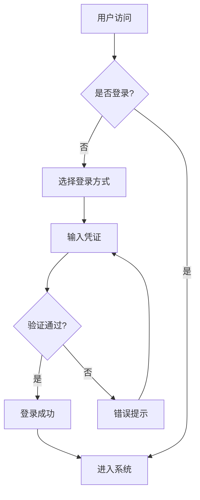
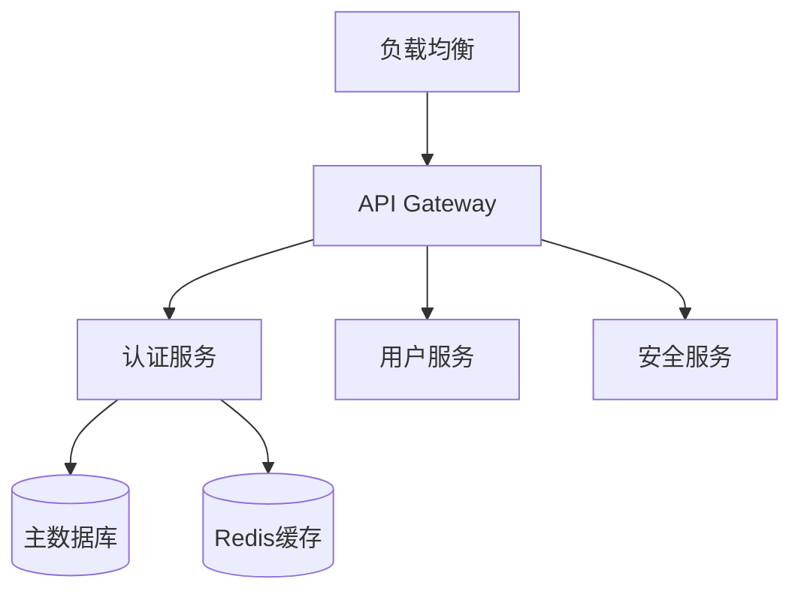
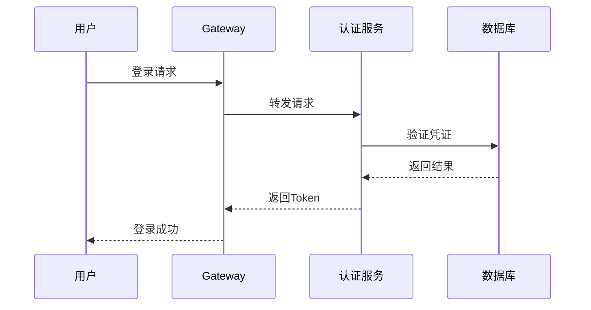
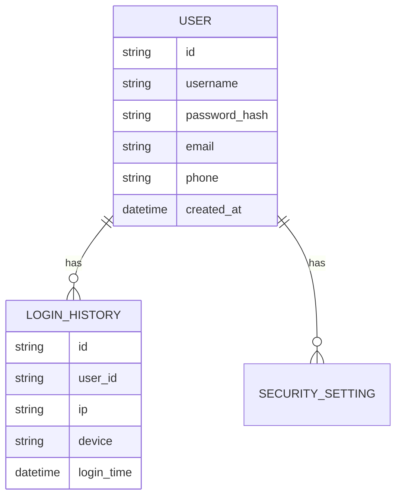

# Dove 登录系统 - 产品需求文档（PRD）

## 1. 文档信息

| 项目       | 内容                    |
|------------|-------------------------|
| 文档名称   | Dove 登录系统 PRD       |
| 当前版本   | v1.0                    |
| 作者       | {产品经理姓名/产品部门}  |
| 审核人     | {技术负责人姓名/技术部门} |
| 更新日期   | 2024-03-21              |
| 适用范围   | 内部开发团队             |

### 1.1 版本记录

| 版本号 | 变更日期   | 变更人 | 变更内容描述 |
|--------|------------|--------|--------------|
| v1.0   | 2024-03-21 | {作者} | 初始化文档   |

## 2. 概述（Overview）

### 2.1 文档目的
本文档旨在：
- 详细描述 Dove 登录系统的产品需求，确保开发团队对功能、性能、安全等需求有统一理解
- 为后续的技术设计、开发实现和测试验收提供明确的指导
- 作为产品功能验收的基准文档

### 2.2 背景与动机
- **市场环境**
  - 全球化 SaaS 市场快速增长，对安全可靠的身份认证需求日益提升
  - 企业级应用对高并发、高可用的登录系统要求越来越高
  - 需要参考 JIRA 等成熟产品的最佳实践

- **企业现状**
  - 用户规模：2 亿注册用户，峰值同时在线 8000 万
  - 全球化业务覆盖，需要支持多语言、多时区
  - 工作时间为主要使用时段，非工作时间约为工作时间流量的 30%

### 2.3 阅读对象
- 产品经理：了解产品完整功能规划
- 架构师：进行技术方案设计
- 开发团队：实现具体功能
- 测试团队：编写测试用例
- 运维团队：规划部署方案
- 安全团队：评估安全风险

## 3. 产品目标与成功指标

### 3.1 产品目标
- **核心目标**
  - 构建企业级、高可用的统一登录认证系统
  - 支持全球化部署，满足多语言、多时区需求
  - 确保系统安全性，防范各类账号安全风险

- **子目标**
  1. 支持多种登录方式（用户名、邮箱、SSO 等）
  2. 实现完整的安全防护体系
  3. 提供灵活的配置管理功能
  4. 支持详细的审计日志

### 3.2 关键结果/核心指标（KPIs）
- **性能指标**
  - 支持 2 亿用户规模
  - 支持 8000 万用户并发在线
  - 登录响应时间 < 500ms（P95）
  - 系统可用性 99.999%

- **业务指标**
  - 登录成功率 > 99.9%
  - 账号安全事件发生率 < 0.001%
  - 验证码识别准确率 > 99%

## 4. 用户需求

### 4.1 目标用户
- **企业管理员**
  - 负责配置企业 SSO 和安全策略
  - 管理企业内用户权限
  - 查看安全审计日志

- **普通用户**
  - 需要安全、便捷的登录体验
  - 可能来自全球不同地区
  - 使用不同终端设备访问

### 4.2 用户痛点及需求场景
1. **安全性需求**
   - 担心账号被盗
   - 需要多因素认证保护
   - 异地登录提醒

2. **便捷性需求**
   - 快速登录
   - 记住登录状态
   - 自动填充历史账号

3. **多端同步需求**
   - 一次登录，多端互通
   - 会话状态同步

### 4.3 使用流程



## 5. 功能需求

### 5.1 登录认证模块

#### 5.1.1 功能概述
提供多种安全的登录认证方式，支持记住登录状态，实现全球化部署。

#### 5.1.2 功能详情

##### 标准登录
- **需求描述**
  - 支持用户名/邮箱 + 密码登录
  - 支持图形验证码防护
  - 支持记住登录（30天）
  
- **业务规则**
  - 密码规则：8-32位，包含大小写字母、数字、特殊字符
  - 连续失败5次触发图形验证码
  - 连续失败10次锁定账号30分钟

- **优先级**：P0

##### 企业 SSO
- **需求描述**
  - 支持 SAML 2.0
  - 支持 OAuth 2.0
  - 支持 OpenID Connect
  
- **业务规则**
  - 支持多个 IdP 配置
  - SSO 登录优先级高于密码登录
  
- **优先级**：P0

##### 多因素认证（MFA）
- **需求描述**
  - 支持短信验证码
  - 支持邮件验证码
  - 支持 TOTP（如 Google Authenticator）
  
- **业务规则**
  - 可选强制开启
  - 异地登录必须 MFA
  - 验证码有效期5分钟
  
- **优先级**：P1

### 5.2 安全策略模块

#### 5.2.1 功能概述
提供完整的安全策略配置，包括密码策略、登录保护、会话管理等。

#### 5.2.2 功能详情

##### 密码策略
- **需求描述**
  - 密码强度要求配置
  - 密码过期策略
  - 密码历史策略
  
- **业务规则**
  - 不可重复使用最近5次密码
  - 密码90天强制更新
  
- **优先级**：P0

##### 登录保护
- **需求描述**
  - IP 黑白名单
  - 登录时间限制
  - 地理位置限制
  
- **业务规则**
  - 支持 IP 段配置
  - 可按组织设置规则
  
- **优先级**：P1

### 5.3 审计日志模块

#### 5.3.1 功能概述
记录所有登录相关操作，支持日志查询和导出。

#### 5.3.2 功能详情
- **需求描述**
  - 记录登录/登出行为
  - 记录密码修改
  - 记录策略变更
  
- **业务规则**
  - 日志保存180天
  - 支持多维度筛选
  
- **优先级**：P0

## 6. 非功能需求

### 6.1 性能需求
- **并发处理**
  - 支持 8000 万用户同时在线
  - 单机支持 10000 QPS
  - 99% 请求响应时间 < 500ms
  
- **扩展性**
  - 支持水平扩展
  - 无状态设计
  - 分布式架构

### 6.2 安全合规需求
- **访问控制**
  - 密码加密存储（PBKDF2）
  - HTTPS 传输加密
  - JWT Token 认证
  
- **合规要求**
  - 符合 GDPR 规范
  - 符合 ISO 27001
  - 支持数据本地化存储

### 6.3 可用性需求
- 系统可用性 99.999%
- 故障自动切换时间 < 30s
- 数据备份恢复时间 < 4h

### 6.4 国际化需求
- **多语言支持**
  - 支持 20+ 主流语言
  - 支持动态语言包加载
  
- **时区处理**
  - 自动检测用户时区
  - 所有时间显示遵循本地格式

## 7. 系统流程与架构

### 7.1 系统架构图



### 7.2 核心业务流程



## 8. 接口说明

### 8.1 接口列表

| 接口名称 | 方法 | 路径 | 说明 | 
|---------|------|------|------|
| 标准登录 | POST | /api/v1/auth/login | 用户名密码登录 |
| SSO登录 | GET | /api/v1/auth/sso/{provider} | 企业SSO登录 |
| MFA验证 | POST | /api/v1/auth/mfa/verify | 多因素认证 |

### 8.2 示例接口

```yaml
POST /api/v1/auth/login
Request:
  username: string
  password: string
  captcha: string
Response:
  token: string
  expires_in: number
```

## 9. 数据需求

### 9.1 数据模型



### 9.2 数据字典

| 表名 | 字段名 | 类型 | 说明 |
|------|--------|------|------|
| user | id | string | 用户ID |
| user | username | string | 用户名 |
| user | password_hash | string | 密码哈希 |

## 10. UI/UX 需求

### 10.1 登录页面
- 简洁大方的设计风格
- 响应式布局，适配各种设备
- 清晰的错误提示
- 登录表单居中展示

### 10.2 交互原型
- 登录页面布局参考 JIRA
- 表单验证实时反馈
- 登录状态切换流畅

## 11. 测试与验收标准

### 11.1 功能测试
- 所有登录方式
- 安全策略生效
- 审计日志完整

### 11.2 性能测试
- 并发用户数
- 响应时间
- 资源占用

### 11.3 安全测试
- 密码强度
- 防暴力破解
- SQL注入防护
- XSS防护

## 12. 风险评估

### 12.1 风险列表

| 风险 | 影响 | 可能性 | 应对策略 |
|------|------|--------|----------|
| 性能瓶颈 | 高 | 中 | 性能优化、扩容预案 |
| 安全漏洞 | 高 | 低 | 安全审计、及时修复 |
| 数据一致性 | 中 | 中 | 分布式事务 |

## 13. 项目计划

### 13.1 里程碑

| 阶段 | 时间 | 交付物 |
|------|------|--------|
| 需求分析 | 2周 | PRD确认 |
| 技术方案 | 2周 | 架构设计 |
| 开发实现 | 8周 | 功能完成 |
| 测试验证 | 4周 | 测试报告 |

## 14. 附录

### 14.1 参考文档
- JIRA 登录系统设计
- Spring Cloud 官方文档
- GDPR 合规要求

---

**版权所有 © Dove Team**  
仅限内部使用，未经许可不得外传 