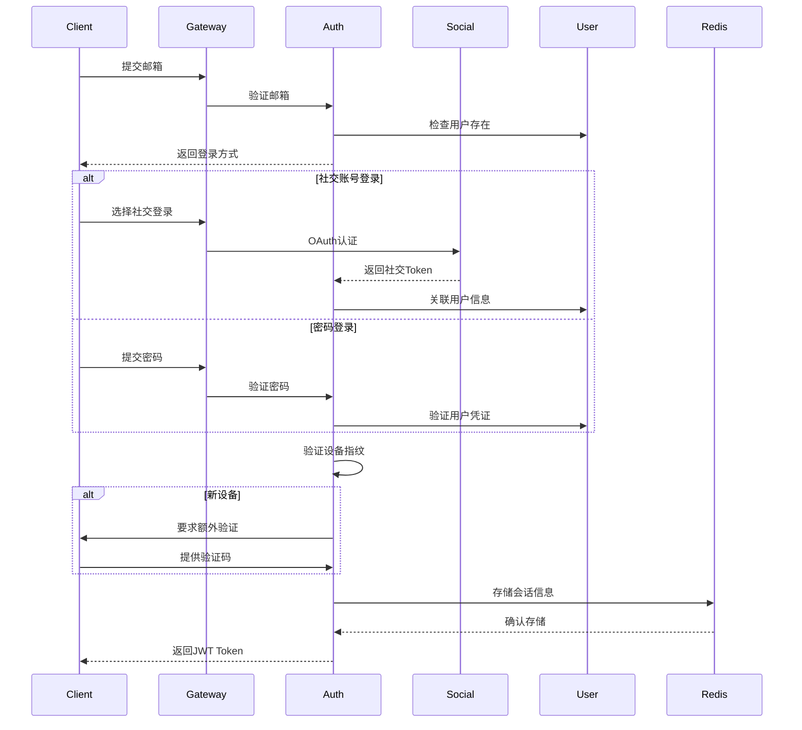

# Login System Product Requirements Document (PRD)
# 登录系统产品需求文档

## 0. Technical Requirements | 技术要求

### 0.1 Technology Selection Principles | 技术选型原则
- 开源技术，确保可商用
- 文档完善，社区活跃
- 技术支持完善
- 企业级生产环境验证
- 支持多终端部署

### 0.2 Project Architecture | 项目架构
- 前后端分离架构
- 多终端支持（Web、Mobile、Desktop）
- 企业级微服务架构

### 0.3 Project Structure | 项目结构

#### Repository Structure | 仓库结构
每个项目都是独立的Git仓库，便于独立开发和部署：

```
dove-projects/
├── dove-parent/                # 父项目仓库
│   └── pom.xml                # 父POM，管理依赖版本
│
├── dove-common/               # 公共模块仓库
│   ├── .git/                  # Git仓库
│   ├── pom.xml               # 项目POM
│   └── src/                  # 源代码
│       └── main/
│           ├── java/
│           └── resources/
│
├── dove-auth-service/         # 认证服务仓库
│   ├── .git/                  # Git仓库
│   ├── pom.xml               # 项目POM
│   ├── Dockerfile           # 容器化配置
│   ├── docker-compose.yml   # 本地开发环境
│   └── src/                  # 源代码
│       ├── main/
│       │   ├── java/
│       │   └── resources/
│       └── test/
│
├── dove-gateway/             # 网关服务仓库
│   ├── .git/                  # Git仓库
│   ├── pom.xml               # 项目POM
│   ├── Dockerfile           # 容器化配置
│   ├── docker-compose.yml   # 本地开发环境
│   └── src/                  # 源代码
│       ├── main/
│       │   ├── java/
│       │   └── resources/
│       └── test/
│
└── dove-auth-ui/             # 前端项目仓库
    ├── .git/                  # Git仓库
    ├── package.json          # 项目配置
    ├── Dockerfile           # 容器化配置
    └── src/                  # 源代码
        ├── components/
        ├── pages/
        └── utils/
```

#### Deployment Structure | 部署结构
每个服务都是独立部署的微服务：

```
Kubernetes Cluster/
├── dove-namespace/
│   ├── dove-auth-service/     # 认证服务部署
│   │   ├── deployment.yaml
│   │   ├── service.yaml
│   │   └── configmap.yaml
│   │
│   ├── dove-gateway/         # 网关服务部署
│   │   ├── deployment.yaml
│   │   ├── service.yaml
│   │   └── configmap.yaml
│   │
│   └── dove-auth-ui/         # 前端应用部署
│       ├── deployment.yaml
│       ├── service.yaml
│       └── ingress.yaml
│
├── shared-services/
│   ├── nacos/                # 配置中心
│   ├── redis/                # 缓存服务
│   └── mysql/                # 数据库服务
│
└── monitoring/
    ├── prometheus/           # 监控系统
    └── grafana/              # 监控面板
```

#### Development Guidelines | 开发指南
1. 每个服务都有自己的Git仓库，可以独立开发和版本控制
2. 服务之间通过接口契约和版本管理保持兼容性
3. 每个服务都有完整的CI/CD流程
4. 本地开发使用docker-compose进行依赖服务的管理
5. 测试环境和生产环境使用Kubernetes进行容器编排

#### Build & Deployment | 构建和部署
1. 构建流程
   ```bash
   # 构建公共模块
   cd dove-common
   mvn clean install

   # 构建认证服务
   cd dove-auth-service
   mvn clean package
   docker build -t dove-auth-service:latest .

   # 构建网关服务
   cd dove-gateway
   mvn clean package
   docker build -t dove-gateway:latest .

   # 构建前端应用
   cd dove-auth-ui
   npm install
   npm run build
   docker build -t dove-auth-ui:latest .
   ```

2. 部署流程
   ```bash
   # 部署认证服务
   kubectl apply -f dove-auth-service/k8s/

   # 部署网关服务
   kubectl apply -f dove-gateway/k8s/

   # 部署前端应用
   kubectl apply -f dove-auth-ui/k8s/
   ```

#### Naming Conventions | 命名规范
- 项目命名规范
  - 所有子项目以 `dove-` 为前缀
  - 示例: `dove-auth`, `dove-gateway`, `dove-user`
- Java包命名规范
  - 统一以 `com.helix.dove` 为根包名
  - 示例: `com.helix.dove.auth`, `com.helix.dove.user`

#### Database | 数据库
- MariaDB 11.5.2
  - 开源、高性能
  - 兼容 MySQL
  - 企业级特性支持
- 持久层框架
  - Spring Data JPA
  - JPA规范实现
  - 自动化SQL生成
  - 丰富的查询支持

## 1. Technical Architecture Overview | 技术架构概述

### 1.1 Architecture Stack | 技术栈
#### Frontend | 前端
- **Framework**: Vue.js 3.x
  - TypeScript support
  - Vue Router for SPA routing
  - Pinia for state management
  - Vue I18n for internationalization
- **UI Framework**: 
  - Ant Design Vue
  - RTL support components
  - Locale-specific components
- **Build Tool**: 
  - Vite
  - i18n resource bundling
  - Dynamic locale loading
- **HTTP Client**: 
  - Axios
  - i18n request/response interceptors
- **Testing**: 
  - Jest + Vue Test Utils
  - i18n testing utilities

#### Backend | 后端
- **Internationalization Support**:
  - Spring MessageSource
  - Resource Bundle
  - Dynamic message loading
  - Custom locale resolvers

- **Microservices Framework**:
  - Spring Cloud Alibaba 2022.0.0.0
  - Spring Boot 3.2.x
  - Spring Cloud Gateway
  - Spring Security + JWT
  - i18n message sources

- **Service Discovery & Config**:
  - Nacos 2.x (服务注册、配置中心)
    * Multi-region configuration
    * Locale-specific settings
  - OpenFeign (服务调用)

- **Resilience & Monitoring**:
  - Sentinel (限流、熔断、降级)
  - Spring Boot Admin (服务监控)
  - SkyWalking (链路追踪)
  - Prometheus + Grafana (监控告警)

- **Database & Cache**:
  - MariaDB 11.5.2
  - Redis 7.x
  - Spring Data JPA (持久层框架)

- **Message Queue**:
  - RocketMQ 5.x (消息队列)

### 1.2 System Components | 系统组件

1. **API Gateway Service** | API网关服务
   - 路由转发
   - 统一认证
   - 限流控制
   - 日志记录

2. **Auth Service** | 认证服务
   - 用户认证
   - Token管理
   - 权限控制
   - 会话管理

3. **User Service** | 用户服务
   - 用户管理
   - 个人信息
   - 密码管理

4. **Notification Service** | 通知服务
   - 邮件发送
   - 短信发送
   - 消息推送

## 2. Detailed Technical Requirements | 详细技术需求

### 2.1 Authentication Flow | 认证流程

#### 2.1.1 Login Process | 登录流程


#### 2.1.2 Token Management | Token管理
```yaml
token_management:
  jwt_token:
    format: "Header.Payload.Signature"
    validity: "2h"
    fields:
      - user_id
      - email
      - device_id
      - permissions
      - locale
      
  refresh_token:
    validity: "7d"
    storage: "Redis Cluster"
    rotation: true
    
  device_token:
    validity: "30d"
    storage: "Redis Cluster"
    fields:
      - device_id
      - device_type
      - last_verified
      - trust_score
```

### 2.2 Security Implementation | 安全实现

#### 2.2.1 Password Security | 密码安全
```yaml
password_security:
  hash_algorithm: "BCrypt"
  hash_strength: 12
  password_policy:
    min_length: 8
    max_length: 128
    require_uppercase: true
    require_lowercase: true
    require_numbers: true
    require_special_chars: true
    password_history: 5
    max_attempts: 5
    lockout_duration: 30m
```

#### 2.2.2 Social Login Security | 社交登录安全
```yaml
social_login_security:
  providers:
    google:
      oauth_version: "2.0"
      scope: ["email", "profile"]
      verify_token: true
      verify_email: true
      
    microsoft:
      oauth_version: "2.0"
      scope: ["user.read", "email"]
      verify_token: true
      verify_email: true
      
    apple:
      oauth_version: "2.0"
      scope: ["email", "name"]
      verify_token: true
      verify_email: true
      
    slack:
      oauth_version: "2.0"
      scope: ["identity.basic", "identity.email"]
      verify_token: true
      verify_email: true
      
  security_measures:
    token_validation: true
    email_verification: true
    domain_verification: true
    state_parameter: true
    nonce_validation: true
```

#### 2.2.3 Device Security | 设备安全
```yaml
device_security:
  fingerprint:
    attributes:
      - user_agent
      - screen_resolution
      - color_depth
      - timezone
      - language
      - platform
      - plugins
      - canvas_hash
      - webgl_hash
      
  trust_score:
    factors:
      - login_history
      - location_consistency
      - device_age
      - behavior_pattern
    thresholds:
      high_trust: 0.8
      medium_trust: 0.5
      low_trust: 0.3
      
  verification:
    new_device:
      require_email: true
      require_mfa: true
      session_limit: 24h
    suspicious_device:
      require_mfa: true
      session_limit: 1h
      monitoring: true
```

#### 2.2.4 Step-by-Step Login Security | 分步登录安全
```yaml
step_login_security:
  email_step:
    rate_limit:
      max_attempts: 10
      window: 5m
    validation:
      format_check: true
      existence_check: true
      domain_check: true
      
  verification_step:
    methods:
      - email_code
      - sms_code
      - authenticator_app
      - security_key
    code_policy:
      length: 6
      validity: 10m
      max_attempts: 3
      
  session_security:
    progressive_timeout:
      initial: 5m
      after_email: 10m
      after_verification: 2h
    state_management:
      encrypt_state: true
      validate_sequence: true
      prevent_skip: true
```

### 2.3 Database Schema | 数据库设计

#### 2.3.1 Core Tables | 核心表

```sql
-- 用户主表
CREATE TABLE `user` (
  `id` bigint NOT NULL AUTO_INCREMENT COMMENT '用户ID',
  `username` varchar(64) NOT NULL COMMENT '用户名',
  `email` varchar(128) NOT NULL COMMENT '邮箱',
  `password_hash` varchar(128) NOT NULL COMMENT '密码哈希',
  `status` tinyint NOT NULL DEFAULT '1' COMMENT '状态：1-正常，2-锁定，3-禁用',
  `account_type` tinyint NOT NULL DEFAULT '1' COMMENT '账号类型：1-个人，2-企业',
  `last_login_time` datetime DEFAULT NULL COMMENT '最后登录时间',
  `last_login_ip` varchar(45) DEFAULT NULL COMMENT '最后登录IP',
  `failed_attempts` int NOT NULL DEFAULT '0' COMMENT '失败尝试次数',
  `locked_until` datetime DEFAULT NULL COMMENT '锁定截止时间',
  `created_at` datetime NOT NULL DEFAULT CURRENT_TIMESTAMP,
  `updated_at` datetime NOT NULL DEFAULT CURRENT_TIMESTAMP ON UPDATE CURRENT_TIMESTAMP,
  `locale` varchar(10) NOT NULL DEFAULT 'en_US' COMMENT '语言偏好',
  `timezone` varchar(40) NOT NULL DEFAULT 'UTC' COMMENT '时区',
  `date_format` varchar(20) NOT NULL DEFAULT 'yyyy-MM-dd' COMMENT '日期格式',
  `time_format` varchar(20) NOT NULL DEFAULT 'HH:mm:ss' COMMENT '时间格式',
  `currency` varchar(3) NOT NULL DEFAULT 'USD' COMMENT '货币单位',
  `region` varchar(10) DEFAULT NULL COMMENT '地区',
  PRIMARY KEY (`id`),
  UNIQUE KEY `uk_username` (`username`),
  UNIQUE KEY `uk_email` (`email`),
  KEY `idx_status` (`status`),
  KEY `idx_locale` (`locale`),
  KEY `idx_region` (`region`),
  KEY `idx_account_type` (`account_type`),
  KEY `idx_created_at` (`created_at`)
) ENGINE=InnoDB DEFAULT CHARSET=utf8mb4 COLLATE=utf8mb4_unicode_ci COMMENT='用户表';

-- 用户安全设置表
CREATE TABLE `user_security_setting` (
  `id` bigint NOT NULL AUTO_INCREMENT COMMENT '主键ID',
  `user_id` bigint NOT NULL COMMENT '用户ID',
  `mfa_enabled` tinyint(1) NOT NULL DEFAULT '0' COMMENT '是否启用MFA',
  `mfa_type` varchar(20) DEFAULT NULL COMMENT 'MFA类型：google,sms,email',
  `mfa_secret` varchar(128) DEFAULT NULL COMMENT 'MFA密钥',
  `recovery_email` varchar(128) DEFAULT NULL COMMENT '备用邮箱',
  `recovery_phone` varchar(20) DEFAULT NULL COMMENT '备用手机',
  `security_questions` json DEFAULT NULL COMMENT '安全问题',
  `password_expires_at` datetime DEFAULT NULL COMMENT '密码过期时间',
  `password_updated_at` datetime DEFAULT NULL COMMENT '密码更新时间',
  `login_notification` tinyint(1) NOT NULL DEFAULT '1' COMMENT '登录通知',
  `suspicious_login_alert` tinyint(1) NOT NULL DEFAULT '1' COMMENT '可疑登录提醒',
  `created_at` datetime NOT NULL DEFAULT CURRENT_TIMESTAMP,
  `updated_at` datetime NOT NULL DEFAULT CURRENT_TIMESTAMP ON UPDATE CURRENT_TIMESTAMP,
  PRIMARY KEY (`id`),
  UNIQUE KEY `uk_user_id` (`user_id`),
  KEY `idx_mfa_enabled` (`mfa_enabled`),
  CONSTRAINT `fk_uss_user_id` FOREIGN KEY (`user_id`) REFERENCES `user` (`id`) ON DELETE CASCADE
) ENGINE=InnoDB DEFAULT CHARSET=utf8mb4 COLLATE=utf8mb4_unicode_ci COMMENT='用户安全设置表';

-- 用户设备表
CREATE TABLE `user_device` (
  `id` bigint NOT NULL AUTO_INCREMENT COMMENT '主键ID',
  `user_id` bigint NOT NULL COMMENT '用户ID',
  `device_id` varchar(128) NOT NULL COMMENT '设备唯一标识',
  `device_name` varchar(100) DEFAULT NULL COMMENT '设备名称',
  `device_type` varchar(50) NOT NULL COMMENT '设备类型：web,ios,android,desktop',
  `device_info` json NOT NULL COMMENT '设备详细信息',
  `is_trusted` tinyint(1) NOT NULL DEFAULT '0' COMMENT '是否受信任设备',
  `trust_expires_at` datetime DEFAULT NULL COMMENT '信任过期时间',
  `last_login_at` datetime DEFAULT NULL COMMENT '最后登录时间',
  `last_login_ip` varchar(45) DEFAULT NULL COMMENT '最后登录IP',
  `last_login_location` varchar(100) DEFAULT NULL COMMENT '最后登录位置',
  `created_at` datetime NOT NULL DEFAULT CURRENT_TIMESTAMP,
  `updated_at` datetime NOT NULL DEFAULT CURRENT_TIMESTAMP ON UPDATE CURRENT_TIMESTAMP,
  PRIMARY KEY (`id`),
  UNIQUE KEY `uk_user_device` (`user_id`, `device_id`),
  KEY `idx_device_id` (`device_id`),
  KEY `idx_is_trusted` (`is_trusted`),
  KEY `idx_last_login_at` (`last_login_at`),
  CONSTRAINT `fk_ud_user_id` FOREIGN KEY (`user_id`) REFERENCES `user` (`id`) ON DELETE CASCADE
) ENGINE=InnoDB DEFAULT CHARSET=utf8mb4 COLLATE=utf8mb4_unicode_ci COMMENT='用户设备表';

-- 会话表
CREATE TABLE `user_session` (
  `id` bigint NOT NULL AUTO_INCREMENT COMMENT '主键ID',
  `user_id` bigint NOT NULL COMMENT '用户ID',
  `session_id` varchar(64) NOT NULL COMMENT '会话ID',
  `device_id` varchar(128) DEFAULT NULL COMMENT '设备ID',
  `refresh_token` varchar(256) NOT NULL COMMENT '刷新令牌',
  `access_token` varchar(256) NOT NULL COMMENT '访问令牌',
  `token_type` varchar(20) NOT NULL DEFAULT 'Bearer' COMMENT '令牌类型',
  `expires_at` datetime NOT NULL COMMENT '过期时间',
  `revoked` tinyint(1) NOT NULL DEFAULT '0' COMMENT '是否已撤销',
  `revoked_reason` varchar(50) DEFAULT NULL COMMENT '撤销原因',
  `created_at` datetime NOT NULL DEFAULT CURRENT_TIMESTAMP,
  `updated_at` datetime NOT NULL DEFAULT CURRENT_TIMESTAMP ON UPDATE CURRENT_TIMESTAMP,
  PRIMARY KEY (`id`),
  UNIQUE KEY `uk_session_id` (`session_id`),
  KEY `idx_user_id` (`user_id`),
  KEY `idx_device_id` (`device_id`),
  KEY `idx_refresh_token` (`refresh_token`),
  KEY `idx_expires_at` (`expires_at`),
  CONSTRAINT `fk_us_user_id` FOREIGN KEY (`user_id`) REFERENCES `user` (`id`) ON DELETE CASCADE
) ENGINE=InnoDB DEFAULT CHARSET=utf8mb4 COLLATE=utf8mb4_unicode_ci COMMENT='用户会话表';

-- 验证码表
CREATE TABLE `verification_code` (
  `id` bigint NOT NULL AUTO_INCREMENT COMMENT '主键ID',
  `user_id` bigint NOT NULL COMMENT '用户ID',
  `code_type` varchar(20) NOT NULL COMMENT '验证码类型：email,sms,authenticator',
  `code_value` varchar(128) NOT NULL COMMENT '验证码值',
  `purpose` varchar(50) NOT NULL COMMENT '用途：login,reset,register',
  `expires_at` datetime NOT NULL COMMENT '过期时间',
  `verify_attempts` int NOT NULL DEFAULT '0' COMMENT '验证尝试次数',
  `status` varchar(20) NOT NULL COMMENT '状态：active,used,expired',
  `created_at` datetime NOT NULL DEFAULT CURRENT_TIMESTAMP,
  `updated_at` datetime NOT NULL DEFAULT CURRENT_TIMESTAMP ON UPDATE CURRENT_TIMESTAMP,
  PRIMARY KEY (`id`),
  KEY `idx_user_id` (`user_id`),
  KEY `idx_expires_at` (`expires_at`),
  KEY `idx_status` (`status`),
  CONSTRAINT `fk_vc_user_id` FOREIGN KEY (`user_id`) REFERENCES `user` (`id`) ON DELETE CASCADE
) ENGINE=InnoDB DEFAULT CHARSET=utf8mb4 COLLATE=utf8mb4_unicode_ci COMMENT='验证码表';

-- 密码历史表
CREATE TABLE `password_history` (
  `id` bigint NOT NULL AUTO_INCREMENT COMMENT '主键ID',
  `user_id` bigint NOT NULL COMMENT '用户ID',
  `password_hash` varchar(128) NOT NULL COMMENT '密码哈希',
  `change_time` datetime NOT NULL COMMENT '修改时间',
  `change_ip` varchar(45) NOT NULL COMMENT '修改IP',
  `change_device_id` varchar(128) DEFAULT NULL COMMENT '修改设备ID',
  `change_reason` varchar(50) NOT NULL COMMENT '修改原因：user,admin,reset,expired',
  `created_at` datetime NOT NULL DEFAULT CURRENT_TIMESTAMP,
  PRIMARY KEY (`id`),
  KEY `idx_user_id` (`user_id`),
  KEY `idx_change_time` (`change_time`),
  CONSTRAINT `fk_ph_user_id` FOREIGN KEY (`user_id`) REFERENCES `user` (`id`) ON DELETE CASCADE
) ENGINE=InnoDB DEFAULT CHARSET=utf8mb4 COLLATE=utf8mb4_unicode_ci COMMENT='密码历史表';

-- 登录步骤状态表
CREATE TABLE `login_step_state` (
  `id` bigint NOT NULL AUTO_INCREMENT COMMENT '主键ID',
  `session_id` varchar(64) NOT NULL COMMENT '会话ID',
  `user_id` bigint DEFAULT NULL COMMENT '用户ID',
  `email` varchar(128) DEFAULT NULL COMMENT '邮箱',
  `current_step` varchar(20) NOT NULL COMMENT '当前步骤：email,password,mfa,social',
  `completed_steps` json NOT NULL COMMENT '已完成步骤',
  `step_data` json DEFAULT NULL COMMENT '步骤数据',
  `device_info` json DEFAULT NULL COMMENT '设备信息',
  `expires_at` datetime NOT NULL COMMENT '过期时间',
  `created_at` datetime NOT NULL DEFAULT CURRENT_TIMESTAMP,
  `updated_at` datetime NOT NULL DEFAULT CURRENT_TIMESTAMP ON UPDATE CURRENT_TIMESTAMP,
  PRIMARY KEY (`id`),
  UNIQUE KEY `uk_session_id` (`session_id`),
  KEY `idx_user_id` (`user_id`),
  KEY `idx_expires_at` (`expires_at`),
  CONSTRAINT `fk_lss_user_id` FOREIGN KEY (`user_id`) REFERENCES `user` (`id`) ON DELETE CASCADE
) ENGINE=InnoDB DEFAULT CHARSET=utf8mb4 COLLATE=utf8mb4_unicode_ci COMMENT='登录步骤状态表';
```

#### 2.3.2 Security and Audit Tables | 安全和审计表

```sql
-- 登录历史表
CREATE TABLE `login_history` (
  `id` bigint NOT NULL AUTO_INCREMENT COMMENT '主键ID',
  `user_id` bigint NOT NULL COMMENT '用户ID',
  `session_id` varchar(64) DEFAULT NULL COMMENT '会话ID',
  `device_id` varchar(128) DEFAULT NULL COMMENT '设备ID',
  `login_type` varchar(20) NOT NULL COMMENT '登录类型：password,sso,mfa',
  `login_status` varchar(20) NOT NULL COMMENT '登录状态：success,failed',
  `login_time` datetime NOT NULL COMMENT '登录时间',
  `login_ip` varchar(45) NOT NULL COMMENT '登录IP',
  `login_location` varchar(100) DEFAULT NULL COMMENT '登录位置',
  `user_agent` varchar(512) DEFAULT NULL COMMENT '用户代理',
  `device_info` json NOT NULL COMMENT '设备信息',
  `failure_reason` varchar(100) DEFAULT NULL COMMENT '失败原因',
  `risk_level` varchar(20) DEFAULT NULL COMMENT '风险等级',
  `risk_factors` json DEFAULT NULL COMMENT '风险因素',
  `created_at` datetime NOT NULL DEFAULT CURRENT_TIMESTAMP,
  PRIMARY KEY (`id`),
  KEY `idx_user_id` (`user_id`),
  KEY `idx_session_id` (`session_id`),
  KEY `idx_device_id` (`device_id`),
  KEY `idx_login_time` (`login_time`),
  KEY `idx_login_status` (`login_status`),
  KEY `idx_risk_level` (`risk_level`),
  CONSTRAINT `fk_lh_user_id` FOREIGN KEY (`user_id`) REFERENCES `user` (`id`) ON DELETE CASCADE
) ENGINE=InnoDB DEFAULT CHARSET=utf8mb4 COLLATE=utf8mb4_unicode_ci COMMENT='登录历史表';

-- 安全事件表
CREATE TABLE `security_event` (
  `id` bigint NOT NULL AUTO_INCREMENT COMMENT '主键ID',
  `user_id` bigint NOT NULL COMMENT '用户ID',
  `event_type` varchar(50) NOT NULL COMMENT '事件类型',
  `event_status` varchar(20) NOT NULL COMMENT '事件状态',
  `event_time` datetime NOT NULL COMMENT '事件时间',
  `event_location` varchar(100) DEFAULT NULL COMMENT '事件位置',
  `event_ip` varchar(45) NOT NULL COMMENT '事件IP',
  `device_id` varchar(128) DEFAULT NULL COMMENT '设备ID',
  `event_details` json NOT NULL COMMENT '事件详情',
  `risk_level` varchar(20) DEFAULT NULL COMMENT '风险等级',
  `handled` tinyint(1) NOT NULL DEFAULT '0' COMMENT '是否已处理',
  `handled_by` bigint DEFAULT NULL COMMENT '处理人',
  `handled_at` datetime DEFAULT NULL COMMENT '处理时间',
  `created_at` datetime NOT NULL DEFAULT CURRENT_TIMESTAMP,
  PRIMARY KEY (`id`),
  KEY `idx_user_id` (`user_id`),
  KEY `idx_event_type` (`event_type`),
  KEY `idx_event_time` (`event_time`),
  KEY `idx_risk_level` (`risk_level`),
  CONSTRAINT `fk_se_user_id` FOREIGN KEY (`user_id`) REFERENCES `user` (`id`) ON DELETE CASCADE
) ENGINE=InnoDB DEFAULT CHARSET=utf8mb4 COLLATE=utf8mb4_unicode_ci COMMENT='安全事件表';

-- 风控规则表
CREATE TABLE `risk_rule` (
  `id` bigint NOT NULL AUTO_INCREMENT COMMENT '主键ID',
  `rule_name` varchar(100) NOT NULL COMMENT '规则名称',
  `rule_type` varchar(50) NOT NULL COMMENT '规则类型：ip,device,behavior',
  `rule_config` json NOT NULL COMMENT '规则配置',
  `risk_level` varchar(20) NOT NULL COMMENT '风险等级：low,medium,high',
  `action` varchar(50) NOT NULL COMMENT '动作：allow,mfa,block',
  `is_enabled` tinyint(1) NOT NULL DEFAULT '1' COMMENT '是否启用',
  `priority` int NOT NULL DEFAULT '0' COMMENT '优先级',
  `description` varchar(255) DEFAULT NULL COMMENT '规则描述',
  `created_at` datetime NOT NULL DEFAULT CURRENT_TIMESTAMP,
  `updated_at` datetime NOT NULL DEFAULT CURRENT_TIMESTAMP ON UPDATE CURRENT_TIMESTAMP,
  PRIMARY KEY (`id`),
  UNIQUE KEY `uk_rule_name` (`rule_name`),
  KEY `idx_rule_type` (`rule_type`),
  KEY `idx_risk_level` (`risk_level`),
  KEY `idx_priority` (`priority`)
) ENGINE=InnoDB DEFAULT CHARSET=utf8mb4 COLLATE=utf8mb4_unicode_ci COMMENT='风控规则表';

-- IP黑名单表
CREATE TABLE `ip_blacklist` (
  `id` bigint NOT NULL AUTO_INCREMENT COMMENT '主键ID',
  `ip_address` varchar(45) NOT NULL COMMENT 'IP地址',
  `block_reason` varchar(100) NOT NULL COMMENT '封禁原因',
  `risk_level` varchar(20) NOT NULL COMMENT '风险等级',
  `expires_at` datetime DEFAULT NULL COMMENT '过期时间',
  `created_by` varchar(50) NOT NULL COMMENT '创建人',
  `created_at` datetime NOT NULL DEFAULT CURRENT_TIMESTAMP,
  `updated_at` datetime NOT NULL DEFAULT CURRENT_TIMESTAMP ON UPDATE CURRENT_TIMESTAMP,
  PRIMARY KEY (`id`),
  UNIQUE KEY `uk_ip_address` (`ip_address`),
  KEY `idx_expires_at` (`expires_at`),
  KEY `idx_risk_level` (`risk_level`)
) ENGINE=InnoDB DEFAULT CHARSET=utf8mb4 COLLATE=utf8mb4_unicode_ci COMMENT='IP黑名单表';

-- 设备指纹表
CREATE TABLE `device_fingerprint` (
  `id` bigint NOT NULL AUTO_INCREMENT COMMENT '主键ID',
  `fingerprint_hash` varchar(64) NOT NULL COMMENT '设备指纹哈希',
  `user_agent` varchar(512) NOT NULL COMMENT '用户代理',
  `screen_resolution` varchar(20) DEFAULT NULL COMMENT '屏幕分辨率',
  `color_depth` int DEFAULT NULL COMMENT '颜色深度',
  `timezone` varchar(40) DEFAULT NULL COMMENT '时区',
  `language` varchar(10) DEFAULT NULL COMMENT '语言',
  `platform` varchar(50) DEFAULT NULL COMMENT '平台',
  `plugins_hash` varchar(64) DEFAULT NULL COMMENT '插件哈希',
  `canvas_hash` varchar(64) DEFAULT NULL COMMENT 'Canvas哈希',
  `webgl_hash` varchar(64) DEFAULT NULL COMMENT 'WebGL哈希',
  `created_at` datetime NOT NULL DEFAULT CURRENT_TIMESTAMP,
  `updated_at` datetime NOT NULL DEFAULT CURRENT_TIMESTAMP ON UPDATE CURRENT_TIMESTAMP,
  PRIMARY KEY (`id`),
  UNIQUE KEY `uk_fingerprint_hash` (`fingerprint_hash`),
  KEY `idx_user_agent` (`user_agent`(255))
) ENGINE=InnoDB DEFAULT CHARSET=utf8mb4 COLLATE=utf8mb4_unicode_ci COMMENT='设备指纹表';
```

#### 2.3.3 Social Login Tables | 社交登录表

```sql
-- 社交账号关联表
CREATE TABLE `social_account` (
  `id` bigint NOT NULL AUTO_INCREMENT COMMENT '主键ID',
  `user_id` bigint NOT NULL COMMENT '用户ID',
  `provider` varchar(20) NOT NULL COMMENT '提供商：google,microsoft,apple,slack',
  `social_id` varchar(128) NOT NULL COMMENT '社交平台用户ID',
  `social_email` varchar(128) NOT NULL COMMENT '社交账号邮箱',
  `social_name` varchar(100) DEFAULT NULL COMMENT '社交账号名称',
  `access_token` varchar(512) DEFAULT NULL COMMENT '访问令牌',
  `refresh_token` varchar(512) DEFAULT NULL COMMENT '刷新令牌',
  `token_expires_at` datetime DEFAULT NULL COMMENT '令牌过期时间',
  `scope` varchar(512) DEFAULT NULL COMMENT '授权范围',
  `profile_data` json DEFAULT NULL COMMENT '社交账号资料',
  `is_primary` tinyint(1) NOT NULL DEFAULT '0' COMMENT '是否主账号',
  `verified` tinyint(1) NOT NULL DEFAULT '0' COMMENT '是否已验证',
  `created_at` datetime NOT NULL DEFAULT CURRENT_TIMESTAMP,
  `updated_at` datetime NOT NULL DEFAULT CURRENT_TIMESTAMP ON UPDATE CURRENT_TIMESTAMP,
  PRIMARY KEY (`id`),
  UNIQUE KEY `uk_provider_social_id` (`provider`, `social_id`),
  KEY `idx_user_id` (`user_id`),
  KEY `idx_social_email` (`social_email`),
  KEY `idx_is_primary` (`is_primary`),
  CONSTRAINT `fk_sa_user_id` FOREIGN KEY (`user_id`) REFERENCES `user` (`id`) ON DELETE CASCADE
) ENGINE=InnoDB DEFAULT CHARSET=utf8mb4 COLLATE=utf8mb4_unicode_ci COMMENT='社交账号关联表';

-- 社交登录配置表
CREATE TABLE `social_provider_config` (
  `id` bigint NOT NULL AUTO_INCREMENT COMMENT '主键ID',
  `provider` varchar(20) NOT NULL COMMENT '提供商',
  `client_id` varchar(128) NOT NULL COMMENT '客户端ID',
  `client_secret` varchar(128) NOT NULL COMMENT '客户端密钥',
  `redirect_uri` varchar(256) NOT NULL COMMENT '重定向URI',
  `scopes` json NOT NULL COMMENT '授权范围',
  `auth_url` varchar(256) NOT NULL COMMENT '授权URL',
  `token_url` varchar(256) NOT NULL COMMENT '令牌URL',
  `profile_url` varchar(256) NOT NULL COMMENT '个人资料URL',
  `extra_config` json DEFAULT NULL COMMENT '额外配置',
  `is_enabled` tinyint(1) NOT NULL DEFAULT '1' COMMENT '是否启用',
  `created_at` datetime NOT NULL DEFAULT CURRENT_TIMESTAMP,
  `updated_at` datetime NOT NULL DEFAULT CURRENT_TIMESTAMP ON UPDATE CURRENT_TIMESTAMP,
  PRIMARY KEY (`id`),
  UNIQUE KEY `uk_provider` (`provider`)
) ENGINE=InnoDB DEFAULT CHARSET=utf8mb4 COLLATE=utf8mb4_unicode_ci COMMENT='社交登录配置表';
```

### 2.4 API Specifications | API规范

#### 2.4.1 Authentication APIs | 认证API

```yaml
/api/v1/auth:
  /login/email:
    post:
      summary: 邮箱登录第一步
      request:
        email: string          # 邮箱地址
        locale: string         # 用户语言偏好
        device_info: object    # 设备信息
      response:
        session_id: string     # 会话ID
        next_step: string      # 下一步操作
        auth_methods: array    # 可用认证方式
        domain_type: string    # 域名类型(personal/enterprise)

  /login/password:
    post:
      summary: 密码登录
      request:
        session_id: string     # 会话ID
        password: string       # 密码
        remember_me: boolean   # 记住登录
      response:
        access_token: string   # 访问令牌
        refresh_token: string  # 刷新令牌
        expires_in: number     # 过期时间
        token_type: string     # 令牌类型
        user_info: object      # 用户信息

  /login/mfa:
    post:
      summary: MFA验证
      request:
        session_id: string     # 会话ID
        mfa_type: string      # MFA类型
        mfa_code: string      # MFA验证码
      response:
        access_token: string   # 访问令牌
        refresh_token: string  # 刷新令牌
        expires_in: number     # 过期时间
        token_type: string     # 令牌类型

  /login/social/{provider}:
    get:
      summary: 社交登录授权
      parameters:
        provider: string       # 社交提供商
      response:
        redirect_url: string   # 授权重定向URL

  /login/social/{provider}/callback:
    get:
      summary: 社交登录回调
      parameters:
        provider: string       # 社交提供商
        code: string          # 授权码
        state: string         # 状态码
      response:
        access_token: string   # 访问令牌
        refresh_token: string  # 刷新令牌
        expires_in: number     # 过期时间
        token_type: string     # 令牌类型

  /logout:
    post:
      summary: 退出登录
      request:
        session_id: string     # 会话ID
        device_id: string      # 设备ID
      response:
        success: boolean       # 是否成功

  /token/refresh:
    post:
      summary: 刷新令牌
      request:
        refresh_token: string  # 刷新令牌
      response:
        access_token: string   # 新访问令牌
        refresh_token: string  # 新刷新令牌
        expires_in: number     # 过期时间
        token_type: string     # 令牌类型

  /token/revoke:
    post:
      summary: 撤销令牌
      request:
        token: string         # 令牌
        token_type: string    # 令牌类型
      response:
        success: boolean      # 是否成功
```

#### 2.4.2 User Security APIs | 用户安全API

```yaml
/api/v1/user/security:
  /mfa:
    get:
      summary: 获取MFA状态
      response:
        enabled: boolean       # 是否启用
        type: string          # MFA类型
        backup_codes: array   # 备用码

    post:
      summary: 启用MFA
      request:
        type: string          # MFA类型
        code: string          # 验证码
      response:
        secret: string        # MFA密钥
        backup_codes: array   # 备用码

    delete:
      summary: 禁用MFA
      request:
        code: string          # 验证码
      response:
        success: boolean      # 是否成功

  /devices:
    get:
      summary: 获取设备列表
      response:
        devices: array        # 设备列表
          - id: string        # 设备ID
            name: string      # 设备名称
            type: string      # 设备类型
            last_login: date  # 最后登录
            trusted: boolean  # 是否信任

    /{device_id}:
      put:
        summary: 更新设备信息
        request:
          name: string        # 设备名称
          trusted: boolean    # 是否信任
        response:
          success: boolean    # 是否成功

      delete:
        summary: 删除设备
        response:
          success: boolean    # 是否成功

  /sessions:
    get:
      summary: 获取会话列表
      response:
        sessions: array       # 会话列表
          - id: string        # 会话ID
            device: object    # 设备信息
            location: string  # 登录位置
            last_active: date # 最后活动

    /{session_id}:
      delete:
        summary: 终止会话
        response:
          success: boolean    # 是否成功
```

#### 2.4.3 Social Account APIs | 社交账号API

```yaml
/api/v1/social:
  /accounts:
    get:
      summary: 获取关联的社交账号
      response:
        accounts: array       # 社交账号列表
          - provider: string  # 提供商
            id: string       # 社交账号ID
            email: string    # 社交邮箱
            name: string     # 社交名称
            avatar: string   # 头像URL
            primary: boolean # 是否主账号

    /{provider}:
      post:
        summary: 关联社交账号
        request:
          code: string       # 授权码
          redirect_uri: string # 重定向URI
        response:
          success: boolean   # 是否成功
          account: object    # 账号信息

      delete:
        summary: 解除社交账号关联
        response:
          success: boolean   # 是否成功

      put:
        summary: 设置主社交账号
        request:
          primary: boolean   # 是否设为主账号
        response:
          success: boolean   # 是否成功
```

#### 2.4.4 Error Responses | 错误响应

```yaml
error_responses:
  400:
    bad_request:
      code: "AUTH-400"
      message: "请求参数错误"
      details: object

  401:
    unauthorized:
      code: "AUTH-401"
      message: "未授权访问"
      details: object

  403:
    forbidden:
      code: "AUTH-403"
      message: "访问被拒绝"
      details: object

  404:
    not_found:
      code: "AUTH-404"
      message: "资源不存在"
      details: object

  429:
    too_many_requests:
      code: "AUTH-429"
      message: "请求过于频繁"
      details:
        retry_after: number

  500:
    internal_error:
      code: "AUTH-500"
      message: "服务器内部错误"
      details: object

error_format:
  error:
    code: string        # 错误代码
    message: string     # 错误消息
    details: object     # 详细信息
    trace_id: string    # 追踪ID
    timestamp: string   # 时间戳
```

### 2.5 Performance Requirements | 性能需求

#### 2.5.1 System Metrics | 系统指标
- API响应时间: < 200ms
- 并发用户数: 10000+
- 系统可用性: 99.9%
- 数据库连接池: 50-100
- Redis连接池: 20-50

#### 2.5.2 Caching Strategy | 缓存策略
- 用户信息缓存: Redis, 15分钟
- Token缓存: Redis, 2小时
- 验证码缓存: Redis, 5分钟

### 2.6 Deployment Architecture | 部署架构

#### 2.6.1 Container Platform | 容器平台
- Docker + Kubernetes
- 服务网格: Istio

#### 2.6.2 High Availability | 高可用设计
- 多区域部署
- 服务多副本
- 数据库主从
- Redis集群

## 3. Development Guidelines | 开发指南

### 3.1 Code Standards | 代码规范
- Alibaba Java Coding Guidelines
- ESLint + Prettier
- Git Flow工作流
- Code Review必须

### 3.2 Testing Strategy | 测试策略
- 单元测试覆盖率 > 80%
- API自动化测试
- 性能测试
- 安全扫描

### 3.3 CI/CD Pipeline | 持续集成部署
- GitLab CI/CD
- 自动化构建
- 自动化测试
- 自动化部署

## 4. Timeline | 时间线
1. Phase 1 (4周): 基础架构搭建
2. Phase 2 (3周): 核心认证功能
3. Phase 3 (2周): 安全加固
4. Phase 4 (1周): 性能优化
5. Phase 5 (2周): 测试与上线

## 5. Risk Management | 风险管理
1. 性能风险
2. 安全风险
3. 兼容性风险
4. 集成风险

## 6. Success Metrics | 成功指标
1. 系统可用性 > 99.9%
2. API响应时间 < 200ms
3. 用户认证成功率 > 99.99%
4. 安全漏洞 Zero 

### 2.7 Internationalization Implementation | 国际化实现

#### 2.7.1 Frontend Internationalization | 前端国际化
```typescript
// i18n配置
export default {
  locale: 'zh_CN',
  fallbackLocale: 'en_US',
  messages: {
    async loader(locale) {
      const messages = await loadLocaleMessages(locale);
      return messages;
    }
  },
  numberFormats: {
    'en_US': {
      currency: {
        style: 'currency',
        currency: 'USD'
      }
    },
    'zh_CN': {
      currency: {
        style: 'currency',
        currency: 'CNY'
      }
    }
  },
  dateTimeFormats: {
    'en_US': {
      short: {
        year: 'numeric',
        month: 'short',
        day: 'numeric'
      }
    },
    'zh_CN': {
      short: {
        year: 'numeric',
        month: 'long',
        day: 'numeric'
      }
    }
  }
}
```

#### 2.7.2 Backend Internationalization | 后端国际化
```java
@Configuration
public class I18nConfig {
    @Bean
    public LocaleResolver localeResolver() {
        SessionLocaleResolver resolver = new SessionLocaleResolver();
        resolver.setDefaultLocale(Locale.US);
        return resolver;
    }
    
    @Bean
    public MessageSource messageSource() {
        ReloadableResourceBundleMessageSource messageSource = new ReloadableResourceBundleMessageSource();
        messageSource.setBasename("classpath:i18n/messages");
        messageSource.setDefaultEncoding("UTF-8");
        messageSource.setCacheSeconds(3600);
        return messageSource;
    }
}
```

#### 2.7.3 Database Internationalization | 数据库国际化
- 字符集使用：utf8mb4
- 排序规则：utf8mb4_unicode_ci
- 时间存储：使用UTC时间
- 数值格式：统一存储格式

### 2.8 Regional Deployment | 区域部署

#### 2.8.1 Multi-Region Architecture | 多区域架构
```yaml
regions:
  asia-east:
    primary: Tokyo
    secondary: Seoul
    databases:
      master: Tokyo
      slaves: [Seoul, Singapore]
    cdn_nodes: [Tokyo, Seoul, Singapore, Hong Kong]

  europe-west:
    primary: Frankfurt
    secondary: Paris
    databases:
      master: Frankfurt
      slaves: [Paris, London]
    cdn_nodes: [Frankfurt, Paris, London, Amsterdam]

  america-east:
    primary: Virginia
    secondary: Ohio
    databases:
      master: Virginia
      slaves: [Ohio, Toronto]
    cdn_nodes: [Virginia, Ohio, Toronto, New York]
```

#### 2.8.2 Data Synchronization | 数据同步
```yaml
sync_strategy:
  user_data:
    type: real-time
    priority: high
    conflict_resolution: last-write-wins

  i18n_resources:
    type: scheduled
    frequency: hourly
    priority: medium

  audit_logs:
    type: batch
    frequency: daily
    priority: low
```

### 2.9 Multi-Tenant Implementation | 多租户实现

#### 2.9.1 Tenant Context Management | 租户上下文管理
```java
@Configuration
public class TenantConfig {
    @Bean
    public TenantContextHolder tenantContextHolder() {
        return new TenantContextHolder();
    }
    
    @Bean
    public TenantInterceptor tenantInterceptor() {
        return new TenantInterceptor(tenantContextHolder());
    }
    
    @Bean
    public WebMvcConfigurer tenantWebMvcConfigurer() {
        return new WebMvcConfigurer() {
            @Override
            public void addInterceptors(InterceptorRegistry registry) {
                registry.addInterceptor(tenantInterceptor())
                    .addPathPatterns("/**")
                    .excludePathPatterns("/public/**", "/auth/**");
            }
        };
    }
}
```

#### 2.9.2 Database Routing | 数据库路由
```java
@Configuration
public class DataSourceConfig {
    @Bean
    public DataSource dynamicDataSource() {
        Map<Object, Object> targetDataSources = new HashMap<>();
        targetDataSources.put("DEFAULT", defaultDataSource());
        
        DynamicRoutingDataSource dataSource = new DynamicRoutingDataSource();
        dataSource.setDefaultTargetDataSource(defaultDataSource());
        dataSource.setTargetDataSources(targetDataSources);
        
        return dataSource;
    }
    
    @Bean
    public TenantDatabaseRouter tenantDatabaseRouter() {
        return new TenantDatabaseRouter(tenantContextHolder());
    }
}
```

#### 2.9.3 Cache Strategy | 缓存策略
```java
@Configuration
public class CacheConfig {
    @Bean
    public CacheManager tenantAwareCacheManager() {
        RedisCacheManager.RedisCacheManagerBuilder builder = RedisCacheManager
            .builder(redisConnectionFactory())
            .cacheDefaults(defaultConfig());
            
        return new TenantAwareCacheManager(builder.build(), tenantContextHolder());
    }
    
    private RedisCacheConfiguration defaultConfig() {
        return RedisCacheConfiguration.defaultCacheConfig()
            .entryTtl(Duration.ofMinutes(30))
            .computePrefixWith(cacheName -> 
                tenantContextHolder().getTenantId() + ":" + cacheName);
    }
}
```

#### 2.9.4 API Endpoints | API接口
```yaml
/api/v1/tenant:
  post:
    summary: 创建租户
    request:
      tenant_code: string
      tenant_name: string
      edition: string
      max_users: number
      region: string
    response:
      tenant_id: string
      status: string
      database_config: object

  get:
    summary: 获取租户信息
    response:
      tenant_code: string
      tenant_name: string
      status: string
      edition: string
      usage_statistics: object
      subscription_info: object

/api/v1/tenant/quota:
  get:
    summary: 获取资源配额
    response:
      resources:
        - type: string
          max_quota: number
          used_quota: number
          alert_threshold: number

  put:
    summary: 更新资源配额
    request:
      resource_type: string
      max_quota: number
      alert_threshold: number
    response:
      success: boolean
      message: string

/api/v1/tenant/subscription:
  post:
    summary: 订阅计划
    request:
      plan_code: string
      auto_renew: boolean
      payment_method: string
    response:
      subscription_id: string
      start_date: string
      end_date: string
      status: string
```

#### 2.9.5 Tenant Metrics | 租户指标
```yaml
metrics:
  - name: tenant_active_users
    type: gauge
    labels:
      - tenant_id
      - region
    help: "Number of active users per tenant"

  - name: tenant_api_requests
    type: counter
    labels:
      - tenant_id
      - api_path
      - status
    help: "Number of API requests per tenant"

  - name: tenant_resource_usage
    type: gauge
    labels:
      - tenant_id
      - resource_type
    help: "Resource usage per tenant"

  - name: tenant_quota_utilization
    type: gauge
    labels:
      - tenant_id
      - resource_type
    help: "Resource quota utilization percentage"
```

### 2.10 Multi-Terminal Implementation | 多终端实现

#### 2.10.1 Terminal Support Matrix | 终端支持矩阵
```yaml
terminals:
  web:
    frameworks:
      - Vue.js 3.x (PC Web)
      - Vant (Mobile Web)
    responsive_breakpoints:
      xs: 320px    # Mobile phones
      sm: 480px    # Large phones
      md: 768px    # Tablets
      lg: 1024px   # Desktops
      xl: 1200px   # Large desktops
    technologies:
      - PWA support
      - Service Workers
      - WebSocket
      
  mobile:
    frameworks:
      - Flutter 3.x
      - Native Android (Kotlin)
      - Native iOS (Swift)
    features:
      - Offline mode
      - Push notifications
      - Biometric auth
      - Deep linking
      
  desktop:
    frameworks:
      - Electron 28.x
      - Tauri 2.x
    features:
      - Auto updates
      - System tray
      - Native menus
      - File system access
```

#### 2.10.2 Shared Components | 共享组件
```typescript
// 核心组件库结构
@dove/core-components/
├── auth/
│   ├── LoginForm/
│   ├── RegisterForm/
│   └── PasswordReset/
├── common/
│   ├── Button/
│   ├── Input/
│   └── Modal/
└── layout/
    ├── Header/
    ├── Footer/
    └── Sidebar/

// 组件适配示例
interface ILoginForm {
  platform: 'web' | 'mobile' | 'desktop';
  theme: ThemeConfig;
  i18n: I18nConfig;
  layout: LayoutConfig;
}

class LoginForm implements ILoginForm {
  constructor(config: ILoginForm) {
    this.initPlatformSpecific(config.platform);
    this.applyTheme(config.theme);
    this.setupI18n(config.i18n);
    this.adjustLayout(config.layout);
  }
}
```

### 2.11 Load Balancing Strategy | 负载均衡策略

#### 2.11.1 Time-based Auto Scaling | 基于时间的自动扩缩容
```yaml
scaling_rules:
  working_hours:
    - time_range: "09:00-18:00"
      regions: ["Asia/Shanghai", "Asia/Tokyo"]
      scaling:
        min_replicas: 100
        max_replicas: 200
        target_cpu_utilization: 70%
        target_memory_utilization: 80%
        
    - time_range: "09:00-18:00"
      regions: ["Europe/London", "Europe/Paris"]
      scaling:
        min_replicas: 80
        max_replicas: 160
        target_cpu_utilization: 70%
        target_memory_utilization: 80%
        
  non_working_hours:
    scaling:
      min_replicas: 30
      max_replicas: 60
      target_cpu_utilization: 50%
      target_memory_utilization: 60%
      
  special_events:
    scaling:
      min_replicas: 200
      max_replicas: 400
      target_cpu_utilization: 60%
      target_memory_utilization: 70%
```

#### 2.11.2 Cost Optimization | 成本优化
```yaml
optimization_strategies:
  spot_instances:
    enabled: true
    max_price: "on-demand-price"
    instance_types:
      - c6i.xlarge
      - c6a.xlarge
      - c5.xlarge
      
  resource_allocation:
    working_hours:
      cpu_request: "2"
      cpu_limit: "4"
      memory_request: "4Gi"
      memory_limit: "8Gi"
      
    non_working_hours:
      cpu_request: "1"
      cpu_limit: "2"
      memory_request: "2Gi"
      memory_limit: "4Gi"
```

### 2.12 Global CDN and DNS Strategy | 全球CDN和DNS策略

#### 2.12.1 CDN Configuration | CDN配置
```yaml
cdn_providers:
  primary:
    provider: "Cloudflare Enterprise"
    features:
      - DDoS protection
      - WAF
      - Image optimization
      - HTTP/3
      - Argo smart routing
    
  secondary:
    provider: "Alibaba Cloud CDN"
    regions: ["CN"]
    features:
      - HTTPS acceleration
      - Dynamic route optimization
      - Real-time log
      
  configuration:
    cache_rules:
      - pattern: "*.js"
        ttl: 7d
      - pattern: "*.css"
        ttl: 7d
      - pattern: "*.png"
        ttl: 30d
      - pattern: "api/*"
        ttl: 0
        
    optimization:
      - Brotli compression
      - WebP conversion
      - HTTP/2 prioritization
      - TCP optimization
```

#### 2.12.2 DNS Strategy | DNS策略
```yaml
dns_configuration:
  primary_provider: "Route 53"
  secondary_provider: "Cloudflare DNS"
  
  routing_policies:
    - type: "Latency Based Routing"
      enabled: true
      regions:
        - id: "ap-northeast-1"
          endpoints: ["tokyo.auth.example.com"]
        - id: "eu-west-1"
          endpoints: ["london.auth.example.com"]
          
    - type: "Geolocation Based Routing"
      enabled: true
      locations:
        - continent: "AS"
          endpoints: ["asia.auth.example.com"]
        - continent: "EU"
          endpoints: ["europe.auth.example.com"]
          
  health_checks:
    - type: "TCP"
      port: 443
      interval: 30
      failure_threshold: 3
    - type: "HTTP"
      path: "/health"
      interval: 60
      failure_threshold: 2
```

### 2.13 Enhanced Monitoring System | 增强监控系统

#### 2.13.1 Metrics Collection | 指标收集
```yaml
metrics_collection:
  infrastructure:
    - cpu_usage
    - memory_usage
    - disk_io
    - network_traffic
    
  application:
    - active_users
    - concurrent_sessions
    - request_latency
    - error_rates
    
  business:
    - login_success_rate
    - registration_rate
    - password_reset_rate
    - session_duration
    
  custom_metrics:
    - name: "tenant_resource_usage"
      type: "gauge"
      labels:
        - tenant_id
        - resource_type
    - name: "regional_latency"
      type: "histogram"
      labels:
        - region
        - endpoint
```

#### 2.13.2 Alert Rules | 告警规则
```yaml
alert_rules:
  critical:
    - name: "High Error Rate"
      condition: "error_rate > 1% for 5m"
      channels: ["pagerduty", "slack"]
      
    - name: "Service Degradation"
      condition: "latency_p99 > 1s for 5m"
      channels: ["pagerduty", "slack"]
      
  warning:
    - name: "Elevated Resource Usage"
      condition: "cpu_usage > 80% for 15m"
      channels: ["slack", "email"]
      
    - name: "Abnormal User Behavior"
      condition: "failed_login_attempts > 100 per minute"
      channels: ["slack", "email"]

  info:
    - name: "Scale Up Event"
      condition: "replicas_changed"
      channels: ["slack"]
```

#### 2.13.3 Monitoring Dashboard | 监控面板
```yaml
dashboards:
  global_overview:
    - active_users_by_region
    - error_rates_by_service
    - latency_heatmap
    - resource_usage_trends
    
  tenant_metrics:
    - tenant_resource_usage
    - tenant_user_activity
    - tenant_api_usage
    - tenant_error_rates
    
  performance_metrics:
    - service_latency
    - database_performance
    - cache_hit_rates
    - network_throughput
```

### 2.14 Performance Testing Framework | 性能测试框架

#### 2.14.1 Load Testing Implementation | 负载测试实现
```yaml
load_testing:
  tools:
    - name: "JMeter"
      version: "5.6"
      plugins:
        - "Ultimate Thread Group"
        - "Flexible File Writer"
        - "Custom JMeter Functions"
    
    - name: "Gatling"
      version: "3.9"
      features:
        - "Scala DSL"
        - "Real-time metrics"
        - "Distributed testing"

  test_scenarios:
    login_flow:
      users: 8000000
      ramp_up: 30m
      duration: 2h
      think_time: 
        min: 1s
        max: 5s
      assertions:
        response_time_p95: 500ms
        error_rate: 0.1%
        
    concurrent_sessions:
      users: 80000000
      hold_time: 1h
      data_points: 
        - active_sessions
        - system_resources
        - response_times

    regional_performance:
      regions: 
        - "asia-east"
        - "europe-west"
        - "america-east"
      metrics:
        - regional_latency
        - cdn_performance
        - database_response
```

#### 2.14.2 Performance Monitoring Implementation | 性能监控实现
```yaml
monitoring_implementation:
  apm_solution:
    tool: "SkyWalking"
    version: "9.0"
    features:
      - distributed_tracing
      - service_mesh_monitoring
      - database_monitoring
      - browser_monitoring
    
  metrics_collection:
    prometheus:
      scrape_interval: 15s
      evaluation_interval: 15s
      retention: 15d
      rules:
        - record: "api_latency:p99"
          expr: "histogram_quantile(0.99, rate(http_request_duration_seconds_bucket[5m]))"
        - record: "node_memory_usage"
          expr: "sum(container_memory_usage_bytes) by (instance)"

  visualization:
    grafana:
      dashboards:
        - name: "System Overview"
          panels:
            - "CPU Usage"
            - "Memory Usage"
            - "Network I/O"
            - "Disk I/O"
        - name: "Application Metrics"
          panels:
            - "Request Rate"
            - "Error Rate"
            - "Latency Distribution"
            - "Saturation Points"
```

### 2.15 Security Testing Framework | 安全测试框架

#### 2.15.1 Automated Security Testing | 自动化安全测试
```yaml
security_testing:
  static_analysis:
    tools:
      - name: "SonarQube"
        version: "10.0"
        rules:
          - "security-hotspots"
          - "vulnerabilities"
          - "code-smells"
      
      - name: "OWASP Dependency Check"
        version: "8.0"
        scan_scope:
          - "maven-dependencies"
          - "npm-packages"
          - "docker-images"

  dynamic_testing:
    tools:
      - name: "OWASP ZAP"
        version: "2.14"
        scan_types:
          - "active-scan"
          - "api-scan"
          - "passive-scan"
      
      - name: "Burp Suite Enterprise"
        version: "2023.11"
        features:
          - "automated-scan"
          - "vulnerability-management"
          - "compliance-reporting"

  penetration_testing:
    frequency: "quarterly"
    scope:
      - "authentication-flows"
      - "session-management"
      - "access-controls"
      - "data-protection"
```

#### 2.15.2 Security Audit Implementation | 安全审计实现
```yaml
security_audit:
  log_collection:
    tools:
      - name: "ELK Stack"
        components:
          - "Elasticsearch 8.x"
          - "Logstash 8.x"
          - "Kibana 8.x"
        retention: "365d"
    
    audit_events:
      authentication:
        - "login_attempts"
        - "password_changes"
        - "mfa_operations"
        - "session_activities"
      
      authorization:
        - "permission_changes"
        - "role_assignments"
        - "access_denials"
        - "privilege_escalations"

  compliance_reporting:
    frameworks:
      - name: "SOC 2"
        reports:
          - "access_control"
          - "system_operations"
          - "risk_management"
      
      - name: "GDPR"
        reports:
          - "data_processing"
          - "consent_management"
          - "data_protection"
```

### 2.16 Automated Testing Framework | 自动化测试框架

#### 2.16.1 Test Automation Architecture | 测试自动化架构
```yaml
test_automation:
  frameworks:
    unit_testing:
      - name: "JUnit 5"
        features:
          - "parallel-execution"
          - "dynamic-tests"
          - "parameterized-tests"
      
      - name: "Jest"
        features:
          - "snapshot-testing"
          - "code-coverage"
          - "mock-functions"

    integration_testing:
      - name: "TestContainers"
        scope:
          - "database-testing"
          - "message-queue-testing"
          - "cache-testing"
      
      - name: "REST Assured"
        scope:
          - "api-testing"
          - "contract-testing"
          - "security-testing"

    e2e_testing:
      - name: "Selenium Grid"
        features:
          - "cross-browser-testing"
          - "parallel-execution"
          - "video-recording"
      
      - name: "Cypress"
        features:
          - "real-time-reloading"
          - "time-travel-debugging"
          - "automatic-waiting"
```

#### 2.16.2 Test Data Management | 测试数据管理
```yaml
test_data:
  data_generation:
    tools:
      - name: "Faker"
        scope:
          - "user-profiles"
          - "addresses"
          - "payment-info"
      
      - name: "DBUnit"
        scope:
          - "database-fixtures"
          - "test-datasets"
          - "data-cleanup"

  data_management:
    strategies:
      - type: "on-demand"
        implementation:
          - "data-generation-api"
          - "fixture-factories"
          - "test-data-builders"
      
      - type: "pre-generated"
        implementation:
          - "static-datasets"
          - "anonymized-production-data"
          - "synthetic-data-sets"

    cleanup:
      strategies:
        - "transaction-rollback"
        - "database-reset"
        - "container-recreation"
```

#### 2.16.3 Continuous Testing Pipeline | 持续测试流水线
```yaml
testing_pipeline:
  stages:
    commit_stage:
      - "unit-tests"
      - "static-analysis"
      - "security-scan"
      
    integration_stage:
      - "api-tests"
      - "integration-tests"
      - "performance-tests"
      
    acceptance_stage:
      - "e2e-tests"
      - "accessibility-tests"
      - "security-tests"

  reporting:
    tools:
      - name: "Allure"
        features:
          - "test-results-dashboard"
          - "trend-analysis"
          - "failure-analytics"
      
      - name: "TestRail"
        features:
          - "test-case-management"
          - "test-execution-tracking"
          - "defect-integration"

  notifications:
    channels:
      - "slack"
      - "email"
      - "ms-teams"
    events:
      - "test-failures"
      - "coverage-drops"
      - "security-issues"
```

### 2.17 Login Flow Design | 登录流程设计

#### 2.17.1 Login Process Flow | 登录流程
```yaml
login_flow:
  steps:
    1_email_input:
      type: "initial"
      components:
        - email_field
        - continue_button
      validations:
        - email_format
        - domain_existence
      next: "domain_detection"
      
    2_domain_detection:
      type: "automatic"
      logic:
        - check_enterprise_domain
        - check_sso_configuration
      branches:
        enterprise_sso:
          condition: "has_sso_config"
          next: "sso_redirect"
        personal_account:
          condition: "default"
          next: "authentication_method"
          
    3_authentication_method:
      type: "selection"
      options:
        - password_login
        - social_login
        - mfa_verification
      next: "verification"
      
    4_verification:
      type: "verification"
      methods:
        - password:
            validation: "password_policy"
        - social:
            providers: ["google", "microsoft", "apple"]
        - mfa:
            types: ["email", "sms", "authenticator"]
      next: "completion"
      
    5_completion:
      type: "final"
      actions:
        - create_session
        - set_cookies
        - redirect_to_dashboard

#### 2.17.2 Page Layout Design | 页面布局设计
```yaml
layout_design:
  container:
    type: "split_screen"
    ratio: "45:55"
    
  left_section:
    type: "branding"
    components:
      header:
        logo:
          type: "image"
          max_width: "180px"
          margin: "0 0 48px 0"
        
      content:
        title:
          font_size: "32px"
          line_height: "1.4"
          color: "#253858"
          margin: "0 0 24px 0"
          
        description:
          font_size: "16px"
          line_height: "1.6"
          color: "#42526E"
          
      footer:
        links:
          - "Terms of Service"
          - "Privacy Policy"
          
  right_section:
    type: "form"
    width: "400px"
    padding: "48px"
    components:
      header:
        title:
          text: "登录到您的账户"
          style:
            font_size: "24px"
            font_weight: "600"
            margin: "0 0 32px 0"
            
      form:
        style:
          width: "100%"
          max_width: "320px"
          margin: "0 auto"
          
      social_login:
        style:
          margin_top: "24px"
          text_align: "center"

#### 2.17.3 Interaction Design | 交互设计
```yaml
interaction_design:
  animations:
    page_transition:
      type: "fade"
      duration: "300ms"
      timing: "ease-in-out"
      
    form_transition:
      type: "slide"
      duration: "400ms"
      timing: "ease-out"
      
  validations:
    email_field:
      real_time: true
      debounce: "300ms"
      messages:
        empty: "请输入邮箱地址"
        invalid: "请输入有效的邮箱地址"
        enterprise: "检测到企业邮箱，即将跳转到SSO登录"
        
    password_field:
      real_time: true
      show_strength: true
      messages:
        weak: "密码强度较弱"
        medium: "密码强度中等"
        strong: "密码强度较强"
        
  feedback:
    loading:
      type: "spinner"
      color: "#0052CC"
      size: "24px"
      
    success:
      type: "checkmark"
      color: "#36B37E"
      duration: "1000ms"
      
    error:
      type: "message"
      style:
        background: "#FFEBE6"
        border: "1px solid #FF5630"
        padding: "12px"
        border_radius: "3px"

#### 2.17.4 Accessibility Design | 无障碍设计
```yaml
accessibility_design:
  keyboard_navigation:
    tab_order:
      - email_field
      - continue_button
      - social_login_buttons
      - help_links
    shortcuts:
      enter: "submit_form"
      escape: "clear_field"
      
  screen_readers:
    aria_labels:
      email_field: "邮箱地址输入框"
      continue_button: "继续按钮"
      social_login: "使用社交账号登录"
      
    live_regions:
      validation_messages: "polite"
      error_messages: "assertive"
      
  visual_assistance:
    color_contrast:
      minimum_ratio: "4.5:1"
      preferred_ratio: "7:1"
      
    focus_indicators:
      style:
        color: "#4C9AFF"
        width: "2px"
        offset: "2px"
        
    error_states:
      color: "#DE350B"
      icon: true
      message: true
```

### 2.4 API Design | API设计

#### 2.4.1 Authentication APIs | 认证API

##### 2.4.1.1 Verification Code APIs | 验证码API

```http
POST /api/v1/auth/verification-code/send
Content-Type: application/json

Request:
{
  "email": "string",                  // 邮箱
  "purpose": "string",                // 用途：login,reset,register
  "deviceInfo": {                     // 设备信息
    "fingerprint": "string",          // 设备指纹
    "userAgent": "string"             // 用户代理
  }
}

Response:
{
  "success": true,
  "data": {
    "expiresIn": 300,                // 过期时间(秒)
    "nextResendTime": "timestamp"     // 下次可发送时间
  }
}
```

```http
POST /api/v1/auth/verification-code/verify
Content-Type: application/json

Request:
{
  "email": "string",                  // 邮箱
  "code": "string",                   // 验证码
  "purpose": "string"                 // 用途
}

Response:
{
  "success": true,
  "data": {
    "verified": true,
    "sessionToken": "string"          // 会话令牌(仅登录场景)
  }
}
```

##### 2.4.1.2 Password Management APIs | 密码管理API

```http
POST /api/v1/auth/password/change
Content-Type: application/json
Authorization: Bearer <token>

Request:
{
  "currentPassword": "string",        // 当前密码
  "newPassword": "string",            // 新密码
  "deviceInfo": {                     // 设备信息
    "fingerprint": "string",
    "userAgent": "string"
  }
}

Response:
{
  "success": true,
  "data": {
    "requiresRelogin": false         // 是否需要重新登录
  }
}
```

```http
POST /api/v1/auth/password/reset/request
Content-Type: application/json

Request:
{
  "email": "string",                 // 邮箱
  "deviceInfo": {                    // 设备信息
    "fingerprint": "string",
    "userAgent": "string"
  }
}

Response:
{
  "success": true,
  "data": {
    "resetToken": "string",          // 重置令牌
    "expiresIn": 3600               // 过期时间(秒)
  }
}
```

```http
POST /api/v1/auth/password/reset/confirm
Content-Type: application/json

Request:
{
  "resetToken": "string",            // 重置令牌
  "newPassword": "string",           // 新密码
  "deviceInfo": {                    // 设备信息
    "fingerprint": "string",
    "userAgent": "string"
  }
}

Response:
{
  "success": true
}
```

##### 2.4.1.3 Risk Control APIs | 风控API

```http
POST /api/v1/auth/risk/evaluate
Content-Type: application/json

Request:
{
  "userId": "string",                // 用户ID
  "action": "string",                // 动作：login,reset,change_password
  "deviceInfo": {                    // 设备信息
    "fingerprint": "string",
    "userAgent": "string",
    "ipAddress": "string"
  },
  "context": {                       // 上下文信息
    "loginAttempts": 0,             // 登录尝试次数
    "lastLoginTime": "timestamp",    // 上次登录时间
    "lastLoginIp": "string"         // 上次登录IP
  }
}

Response:
{
  "success": true,
  "data": {
    "riskLevel": "string",          // 风险等级：low,medium,high
    "action": "string",             // 建议动作：allow,mfa,block
    "reason": "string",             // 原因
    "additionalSteps": [            // 额外步骤
      {
        "type": "string",           // 步骤类型
        "config": {}                // 步骤配置
      }
    ]
  }
}
```

```http
POST /api/v1/auth/risk/report
Content-Type: application/json
Authorization: Bearer <token>

Request:
{
  "type": "string",                 // 报告类型：suspicious_activity,login_failure
  "details": {                      // 详细信息
    "description": "string",
    "evidence": {}
  },
  "deviceInfo": {                   // 设备信息
    "fingerprint": "string",
    "userAgent": "string",
    "ipAddress": "string"
  }
}

Response:
{
  "success": true,
  "data": {
    "reportId": "string",           // 报告ID
    "status": "string"              // 状态：received,processing,resolved
  }
}
```

##### 2.4.1.4 Login Flow APIs | 登录流程API

```http
POST /api/v1/auth/login/email/precheck
Content-Type: application/json

Request:
{
  "email": "string",                  // 邮箱
  "deviceInfo": {                     // 设备信息
    "fingerprint": "string",
    "userAgent": "string",
    "ipAddress": "string"
  }
}

Response:
{
  "success": true,
  "data": {
    "exists": true,                   // 用户是否存在
    "loginMethods": [                 // 可用登录方式
      {
        "type": "string",             // 类型：password,social,sso
        "provider": "string",         // 提供商（社交登录时）
        "preferred": true             // 是否首选方式
      }
    ],
    "domainType": "string",          // 域名类型：personal,enterprise
    "ssoConfig": {                    // SSO配置（企业域名）
      "provider": "string",
      "loginUrl": "string"
    }
  }
}
```

```http
POST /api/v1/auth/device/verify
Content-Type: application/json

Request:
{
  "sessionId": "string",              // 会话ID
  "deviceInfo": {                     // 设备信息
    "fingerprint": "string",
    "userAgent": "string",
    "name": "string",                 // 设备名称
    "platform": "string"              // 平台信息
  }
}

Response:
{
  "success": true,
  "data": {
    "verified": true,                 // 是否验证通过
    "trustScore": 0.95,              // 信任度分数
    "requiresVerification": false,    // 是否需要额外验证
    "verificationMethods": [          // 可用验证方式
      {
        "type": "string",             // 验证类型
        "config": {}                  // 验证配置
      }
    ]
  }
}
```

```http
GET /api/v1/auth/social/status/{provider}
Content-Type: application/json

Response:
{
  "success": true,
  "data": {
    "connected": true,               // 是否已连接
    "email": "string",              // 关联邮箱
    "lastUsed": "timestamp",        // 最后使用时间
    "permissions": [                // 已授权权限
      "string"
    ]
  }
}
```

##### 2.4.1.5 Session Management APIs | 会话管理API

```http
POST /api/v1/auth/session/renew
Content-Type: application/json
Authorization: Bearer <token>

Request:
{
  "sessionId": "string",            // 会话ID
  "refreshToken": "string"          // 刷新令牌
}

Response:
{
  "success": true,
  "data": {
    "accessToken": "string",        // 新访问令牌
    "refreshToken": "string",       // 新刷新令牌
    "expiresIn": 7200              // 过期时间(秒)
  }
}
```

```http
GET /api/v1/auth/session/status
Content-Type: application/json
Authorization: Bearer <token>

Response:
{
  "success": true,
  "data": {
    "active": true,                // 是否活跃
    "expiresIn": 3600,            // 剩余时间(秒)
    "device": {                    // 设备信息
      "id": "string",
      "name": "string",
      "trusted": true
    },
    "lastActivity": "timestamp"    // 最后活动时间
  }
}
```

```http
POST /api/v1/auth/session/bulk
Content-Type: application/json
Authorization: Bearer <token>

Request:
{
  "action": "string",              // 操作：terminate,renew
  "filter": {                      // 过滤条件
    "deviceIds": ["string"],       // 设备ID列表
    "before": "timestamp",         // 时间范围
    "excludeCurrent": true         // 排除当前会话
  }
}

Response:
{
  "success": true,
  "data": {
    "processed": 0,               // 处理数量
    "failed": 0,                  // 失败数量
    "details": [                  // 详细结果
      {
        "sessionId": "string",
        "success": true,
        "error": "string"
      }
    ]
  }
}
```

##### 2.4.1.6 Device Management APIs | 设备管理API

```http
POST /api/v1/auth/device/evaluate
Content-Type: application/json
Authorization: Bearer <token>

Request:
{
  "deviceId": "string",           // 设备ID
  "context": {                    // 评估上下文
    "location": "string",
    "timestamp": "string",
    "activity": "string"
  }
}

Response:
{
  "success": true,
  "data": {
    "trustScore": 0.95,          // 信任度分数
    "factors": [                  // 影响因素
      {
        "type": "string",
        "score": 0.9,
        "weight": 0.3
      }
    ],
    "recommendations": [          // 建议操作
      {
        "action": "string",
        "reason": "string"
      }
    ]
  }
}
```

```http
POST /api/v1/auth/device/bind
Content-Type: application/json
Authorization: Bearer <token>

Request:
{
  "deviceInfo": {                 // 设备信息
    "fingerprint": "string",
    "name": "string",
    "platform": "string"
  },
  "trustLevel": "string"         // 信任级别：high,medium,low
}

Response:
{
  "success": true,
  "data": {
    "deviceId": "string",        // 设备ID
    "verificationRequired": true, // 是否需要验证
    "verificationMethod": {       // 验证方式
      "type": "string",
      "config": {}
    }
  }
}
```

```http
POST /api/v1/auth/device/suspicious
Content-Type: application/json
Authorization: Bearer <token>

Request:
{
  "deviceId": "string",          // 设备ID
  "reason": "string",            // 可疑原因
  "evidence": {                  // 证据信息
    "type": "string",
    "details": {}
  }
}

Response:
{
  "success": true,
  "data": {
    "status": "string",          // 处理状态
    "action": "string",          // 采取的行动
    "nextSteps": [               // 后续步骤
      {
        "type": "string",
        "description": "string"
      }
    ]
  }
}
```

##### 2.4.1.7 Internationalization APIs | 国际化API

```http
PUT /api/v1/user/preferences/locale
Content-Type: application/json
Authorization: Bearer <token>

Request:
{
  "locale": "string",              // 语言代码
  "timezone": "string",            // 时区
  "dateFormat": "string",          // 日期格式
  "timeFormat": "string",          // 时间格式
  "numberFormat": "string"         // 数字格式
}

Response:
{
  "success": true,
  "data": {
    "applied": true,               // 是否已应用
    "effectiveTime": "timestamp"   // 生效时间
  }
}
```

```http
GET /api/v1/system/i18n/messages
Content-Type: application/json

Request Parameters:
- locale: string                   // 语言代码
- module: string                   // 模块名称
- version: string                  // 版本号

Response:
{
  "success": true,
  "data": {
    "locale": "string",           // 语言代码
    "module": "string",           // 模块名称
    "messages": {                 // 消息配置
      "errors": {                 // 错误消息
        "AUTH-001": "string",
        "AUTH-002": "string"
      },
      "validations": {           // 验证消息
        "required": "string",
        "format": "string"
      },
      "ui": {                    // 界面文本
        "buttons": {},
        "labels": {},
        "messages": {}
      }
    },
    "rules": {                   // 区域特定规则
      "password": {},            // 密码规则
      "username": {},            // 用户名规则
      "phone": {}                // 手机号规则
    }
  }
}
```

##### 2.4.1.8 Multi-tenant APIs | 多租户API

```http
POST /api/v1/tenant/config
Content-Type: application/json
Authorization: Bearer <token>

Request:
{
  "tenantId": "string",           // 租户ID
  "config": {
    "authentication": {           // 认证配置
      "methods": ["string"],      // 认证方式
      "passwordPolicy": {},       // 密码策略
      "mfaPolicy": {},           // MFA策略
      "sessionPolicy": {}        // 会话策略
    },
    "authorization": {           // 授权配置
      "roleTemplates": [],       // 角色模板
      "permissionSets": []       // 权限集
    },
    "security": {               // 安全配置
      "ipWhitelist": [],        // IP白名单
      "devicePolicy": {},       // 设备策略
      "auditPolicy": {}        // 审计策略
    }
  }
}

Response:
{
  "success": true,
  "data": {
    "applied": true,            // 是否已应用
    "effectiveTime": "timestamp" // 生效时间
  }
}
```

```http
POST /api/v1/tenant/user/transfer
Content-Type: application/json
Authorization: Bearer <token>

Request:
{
  "userId": "string",           // 用户ID
  "sourceTenantId": "string",   // 源租户ID
  "targetTenantId": "string",   // 目标租户ID
  "transferConfig": {           // 迁移配置
    "keepHistory": true,        // 保留历史记录
    "keepDevices": true,        // 保留设备信息
    "keepSessions": false       // 保留会话
  }
}

Response:
{
  "success": true,
  "data": {
    "status": "string",         // 迁移状态
    "newUserId": "string",      // 新用户ID
    "migrationDetails": {       // 迁移详情
      "dataTransferred": [],    // 已迁移数据
      "warnings": []            // 警告信息
    }
  }
}
```

```http
POST /api/v1/tenant/security/policy
Content-Type: application/json
Authorization: Bearer <token>

Request:
{
  "tenantId": "string",         // 租户ID
  "policyType": "string",       // 策略类型
  "policy": {
    "name": "string",           // 策略名称
    "description": "string",    // 策略描述
    "rules": [                  // 策略规则
      {
        "type": "string",       // 规则类型
        "config": {},           // 规则配置
        "priority": 0,          // 优先级
        "action": "string"      // 动作
      }
    ],
    "scope": {                  // 策略范围
      "userGroups": [],         // 用户组
      "roles": [],              // 角色
      "regions": []             // 区域
    }
  }
}

Response:
{
  "success": true,
  "data": {
    "policyId": "string",       // 策略ID
    "status": "string",         // 状态
    "effectiveTime": "timestamp" // 生效时间
  }
}
```

##### 2.4.1.9 Security Audit APIs | 安全审计API

```http
GET /api/v1/security/events
Content-Type: application/json
Authorization: Bearer <token>

Request Parameters:
- startTime: timestamp           // 开始时间
- endTime: timestamp            // 结束时间
- eventTypes: string[]          // 事件类型
- severity: string[]            // 严重程度
- status: string[]              // 状态
- page: number                  // 页码
- size: number                  // 每页大小

Response:
{
  "success": true,
  "data": {
    "total": 0,                 // 总数
    "pages": 0,                 // 总页数
    "events": [                 // 事件列表
      {
        "id": "string",         // 事件ID
        "type": "string",       // 事件类型
        "severity": "string",   // 严重程度
        "status": "string",     // 状态
        "source": {             // 事件源
          "ip": "string",
          "device": "string",
          "location": "string"
        },
        "target": {             // 事件目标
          "resource": "string",
          "action": "string"
        },
        "details": {},          // 详细信息
        "timestamp": "string"   // 发生时间
      }
    ]
  }
}
```

```http
GET /api/v1/audit/logs
Content-Type: application/json
Authorization: Bearer <token>

Request Parameters:
- startTime: timestamp          // 开始时间
- endTime: timestamp           // 结束时间
- userId: string               // 用户ID
- resourceType: string[]       // 资源类型
- action: string[]             // 操作类型
- status: string[]             // 状态
- page: number                 // 页码
- size: number                 // 每页大小

Response:
{
  "success": true,
  "data": {
    "total": 0,                // 总数
    "pages": 0,                // 总页数
    "logs": [                  // 日志列表
      {
        "id": "string",        // 日志ID
        "timestamp": "string", // 时间戳
        "userId": "string",    // 用户ID
        "action": "string",    // 操作
        "resourceType": "string", // 资源类型
        "resourceId": "string",   // 资源ID
        "status": "string",    // 状态
        "details": {           // 详细信息
          "before": {},        // 操作前
          "after": {},         // 操作后
          "reason": "string"   // 原因
        },
        "metadata": {          // 元数据
          "ip": "string",
          "userAgent": "string",
          "location": "string"
        }
      }
    ]
  }
}
```

##### 2.4.1.10 Monitoring APIs | 监控API

```http
GET /api/v1/monitor/metrics/realtime
Content-Type: application/json
Authorization: Bearer <token>

Request Parameters:
- metrics: string[]            // 指标名称
- interval: number            // 间隔(秒)
- duration: number           // 持续时间(秒)

Response:
{
  "success": true,
  "data": {
    "timestamp": "string",    // 时间戳
    "metrics": {              // 指标数据
      "active_users": {       // 活跃用户
        "value": 0,
        "change": 0,
        "trend": "string"
      },
      "login_attempts": {     // 登录尝试
        "success": 0,
        "failure": 0,
        "rate": 0
      },
      "response_time": {      // 响应时间
        "p50": 0,
        "p90": 0,
        "p99": 0
      },
      "error_rate": {         // 错误率
        "value": 0,
        "threshold": 0,
        "status": "string"
      }
    }
  }
}
```

```http
GET /api/v1/monitor/alerts
Content-Type: application/json
Authorization: Bearer <token>

Request Parameters:
- severity: string[]          // 严重程度
- status: string[]           // 状态
- type: string[]            // 类型

Response:
{
  "success": true,
  "data": {
    "active_alerts": [       // 活动告警
      {
        "id": "string",      // 告警ID
        "type": "string",    // 类型
        "severity": "string", // 严重程度
        "status": "string",  // 状态
        "metric": {          // 指标信息
          "name": "string",
          "value": 0,
          "threshold": 0
        },
        "source": {          // 来源
          "service": "string",
          "instance": "string"
        },
        "firstTime": "string", // 首次时间
        "lastTime": "string",  // 最后时间
        "count": 0            // 发生次数
      }
    ],
    "alert_summary": {       // 告警汇总
      "critical": 0,
      "warning": 0,
      "info": 0
    }
  }
}
```

```http
POST /api/v1/monitor/alerts/{alertId}/acknowledge
Content-Type: application/json
Authorization: Bearer <token>

Request:
{
  "comment": "string",        // 确认说明
  "assignee": "string",       // 处理人
  "priority": "string"        // 优先级
}

Response:
{
  "success": true,
  "data": {
    "status": "string",       // 新状态
    "updateTime": "string",   // 更新时间
    "nextCheck": "string"     // 下次检查
  }
}
```