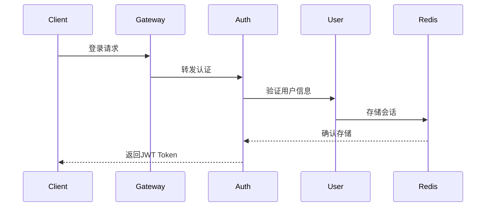

# Login System Product Requirements Document (PRD)
# 登录系统产品需求文档

## 0. Technical Requirements | 技术要求

### 0.1 Technology Selection Principles | 技术选型原则
- 开源技术，确保可商用
- 文档完善，社区活跃
- 技术支持完善
- 企业级生产环境验证
- 支持多终端部署

### 0.2 Project Architecture | 项目架构
- 前后端分离架构
- 多终端支持（Web、Mobile、Desktop）
- 企业级微服务架构

### 0.3 Project Structure | 项目结构
#### Backend Structure | 后端结构
- 标准 Maven 父子项目结构
- 父项目: `dove-parent`
  - 统一依赖管理
  - 统一版本控制
  - 统一构建配置
- 子项目: 独立的 Maven 微服务项目
  - 独立目录结构
  - 独立部署配置
  - 独立 Git 仓库
  - 继承父项目配置

#### Naming Conventions | 命名规范
- 项目命名规范
  - 所有子项目以 `dove-` 为前缀
  - 示例: `dove-auth`, `dove-gateway`, `dove-user`
- Java包命名规范
  - 统一以 `com.helix.dove` 为根包名
  - 示例: `com.helix.dove.auth`, `com.helix.dove.user`

#### Database | 数据库
- MariaDB 11.5.2
  - 开源、高性能
  - 兼容 MySQL
  - 企业级特性支持
- 持久层框架
  - Spring Data JPA
  - JPA规范实现
  - 自动化SQL生成
  - 丰富的查询支持

## 1. Technical Architecture Overview | 技术架构概述

### 1.1 Architecture Stack | 技术栈
#### Frontend | 前端
- **Framework**: Vue.js 3.x
  - TypeScript support
  - Vue Router for SPA routing
  - Pinia for state management
  - Vue I18n for internationalization
- **UI Framework**: 
  - Ant Design Vue
  - RTL support components
  - Locale-specific components
- **Build Tool**: 
  - Vite
  - i18n resource bundling
  - Dynamic locale loading
- **HTTP Client**: 
  - Axios
  - i18n request/response interceptors
- **Testing**: 
  - Jest + Vue Test Utils
  - i18n testing utilities

#### Backend | 后端
- **Internationalization Support**:
  - Spring MessageSource
  - Resource Bundle
  - Dynamic message loading
  - Custom locale resolvers

- **Microservices Framework**:
  - Spring Cloud Alibaba 2022.0.0.0
  - Spring Boot 3.2.x
  - Spring Cloud Gateway
  - Spring Security + JWT
  - i18n message sources

- **Service Discovery & Config**:
  - Nacos 2.x (服务注册、配置中心)
    * Multi-region configuration
    * Locale-specific settings
  - OpenFeign (服务调用)

- **Resilience & Monitoring**:
  - Sentinel (限流、熔断、降级)
  - Spring Boot Admin (服务监控)
  - SkyWalking (链路追踪)
  - Prometheus + Grafana (监控告警)

- **Database & Cache**:
  - MariaDB 11.5.2
  - Redis 7.x
  - Spring Data JPA (持久层框架)

- **Message Queue**:
  - RocketMQ 5.x (消息队列)

### 1.2 System Components | 系统组件

1. **API Gateway Service** | API网关服务
   - 路由转发
   - 统一认证
   - 限流控制
   - 日志记录

2. **Auth Service** | 认证服务
   - 用户认证
   - Token管理
   - 权限控制
   - 会话管理

3. **User Service** | 用户服务
   - 用户管理
   - 个人信息
   - 密码管理

4. **Notification Service** | 通知服务
   - 邮件发送
   - 短信发送
   - 消息推送

## 2. Detailed Technical Requirements | 详细技术需求

### 2.1 Authentication Flow | 认证流程

#### 2.1.1 Login Process | 登录流程


#### 2.1.2 Token Management | Token管理
- JWT格式: Header.Payload.Signature
- Token有效期: 2小时
- Refresh Token有效期: 7天
- Token存储: Redis集群

### 2.2 Security Implementation | 安全实现

#### 2.2.1 Password Security | 密码安全
- 加密算法: BCrypt
- 密码策略:
  - 最小长度: 8位
  - 必须包含: 大小写字母、数字、特殊字符
  - 密码历史: 记录前5次密码

#### 2.2.2 API Security | API安全
- 所有API使用HTTPS
- API签名验证
- 请求防重放
- CORS配置

### 2.3 Database Schema | 数据库设计

#### 2.3.1 User Table | 用户表
```sql
CREATE TABLE `user` (
  `id` bigint NOT NULL AUTO_INCREMENT,
  `username` varchar(64) NOT NULL,
  `email` varchar(128) NOT NULL,
  `password_hash` varchar(128) NOT NULL,
  `status` tinyint NOT NULL DEFAULT '1',
  `last_login_time` datetime DEFAULT NULL,
  `created_at` datetime NOT NULL DEFAULT CURRENT_TIMESTAMP,
  `updated_at` datetime NOT NULL DEFAULT CURRENT_TIMESTAMP,
  `locale` varchar(10) NOT NULL DEFAULT 'en_US',
  `timezone` varchar(40) NOT NULL DEFAULT 'UTC',
  `date_format` varchar(20) NOT NULL DEFAULT 'yyyy-MM-dd',
  `time_format` varchar(20) NOT NULL DEFAULT 'HH:mm:ss',
  `currency` varchar(3) NOT NULL DEFAULT 'USD',
  `region` varchar(10) DEFAULT NULL,
  PRIMARY KEY (`id`),
  UNIQUE KEY `idx_username` (`username`),
  UNIQUE KEY `idx_email` (`email`),
  KEY `idx_locale` (`locale`),
  KEY `idx_region` (`region`)
) ENGINE=InnoDB DEFAULT CHARSET=utf8mb4 COLLATE=utf8mb4_unicode_ci;
```

#### 2.3.2 User Token Table | 用户Token表
```sql
CREATE TABLE `user_token` (
  `id` bigint NOT NULL AUTO_INCREMENT,
  `user_id` bigint NOT NULL,
  `refresh_token` varchar(256) NOT NULL,
  `expires_at` datetime NOT NULL,
  `created_at` datetime NOT NULL DEFAULT CURRENT_TIMESTAMP,
  PRIMARY KEY (`id`),
  KEY `idx_user_id` (`user_id`)
) ENGINE=InnoDB DEFAULT CHARSET=utf8mb4;
```

#### 2.3.3 Localization Tables | 本地化表
```sql
-- 语言资源表
CREATE TABLE `i18n_resource` (
  `id` bigint NOT NULL AUTO_INCREMENT,
  `locale` varchar(10) NOT NULL,
  `resource_key` varchar(100) NOT NULL,
  `resource_value` text NOT NULL,
  `resource_type` varchar(20) NOT NULL,
  `created_at` datetime NOT NULL DEFAULT CURRENT_TIMESTAMP,
  `updated_at` datetime NOT NULL DEFAULT CURRENT_TIMESTAMP,
  PRIMARY KEY (`id`),
  UNIQUE KEY `idx_locale_key` (`locale`, `resource_key`),
  KEY `idx_resource_type` (`resource_type`)
) ENGINE=InnoDB DEFAULT CHARSET=utf8mb4 COLLATE=utf8mb4_unicode_ci;

-- 区域配置表
CREATE TABLE `region_config` (
  `id` bigint NOT NULL AUTO_INCREMENT,
  `region_code` varchar(10) NOT NULL,
  `default_locale` varchar(10) NOT NULL,
  `supported_locales` json NOT NULL,
  `timezone` varchar(40) NOT NULL,
  `date_format` varchar(20) NOT NULL,
  `time_format` varchar(20) NOT NULL,
  `currency` varchar(3) NOT NULL,
  `created_at` datetime NOT NULL DEFAULT CURRENT_TIMESTAMP,
  `updated_at` datetime NOT NULL DEFAULT CURRENT_TIMESTAMP,
  PRIMARY KEY (`id`),
  UNIQUE KEY `idx_region_code` (`region_code`)
) ENGINE=InnoDB DEFAULT CHARSET=utf8mb4 COLLATE=utf8mb4_unicode_ci;
```

#### 2.3.3 Tenant Tables | 租户表
```sql
-- 租户表
CREATE TABLE `tenant` (
  `id` bigint NOT NULL AUTO_INCREMENT,
  `tenant_code` varchar(32) NOT NULL,
  `tenant_name` varchar(100) NOT NULL,
  `status` tinyint NOT NULL DEFAULT '1',
  `edition` varchar(20) NOT NULL,
  `max_users` int NOT NULL,
  `max_storage` bigint NOT NULL,
  `region` varchar(20) NOT NULL,
  `database_config` json DEFAULT NULL,
  `created_at` datetime NOT NULL DEFAULT CURRENT_TIMESTAMP,
  `updated_at` datetime NOT NULL DEFAULT CURRENT_TIMESTAMP,
  PRIMARY KEY (`id`),
  UNIQUE KEY `idx_tenant_code` (`tenant_code`),
  KEY `idx_region` (`region`)
) ENGINE=InnoDB DEFAULT CHARSET=utf8mb4 COLLATE=utf8mb4_unicode_ci;

-- 租户配置表
CREATE TABLE `tenant_config` (
  `id` bigint NOT NULL AUTO_INCREMENT,
  `tenant_id` bigint NOT NULL,
  `config_key` varchar(50) NOT NULL,
  `config_value` text NOT NULL,
  `created_at` datetime NOT NULL DEFAULT CURRENT_TIMESTAMP,
  `updated_at` datetime NOT NULL DEFAULT CURRENT_TIMESTAMP,
  PRIMARY KEY (`id`),
  UNIQUE KEY `idx_tenant_key` (`tenant_id`, `config_key`)
) ENGINE=InnoDB DEFAULT CHARSET=utf8mb4 COLLATE=utf8mb4_unicode_ci;

-- 租户资源配额表
CREATE TABLE `tenant_quota` (
  `id` bigint NOT NULL AUTO_INCREMENT,
  `tenant_id` bigint NOT NULL,
  `resource_type` varchar(20) NOT NULL,
  `max_quota` bigint NOT NULL,
  `used_quota` bigint NOT NULL DEFAULT '0',
  `alert_threshold` int NOT NULL DEFAULT '80',
  `created_at` datetime NOT NULL DEFAULT CURRENT_TIMESTAMP,
  `updated_at` datetime NOT NULL DEFAULT CURRENT_TIMESTAMP,
  PRIMARY KEY (`id`),
  UNIQUE KEY `idx_tenant_resource` (`tenant_id`, `resource_type`)
) ENGINE=InnoDB DEFAULT CHARSET=utf8mb4 COLLATE=utf8mb4_unicode_ci;

-- 租户订阅表
CREATE TABLE `tenant_subscription` (
  `id` bigint NOT NULL AUTO_INCREMENT,
  `tenant_id` bigint NOT NULL,
  `plan_code` varchar(20) NOT NULL,
  `start_date` datetime NOT NULL,
  `end_date` datetime NOT NULL,
  `auto_renew` tinyint NOT NULL DEFAULT '0',
  `status` varchar(20) NOT NULL,
  `created_at` datetime NOT NULL DEFAULT CURRENT_TIMESTAMP,
  `updated_at` datetime NOT NULL DEFAULT CURRENT_TIMESTAMP,
  PRIMARY KEY (`id`),
  KEY `idx_tenant_id` (`tenant_id`)
) ENGINE=InnoDB DEFAULT CHARSET=utf8mb4 COLLATE=utf8mb4_unicode_ci;
```

### 2.4 API Specifications | API规范

#### 2.4.1 Authentication APIs | 认证API
```yaml
/api/v1/auth/login:
  post:
    summary: 用户登录
    request:
      username: string
      password: string
      remember_me: boolean
      locale: string    # 用户语言偏好
      timezone: string  # 用户时区
    response:
      access_token: string
      refresh_token: string
      expires_in: number
      user_settings:
        locale: string
        timezone: string
        date_format: string
        time_format: string
        currency: string

/api/v1/auth/settings:
  get:
    summary: 获取用户区域设置
    response:
      locale: string
      timezone: string
      date_format: string
      time_format: string
      currency: string
      supported_locales: array
      supported_timezones: array
      supported_currencies: array

  put:
    summary: 更新用户区域设置
    request:
      locale: string
      timezone: string
      date_format: string
      time_format: string
      currency: string
    response:
      success: boolean
      message: string
```

### 2.5 Performance Requirements | 性能需求

#### 2.5.1 System Metrics | 系统指标
- API响应时间: < 200ms
- 并发用户数: 10000+
- 系统可用性: 99.9%
- 数据库连接池: 50-100
- Redis连接池: 20-50

#### 2.5.2 Caching Strategy | 缓存策略
- 用户信息缓存: Redis, 15分钟
- Token缓存: Redis, 2小时
- 验证码缓存: Redis, 5分钟

### 2.6 Deployment Architecture | 部署架构

#### 2.6.1 Container Platform | 容器平台
- Docker + Kubernetes
- 服务网格: Istio

#### 2.6.2 High Availability | 高可用设计
- 多区域部署
- 服务多副本
- 数据库主从
- Redis集群

## 3. Development Guidelines | 开发指南

### 3.1 Code Standards | 代码规范
- Alibaba Java Coding Guidelines
- ESLint + Prettier
- Git Flow工作流
- Code Review必须

### 3.2 Testing Strategy | 测试策略
- 单元测试覆盖率 > 80%
- API自动化测试
- 性能测试
- 安全扫描

### 3.3 CI/CD Pipeline | 持续集成部署
- GitLab CI/CD
- 自动化构建
- 自动化测试
- 自动化部署

## 4. Timeline | 时间线
1. Phase 1 (4周): 基础架构搭建
2. Phase 2 (3周): 核心认证功能
3. Phase 3 (2周): 安全加固
4. Phase 4 (1周): 性能优化
5. Phase 5 (2周): 测试与上线

## 5. Risk Management | 风险管理
1. 性能风险
2. 安全风险
3. 兼容性风险
4. 集成风险

## 6. Success Metrics | 成功指标
1. 系统可用性 > 99.9%
2. API响应时间 < 200ms
3. 用户认证成功率 > 99.99%
4. 安全漏洞 Zero 

### 2.7 Internationalization Implementation | 国际化实现

#### 2.7.1 Frontend Internationalization | 前端国际化
```typescript
// i18n配置
export default {
  locale: 'zh_CN',
  fallbackLocale: 'en_US',
  messages: {
    async loader(locale) {
      const messages = await loadLocaleMessages(locale);
      return messages;
    }
  },
  numberFormats: {
    'en_US': {
      currency: {
        style: 'currency',
        currency: 'USD'
      }
    },
    'zh_CN': {
      currency: {
        style: 'currency',
        currency: 'CNY'
      }
    }
  },
  dateTimeFormats: {
    'en_US': {
      short: {
        year: 'numeric',
        month: 'short',
        day: 'numeric'
      }
    },
    'zh_CN': {
      short: {
        year: 'numeric',
        month: 'long',
        day: 'numeric'
      }
    }
  }
}
```

#### 2.7.2 Backend Internationalization | 后端国际化
```java
@Configuration
public class I18nConfig {
    @Bean
    public LocaleResolver localeResolver() {
        SessionLocaleResolver resolver = new SessionLocaleResolver();
        resolver.setDefaultLocale(Locale.US);
        return resolver;
    }
    
    @Bean
    public MessageSource messageSource() {
        ReloadableResourceBundleMessageSource messageSource = new ReloadableResourceBundleMessageSource();
        messageSource.setBasename("classpath:i18n/messages");
        messageSource.setDefaultEncoding("UTF-8");
        messageSource.setCacheSeconds(3600);
        return messageSource;
    }
}
```

#### 2.7.3 Database Internationalization | 数据库国际化
- 字符集使用：utf8mb4
- 排序规则：utf8mb4_unicode_ci
- 时间存储：使用UTC时间
- 数值格式：统一存储格式

### 2.8 Regional Deployment | 区域部署

#### 2.8.1 Multi-Region Architecture | 多区域架构
```yaml
regions:
  asia-east:
    primary: Tokyo
    secondary: Seoul
    databases:
      master: Tokyo
      slaves: [Seoul, Singapore]
    cdn_nodes: [Tokyo, Seoul, Singapore, Hong Kong]

  europe-west:
    primary: Frankfurt
    secondary: Paris
    databases:
      master: Frankfurt
      slaves: [Paris, London]
    cdn_nodes: [Frankfurt, Paris, London, Amsterdam]

  america-east:
    primary: Virginia
    secondary: Ohio
    databases:
      master: Virginia
      slaves: [Ohio, Toronto]
    cdn_nodes: [Virginia, Ohio, Toronto, New York]
```

#### 2.8.2 Data Synchronization | 数据同步
```yaml
sync_strategy:
  user_data:
    type: real-time
    priority: high
    conflict_resolution: last-write-wins

  i18n_resources:
    type: scheduled
    frequency: hourly
    priority: medium

  audit_logs:
    type: batch
    frequency: daily
    priority: low
```

### 2.9 Multi-Tenant Implementation | 多租户实现

#### 2.9.1 Tenant Context Management | 租户上下文管理
```java
@Configuration
public class TenantConfig {
    @Bean
    public TenantContextHolder tenantContextHolder() {
        return new TenantContextHolder();
    }
    
    @Bean
    public TenantInterceptor tenantInterceptor() {
        return new TenantInterceptor(tenantContextHolder());
    }
    
    @Bean
    public WebMvcConfigurer tenantWebMvcConfigurer() {
        return new WebMvcConfigurer() {
            @Override
            public void addInterceptors(InterceptorRegistry registry) {
                registry.addInterceptor(tenantInterceptor())
                    .addPathPatterns("/**")
                    .excludePathPatterns("/public/**", "/auth/**");
            }
        };
    }
}
```

#### 2.9.2 Database Routing | 数据库路由
```java
@Configuration
public class DataSourceConfig {
    @Bean
    public DataSource dynamicDataSource() {
        Map<Object, Object> targetDataSources = new HashMap<>();
        targetDataSources.put("DEFAULT", defaultDataSource());
        
        DynamicRoutingDataSource dataSource = new DynamicRoutingDataSource();
        dataSource.setDefaultTargetDataSource(defaultDataSource());
        dataSource.setTargetDataSources(targetDataSources);
        
        return dataSource;
    }
    
    @Bean
    public TenantDatabaseRouter tenantDatabaseRouter() {
        return new TenantDatabaseRouter(tenantContextHolder());
    }
}
```

#### 2.9.3 Cache Strategy | 缓存策略
```java
@Configuration
public class CacheConfig {
    @Bean
    public CacheManager tenantAwareCacheManager() {
        RedisCacheManager.RedisCacheManagerBuilder builder = RedisCacheManager
            .builder(redisConnectionFactory())
            .cacheDefaults(defaultConfig());
            
        return new TenantAwareCacheManager(builder.build(), tenantContextHolder());
    }
    
    private RedisCacheConfiguration defaultConfig() {
        return RedisCacheConfiguration.defaultCacheConfig()
            .entryTtl(Duration.ofMinutes(30))
            .computePrefixWith(cacheName -> 
                tenantContextHolder().getTenantId() + ":" + cacheName);
    }
}
```

#### 2.9.4 API Endpoints | API接口
```yaml
/api/v1/tenant:
  post:
    summary: 创建租户
    request:
      tenant_code: string
      tenant_name: string
      edition: string
      max_users: number
      region: string
    response:
      tenant_id: string
      status: string
      database_config: object

  get:
    summary: 获取租户信息
    response:
      tenant_code: string
      tenant_name: string
      status: string
      edition: string
      usage_statistics: object
      subscription_info: object

/api/v1/tenant/quota:
  get:
    summary: 获取资源配额
    response:
      resources:
        - type: string
          max_quota: number
          used_quota: number
          alert_threshold: number

  put:
    summary: 更新资源配额
    request:
      resource_type: string
      max_quota: number
      alert_threshold: number
    response:
      success: boolean
      message: string

/api/v1/tenant/subscription:
  post:
    summary: 订阅计划
    request:
      plan_code: string
      auto_renew: boolean
      payment_method: string
    response:
      subscription_id: string
      start_date: string
      end_date: string
      status: string
```

#### 2.9.5 Tenant Metrics | 租户指标
```yaml
metrics:
  - name: tenant_active_users
    type: gauge
    labels:
      - tenant_id
      - region
    help: "Number of active users per tenant"

  - name: tenant_api_requests
    type: counter
    labels:
      - tenant_id
      - api_path
      - status
    help: "Number of API requests per tenant"

  - name: tenant_resource_usage
    type: gauge
    labels:
      - tenant_id
      - resource_type
    help: "Resource usage per tenant"

  - name: tenant_quota_utilization
    type: gauge
    labels:
      - tenant_id
      - resource_type
    help: "Resource quota utilization percentage"
``` 