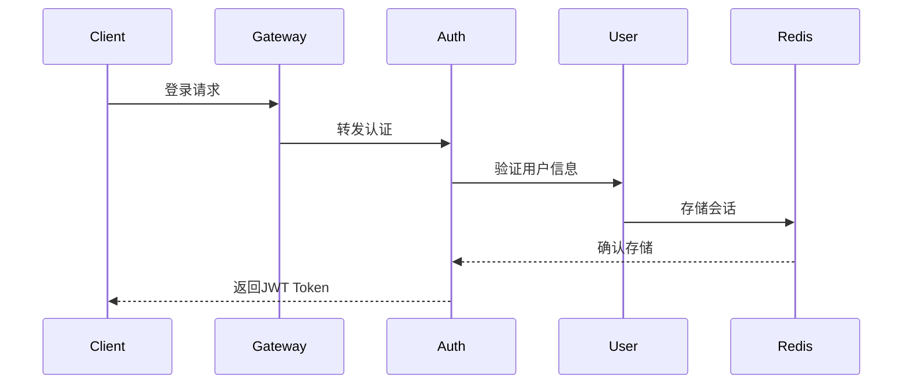

# Login System Product Requirements Document (PRD)
# 登录系统产品需求文档

## 1. Technical Architecture Overview | 技术架构概述

### 1.1 Architecture Stack | 技术栈
#### Frontend | 前端
- **Framework**: Vue.js 3.x
  - TypeScript support
  - Vue Router for SPA routing
  - Pinia for state management
- **UI Framework**: Ant Design Vue
- **Build Tool**: Vite
- **HTTP Client**: Axios
- **Testing**: Jest + Vue Test Utils

#### Backend | 后端
- **Microservices Framework**:
  - Spring Cloud Alibaba 2022.0.0.0
  - Spring Boot 3.2.x
  - Spring Cloud Gateway
  - Spring Security + JWT

- **Service Discovery & Config**:
  - Nacos 2.x (服务注册、配置中心)
  - OpenFeign (服务调用)

- **Resilience & Monitoring**:
  - Sentinel (限流、熔断、降级)
  - Spring Boot Admin (服务监控)
  - SkyWalking (链路追踪)
  - Prometheus + Grafana (监控告警)

- **Database & Cache**:
  - MySQL 8.0
  - Redis 7.x
  - MyBatis-Plus (ORM)

- **Message Queue**:
  - RocketMQ 5.x (消息队列)

### 1.2 System Components | 系统组件

1. **API Gateway Service** | API网关服务
   - 路由转发
   - 统一认证
   - 限流控制
   - 日志记录

2. **Auth Service** | 认证服务
   - 用户认证
   - Token管理
   - 权限控制
   - 会话管理

3. **User Service** | 用户服务
   - 用户管理
   - 个人信息
   - 密码管理

4. **Notification Service** | 通知服务
   - 邮件发送
   - 短信发送
   - 消息推送

## 2. Detailed Technical Requirements | 详细技术需求

### 2.1 Authentication Flow | 认证流程

#### 2.1.1 Login Process | 登录流程


#### 2.1.2 Token Management | Token管理
- JWT格式: Header.Payload.Signature
- Token有效期: 2小时
- Refresh Token有效期: 7天
- Token存储: Redis集群

### 2.2 Security Implementation | 安全实现

#### 2.2.1 Password Security | 密码安全
- 加密算法: BCrypt
- 密码策略:
  - 最小长度: 8位
  - 必须包含: 大小写字母、数字、特殊字符
  - 密码历史: 记录前5次密码

#### 2.2.2 API Security | API安全
- 所有API使用HTTPS
- API签名验证
- 请求防重放
- CORS配置

### 2.3 Database Schema | 数据库设计

#### 2.3.1 User Table | 用户表
```sql
CREATE TABLE `user` (
  `id` bigint NOT NULL AUTO_INCREMENT,
  `username` varchar(64) NOT NULL,
  `email` varchar(128) NOT NULL,
  `password_hash` varchar(128) NOT NULL,
  `status` tinyint NOT NULL DEFAULT '1',
  `last_login_time` datetime DEFAULT NULL,
  `created_at` datetime NOT NULL DEFAULT CURRENT_TIMESTAMP,
  `updated_at` datetime NOT NULL DEFAULT CURRENT_TIMESTAMP,
  PRIMARY KEY (`id`),
  UNIQUE KEY `idx_username` (`username`),
  UNIQUE KEY `idx_email` (`email`)
) ENGINE=InnoDB DEFAULT CHARSET=utf8mb4;
```

#### 2.3.2 User Token Table | 用户Token表
```sql
CREATE TABLE `user_token` (
  `id` bigint NOT NULL AUTO_INCREMENT,
  `user_id` bigint NOT NULL,
  `refresh_token` varchar(256) NOT NULL,
  `expires_at` datetime NOT NULL,
  `created_at` datetime NOT NULL DEFAULT CURRENT_TIMESTAMP,
  PRIMARY KEY (`id`),
  KEY `idx_user_id` (`user_id`)
) ENGINE=InnoDB DEFAULT CHARSET=utf8mb4;
```

### 2.4 API Specifications | API规范

#### 2.4.1 Authentication APIs | 认证API
```yaml
/api/v1/auth/login:
  post:
    summary: 用户登录
    request:
      username: string
      password: string
      remember_me: boolean
    response:
      access_token: string
      refresh_token: string
      expires_in: number

/api/v1/auth/refresh:
  post:
    summary: 刷新Token
    request:
      refresh_token: string
    response:
      access_token: string
      refresh_token: string
      expires_in: number
```

### 2.5 Performance Requirements | 性能需求

#### 2.5.1 System Metrics | 系统指标
- API响应时间: < 200ms
- 并发用户数: 10000+
- 系统可用性: 99.9%
- 数据库连接池: 50-100
- Redis连接池: 20-50

#### 2.5.2 Caching Strategy | 缓存策略
- 用户信息缓存: Redis, 15分钟
- Token缓存: Redis, 2小时
- 验证码缓存: Redis, 5分钟

### 2.6 Deployment Architecture | 部署架构

#### 2.6.1 Container Platform | 容器平台
- Docker + Kubernetes
- 服务网格: Istio

#### 2.6.2 High Availability | 高可用设计
- 多区域部署
- 服务多副本
- 数据库主从
- Redis集群

## 3. Development Guidelines | 开发指南

### 3.1 Code Standards | 代码规范
- Alibaba Java Coding Guidelines
- ESLint + Prettier
- Git Flow工作流
- Code Review必须

### 3.2 Testing Strategy | 测试策略
- 单元测试覆盖率 > 80%
- API自动化测试
- 性能测试
- 安全扫描

### 3.3 CI/CD Pipeline | 持续集成部署
- GitLab CI/CD
- 自动化构建
- 自动化测试
- 自动化部署

## 4. Timeline | 时间线
1. Phase 1 (4周): 基础架构搭建
2. Phase 2 (3周): 核心认证功能
3. Phase 3 (2周): 安全加固
4. Phase 4 (1周): 性能优化
5. Phase 5 (2周): 测试与上线

## 5. Risk Management | 风险管理
1. 性能风险
2. 安全风险
3. 兼容性风险
4. 集成风险

## 6. Success Metrics | 成功指标
1. 系统可用性 > 99.9%
2. API响应时间 < 200ms
3. 用户认证成功率 > 99.99%
4. 安全漏洞 Zero 