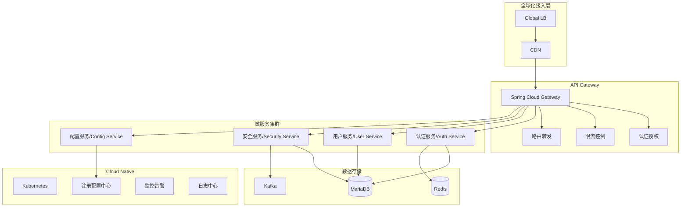

# 企业级 Maven 使用需求说明 (最终完善版)

## 一、项目背景与目标

1. **规模与使用场景**  
   - 面向 **2 亿注册用户**、**8000 万并发**访问的 **SaaS 国际化**平台，覆盖全球多时区、多语言环境。  
   - 需保证在 **工作时间高负载**、**非工作时间 30% 负载** 依然稳定运行。

2. **关键业务需求**  
   - 前后端分离，后端采用 **Spring Cloud + Spring Cloud Alibaba** 微服务；  
   - **精确复刻 JIRA Web 登录**流程，包括表单字段、Remember Me、登录错误提示、UI 交互等；  
   - 强调 **国际化 (i18n)**、**高并发**、**弹性扩容** 与 **安全合规**。

3. **Maven 的角色**  
   - 统一管理 **微服务依赖**（Spring Boot/Cloud/Alibaba、Security、Database、MQ、Cache 等）与 **构建插件**；  
   - 提供 **多模块/多仓库** 的父子项目结构，简化子服务的版本与插件配置；  
   - 支持企业级 CI/CD、许可证审查、质量审查、Docker 化部署。

---

## 二、Maven 需求与规范

### 企业级微服务项目结构
   - **dove-parent** (父POM项目)
     - 统一依赖版本管理
       - 定义 `<properties>` 统一管理版本号
       - 使用 `<dependencyManagement>` 声明第三方依赖
       - 引入 dove-dependencies BOM 管理内部模块
       - 锁定 Spring Boot/Cloud/Alibaba 等核心框架版本
     
     - 统一插件管理
       - 使用 `<pluginManagement>` 统一声明插件版本与配置
       - 配置 maven-compiler-plugin 指定 Java 版本
       - 配置 spring-boot-maven-plugin 支持打包
       - 配置 maven-source-plugin 生成源码包
       - 配置 maven-javadoc-plugin 生成文档
       - 配置 maven-checkstyle-plugin 检查代码规范
       - 配置 jacoco-maven-plugin 生成测试覆盖率报告
     
     - 统一构建配置  
       - 设置 `<packaging>pom</packaging>` 作为父项目
       - 配置 `<modules>` 声明子模块
       - 配置 `<profiles>` 区分开发/测试/生产环境
         - dev: 开发环境,默认激活,spring.profiles.active=dev
         - test: 测试环境,spring.profiles.active=test
         - prod: 生产环境,spring.profiles.active=prod
       - 配置 distributionManagement 指定发布仓库
       - 配置 repositories/pluginRepositories 指定依赖仓库
     
     - 统一代码规范
       - 配置 checkstyle 规则文件
       - 配置 EditorConfig 统一代码格式
       - 配置 PMD/SpotBugs 进行静态代码分析
       - 配置 Git pre-commit hooks 检查提交规范

   - **dove-dependencies** (依赖管理BOM)
     - 统一依赖版本管理
       - 设置 `<packaging>pom</packaging>` 作为BOM项目
       - 定义 `<properties>` 统一管理版本号
       - 使用 `<dependencyManagement>` 声明第三方依赖
       - 锁定 Spring Boot/Cloud/Alibaba 等核心框架版本
       - 锁定数据库、缓存、消息队列等中间件版本
       - 锁定工具类库、测试框架等通用依赖版本
     
     - 内部模块版本管理
       - 在 `<dependencyManagement>` 中声明所有内部模块
       
       - 统一管理技术框架层版本 (dove-framework)
         - dove-framework-core: 提供框架级基础功能,如IoC容器、AOP等底层支持
         - dove-framework-web: 提供MVC框架、过滤器、拦截器等Web框架功能
         - dove-framework-data: 提供ORM框架、数据源、事务等数据访问层框架
         - dove-framework-cache: 提供缓存抽象、多级缓存等缓存框架功能
         - dove-framework-security: 提供认证授权、安全过滤等安全框架功能
         - dove-framework-log: 提供日志框架集成、日志切面等日志框架功能
         - dove-framework-test: 提供单元测试、集成测试等测试框架功能
       
       - 统一管理公共工具层版本 (dove-common)
         - dove-common-core: 提供字符串、日期等基础工具类
         - dove-common-util: 提供文件、加密等通用工具类
         - dove-common-model: 提供DTO、VO等通用对象模型
         - dove-common-swagger: 提供Swagger文档生成工具
         - dove-common-redis: 提供Redis操作工具类
         - dove-common-mybatis: 提供Mybatis扩展工具类
         - dove-common-log: 提供日志记录工具类
         - dove-common-security: 提供安全工具类
         
       - 统一管理业务模块层版本
         - dove-module-system 系统管理版本
         - dove-module-auth 认证中心版本
         - dove-module-gateway API网关版本
         - dove-module-monitor 监控中心版本
         - dove-module-job 任务调度版本
         - dove-module-file 文件服务版本
         - dove-module-message 消息中心版本
         - dove-module-report 报表中心版本
         
       - 统一管理服务接口层版本
         - dove-api-system 系统接口版本
         - dove-api-auth 认证接口版本
         - dove-api-file 文件接口版本
         - dove-api-message 消息接口版本
     
     - 版本发布管理
       - 配置 distributionManagement 指定发布仓库
         - 配置 Nexus/Artifactory 私服仓库
           - SNAPSHOT 仓库用于开发版本
           - RELEASE 仓库用于稳定版本
           - 3rd-party 仓库存放第三方依赖
         - 配置 Maven Settings.xml 的 server 认证信息
         - 配置 CI/CD 流水线自动发布流程
       
       - 配置版本号规则
         - 主版本号.次版本号.修订号-SNAPSHOT
           - 开发阶段使用 SNAPSHOT 版本
           - 如 1.0.0-SNAPSHOT, 1.0.1-SNAPSHOT
         - 主版本号.次版本号.修订号-RELEASE  
           - 稳定版本使用 RELEASE 版本
           - 如 1.0.0-RELEASE, 1.0.1-RELEASE
         - 遵循语义化版本规范(Semantic Versioning)
           - 主版本号:不兼容的API修改
           - 次版本号:向下兼容的功能性新增
           - 修订号:向下兼容的问题修正
       
       - 定期发布稳定版本
         - 每月发布一次 RELEASE 版本
         - 版本发布前进行完整测试与审查
         - 生成版本变更文档(Release Notes)
         - 打 Tag 标记版本代码
         - 归档历史版本制品
     
     - 依赖版本管理
       - 锁定第三方依赖版本
         - 使用 Maven Bill of Materials(BOM)
         - 在 properties 中统一声明版本号
         - 使用 dependencyManagement 锁定版本
         - 定期检查并升级依赖版本
         - 使用 Maven Enforcer 插件强制版本
       
       - 管理内部模块版本
         - 统一管理所有内部模块版本号
         - 保持模块间版本一致性
         - 模块间依赖使用 ${project.version}
         - 避免循环依赖
     
     - 技术选型基线
       - 定期评估和更新技术栈
       - 建立依赖白名单机制
       - 进行依赖安全漏洞扫描
       - 评估开源许可证合规性
       - 建立依赖升级变更流程
       - 维护技术栈文档

   - **dove-framework** (技术框架层)
     - dove-framework-core: 核心框架
     - dove-framework-web: Web框架
     - dove-framework-data: 数据访问
     - dove-framework-cache: 缓存框架
     - dove-framework-security: 安全框架
     - dove-framework-log: 日志框架
     - dove-framework-test: 测试框架

   - **dove-common** (公共工具层)
     - dove-common-core: 核心工具类
     - dove-common-util: 通用工具类
     - dove-common-model: 通用领域模型
     - dove-common-swagger: API文档
     - dove-common-redis: Redis工具
     - dove-common-mybatis: Mybatis工具
     - dove-common-log: 日志工具
     - dove-common-security: 安全工具

   - **dove-modules** (业务模块层)
     - dove-module-system: 系统管理
     - dove-module-auth: 认证中心
     - dove-module-gateway: API网关
     - dove-module-monitor: 监控中心
     - dove-module-job: 任务调度
     - dove-module-file: 文件服务
     - dove-module-message: 消息中心
     - dove-module-report: 报表中心

   - **dove-api** (服务接口层)
     - dove-api-system: 系统接口
     - dove-api-auth: 认证接口
     - dove-api-file: 文件接口
     - dove-api-message: 消息接口

   - **dove-example** (示例工程)
     - 微服务架构最佳实践
     - 框架使用示例代码
     - 常见业务场景演示
     

### 2. 父 POM (Parent POM)

#### 2.1 基本配置信息
2.1.1 父项目名称: dove-parent  
2.1.2 包名：com.dove  
2.1.3 版本号：1.0.0  
2.1.4 描述：dove-parent 是 Dove 项目的父项目，用于统一管理依赖版本、插件版本、构建配置等。  
2.1.5 文件夹结构
   ```
   dove-parent
   ├── pom.xml                               # 父POM配置文件
   ├── .gitignore                            # Git忽略文件
   ├── README.md                             # 项目说明文档
   ├── LICENSE                               # 开源许可证
   ├── .mvn                                  # Maven Wrapper配置目录,用于统一管理Maven版本
   │   └── wrapper                          # wrapper配置文件夹
   │       ├── maven-wrapper.jar            # Maven Wrapper可执行JAR包,用于自动下载指定版本的Maven
   │       └── maven-wrapper.properties     # Maven Wrapper属性配置文件,指定Maven版本等配置
   ├── mvnw                                  # Maven Wrapper脚本(Unix)
   ├── mvnw.cmd                             # Maven Wrapper脚本(Windows)
   ├── docs                                 # 项目文档
   │   ├── images                           # 文档图片资源
   │   └── guides                           # 使用指南
   ├── scripts                              # 构建和部署脚本
   │   ├── build.sh                         # 构建脚本
   │   └── deploy.sh                        # 部署脚本
   └── src                                  # 源代码目录
       └── main
           └── resources
               ├── archetype-resources       # Maven原型资源
               └── META-INF
                   └── maven                 # Maven配置元数据
   ```

#### 2.2 父 POM项目 核心配置要求
     - 统一依赖版本管理
       - 定义 `<properties>` 统一管理版本号
       - 使用 `<dependencyManagement>` 声明第三方依赖
       - 引入 dove-dependencies BOM 管理内部模块
       - 锁定 Spring Boot/Cloud/Alibaba 等核心框架版本
     
     - 统一插件管理
       - 使用 `<pluginManagement>` 统一声明插件版本与配置
       - 配置 maven-compiler-plugin 指定 Java 版本
       - 配置 spring-boot-maven-plugin 支持打包
       - 配置 maven-source-plugin 生成源码包
       - 配置 maven-javadoc-plugin 生成文档
       - 配置 maven-checkstyle-plugin 检查代码规范
       - 配置 jacoco-maven-plugin 生成测试覆盖率报告
     
     - 统一构建配置  
       - 设置 `<packaging>pom</packaging>` 作为父项目
       - 配置 `<modules>` 声明子模块
       - 配置 `<profiles>` 区分开发/测试/生产环境
       - 配置 distributionManagement 指定发布仓库
       - 配置 repositories/pluginRepositories 指定依赖仓库
     
     - 统一代码规范
       - 配置 checkstyle 规则文件
       - 配置 EditorConfig 统一代码格式
       - 配置 PMD/SpotBugs 进行静态代码分析
       - 配置 Git pre-commit hooks 检查提交规范

#### 2.1.1 父项目名称: dove-parent  
2.1.2 包名：com.dove  
2.1.3 版本号：1.0.0  
2.1.4 描述：dove-parent 是 Dove 项目的父项目，用于统一管理依赖版本、插件版本、构建配置等。  
2.1.5 文件夹结构  
#### 2.3 依赖管理 (dependencyManagement)  
   - **Spring Cloud 基础依赖**
     - `spring-boot-starter-parent:3.1.5`
     - `spring-cloud-dependencies:2022.0.4`
     - `spring-cloud-alibaba-dependencies:2022.0.0.0`

   - **Spring Cloud 核心组件**
     - `spring-cloud-starter-bootstrap:4.0.4`
     - `spring-cloud-starter-loadbalancer:4.0.4`
     - `spring-cloud-starter-openfeign:4.0.4`
     - `spring-cloud-starter-gateway:4.0.4`

   - **Spring Cloud Alibaba 组件**
     - `spring-cloud-starter-alibaba-nacos-discovery:2022.0.0.0`
     - `spring-cloud-starter-alibaba-nacos-config:2022.0.0.0`
     - `spring-cloud-starter-alibaba-sentinel:2022.0.0.0`
     - `spring-cloud-starter-alibaba-seata:2022.0.0.0`

   - **安全认证**
     - `spring-boot-starter-security:3.1.5`
     - `spring-security-oauth2-authorization-server:1.1.3`
     - `spring-security-oauth2-resource-server:6.1.5`
     - `jjwt-api:0.11.5`
     - `jjwt-impl:0.11.5`
     - `keycloak-spring-boot-starter:23.0.3`
     - `spring-security-saml2-service-provider:6.1.5`
     - `spring-security-crypto:6.1.5`
     - `passay:1.6.3`
     - `otp:1.0.1`
     - `spring-security-test:6.1.5`

   - **验证码服务**
     - `kaptcha:2.3.3`

   - **数据存储与缓存**
     - `mariadb-java-client:3.1.4`
     - `spring-boot-starter-data-redis:3.1.5`
     - `redisson-spring-boot-starter:3.23.5`
     - `spring-boot-starter-data-jpa:3.1.5`
     - `hibernate-core:6.2.13.Final`
     - `hikaricp:5.0.1`
     - `spring-session-data-redis:3.1.2`
     - `spring-session-jdbc:3.1.2`
     - `spring-session-hazelcast:3.1.2`

   - **数据库迁移**
     - `flyway-core:9.22.3`
     - `flyway-mysql:9.22.3`

   - **响应式编程**
     - `spring-boot-starter-webflux:3.1.5`
     - `reactor-test:3.5.11`
     - `reactor-tools:3.5.11`
     - `spring-data-redis-reactive:3.1.5`

   - **缓存**
     - `spring-boot-starter-cache:3.1.5`
     - `ehcache:3.10.8`
     - `caffeine:3.1.8`

   - **消息队列**
     - `rocketmq-spring-boot-starter:2.2.3`
     - `spring-kafka:3.0.12`
     - `spring-cloud-starter-stream-kafka:4.0.4`

   - **监控与日志**
     - `spring-boot-starter-actuator:3.1.5`
     - `micrometer-registry-prometheus:1.11.5`
     - `spring-boot-starter-log4j2:3.1.5`
     - `logstash-logback-encoder:7.4`
     - `spring-boot-admin-starter-server:3.1.7`
     - `spring-boot-admin-starter-client:3.1.7`
     - `prometheus-client:0.16.0`

   - **国际化与模板**
     - `spring-boot-starter-thymeleaf:3.1.5`
     - `thymeleaf-extras-springsecurity6:3.1.2.RELEASE`
     - `spring-boot-starter-validation:3.1.5`
     - `freemarker:2.3.32`
     - `velocity-engine-core:2.3`
     - `thymeleaf-spring6:3.1.2.RELEASE`

   - **工具类库**
     - `commons-lang3:3.13.0`
     - `guava:32.1.2-jre`
     - `fastjson2:2.0.40`
     - `mapstruct:1.5.5.Final`
     - `lombok:1.18.30`
     - `javassist:3.29.2-GA`

   - **API文档**
     - `springdoc-openapi-starter-webmvc-ui:2.2.0`
     - `springdoc-openapi-starter-webflux-ui:2.2.0`

   - **任务调度**
     - `xxl-job-core:2.4.0`
     - `spring-boot-starter-quartz:3.1.5`
     - `spring-boot-starter-batch:3.1.5`

   - **测试框架**
     - `spring-boot-starter-test:3.1.5`
     - `testcontainers:1.19.1`
     - `mockito-core:5.7.0`
     - `junit-jupiter:5.10.0`
     - `spring-cloud-starter-contract-verifier:4.0.4`
     - `jmh-core:1.37`

   - **链路追踪**
     - `micrometer-tracing-bridge-brave:1.1.5`
     - `skywalking-agent:9.0.0`

   - **开发工具**
     - `spring-boot-devtools:3.1.5`
     - `spring-boot-configuration-processor:3.1.5`
     - `spring-boot-properties-migrator:3.1.5`
     - `arthas-spring-boot-starter:3.7.1`

   - **分布式事务**
     - `seata-spring-boot-starter:1.7.1`

   - **文件存储与文档处理**
     - `minio-java:8.5.6`
     - `aws-java-sdk-s3:1.12.261`
     - `poi-ooxml:5.2.4`
     - `easyexcel:3.3.2`
     - `aspose-words:23.10`
     - `itext7-core:8.0.2`

   - **搜索引擎**
     - `spring-boot-starter-data-elasticsearch:3.1.5`
     - `lucene-core:9.8.0`
     - `hibernate-search-orm-orm6:6.2.1.Final`

   - **安全与加密**
     - `jasypt-spring-boot-starter:3.0.5`
     - `shield-core:1.0.1`
     - `sensitive-core:1.0.0`
     - `encryption-spring-boot-starter:1.0.0`

   - **通信**
     - `grpc-spring-boot-starter:2.15.0.RELEASE`
     - `spring-boot-starter-mail:3.1.5`

   - **报表工具**
     - `jasperreports:6.20.6`
     - `xdocreport:2.0.4`

#### 2.3 插件管理 (pluginManagement)  
   - **编译与资源处理**：
     - `maven-compiler-plugin:3.11.0` - Java 17编译配置
     - `maven-resources-plugin:3.3.1` - 资源文件处理
     - `maven-source-plugin:3.3.0` - 源码打包

   - **测试与质量**：
     - `maven-surefire-plugin:3.1.2` - 单元测试执行
     - `maven-failsafe-plugin:3.1.2` - 集成测试执行
     - `jacoco-maven-plugin:0.8.10` - 代码覆盖率分析
     - `sonar-maven-plugin:3.9.1` - SonarQube代码质量分析
     - `maven-checkstyle-plugin:3.3.0` - 代码风格检查
     - `spotbugs-maven-plugin:4.7.3.6` - Bug静态分析

   - **依赖管理与安全**：
     - `versions-maven-plugin:2.16.1` - 依赖版本检查更新
     - `maven-enforcer-plugin:3.4.1` - 依赖版本与环境强制检查
     - `dependency-check-maven:8.4.0` - OWASP安全漏洞扫描
     - `license-maven-plugin:2.2.0` - 依赖许可证检查

   - **容器化部署**：
     - `jib-maven-plugin:3.3.2` - Google容器构建工具
     - `dockerfile-maven-plugin:1.4.13` - Docker镜像构建
     - `fabric8-maven-plugin:4.4.2` - K8s部署支持

   - **文档与发布**：
     - `maven-javadoc-plugin:3.6.0` - JavaDoc生成
     - `maven-deploy-plugin:3.1.1` - 制品发布
     - `maven-release-plugin:3.0.1` - 版本发布管理

   - **Profile配置**：
     - 开发环境(dev): 快速编译,跳过测试
     - 测试环境(test): 启用单元测试,代码覆盖率检查
     - 预发环境(staging): 完整测试,质量检查
     - 生产环境(prod): 完整构建,安全扫描,制品签名

#### 2.4 许可证合规  
   - 父 POM 中记录各依赖的 LICENSE 信息（Apache 2.0、MIT、BSD 等），禁止接入可能冲突商业化的 GPLv3 等；
   - 使用 Helix 公司的 LICENSE 许可证:
     ```
     Copyright (c) 2023 Helix Corporation
     
     Permission is hereby granted, free of charge, to any person obtaining a copy
     of this software and associated documentation files (the "Software"), to deal
     in the Software without restriction, including without limitation the rights
     to use, copy, modify, merge, publish, distribute, sublicense, and/or sell
     copies of the Software, and to permit persons to whom the Software is
     furnished to do so, subject to the following conditions:
     
     The above copyright notice and this permission notice shall be included in all
     copies or substantial portions of the Software.
     
     THE SOFTWARE IS PROVIDED "AS IS", WITHOUT WARRANTY OF ANY KIND, EXPRESS OR
     IMPLIED, INCLUDING BUT NOT LIMITED TO THE WARRANTIES OF MERCHANTABILITY,
     FITNESS FOR A PARTICULAR PURPOSE AND NONINFRINGEMENT. IN NO EVENT SHALL THE
     AUTHORS OR COPYRIGHT HOLDERS BE LIABLE FOR ANY CLAIM, DAMAGES OR OTHER
     LIABILITY, WHETHER IN AN ACTION OF CONTRACT, TORT OR OTHERWISE, ARISING FROM,
     OUT OF OR IN CONNECTION WITH THE SOFTWARE OR THE USE OR OTHER DEALINGS IN THE
     SOFTWARE.
     ```
   - 定期审阅第三方依赖，升级或替换存在安全/许可证风险的库：
     - 每月使用 `mvn versions:display-dependency-updates` 检查依赖更新
     - 配置 `maven-enforcer-plugin` 强制依赖版本检查规则
     - 使用 `dependency-check-maven` 定期扫描 CVE 漏洞
     - 建立依赖白名单制度，新增依赖需评审其许可证
     - 使用 `license-maven-plugin` 自动检查依赖许可证
     - 配置 SonarQube 定期扫描，关注依赖相关安全告警
     - 建立升级变更流程：本地验证 -> 测试环境 -> 预发布 -> 生产

### 3. dove-dependencies (依赖管理BOM)
#### 3.1 基本信息
     - 包名：com.dove
     - 版本号：1.0.0
     - 描述：dove-dependencies 是 Dove 项目的依赖管理BOM，用于统一管理依赖版本、插件版本、构建配置等。
     - 文件夹结构：
       ```
       dove-dependencies
       ├── pom.xml                               # BOM配置文件
       ├── .gitignore                            # Git忽略文件
       ├── README.md                             # 项目说明文档
       ├── LICENSE                               # 开源许可证
       ├── docs                                  # 项目文档
       │   ├── dependencies                      # 依赖说明文档
       │   │   ├── spring-cloud.md              # Spring Cloud依赖说明
       │   │   ├── spring-boot.md               # Spring Boot依赖说明
       │   │   ├── database.md                  # 数据库相关依赖说明
       │   │   └── tools.md                     # 工具类依赖说明
       │   └── guides                           # 使用指南
       │       ├── quick-start.md               # 快速开始
       │       └── best-practices.md            # 最佳实践
       ├── scripts                              # 构建和部署脚本
       │   ├── version-check.sh                 # 版本检查脚本
       │   ├── dependency-analyze.sh            # 依赖分析脚本
       │   └── license-check.sh                 # 许可证检查脚本
       └── src                                  # 源代码目录
           └── main
               └── resources
                   ├── META-INF
                   │   └── maven                # Maven配置元数据
                   │       └── com.dove
                   │           └── dove-dependencies
                   │               └── pom.xml   # BOM配置备份
                   └── version-rules.xml        # 版本管理规则配置
       
       - pom.xml
       - src/main/resources/META-INF/maven/com.dove/dove-dependencies/pom.xml
       ```

     
#### POM项目 核心配置要求
     - 统一依赖版本管理
       - 设置 `<packaging>pom</packaging>` 作为BOM项目
       - 定义 `<properties>` 统一管理版本号
       - 使用 `<dependencyManagement>` 声明第三方依赖
       - 锁定 Spring Boot/Cloud/Alibaba 等核心框架版本
       - 锁定数据库、缓存、消息队列等中间件版本
       - 锁定工具类库、测试框架等通用依赖版本
     
     - 内部模块版本管理
       - 在 `<dependencyManagement>` 中声明所有内部模块
       - 统一管理技术框架层版本
         - dove-framework-core 核心框架版本
         - dove-framework-web Web框架版本
         - dove-framework-data 数据访问版本
         - dove-framework-cache 缓存框架版本
         - dove-framework-security 安全框架版本
         - dove-framework-log 日志框架版本
         - dove-framework-test 测试框架版本
       
       - 统一管理公共工具层版本
         - dove-common-core 核心工具类版本
         - dove-common-util 通用工具类版本
         - dove-common-model 通用领域模型版本
         - dove-common-swagger API文档版本
         - dove-common-redis Redis工具版本
         - dove-common-mybatis Mybatis工具版本
         - dove-common-log 日志工具版本
         - dove-common-security 安全工具版本
         
       - 统一管理业务模块层版本
         - dove-module-system 系统管理版本
         - dove-module-auth 认证中心版本
         - dove-module-gateway API网关版本
         - dove-module-monitor 监控中心版本
         - dove-module-job 任务调度版本
         - dove-module-file 文件服务版本
         - dove-module-message 消息中心版本
         - dove-module-report 报表中心版本
         
       - 统一管理服务接口层版本
         - dove-api-system 系统接口版本
         - dove-api-auth 认证接口版本
         - dove-api-file 文件接口版本
         - dove-api-message 消息接口版本
     
     - 版本发布管理
       - 配置 distributionManagement 指定发布仓库
         - 配置 Nexus/Artifactory 私服仓库
           - SNAPSHOT 仓库用于开发版本
           - RELEASE 仓库用于稳定版本
           - 3rd-party 仓库存放第三方依赖
         - 配置 Maven Settings.xml 的 server 认证信息
         - 配置 CI/CD 流水线自动发布流程
       
       - 配置版本号规则
         - 主版本号.次版本号.修订号-SNAPSHOT
           - 开发阶段使用 SNAPSHOT 版本
           - 如 1.0.0-SNAPSHOT, 1.0.1-SNAPSHOT
         - 主版本号.次版本号.修订号-RELEASE  
           - 稳定版本使用 RELEASE 版本
           - 如 1.0.0-RELEASE, 1.0.1-RELEASE
         - 遵循语义化版本规范(Semantic Versioning)
           - 主版本号:不兼容的API修改
           - 次版本号:向下兼容的功能性新增
           - 修订号:向下兼容的问题修正
       
       - 定期发布稳定版本
         - 每月发布一次 RELEASE 版本
         - 版本发布前进行完整测试与审查
         - 生成版本变更文档(Release Notes)
         - 打 Tag 标记版本代码
         - 归档历史版本制品
     
     - 依赖版本管理
       - 锁定第三方依赖版本
         - 使用 Maven Bill of Materials(BOM)
         - 在 properties 中统一声明版本号
         - 使用 dependencyManagement 锁定版本
         - 定期检查并升级依赖版本
         - 使用 Maven Enforcer 插件强制版本
       
       - 管理内部模块版本
         - 统一管理所有内部模块版本号
         - 保持模块间版本一致性
         - 模块间依赖使用 ${project.version}
         - 避免循环依赖
     
     - 技术选型基线
       - 定期评估和更新技术栈
       - 建立依赖白名单机制
       - 进行依赖安全漏洞扫描
       - 评估开源许可证合规性
       - 建立依赖升级变更流程
       - 维护技术栈文档
### 2. 子模块 (微服务) 设计
#### 2.0 架构图（Architecture Diagram）

系统架构采用分层设计,各层职责和交互关系如下:

1. **全球化接入层**
   - Global LB: 全球负载均衡,就近接入
   - CDN: 静态资源加速,降低延迟
   - 流量分发到就近的 API Gateway

2. **网关层 (API Gateway)**
   - Spring Cloud Gateway 作为统一入口
   - 提供认证授权、限流、路由等公共能力
   - 与认证服务(Auth Service)交互进行token校验
   - 根据路由规则转发请求到对应微服务

3. **微服务集群**
   - 认证服务(Auth Service):
     * 处理登录认证请求
     * 生成和验证 token
     * 调用用户服务获取用户信息
     * 调用安全服务进行安全检查
     * 使用 Redis 存储 token 和会话信息
   
   - 用户服务(User Service): 
     * 提供用户信息的CRUD操作
     * 与 MariaDB 交互存储用户数据
     * 被认证服务调用获取用户信息
     * 被安全服务调用获取用户权限

   - 安全服务(Security Service):
     * 提供安全策略检查
     * 记录安全审计日志到 Kafka
     * 被认证服务调用进行登录安全检查
     * 从用户服务获取用户权限信息

   - 配置服务(Config Service):
     * 从 Nacos 获取配置信息
     * 为其他服务提供配置管理
     * 配置变更实时推送

4. **数据层**
   - MariaDB: 存储用户数据、权限数据等
   - Redis: 缓存 token、会话等数据
   - Kafka: 收集安全日志、审计日志

5. **基础设施层**
   - Kubernetes: 容器编排与服务管理
   - Nacos: 服务注册与配置管理
   - 监控告警: 系统运行状态监控
   - 日志中心: 统一日志收集分析




#### 2.1 dove-common  
##### 2.1.0 核心要求
- dove-common 是 dove-parent  的子模块， 但是独立的文件夹和git 仓库
##### 2.1.1 基本信息
     - 2.1.1.1 包名：com.dove
     - 2.1.1.2 版本号：1.0.0
     - 2.1.1.3 描述：dove-dependencies 是 Dove 项目的依赖管理BOM，用于统一管理依赖版本、插件版本、构建配置等。
     - 2.1.1.4 文件夹结构：
     ```
       - dove-common
         - dove-common-core
           ├── pom.xml                          # 核心模块POM
           ├── src/main/java/com/dove/common/core
           │   ├── utils                        # 工具类包
           │   │   ├── StringUtils.java         # 字符串工具类:提供字符串操作、验证、转换等通用方法
           │   │   ├── DateUtils.java           # 日期工具类:提供日期格式化、计算、转换等功能
           │   │   ├── NumberUtils.java         # 数字工具类:提供数值转换、计算、验证等功能
           │   │   ├── CollectionUtils.java     # 集合工具类:提供集合操作、转换等功能
           │   │   ├── MapUtils.java            # Map工具类:提供Map相关操作方法
           │   │   ├── JsonUtils.java           # JSON工具类:提供JSON序列化和反序列化功能
           │   │   └── RegexUtils.java          # 正则工具类:提供常用正则表达式验证
           │   ├── crypto                       # 加密工具包
           │   │   ├── AESUtils.java            # AES加密工具:提供AES对称加密算法实现
           │   │   ├── RSAUtils.java            # RSA加密工具:提供RSA非对称加密算法实现
           │   │   ├── SM2Utils.java            # 国密SM2工具:提供国密SM2非对称加密算法实现
           │   │   ├── SM3Utils.java            # 国密SM3工具:提供国密SM3哈希算法实现
           │   │   ├── SM4Utils.java            # 国密SM4工具:提供国密SM4对称加密算法实现
           │   │   ├── DigestUtils.java         # 摘要工具类:提供MD5/SHA等摘要算法
           │   │   └── Base64Utils.java         # Base64工具类:提供Base64编解码功能
           │   ├── i18n                         # 国际化工具包
           │   │   ├── LocaleUtils.java         # 国际化工具:提供语言、地区、时区等国际化处理
           │   │   └── MessageUtils.java        # 消息工具:提供国际化消息获取、格式化等功能
           │   ├── thread                       # 线程工具包
           │   │   ├── ThreadPoolConfig.java    # 线程池配置:提供可配置的线程池参数和创建方法
           │   │   ├── ThreadPoolMonitor.java   # 线程池监控:提供线程池运行状态监控和统计
           │   │   ├── AsyncUtils.java          # 异步工具类:提供异步任务处理功能
           │   │   └── ThreadLocalUtils.java    # ThreadLocal工具类:提供线程变量管理
           │   ├── limiter                      # 限流工具包
           │   │   ├── TokenBucketLimiter.java  # 令牌桶限流:基于令牌桶算法的限流实现
           │   │   ├── LeakyBucketLimiter.java  # 漏桶限流:基于漏桶算法的限流实现
           │   │   ├── SlidingWindowLimiter.java # 滑动窗口限流:基于滑动窗口的限流实现
           │   │   └── RateLimiterUtils.java    # 限流工具类:提供通用限流功能
           │   └── id                           # ID生成工具包
           │       ├── SnowflakeIdGenerator.java # 雪花ID生成器:Twitter雪花算法全局唯一ID生成
           │       ├── UUIDGenerator.java        # UUID生成器:提供UUID生成和转换功能
           │       ├── SequenceGenerator.java    # 序列生成器:提供自增序列生成功能
           │       └── IdWorker.java            # ID工作器:提供多种ID生成策略
           └── src/test/java                    # 单元测试目录
               ├── benchmark                     # 性能测试包
               │   ├── StringUtilsBenchmark.java # 字符串工具性能测试
               │   ├── JsonUtilsBenchmark.java   # JSON工具性能测试
               │   └── ThreadPoolBenchmark.java  # 线程池性能测试
               ├── security                      # 安全测试包
               │   ├── CryptoUtilsTest.java      # 加密工具安全测试
               │   ├── ThreadSafetyTest.java     # 线程安全性测试
               │   └── InputValidationTest.java  # 输入验证安全测试
               └── unit                          # 单元测试包
                   ├── StringUtilsTest.java      # 字符串工具单元测试
                   ├── DateUtilsTest.java        # 日期工具单元测试
                   └── CollectionUtilsTest.java  # 集合工具单元测试
           
         - dove-common-web
           ├── pom.xml                          # Web模块POM
           ├── src/main/java/com/dove/common/web
           │   ├── response                     # 响应处理包
           │   │   ├── Result.java              # 统一响应封装:统一API返回结果格式
           │   │   ├── ResultCode.java          # 状态码定义:统一定义API响应状态码
           │   │   ├── PageResult.java          # 分页结果封装:统一分页查询结果格式
           │   │   └── ResponseUtils.java       # 响应工具类:提供响应处理工具方法
           │   ├── exception                    # 异常处理包
           │   │   ├── GlobalExceptionHandler.java # 全局异常处理:统一异常处理和响应
           │   │   ├── BusinessException.java    # 业务异常定义:自定义业务异常类型
           │   │   ├── SystemException.java     # 系统异常定义:系统级异常类型
           │   │   └── ExceptionUtils.java      # 异常工具类:提供异常处理工具方法
           │   ├── validator                    # 校验器包
           │   │   ├── ValidatorConfig.java     # 校验配置:配置统一参数校验规则
           │   │   ├── CustomValidator.java     # 自定义校验器:扩展的自定义校验规则
           │   │   ├── ValidationUtils.java     # 校验工具类:提供参数校验工具方法
           │   │   └── ValidatorGroups.java     # 校验分组:定义不同场景的校验分组
           │   └── security                     # Web安全包
           │       ├── XssFilter.java           # XSS过滤器:防止XSS攻击的输入过滤
           │       ├── CsrfInterceptor.java     # CSRF拦截器:防止CSRF攻击的请求验证
           │       ├── SecurityUtils.java       # 安全工具类:提供Web安全相关工具方法
           │       └── WebSecurityConfig.java   # Web安全配置:配置Web安全规则
           └── src/test/java                    # 单元测试目录
               ├── benchmark                     # 性能测试包
               │   ├── ResponseBenchmark.java    # 响应处理性能测试
               │   └── ValidatorBenchmark.java   # 校验器性能测试
               ├── security                      # 安全测试包
               │   ├── XssFilterTest.java        # XSS过滤器安全测试
               │   └── CsrfInterceptorTest.java  # CSRF拦截器安全测试
               └── unit                          # 单元测试包
                   ├── ResultTest.java           # 响应封装单元测试
                   └── ValidatorTest.java        # 校验器单元测试
           
         - dove-common-model
           ├── pom.xml                          # 模型模块POM
           ├── src/main/java/com/dove/common/model
           │   ├── base                         # 基础模型包
           │   │   ├── BaseEntity.java          # 基础实体类:所有数据库实体的基类
           │   │   ├── BaseDTO.java             # 基础DTO:所有数据传输对象的基类
           │   │   ├── BaseVO.java              # 基础VO:所有视图对象的基类
           │   │   └── BaseEnum.java            # 基础枚举:所有枚举类型的基类
           │   ├── query                        # 查询模型包
           │   │   ├── QueryCondition.java      # 查询条件:通用查询条件封装
           │   │   ├── PageQuery.java           # 分页查询:通用分页查询参数
           │   │   └── SortQuery.java           # 排序查询:通用排序查询参数
           │   └── validation                   # 校验模型包
           │       ├── ValidationGroups.java     # 校验分组:定义不同场景的校验分组
           │       └── ValidationConstants.java  # 校验常量:定义校验相关常量
           └── src/test/java                    # 单元测试目录
               ├── benchmark                     # 性能测试包
               │   └── ModelBenchmark.java       # 模型对象性能测试
               └── unit                          # 单元测试包
                   ├── BaseEntityTest.java       # 基础实体单元测试
                   └── QueryConditionTest.java   # 查询条件单元测试
           
         - dove-common-cache
           ├── pom.xml                          # 缓存模块POM
           ├── src/main/java/com/dove/common/cache
           │   ├── config                       # 缓存配置包
           │   │   ├── CacheConfig.java         # 缓存配置:统一缓存配置和管理
           │   │   ├── RedisConfig.java         # Redis配置:Redis连接和操作配置
           │   │   └── CacheConstants.java      # 缓存常量:定义缓存相关常量
           │   ├── lock                         # 分布式锁包
           │   │   ├── RedisLock.java           # Redis分布式锁:基于Redis的分布式锁实现
           │   │   ├── ZookeeperLock.java       # ZK分布式锁:基于Zookeeper的分布式锁实现
           │   │   └── LockUtils.java          # 锁工具类:提供分布式锁工具方法
           │   └── monitor                      # 缓存监控包
           │       ├── CacheMonitor.java        # 缓存监控:缓存使用状况监控和统计
           │       └── MonitorUtils.java        # 监控工具类:提供缓存监控工具方法
           └── src/test/java                    # 单元测试目录
               ├── benchmark                     # 性能测试包
               │   ├── RedisBenchmark.java       # Redis操作性能测试
               │   └── LockBenchmark.java        # 分布式锁性能测试
               ├── security                      # 安全测试包
               │   └── CacheSecurityTest.java    # 缓存安全测试
               └── unit                          # 单元测试包
                   ├── RedisLockTest.java        # Redis锁单元测试
                   └── CacheMonitorTest.java     # 缓存监控单元测试
           
         - dove-common-storage
           ├── pom.xml                          # 存储模块POM
           ├── src/main/java/com/dove/common/storage
           │   ├── file                         # 文件处理包
           │   │   ├── FileUtils.java           # 文件工具类:文件操作和处理工具方法
           │   │   ├── FileUploader.java        # 文件上传器:统一的文件上传处理
           │   │   ├── ImageUtils.java          # 图片工具类:图片处理工具方法
           │   │   └── VideoUtils.java          # 视频工具类:视频处理工具方法
           │   ├── document                     # 文档处理包
           │   │   ├── ExcelUtils.java          # Excel工具类:Excel文件的读写操作
           │   │   ├── PdfUtils.java            # PDF工具类:PDF文件的生成和处理
           │   │   ├── WordUtils.java           # Word工具类:Word文档处理
           │   │   └── CsvUtils.java            # CSV工具类:CSV文件处理
           │   └── oss                          # 对象存储包
           │       ├── OssConfig.java           # OSS配置:对象存储服务配置
           │       ├── OssTemplate.java         # OSS操作模板:统一的对象存储操作接口
           │       ├── MinioTemplate.java       # MinIO操作模板:MinIO存储实现
           │       └── AliyunOssTemplate.java   # 阿里云OSS模板:阿里云OSS实现
           └── src/test/java                    # 单元测试目录
               ├── benchmark                     # 性能测试包
               │   ├── FileUploadBenchmark.java  # 文件上传性能测试
               │   └── OssBenchmark.java         # OSS操作性能测试
               ├── security                      # 安全测试包
               │   └── StorageSecurityTest.java  # 存储安全测试
               └── unit                          # 单元测试包
                   ├── FileUtilsTest.java        # 文件工具单元测试
                   └── OssTemplateTest.java      # OSS模板单元测试
           
         - dove-common-log
           ├── pom.xml                          # 日志模块POM
           ├── src/main/java/com/dove/common/log
           │   ├── aspect                       # 日志切面包
           │   │   ├── LogAspect.java           # 日志切面:通过AOP记录操作日志
           │   │   ├── AuditAspect.java         # 审计切面:通过AOP记录审计日志
           │   │   └── LogAnnotation.java       # 日志注解:自定义日志记录注解
           │   ├── trace                        # 链路追踪包
           │   │   ├── TraceUtils.java          # 链路追踪工具:分布式链路追踪工具
           │   │   └── MDCUtils.java            # MDC工具类:日志上下文工具
           │   └── elk                          # ELK集成包
           │       ├── LogstashAppender.java    # ELK日志配置:Logstash日志收集配置
           │       └── ElkConfig.java           # ELK配置:ELK集成配置
           └── src/test/java                    # 单元测试目录
               ├── benchmark                     # 性能测试包
               │   └── LogBenchmark.java         # 日志记录性能测试
               ├── security                      # 安全测试包
               │   └── LogSecurityTest.java      # 日志安全测试
               └── unit                          # 单元测试包
                   ├── LogAspectTest.java        # 日志切面单元测试
                   └── TraceUtilsTest.java       # 链路追踪单元测试
           
         - dove-common-security
           ├── pom.xml                          # 安全模块POM
           ├── src/main/java/com/dove/common/security
           │   ├── mask                         # 数据脱敏包
           │   │   ├── SensitiveDataUtils.java  # 数据脱敏工具:敏感信息加密和脱敏处理
           │   │   └── MaskStrategy.java        # 脱敏策略:不同类型数据的脱敏策略
           │   ├── crypto                       # 安全加密包
           │   │   ├── PasswordEncoder.java     # 密码加密器:密码加密和验证工具
           │   │   └── CryptoUtils.java         # 加密工具类:通用加密解密工具
           │   └── auth                         # 认证授权包
           │       ├── SecurityUtils.java        # 安全工具类:安全上下文和工具方法
           │       ├── JwtUtils.java            # JWT工具类:JWT令牌处理工具
           │       └── OAuth2Utils.java         # OAuth2工具类:OAuth2认证工具
           └── src/test/java                    # 单元测试目录
               ├── benchmark                     # 性能测试包
               │   ├── CryptoBenchmark.java      # 加密解密性能测试
               │   └── JwtBenchmark.java         # JWT处理性能测试
               ├── security                      # 安全测试包
               │   ├── PasswordStrengthTest.java # 密码强度测试
               │   └── TokenSecurityTest.java    # 令牌安全测试
               └── unit                          # 单元测试包
                   ├── MaskStrategyTest.java     # 脱敏策略单元测试
                   └── SecurityUtilsTest.java    # 安全工具单元测试
           
         - dove-common-swagger
           ├── pom.xml                          # Swagger模块POM
           ├── src/main/java/com/dove/common/swagger
           │   ├── config                       # Swagger配置包
           │   │   ├── SwaggerConfig.java       # Swagger配置:API文档自动生成配置
           │   │   └── SwaggerProperties.java   # Swagger属性:Swagger配置属性
           │   └── plugin                       # Swagger插件包
           │       ├── ApiVersionPlugin.java     # API版本插件:API版本控制插件
           │       └── SecurityPlugin.java       # 安全插件:API文档安全控制插件
           └── src/test/java                    # 单元测试目录
               ├── benchmark                     # 性能测试包
               │   └── SwaggerBenchmark.java     # Swagger性能测试
               └── unit                          # 单元测试包
                   ├── SwaggerConfigTest.java    # Swagger配置单元测试
                   └── ApiVersionTest.java       # API版本单元测试
      ``` 
##### 2.1.2 功能描述

1. dove-common-core 核心功能模块
   - 提供各类通用工具类
     - 字符串、日期、数字、集合等基础工具类
     - JSON序列化/反序列化工具
     - 正则表达式验证工具
   - 提供加密安全工具包
     - AES/RSA等对称/非对称加密
     - 国密SM2/SM3/SM4算法实现
     - 摘要算法(MD5/SHA)和Base64编码
   - 提供国际化支持工具
     - 语言、地区、时区等国际化处理
     - 国际化消息获取和格式化
   - 提供线程管理工具
     - 可配置线程池和监控
     - 异步任务处理
     - ThreadLocal变量管理
   - 提供限流工具实现
     - 令牌桶、漏桶算法
     - 滑动窗口限流
   - 提供全局唯一ID生成
     - 雪花算法
     - UUID生成
     - 序列号生成

2. dove-common-web Web功能模块
   - 统一响应处理
     - 统一API返回格式
     - 统一状态码定义
     - 分页结果封装
   - 全局异常处理
     - 统一异常处理
     - 自定义业务异常
     - 系统异常定义
   - 参数校验功能
     - 统一校验规则配置
     - 自定义校验规则
     - 分组校验支持
   - Web安全防护
     - XSS攻击防护
     - CSRF攻击防护
     - Web安全配置

3. dove-common-model 模型功能模块
   - 提供统一的数据模型定义
   - 提供DTO/VO等传输对象
   - 提供统一的实体类基类

4. dove-common-log 日志功能模块
   - 统一日志记录
     - 统一日志格式定义
     - 日志切面自动记录
     - MDC上下文管理
   - 链路追踪集成
     - 分布式链路追踪
     - 调用链路分析
     - 性能监控支持
   - 日志采集配置
     - ELK日志采集
     - 日志文件管理
     - 日志级别动态调整
   - 审计日志功能
     - 操作日志记录
     - 安全审计日志
     - 日志查询分析

5. dove-common-redis 缓存功能模块
   - Redis操作封装
     - 统一的Redis操作模板
     - 分布式锁实现
     - 缓存注解支持
   - 缓存管理功能
     - 缓存策略配置
     - 缓存监控统计
     - 缓存预热功能
   - 会话管理支持
     - 分布式Session
     - Token存储管理
     - 用户状态缓存

6. dove-common-security 安全功能模块
   - 数据安全防护
     - 敏感数据脱敏
     - 数据加密解密
     - 安全传输保护
   - 认证授权支持
     - JWT令牌管理
     - OAuth2集成
     - SSO单点登录
   - 安全防护功能
     - XSS/CSRF防护
     - SQL注入防护
     - 接口防刷限制

7. dove-common-swagger 接口文档模块
   - Swagger配置管理
     - API文档生成
     - 接口版本控制
     - 文档安全访问
   - 文档增强功能
     - 接口分组管理
     - 文档导出功能
     - 在线调试支持
   - 扩展插件支持
     - 自定义注解支持
     - 文档模板定制
     - 多语言支持

#### 2.2 dove-auth 
##### 2.2.0 核心要求
##### 2.2.1 基本信息
   - 包名: com.dove.auth
   - 版本号: 1.0.0
   - 父项目: dove-parent
   - 依赖管理: dove-dependencies
   - 2.2.1.1文件夹结构：
    ```
    dove-auth
    ├── src
    │   ├── main
    │   │   ├── java
    │   │   │   └── com.dove.auth
    │   │   │       ├── api                    # 对外接口
    │   │   │       │   ├── dto               # 数据传输对象
    │   │   │       │   │   ├── request      # 请求DTO
    │   │   │       │   │   │   └── LoginRequest.java  # 登录请求DTO
    │   │   │       │   │   └── response     # 响应DTO
    │   │   │       │   │       └── LoginResponse.java # 登录响应DTO
    │   │   │       │   └── facade            # 外观接口
    │   │   │       │       └── AuthFacade.java        # 认证服务外观接口
    │   │   │       ├── config                # 配置类
    │   │   │       │   ├── oauth2           # OAuth2配置
    │   │   │       │   │   ├── OAuth2Config.java      # OAuth2主配置
    │   │   │       │   │   ├── OAuth2LoginConfigurer.java # OAuth2登录配置器
    │   │   │       │   │   ├── OAuth2ClientRepository.java # OAuth2客户端配置仓库
    │   │   │       │   │   └── OAuth2Properties.java  # OAuth2配置属性
    │   │   │       │   ├── security         # 安全配置
    │   │   │       │   │   ├── SecurityConfig.java    # 安全主配置
    │   │   │       │   │   └── WebSecurityConfig.java # Web安全配置
    │   │   │       │   └── web              # Web配置
    │   │   │       │       └── WebMvcConfig.java      # MVC配置
    │   │   │       ├── constant             # 常量定义
    │   │   │       │   ├── AuthConstants.java         # 认证常量
    │   │   │       │   └── SecurityConstants.java     # 安全常量
    │   │   │       ├── controller           # 控制器
    │   │   │       │   ├── login           # 登录相关
    │   │   │       │   │   ├── LoginController.java   # 登录控制器
    │   │   │       │   │   ├── ThirdPartyUserController.java # 第三方用户控制器
    │   │   │       │   │   └── LogoutController.java  # 登出控制器
    │   │   │       │   ├── oauth           # OAuth相关
    │   │   │       │   │   └── OAuth2Controller.java  # OAuth2控制器
    │   │   │       │   ├── log            # 日志相关
    │   │   │       │   │   ├── SecurityAuditController.java # 安全审计控制器
    │   │   │       │   │   ├── LoginLogController.java     # 登录日志控制器
    │   │   │       │   │   └── OperationLogController.java # 操作日志控制器
    │   │   │       │   └── session         # 会话相关
    │   │   │       │       └── SessionController.java # 会话控制器
    │   │   │       ├── core                 # 核心模块
    │   │   │       │   ├── auth            # 认证核心
    │   │   │       │   │   ├── provider    # 认证提供者
    │   │   │       │   │   │   ├── TwoFactorAuthenticationProvider.java # 双因素认证提供者
    │   │   │       │   │   │   └── ThirdPartyAuthenticationProvider.java # 第三方认证提供者
    │   │   │       │   │   ├── service     # 认证服务
    │   │   │       │   │   │   ├── GoogleAuthenticator.java # Google验证器
    │   │   │       │   │   │   ├── SmsCodeService.java      # 短信验证码服务
    │   │   │       │   │   │   └── EmailCodeService.java    # 邮箱验证码服务
    │   │   │       │   │   ├── AuthenticationManager.java # 认证管理器
    │   │   │       │   │   └── AuthorizationManager.java  # 授权管理器
    │   │   │       │   ├── session         # 会话核心
    │   │   │       │   │   ├── TokenService.java      # Token服务
    │   │   │       │   │   ├── SessionRegistry.java   # 会话注册表
    │   │   │       │   │   ├── SessionMonitor.java    # 会话监控器
    │   │   │       │   │   ├── SessionCleanupService.java # 会话清理服务
    │   │   │       │   │   └── RedisSessionRepository.java # Redis会话存储
    │   │   │       │   └── security        # 安全核心
    │   │   │       │       ├── BruteForceProtector.java # 暴力破解防护
    │   │   │       │       ├── AbnormalLoginDetector.java # 异常登录检测
    │   │   │       │       ├── SecurityEventPublisher.java # 安全事件发布器
    │   │   │       │       └── SecurityAlertService.java # 安全告警服务
    │   │   │       ├── domain              # 领域模型
    │   │   │       │   ├── entity         # 实体类
    │   │   │       │   │   ├── AuthUser.java                # 用户基本信息实体
    │   │   │       │   │   ├── AuthUserThird.java          # 第三方账号绑定实体  
    │   │   │       │   │   ├── AuthUserPasswordHistory.java # 密码历史记录实体
    │   │   │       │   │   ├── AuthUserToken.java          # 用户令牌实体
    │   │   │       │   │   ├── AuthUserOnline.java         # 在线用户实体
    │   │   │       │   │   ├── AuthLoginLog.java           # 登录日志实体
    │   │   │       │   │   └── AuthSecurityAudit.java      # 安全审计实体
    │   │   │       │   └── vo             # 值对象
    │   │   │       │       └── LoginVO.java         # 登录值对象
    │   │   │       ├── enums               # 枚举定义
    │   │   │       │   ├── LoginType.java          # 登录类型枚举
    │   │   │       │   └── LoginStatus.java        # 登录状态枚举
    │   │   │       ├── repository          # 数据访问层
    │   │   │       │   ├── ThirdPartyUserRepository.java # 第三方用户仓库
    │   │   │       │   ├── SecurityAuditRepository.java  # 安全审计仓库
    │   │   │       │   ├── LoginLogRepository.java      # 登录日志仓库
    │   │   │       │   └── OperationLogRepository.java  # 操作日志仓库
    │   │   │       ├── service             # 业务服务
    │   │   │       │   ├── auth           # 认证服务
    │   │   │       │   │   ├── TwoFactorConfigService.java # 2FA配置服务
    │   │   │       │   │   ├── ThirdPartyConfigService.java # 第三方配置服务
    │   │   │       │   │   ├── WeChatLoginService.java     # 企业微信登录服务
    │   │   │       │   │   └── DingTalkLoginService.java   # 钉钉登录服务
    │   │   │       │   ├── oauth          # OAuth服务
    │   │   │       │   │   ├── OAuth2UserService.java      # OAuth2用户服务
    │   │   │       │   │   └── OAuth2TokenService.java     # OAuth2令牌服务
    │   │   │       │   └── user           # 用户服务
    │   │   │       │       ├── UserPreferenceService.java  # 用户偏好服务
    │   │   │       │       └── PasswordResetService.java   # 密码重置服务
    │   │   │       └── util                # 工具类
    │   │   │           ├── MessageSource.java        # 国际化消息源
    │   │   │           ├── CaptchaService.java      # 验证码服务
    │   │   │           ├── NotificationService.java # 通知服务
    │   │   │           ├── RateLimiter.java        # 限流器
    │   │   │           ├── CircuitBreaker.java     # 熔断器
    │   │   │           ├── LoadBalancer.java       # 负载均衡器
    │   │   │           └── RetryTemplate.java      # 重试模板
    │   │   └── resources
    │   │       ├── i18n                    # 国际化资源
    │   │       │   ├── messages_zh_CN.properties  # 中文资源
    │   │       │   └── messages_en_US.properties  # 英文资源
    │   │       ├── mapper                  # MyBatis映射
    │   │       │   ├── ThirdPartyUserMapper.xml  # 第三方用户映射
    │   │       │   ├── SecurityAuditMapper.xml   # 安全审计映射
    │   │       │   ├── LoginLogMapper.xml        # 登录日志映射
    │   │       │   └── OperationLogMapper.xml    # 操作日志映射
    │   │       └── application.yml         # 应用配置
    │   └── test                           # 测试代码
    │       └── java
    │           └── com.dove.auth
    │               ├── controller         # 控制器测试
    │               │   ├── LoginControllerTest.java    # 登录控制器测试
    │               │   └── AuthenticationServiceTest.java # 认证服务测试
    │               ├── service           # 服务测试
    │               │   ├── UserServiceClientTest.java  # 用户服务客户端测试
    │               │   └── LoginTypeDetectorTest.java  # 登录类型检测器测试
    │               ├── repository        # 仓库测试
    │               │   └── UserRepositoryTest.java     # 用户仓库测试
    │               ├── provider          # 提供者测试
    │               │   └── AuthenticationProviderTest.java # 认证提供者测试
    │               ├── enums            # 枚举测试
    │               │   └── LoginTypeEnumTest.java      # 登录类型枚举测试
    │               └── dto              # DTO测试
    │                   └── LoginDTOTest.java           # 登录DTO测试
    └── pom.xml                          # 项目依赖
    ```
##### 2.2.2 需求描述
###### 2.2.2.1 功能描述
  - 2.2.2.1.1 模块职责描述
   - 用户认证与授权管理
     - 账号密码登录
       - 支持用户名/邮箱/手机号登录
       - 密码加密存储(BCrypt)
       - 防暴力破解(错误次数限制)
       - Remember Me 14天免登录
     - OAuth2/SSO集成
       - 支持OAuth2标准协议
       - 对接企业内部SSO系统
       - 支持多种授权模式
     - 双因素认证(2FA)
       - 支持Google Authenticator
       - 支持短信验证码
       - 支持邮箱验证码
     - 第三方登录
       - 支持企业微信登录
       - 支持钉钉扫码登录
       - 支持自定义第三方登录
   - 会话管理
     - Token签发与验证
     - 会话状态维护
     - 单点登录支持
     - Remember Me功能
   - 安全防护
     - 密码加密存储
     - 防暴力破解
     - 登录日志审计
     - 异常行为检测
   - 用户体验
     - 多语言支持
     - 验证码服务
     - 密码重置流程
     - 登录状态保持
  - 3.1.2 核心流程
    ```mermaid
    sequenceDiagram
        participant C as Client
        participant G as Gateway
        participant A as Auth Service
        participant U as User Service
        participant R as Redis
        
        C->>G: 登录请求
        G->>A: 转发认证
        A->>U: 获取用户信息
        U-->>A: 返回用户数据
        A->>A: 验证密码
        A->>R: 存储会话
        A-->>G: 返回Token
        G-->>C: 登录成功
    ```    
###### 2.2.2.2 非功能性需求
1. 高性能设计
   - 异步非阻塞
   - 本地缓存优化
   - 线程池管理
   - 资源池化复用

2. 高可用保障
   - 熔断降级
   - 限流保护
   - 负载均衡
   - 失败重试

3. 可扩展性
   - 插件化架构
   - SPI机制支持
   - 自定义扩展点
   - 模块化设计

4. 安全性
   - 数据加密
   - 访问控制
   - 安全审计
   - 防攻击机制

5. 可维护性
   - 统一异常处理
   - 规范化日志
   - 监控告警
   - 文档完善
##### 2.2.3 模块设计
###### 2.2.3.1 核心类设计
   - 2.2.3.1.1 用户认证与授权管理 
    -  时序图
     ```mermaid
     sequenceDiagram
      participant Client
      participant LoginController
      participant LoginTypeDetector
      participant AuthenticationProvider
      participant UserServiceClient
      participant TokenGenerator
      participant Redis

      Client->>LoginController: 登录请求(标识符+密码)
      LoginController->>LoginTypeDetector: 检测登录类型
      LoginTypeDetector-->>LoginController: 返回登录类型(用户名/邮箱/手机)
      LoginController->>AuthenticationProvider: 认证请求
      AuthenticationProvider->>UserServiceClient: 获取用户信息
      UserServiceClient-->>AuthenticationProvider: 返回用户数据
      AuthenticationProvider->>AuthenticationProvider: 验证密码
      AuthenticationProvider->>TokenGenerator: 生成Token
      TokenGenerator->>Redis: 存储会话信息
      TokenGenerator-->>AuthenticationProvider: 返回Token
      AuthenticationProvider-->>LoginController: 认证成功
      LoginController-->>Client: 返回Token
     ```
     - 账号密码登录
       - 支持用户名/邮箱/手机号登录
         - 核心类:
           - LoginController: 登录控制器,处理登录请求
             - 方法:
               - login(LoginRequest request): 处理登录请求
                 - 逻辑:
                   1. 参数校验
                   2. 调用LoginTypeDetector检测登录类型
                   3. 调用AuthenticationProvider进行认证
                   4. 生成并返回token
                   5. 记录登录日志
               
               - sendCode(String type, String target): 发送验证码
                 - 逻辑:
                   1. 校验发送类型和目标
                   2. 生成验证码
                   3. 根据类型调用不同发送服务
                   4. 保存验证码到Redis
                   5. 返回发送结果
               
               - verifyCode(String type, String target, String code): 验证验证码
                 - 逻辑:
                   1. 从Redis获取验证码
                   2. 校验验证码是否正确
                   3. 校验验证码是否过期
                   4. 验证成功后删除验证码
                   5. 返回验证结果
           - LoginTypeDetector: 登录类型检测器,通过正则表达式判断登录标识类型
             - 方法:
               - detect(String identifier): LoginType
                 - 逻辑:
                   1. 判断是否为空
                   2. 匹配用户名正则 ^[a-zA-Z][a-zA-Z0-9_]{4,15}$
                   3. 匹配邮箱正则 ^[a-zA-Z0-9_.-]+@[a-zA-Z0-9-]+(\.[a-zA-Z0-9-]+)*\.[a-zA-Z0-9]{2,6}$
                   4. 匹配手机号正则 ^1[3-9]\d{9}$
                   5. 返回对应的LoginType枚举值
                   6. 都不匹配则抛出异常

               - isUsername(String identifier): boolean
                 - 逻辑:
                   1. 判断是否为空
                   2. 匹配用户名正则表达式
                   3. 返回匹配结果

               - isEmail(String identifier): boolean  
                 - 逻辑:
                   1. 判断是否为空
                   2. 匹配邮箱正则表达式
                   3. 返回匹配结果

               - isPhone(String identifier): boolean
                 - 逻辑:
                   1. 判断是否为空
                   2. 匹配手机号正则表达式
                   3. 返回匹配结果

               - validateIdentifier(String identifier): void
                 - 逻辑:
                   1. 判断是否为空
                   2. 判断长度是否合法
                   3. 判断是否包含非法字符
                   4. 不合法则抛出异常
           - 用户服务调用
            - 核心类:
              - UserServiceClient: 用户服务Feign客户端,调用dove-user服务接口
                - 方法:
                  - getUserById(Long id): UserDTO
                    - 逻辑:
                      1. 参数校验
                      2. 调用用户服务获取用户信息
                      3. 转换为UserDTO返回
                      4. 异常时触发降级处理
                  
                  - getUserByUsername(String username): UserDTO
                    - 逻辑:
                      1. 参数校验
                      2. 调用用户服务根据用户名查询
                      3. 转换为UserDTO返回
                      4. 异常时触发降级处理
                  
                  - getUserByEmail(String email): UserDTO
                    - 逻辑:
                      1. 参数校验
                      2. 调用用户服务根据邮箱查询
                      3. 转换为UserDTO返回
                      4. 异常时触发降级处理
                  
                  - getUserByPhone(String phone): UserDTO
                    - 逻辑:
                      1. 参数校验
                      2. 调用用户服务根据手机号查询
                      3. 转换为UserDTO返回
                      4. 异常时触发降级处理

              - UserServiceFallback: 用户服务降级处理
                - 方法:
                  - getUserById(Long id): UserDTO
                    - 逻辑:
                      1. 记录降级日志
                      2. 从本地缓存获取
                      3. 缓存不存在返回空对象
                      4. 触发告警通知
                  
                  - getUserByUsername(String username): UserDTO 
                    - 逻辑:
                      1. 记录降级日志
                      2. 从本地缓存获取
                      3. 缓存不存在返回空对象
                      4. 触发告警通知

                  - getUserByEmail(String email): UserDTO
                    - 逻辑:
                      1. 记录降级日志
                      2. 从本地缓存获取
                      3. 缓存不存在返回空对象
                      4. 触发告警通知

                  - getUserByPhone(String phone): UserDTO
                    - 逻辑:
                      1. 记录降级日志
                      2. 从本地缓存获取
                      3. 缓存不存在返回空对象
                      4. 触发告警通知

              - UserDTO: 用户数据传输对象
                - 属性:
                  - id: Long - 用户ID
                  - username: String - 用户名
                  - email: String - 邮箱
                  - phone: String - 手机号
                  - status: Integer - 状态
                  - createTime: LocalDateTime - 创建时间
                  - updateTime: LocalDateTime - 更新时间
                - 方法:
                  - 标准getter/setter方法
                  - toString(): String - 对象字符串表示
                  - equals(Object o): boolean - 对象比较
                  - hashCode(): int - 哈希值计算

              - UserContext: 用户上下文,存储当前用户信息
                - 方法:
                  - setCurrentUser(UserDTO user): void
                    - 逻辑:
                      1. 参数校验
                      2. 存储用户信息到ThreadLocal
                      3. 更新最后访问时间
                  
                  - getCurrentUser(): UserDTO
                    - 逻辑:
                      1. 从ThreadLocal获取用户信息
                      2. 用户不存在抛出异常
                      3. 返回用户信息
                  
                  - clear(): void
                    - 逻辑:
                      1. 清除ThreadLocal中的用户信息
                      2. 释放资源

              - UserCacheManager: 用户缓存管理,本地缓存用户数据
                - 方法:
                  - getUser(String key): UserDTO
                    - 逻辑:
                      1. 从本地缓存获取
                      2. 缓存不存在从Redis获取
                      3. Redis不存在从数据库获取
                      4. 更新本地缓存和Redis
                  
                  - putUser(String key, UserDTO user): void
                    - 逻辑:
                      1. 参数校验
                      2. 更新本地缓存
                      3. 更新Redis缓存
                      4. 设置过期时间
                  
                  - removeUser(String key): void
                    - 逻辑:
                      1. 从本地缓存删除
                      2. 从Redis删除
                  
                  - clearLocalCache(): void
                    - 逻辑:
                      1. 清空本地缓存
                      2. 释放内存资源
            - 实现方案:
              - 通过Feign声明式调用dove-user服务
              - 使用Hystrix实现服务降级
              - Redis二级缓存减少调用压力
              - 定时刷新本地缓存保证数据一致性
           - AuthenticationProvider: 认证提供者,实现多字段登录认证逻辑
             - 方法:
               - authenticate(LoginRequest request): LoginResponse
                 - 逻辑:
                   1. 参数校验
                   2. 根据登录类型获取用户信息
                   3. 验证密码是否正确
                   4. 生成token
                   5. 保存会话信息
                   6. 返回登录响应
               
               - supports(LoginTypeEnum type): boolean
                 - 逻辑:
                   1. 判断是否支持该登录类型
                   2. 返回是否支持结果

           - LoginTypeEnum: 登录类型枚举,定义支持的登录方式
             - 枚举值:
               - USERNAME: 用户名登录
               - EMAIL: 邮箱登录 
               - MOBILE: 手机号登录
               - WEIXIN: 微信登录
               - QQ: QQ登录

           - LoginRequest: 登录请求DTO,包含登录标识和密码等信息
             - 属性:
               - identifier: 登录标识(用户名/邮箱/手机号)
               - password: 密码
               - loginType: 登录类型
               - rememberMe: 是否记住我
               - deviceInfo: 设备信息

           - LoginResponse: 登录响应DTO,包含token和用户信息等
             - 属性:
               - token: 访问令牌
               - refreshToken: 刷新令牌
               - userInfo: 用户信息
               - expireTime: 过期时间

           - GatewayAuthenticationFilter: 网关认证过滤器,处理登录请求转发
             - 方法:
               - filter(ServerWebExchange exchange): Mono<Void>
                 - 逻辑:
                   1. 判断是否为登录请求
                   2. 提取登录信息
                   3. 转发到认证服务
                   4. 处理响应结果
                   5. 设置跨域响应头

           - AuthenticationService: 认证服务,处理具体的认证逻辑
             - 方法:
               - login(LoginRequest request): LoginResponse
                 - 逻辑:
                   1. 获取认证提供者
                   2. 执行认证流程
                   3. 记录登录日志
                   4. 返回认证结果
               
               - logout(String token): void
                 - 逻辑:
                   1. 清除会话信息
                   2. 记录登出日志
                   3. 清理用户缓存

           - TokenGenerator: Token生成器,生成JWT等token
             - 方法:
               - generateToken(UserDTO user): String
                 - 逻辑:
                   1. 构建JWT payload
                   2. 设置过期时间
                   3. 签名token
                   4. 返回token字符串
               
               - parseToken(String token): Claims
                 - 逻辑:
                   1. 验证token签名
                   2. 解析token内容
                   3. 返回token声明
         - 实现方案:
           - GatewayAuthenticationFilter 拦截登录请求并转发到Auth Service
           - AuthenticationService 调用UserRepository获取用户信息
           - AuthenticationProvider 验证密码
           - TokenGenerator 生成token
           - Redis存储会话信息
           - 返回token给客户端
       - 密码加密存储(BCrypt)
         - 核心类:
           - PasswordEncoder: 密码编码器接口
             - 方法:
               - encode(String rawPassword): String
                 - 逻辑:
                   1. 对原始密码进行加密
                   2. 返回加密后的密文
               - matches(String rawPassword, String encodedPassword): boolean
                 - 逻辑:
                   1. 验证原始密码与加密密码是否匹配
                   2. 返回匹配结果

           - BCryptPasswordEncoder: BCrypt实现的密码编码器
             - 方法:
               - encode(String rawPassword): String
                 - 逻辑:
                   1. 生成随机盐值
                   2. 使用BCrypt算法加密
                   3. 返回加密后的密文
               - matches(String rawPassword, String encodedPassword): boolean
                 - 逻辑:
                   1. 从encodedPassword中提取盐值
                   2. 使用相同盐值加密rawPassword
                   3. 比对加密结果是否一致

           - SecurityConfig: 安全配置类
             - 方法:
               - passwordEncoder(): PasswordEncoder
                 - 逻辑:
                   1. 创建BCryptPasswordEncoder实例
                   2. 配置加密强度
                   3. 返回编码器实例
               - configureGlobal(AuthenticationManagerBuilder auth)
                 - 逻辑:
                   1. 配置认证管理器
                   2. 设置密码编码器
                   3. 配置用户服务

           - PasswordValidator: 密码校验器
             - 方法:
               - validate(String password): void
                 - 逻辑:
                   1. 检查密码长度
                   2. 检查密码复杂度
                   3. 检查是否包含特殊字符
                   4. 不符合要求抛出异常
               - checkStrength(String password): PasswordStrength
                 - 逻辑:
                   1. 计算密码强度分数
                   2. 根据分数返回强度级别

           - PasswordHistoryRepository: 密码历史仓库
             - 方法:
               - save(PasswordHistoryEntity entity): void
                 - 逻辑:
                   1. 保存密码历史记录
               - findByUserId(Long userId): List<PasswordHistoryEntity>
                 - 逻辑:
                   1. 查询用户历史密码记录
               - deleteExpiredHistory(Date expireTime): void
                 - 逻辑:
                   1. 删除过期的历史记录

           - PasswordHistoryService: 密码历史服务
             - 方法:
               - addHistory(Long userId, String encodedPassword): void
                 - 逻辑:
                   1. 创建历史记录实体
                   2. 保存到数据库
               - checkPasswordReuse(Long userId, String newPassword): void
                 - 逻辑:
                   1. 获取历史密码记录
                   2. 检查是否重复使用
                   3. 重复使用则抛出异常
               - cleanupHistory(): void
                 - 逻辑:
                   1. 计算过期时间
                   2. 删除过期记录

           - PasswordHistoryEntity: 密码历史实体类
             - 属性:
               - id: 主键
               - userId: 用户ID
               - password: 加密后的密码
               - createTime: 创建时间

           - PasswordHistoryMapper: 密码历史Mapper接口
             - 方法:
               - insert(PasswordHistoryEntity entity): void
               - selectByUserId(Long userId): List<PasswordHistoryEntity>
               - deleteByCreateTimeBefore(Date time): void

           - PasswordHistoryController: 密码历史控制器
             - 方法:
               - changePassword(ChangePasswordRequest request): Result<Void>
                 - 逻辑:
                   1. 验证旧密码
                   2. 校验新密码强度
                   3. 检查密码重复使用
                   4. 更新密码
                   5. 记录历史
         - 实现方案:
           - 使用 BCryptPasswordEncoder 进行密码加密,强度可配置
           - 密码只存储密文,验证时使用 matches 方法比对
           - 密码更新时校验强度和历史记录
           - 支持定期强制修改密码
       - 防暴力破解(错误次数限制)
         - 核心类:
           - LoginAttemptService: 登录尝试服务
             - 方法:
               - recordFailedAttempt(String username, String ip): void
                 - 逻辑:
                   1. 增加用户名和IP的失败计数
                   2. 检查是否超过阈值
                   3. 超过则调用IpBlockService封禁
                   4. 记录安全审计日志
               
               - resetAttempts(String username): void
                 - 逻辑:
                   1. 清除用户的失败计数
                   2. 记录登录成功日志
               
               - isBlocked(String username): boolean
                 - 逻辑:
                   1. 获取失败次数
                   2. 判断是否超过阈值
                   3. 返回是否被锁定

           - RedisTemplate: Redis操作模板
             - 方法:
               - increment(String key): Long
                 - 逻辑:
                   1. 原子递增计数
                   2. 设置过期时间
               
               - delete(String key): void
                 - 逻辑:
                   1. 删除指定key
               
               - get(String key): Object
                 - 逻辑:
                   1. 获取key对应的值
                   2. 返回结果

           - LoginFailureHandler: 登录失败处理器
             - 方法:
               - onAuthenticationFailure(HttpServletRequest request, HttpServletResponse response, AuthenticationException exception): void
                 - 逻辑:
                   1. 获取用户名和IP
                   2. 调用LoginAttemptService记录失败
                   3. 返回失败响应
                   4. 记录失败日志

           - IpBlockService: IP封禁服务
             - 方法:
               - blockIp(String ip, Duration duration): void
                 - 逻辑:
                   1. 将IP加入黑名单
                   2. 设置封禁时长
                   3. 记录封禁日志
               
               - unblockIp(String ip): void
                 - 逻辑:
                   1. 将IP从黑名单移除
                   2. 记录解封日志
               
               - isIpBlocked(String ip): boolean
                 - 逻辑:
                   1. 检查IP是否在黑名单
                   2. 返回是否被封禁

           - SecurityAuditLogger: 安全审计日志记录
             - 方法:
               - logLoginAttempt(String username, String ip, boolean success): void
                 - 逻辑:
                   1. 记录登录尝试信息
                   2. 包含用户名、IP、时间等
               
               - logIpBlock(String ip, String reason): void
                 - 逻辑:
                   1. 记录IP封禁信息
                   2. 包含IP、原因、时间等
               
               - logSecurityEvent(String event, Map<String,Object> details): void
                 - 逻辑:
                   1. 记录安全相关事件
                   2. 保存详细信息
         - 实现方案:
           - Redis记录失败次数,key格式为 login:fail:{username}
           - 超过阈值锁定账号,登录成功则清除记录
           - 支持IP级别的封禁
           - 记录详细的安全审计日志
       - Remember Me 14天免登录
         - 核心类:
           - RememberMeServices: 记住我服务接口
           - PersistentTokenRepository: 持久化token仓库
           - RememberMeAuthenticationFilter: 记住我认证过滤器
           - TokenCleanupService: 过期token清理服务
           - DeviceInfoService: 设备信息服务
         - 实现方案:
           - 基于数据库存储remember-me token
           - 用户勾选时生成token并写入cookie
           - token有效期可配置
           - 定期清理过期token
           - 记录设备信息用于安全控制
     - OAuth2/SSO集成
       - 核心类:
           - OAuth2LoginConfigurer: OAuth2登录配置器
           - OAuth2UserService: OAuth2用户服务
           - OAuth2AuthorizationRequestResolver: 授权请求解析器
           - OAuth2TokenService: OAuth2令牌服务
           - OAuth2ClientRepository: OAuth2客户端配置仓库
       - 实现方案:
           - 集成Spring Security OAuth2
           - 支持标准OAuth2协议流程
           - 可扩展对接不同的OAuth2提供商
           - 统一的令牌管理
           - 客户端配置动态管理
     - 双因素认证(2FA)
       - 核心类:
           - TwoFactorAuthenticationProvider: 双因素认证提供者
           - GoogleAuthenticator: Google验证器
           - SmsCodeService: 短信验证码服务
           - EmailCodeService: 邮箱验证码服务
           - TwoFactorConfigService: 2FA配置服务
       - 实现方案:
           - 支持多种验证方式(Google/短信/邮箱)
           - 验证码临时存储于Redis
           - 可配置是否强制开启2FA
           - 支持备用验证码
           - 支持动态切换验证方式
     - 第三方登录
       - 核心类:
           - ThirdPartyAuthenticationProvider: 第三方认证提供者
           - WeChatLoginService: 企业微信登录服务
           - DingTalkLoginService: 钉钉登录服务
           - ThirdPartyUserEntity: 第三方用户实体类,映射sys_user_third表
           - ThirdPartyUserRepository: 第三方用户仓库
           - ThirdPartyUserMapper: 第三方用户Mapper接口
           - ThirdPartyUserService: 第三方用户服务
           - ThirdPartyUserController: 第三方用户控制器
           - ThirdPartyConfigService: 第三方配置服务
       - 实现方案:
           - 实现第三方平台的OAuth流程
           - 统一的用户信息映射机制
           - 支持自定义登录提供商
           - 配置动态管理
           - 支持账号绑定/解绑
   - 2.2.3.1.2 会话管理
     - 时序图
     ```mermaid
       sequenceDiagram
           participant C as Client
           participant TS as TokenService
           participant SR as SessionRegistry
           participant CSF as ConcurrentSessionFilter
           participant SM as SessionMonitor
           participant SCS as SessionCleanupService
           participant RSR as RedisSessionRepository
           participant R as Redis

           %% Token 生成和验证流程
           C->>TS: generateToken(user)
           TS->>R: 保存Token
           TS-->>C: 返回Token

           C->>TS: validateToken(token)
           TS->>R: 验证Token状态
           TS-->>C: 返回验证结果

           %% 会话管理流程
           C->>SR: registerNewSession(sessionId, user)
           SR->>RSR: save(session)
           RSR->>R: 保存会话数据
           SR-->>C: 返回注册结果

           C->>CSF: doFilter(request)
           CSF->>SR: 检查会话状态
           CSF->>CSF: 验证并发限制
           CSF-->>C: 返回处理结果

           %% 会话监控和清理流程
           SM->>SR: monitorSessions()
           SM->>SM: 统计会话指标
           SM->>SM: 发送告警

           SCS->>RSR: cleanupExpiredSessions()
           RSR->>R: 清理过期数据
           SCS->>SR: 更新会话状态
       ``` 
     - 核心类:
       

       - TokenService: Token服务,负责Token的生成、验证和管理
         - 方法:
           - generateToken(UserDetails user): 生成用户Token
             - 逻辑:
               1. 获取用户信息
               2. 设置Token过期时间
               3. 生成JWT Token
               4. 保存Token到Redis
           - validateToken(String token): 验证Token有效性
             - 逻辑:
               1. 解析Token
               2. 检查Token是否过期
               3. 验证Token签名
               4. 从Redis验证Token状态
           - revokeToken(String token): 撤销Token
             - 逻辑:
               1. 从Redis删除Token
               2. 记录Token撤销日志

       - SessionRegistry: 会话注册表,管理在线会话信息
         - 方法:
           - registerNewSession(String sessionId, UserDetails user): 注册新会话
             - 逻辑:
               1. 检查用户并发会话数
               2. 保存会话信息
               3. 更新用户会话计数
           - removeSession(String sessionId): 移除会话
             - 逻辑:
               1. 清理会话数据
               2. 更新用户会话计数
               3. 触发会话结束事件

       - ConcurrentSessionFilter: 并发会话过滤器,控制用户同时在线数
         - 方法:
           - doFilter(request, response): 会话并发控制
             - 逻辑:
               1. 获取当前会话信息
               2. 检查会话是否过期
               3. 验证并发会话数限制
               4. 处理超出限制的会话

       - SessionMonitor: 会话监控器,监控会话状态
         - 方法:
           - monitorSessions(): 监控会话状态
             - 逻辑:
               1. 定期检查会话活跃状态
               2. 统计会话指标数据
               3. 发送异常会话告警
           - getSessionStatistics(): 获取会话统计信息
             - 逻辑:
               1. 统计在线会话数
               2. 统计活跃用户数
               3. 生成会话分析报告

       - SessionCleanupService: 会话清理服务,清理过期会话
         - 方法:
           - cleanupExpiredSessions(): 清理过期会话
             - 逻辑:
               1. 扫描过期会话
               2. 清理会话数据
               3. 更新用户状态
           - cleanupInactiveSessions(): 清理不活跃会话
             - 逻辑:
               1. 检查会话最后访问时间
               2. 清理超时会话
               3. 记录清理日志

       - RedisSessionRepository: Redis会话存储,管理会话持久化
         - 方法:
           - save(Session session): 保存会话
             - 逻辑:
               1. 序列化会话数据
               2. 设置过期时间
               3. 保存到Redis
           - findById(String id): 查找会话
             - 逻辑:
               1. 从Redis读取数据
               2. 反序列化会话对象
               3. 更新访问时间
     - 实现方案:
       - JWT或Session实现会话管理
       - Redis存储会话状态
       - 支持会话并发控制
       - 实时监控会话状态
       - 定期清理过期会话
   - 2.2.3.1.3 安全防护
     - 时序图
     - 核心类:
       ```mermaid
       sequenceDiagram
           participant C as Client
           participant AC as AuditController
           participant AS as SecurityAuditService
           participant LS as LoginLogService
           participant BP as BruteForceProtector
           participant AD as AbnormalLoginDetector
           participant EP as SecurityEventPublisher
           participant AL as SecurityAlertService
           participant DB as Database
           
           C->>AC: 安全相关操作
           AC->>AS: recordAuditEvent()
           AS->>DB: 保存审计记录
           AS->>EP: publishSecurityEvent()
           
           alt 登录操作
               AC->>LS: recordLoginLog()
               LS->>BP: checkLoginAttempts()
               BP-->>LS: 返回检查结果
               
               alt 发现异常
                   BP->>AD: detectAbnormalLogin()
                   AD->>AL: evaluateSecurityAlert()
                   AL->>AL: notifySecurityTeam()
               end
           end
           
           EP->>AL: 处理安全事件
           AL-->>C: 返回处理结果
       ```

       - SecurityAuditEntity: 安全审计实体类,映射sys_security_audit表
         - 说明: 记录系统安全相关的审计事件
         - 属性:
           - id: 主键
           - eventType: 事件类型(登录/注销/操作等)
           - eventTime: 事件时间
           - userId: 用户ID
           - ipAddress: IP地址
           - eventDetails: 事件详情
           - riskLevel: 风险等级

       - SecurityAuditService: 安全审计服务
         - 说明: 提供安全审计相关的业务逻辑处理
         - 方法:
           - recordAuditEvent(): 记录审计事件
             - 逻辑:
               1. 收集事件信息
               2. 评估风险等级
               3. 持久化审计记录
               4. 触发安全告警
           - queryAuditEvents(): 查询审计事件
             - 逻辑:
               1. 构建查询条件
               2. 分页查询数据
               3. 数据脱敏处理

       - LoginLogService: 登录日志服务
         - 说明: 处理用户登录相关的日志记录
         - 方法:
           - recordLoginLog(): 记录登录日志
             - 逻辑:
               1. 收集登录信息
               2. 记录登录结果
               3. 分析登录行为
           - analyzeLoginPattern(): 分析登录模式
             - 逻辑:
               1. 统计登录频率
               2. 检测异常时段
               3. 识别异常位置

       - BruteForceProtector: 暴力破解防护
         - 说明: 防止暴力破解攻击
         - 方法:
           - checkLoginAttempts(): 检查登录尝试
             - 逻辑:
               1. 统计失败次数
               2. 实施临时封禁
               3. 记录防护日志
           - updateBlockStatus(): 更新封禁状态
             - 逻辑:
               1. 检查封禁时间
               2. 自动解除封禁
               3. 通知安全告警

       - AbnormalLoginDetector: 异常登录检测
         - 说明: 检测异常登录行为
         - 方法:
           - detectAbnormalLogin(): 检测异常登录
             - 逻辑:
               1. 分析登录位置
               2. 检查登录时间
               3. 评估行为风险
           - handleAbnormalLogin(): 处理异常登录
             - 逻辑:
               1. 发送安全提醒
               2. 要求二次验证
               3. 记录异常事件

       - SecurityEventPublisher: 安全事件发布器
         - 说明: 发布安全相关事件
         - 方法:
           - publishSecurityEvent(): 发布安全事件
             - 逻辑:
               1. 构建事件消息
               2. 异步发布事件
               3. 确保消息送达
           - handleEventFailure(): 处理事件失败
             - 逻辑:
               1. 重试发送事件
               2. 记录失败日志
               3. 触发告警通知

       - SecurityAlertService: 安全告警服务
         - 说明: 处理安全告警
         - 方法:
           - evaluateSecurityAlert(): 评估安全告警
             - 逻辑:
               1. 分析告警级别
               2. 确定处理策略
               3. 执行告警动作
           - notifySecurityTeam(): 通知安全团队
             - 逻辑:
               1. 生成告警通知
               2. 选择通知渠道
               3. 跟踪处理状态
     - 实现方案:
       - 完整的安全审计日志
       - 多维度的攻击防护
       - 异常行为实时检测
       - 安全事件实时通知
       - 支持自定义告警规则
   - 2.2.3.1.4 用户体验
     - 时序图
       ```mermaid
       sequenceDiagram
         participant User as 用户
         participant CS as CaptchaService
         participant PRS as PasswordResetService
         participant Email as EmailService
         participant DB as 数据库
         
         %% 验证码流程
         User->>CS: 请求验证码
         activate CS
         CS->>CS: generateCaptcha()
         CS->>DB: 保存验证码
         CS-->>User: 返回验证码
         deactivate CS
         
         User->>CS: 提交验证码
         activate CS
         CS->>DB: 获取验证码
         CS->>CS: validateCaptcha()
         CS-->>User: 验证结果
         deactivate CS
         
         %% 密码重置流程
         User->>PRS: 发起密码重置
         activate PRS
         PRS->>PRS: initiateReset()
         PRS->>Email: 发送重置链接
         PRS->>DB: 保存重置令牌
         PRS-->>User: 重置链接已发送
         deactivate PRS
         
         User->>PRS: 访问重置链接
         activate PRS
         PRS->>PRS: validateResetToken()
         PRS-->>User: 显示重置页面
         deactivate PRS
         
         User->>PRS: 提交新密码
         activate PRS
         PRS->>PRS: resetPassword()
         PRS->>DB: 更新密码
         PRS->>Email: 发送通知
         PRS-->>User: 重置成功
         deactivate PRS
       ```
     
     - 核心类:
       - CaptchaService: 验证码服务
         - 说明: 提供验证码生成、验证等功能
         - 方法:
           - generateCaptcha(): 生成验证码
             - 逻辑:
               1. 根据配置选择验证码类型(图片/短信/邮件)
               2. 生成随机验证码
               3. 保存验证码与过期时间
               4. 返回验证码内容
           - validateCaptcha(): 验证验证码
             - 逻辑:
               1. 获取保存的验证码
               2. 检查是否过期
               3. 比对验证码是否匹配
               4. 验证成功后失效该验证码
           - getCaptchaStatus(): 获取验证码状态
             - 逻辑:
               1. 检查验证码是否存在
               2. 返回剩余有效时间
               3. 返回验证次数等信息

       - PasswordResetService: 密码重置服务
         - 说明: 处理密码重置流程
         - 方法:
           - initiateReset(): 发起密码重置
             - 逻辑:
               1. 验证用户身份
               2. 生成重置令牌
               3. 发送重置链接
               4. 记录重置请求
           - validateResetToken(): 验证重置令牌
             - 逻辑:
               1. 检查令牌有效性
               2. 验证令牌是否过期
               3. 确认用户身份
           - resetPassword(): 重置密码
             - 逻辑:
               1. 验证新密码强度
               2. 检查密码历史
               3. 更新密码
               4. 清除重置令牌
               5. 发送通知
           - cancelReset(): 取消重置
             - 逻辑:
               1. 作废重置令牌
               2. 清理相关记录
               3. 发送取消通知
     - 实现方案:
       - 多种验证码生成方案
         - 图形验证码
         - 短信验证码
         - 邮件验证码
       - 标准的密码重置流程
         - 身份验证
         - 令牌管理
         - 安全通知

###### 2.2.3.2 数据模型设计
- 数据库表设计
  1. 用户认证相关表
    - auth_user: 用户基本信息表 (主表)
      | 字段 | 业务含义 | 长度 | 取值范围 | 计算规则 | 数据格式 | 是否必填 | 默认值 | 数据校验规则 | 数据关联关系 | 数据权限控制 | 数据生命周期 | 数据质量要求 | 数据安全等级 | 数据备份策略 | 数据审计要求 |
      |------|----------|------|-----------|-----------|-----------|-----------|----------|--------------|---------------|---------------|---------------|---------------|---------------|---------------|---------------|
      | id | 用户唯一标识 | 32 | - | UUID生成 | varchar | 是 | - | 符合UUID格式 | 主键 | 系统管理员可查看 | 永久保存 | 不可重复 | 高 | 实时备份 | 记录创建/修改 |
      | tenant_id | 租户ID | 32 | - | - | varchar | 是 | - | 非空 | 关联租户表 | 租户管理员可查看 | 永久保存 | 必须存在 | 高 | 实时备份 | 记录变更 |
      | username | 登录账号 | 50 | - | - | varchar | 是 | - | 字母数字组合 | - | 用户本人可见 | 永久保存 | 唯一 | 高 | 实时备份 | 记录变更 |
      | password | 加密密码 | 100 | - | BCrypt加密 | varchar | 是 | - | 加密存储 | - | 不可见 | 永久保存 | 必须加密 | 高 | 实时备份 | 记录修改 |
      | email | 邮箱地址 | 100 | - | - | varchar | 否 | null | 邮箱格式 | - | 用户本人可见 | 永久保存 | 格式正确 | 中 | 定期备份 | 记录变更 |
      | phone | 手机号 | 20 | - | - | varchar | 否 | null | 手机号格式 | - | 用户本人可见 | 永久保存 | 格式正确 | 中 | 定期备份 | 记录变更 |
      | status | 账号状态 | 1 | 0-1 | - | tinyint | 是 | 1 | 0或1 | - | 管理员可修改 | 永久保存 | - | 中 | 定期备份 | 记录变更 |
      | mfa_enabled | 多因素认证开关 | 1 | 0-1 | - | tinyint | 是 | 0 | 0或1 | - | 用户可修改 | 永久保存 | - | 中 | 定期备份 | 记录变更 |
      | mfa_secret | 多因素认证密钥 | 32 | - | 随机生成 | varchar | 否 | null | - | - | 不可见 | 永久保存 | 加密存储 | 高 | 实时备份 | 记录变更 |
      | login_attempts | 登录尝试次数 | 11 | 0-N | 累加计数 | int | 是 | 0 | >=0 | - | 系统自动管理 | 24小时重置 | - | 中 | 定期备份 | 记录变更 |
      | locked_until | 锁定截止时间 | - | - | - | datetime | 否 | null | - | - | 系统自动管理 | 自动失效 | - | 中 | 定期备份 | 记录变更 |
      | last_login_time | 最后登录时间 | - | - | - | datetime | 否 | null | - | - | 系统自动更新 | 永久保存 | - | 低 | 定期备份 | 记录变更 |
      | create_time | 创建时间 | - | - | - | datetime | 是 | CURRENT_TIMESTAMP | - | - | 系统自动生成 | 永久保存 | - | 低 | 定期备份 | 记录创建 |
      | update_time | 更新时间 | - | - | - | datetime | 是 | CURRENT_TIMESTAMP | - | - | 系统自动更新 | 永久保存 | - | 低 | 定期备份 | 记录修改 |

    - auth_user_third: 第三方账号绑定表
      | 字段 | 业务含义 | 长度 | 取值范围 | 计算规则 | 数据格式 | 是否必填 | 默认值 | 数据校验规则 | 数据关联关系 | 数据权限控制 | 数据生命周期 | 数据质量要求 | 数据安全等级 | 数据备份策略 | 数据审计要求 |
      |------|----------|------|-----------|-----------|-----------|-----------|----------|--------------|---------------|---------------|---------------|---------------|---------------|---------------|---------------|
      | id | 绑定记录标识 | 32 | - | UUID生成 | varchar | 是 | - | 符合UUID格式 | 主键 | 系统管理员可查看 | 永久保存 | 不可重复 | 高 | 实时备份 | 记录创建/修改 |
      | user_id | 关联用户ID | 32 | - | - | varchar | 是 | - | 存在性校验 | 外键 | 用户本人可见 | 永久保存 | 必须存在 | 高 | 实时备份 | 记录变更 |
      | third_type | 第三方平台类型 | 20 | 预定义类型 | - | varchar | 是 | - | 枚举值校验 | - | 用户本人可见 | 永久保存 | - | 中 | 定期备份 | 记录变更 |
      | third_id | 第三方用户ID | 100 | - | - | varchar | 是 | - | 非空 | - | 用户本人可见 | 永久保存 | - | 中 | 定期备份 | 记录变更 |
      | third_username | 第三方用户名 | 100 | - | - | varchar | 否 | null | - | - | 用户本人可见 | 永久保存 | - | 中 | 定期备份 | 记录变更 |
      | third_email | 第三方邮箱 | 100 | - | - | varchar | 否 | null | 邮箱格式 | - | 用户本人可见 | 永久保存 | - | 中 | 定期备份 | 记录变更 |
      | third_avatar | 头像URL | 255 | - | - | varchar | 否 | null | URL格式 | - | 用户本人可见 | 永久保存 | - | 低 | 定期备份 | 记录变更 |
      | access_token | 访问令牌 | 255 | - | - | varchar | 是 | - | 非空 | - | 不可见 | 过期失效 | 加密存储 | 高 | 实时备份 | 记录变更 |
      | refresh_token | 刷新令牌 | 255 | - | - | varchar | 否 | null | - | - | 不可见 | 过期失效 | 加密存储 | 高 | 实时备份 | 记录变更 |
      | token_expires | 令牌过期时间 | - | - | - | datetime | 是 | - | - | - | 系统自动管理 | 自动失效 | - | 中 | 定期备份 | 记录变更 |
      | bind_time | 绑定时间 | - | - | - | datetime | 是 | CURRENT_TIMESTAMP | - | - | 系统自动生成 | 永久保存 | - | 低 | 定期备份 | 记录创建 |
      | unbind_time | 解绑时间 | - | - | - | datetime | 否 | null | - | - | 系统自动更新 | 永久保存 | - | 低 | 定期备份 | 记录修改 |
      | status | 绑定状态 | 1 | 0-1 | - | tinyint | 是 | 1 | 0或1 | - | 系统自动管理 | 永久保存 | - | 中 | 定期备份 | 记录变更 |

    - auth_user_password_history: 密码历史记录表
      | 字段 | 业务含义 | 长度 | 取值范围 | 计算规则 | 数据格式 | 是否必填 | 默认值 | 数据校验规则 | 数据关联关系 | 数据权限控制 | 数据生命周期 | 数据质量要求 | 数据安全等级 | 数据备份策略 | 数据审计要求 |
      |------|----------|------|-----------|-----------|-----------|-----------|----------|--------------|---------------|---------------|---------------|---------------|---------------|---------------|---------------|
      | id | 历史记录标识 | 32 | - | UUID生成 | varchar | 是 | - | 符合UUID格式 | 主键 | 系统管理员可查看 | 永久保存 | 不可重复 | 高 | 实时备份 | 记录创建/修改 |
      | user_id | 用户ID | 32 | - | - | varchar | 是 | - | 存在性校验 | 外键 | 系统管理员可查看 | 永久保存 | 必须存在 | 高 | 实时备份 | 记录变更 |
      | password | 历史密码 | 100 | - | BCrypt加密 | varchar | 是 | - | 加密存储 | - | 不可见 | 永久保存 | 必须加密 | 高 | 实时备份 | 记录变更 |
      | password_type | 密码类型 | 20 | 预定义类型 | - | varchar | 是 | - | 枚举值校验 | - | 系统管理员可查看 | 永久保存 | - | 中 | 定期备份 | 记录变更 |
      | create_time | 创建时间 | - | - | - | datetime | 是 | CURRENT_TIMESTAMP | - | - | 系统自动生成 | 永久保存 | - | 低 | 定期备份 | 记录创建 |
      | create_ip | 修改IP | 50 | - | - | varchar | 是 | - | IP格式 | - | 系统自动记录 | 永久保存 | - | 中 | 定期备份 | 记录变更 |
      | create_location | 修改地点 | 100 | - | IP解析 | varchar | 否 | null | - | - | 系统自动记录 | 永久保存 | - | 中 | 定期备份 | 记录变更 |

  2. 会话管理相关表
    - auth_user_token: 用户令牌表
      | 字段 | 业务含义 | 长度 | 取值范围 | 计算规则 | 数据格式 | 是否必填 | 默认值 | 数据校验规则 | 数据关联关系 | 数据权限控制 | 数据生命周期 | 数据质量要求 | 数据安全等级 | 数据备份策略 | 数据审计要求 |
      |------|----------|------|-----------|-----------|-----------|-----------|----------|--------------|---------------|---------------|---------------|---------------|---------------|---------------|---------------|
      | id | 令牌标识 | 32 | - | UUID生成 | varchar | 是 | - | 符合UUID格式 | 主键 | 系统管理员可查看 | 永久保存 | 不可重复 | 高 | 实时备份 | 记录创建/修改 |
      | user_id | 用户ID | 32 | - | - | varchar | 是 | - | 存在性校验 | 外键 | 用户本人可见 | 永久保存 | 必须存在 | 高 | 实时备份 | 记录变更 |
      | token | 令牌值 | 255 | - | JWT生成 | varchar | 是 | - | JWT格式 | - | 不可见 | 过期失效 | 加密存储 | 高 | 实时备份 | 记录变更 |
      | token_type | 令牌类型 | 20 | 预定义类型 | - | varchar | 是 | - | 枚举值校验 | - | 系统管理员可查看 | 永久保存 | - | 中 | 定期备份 | 记录变更 |
      | refresh_token | 刷新令牌 | 255 | - | 随机生成 | varchar | 否 | null | - | - | 不可见 | 过期失效 | 加密存储 | 高 | 实时备份 | 记录变更 |
      | device_type | 设备类型 | 20 | 预定义类型 | - | varchar | 是 | - | 枚举值校验 | - | 用户本人可见 | 永久保存 | - | 中 | 定期备份 | 记录变更 |
      | device_id | 设备标识 | 100 | - | - | varchar | 是 | - | 非空 | - | 用户本人可见 | 永久保存 | - | 中 | 定期备份 | 记录变更 |
      | expire_time | 过期时间 | - | - | - | datetime | 是 | - | - | - | 系统自动管理 | 自动失效 | - | 中 | 定期备份 | 记录变更 |
      | create_time | 创建时间 | - | - | - | datetime | 是 | CURRENT_TIMESTAMP | - | - | 系统自动生成 | 永久保存 | - | 低 | 定期备份 | 记录创建 |
      | status | 令牌状态 | 1 | 0-1 | - | tinyint | 是 | 1 | 0或1 | - | 系统自动管理 | 永久保存 | - | 中 | 定期备份 | 记录变更 |

    - auth_user_online: 在线用户表
      | 字段 | 业务含义 | 长度 | 取值范围 | 计算规则 | 数据格式 | 是否必填 | 默认值 | 数据校验规则 | 数据关联关系 | 数据权限控制 | 数据生命周期 | 数据质量要求 | 数据安全等级 | 数据备份策略 | 数据审计要求 |
      |------|----------|------|-----------|-----------|-----------|-----------|----------|--------------|---------------|---------------|---------------|---------------|---------------|---------------|---------------|
      | id | 在线记录标识 | 32 | - | UUID生成 | varchar | 是 | - | 符合UUID格式 | 主键 | 系统管理员可查看 | 永久保存 | 不可重复 | 高 | 实时备份 | 记录创建/修改 |
      | user_id | 用户ID | 32 | - | - | varchar | 是 | - | 存在性校验 | 外键 | 用户本人可见 | 永久保存 | 必须存在 | 高 | 实时备份 | 记录变更 |
      | token_id | 令牌ID | 32 | - | - | varchar | 是 | - | 存在性校验 | 外键 | 系统管理员可查看 | 永久保存 | 必须存在 | 高 | 实时备份 | 记录变更 |
      | browser | 浏览器 | 50 | - | UA解析 | varchar | 否 | null | - | - | 用户本人可见 | 永久保存 | - | 低 | 定期备份 | 记录变更 |
      | os | 操作系统 | 50 | - | UA解析 | varchar | 否 | null | - | - | 用户本人可见 | 永久保存 | - | 低 | 定期备份 | 记录变更 |
      | device_id | 设备标识 | 100 | - | - | varchar | 是 | - | 非空 | - | 用户本人可见 | 永久保存 | - | 中 | 定期备份 | 记录变更 |
      | ip | 登录IP | 50 | - | - | varchar | 是 | - | IP格式 | - | 用户本人可见 | 永久保存 | - | 中 | 定期备份 | 记录变更 |
      | location | 登录地点 | 255 | - | IP解析 | varchar | 否 | null | - | - | 用户本人可见 | 永久保存 | - | 中 | 定期备份 | 记录变更 |
      | start_time | 登录时间 | - | - | - | datetime | 是 | CURRENT_TIMESTAMP | - | - | 系统自动生成 | 永久保存 | - | 低 | 定期备份 | 记录创建 |
      | last_access_time | 最后访问时间 | - | - | - | datetime | 是 | CURRENT_TIMESTAMP | - | - | 系统自动更新 | 永久保存 | - | 低 | 定期备份 | 记录修改 |
      | expire_time | 过期时间 | - | - | - | datetime | 是 | - | - | - | 系统自动管理 | 自动失效 | - | 中 | 定期备份 | 记录变更 |
      | status | 在线状态 | 1 | 0-1 | - | tinyint | 是 | 1 | 0或1 | - | 系统自动管理 | 永久保存 | - | 中 | 定期备份 | 记录变更 |

  3. 安全审计相关表
    - auth_login_log: 登录日志表
      | 字段 | 业务含义 | 长度 | 取值范围 | 计算规则 | 数据格式 | 是否必填 | 默认值 | 数据校验规则 | 数据关联关系 | 数据权限控制 | 数据生命周期 | 数据质量要求 | 数据安全等级 | 数据备份策略 | 数据审计要求 |
      |------|----------|------|-----------|-----------|-----------|-----------|----------|--------------|---------------|---------------|---------------|---------------|---------------|---------------|---------------|
      | id | 日志标识 | 32 | - | UUID生成 | varchar | 是 | - | 符合UUID格式 | 主键 | 系统管理员可查看 | 永久保存 | 不可重复 | 高 | 实时备份 | 记录创建/修改 |
      | user_id | 用户ID | 32 | - | - | varchar | 是 | - | 存在性校验 | 外键 | 用户本人可见 | 永久保存 | 必须存在 | 高 | 实时备份 | 记录变更 |
      | login_type | 登录类型 | 20 | 预定义类型 | - | varchar | 是 | - | 枚举值校验 | - | 系统管理员可查看 | 永久保存 | - | 中 | 定期备份 | 记录变更 |
      | login_ip | 登录IP | 50 | - | - | varchar | 是 | - | IP格式 | - | 用户本人可见 | 永久保存 | - | 中 | 定期备份 | 记录变更 |
      | login_location | 登录地点 | 100 | - | IP解析 | varchar | 否 | null | - | - | 用户本人可见 | 永久保存 | - | 中 | 定期备份 | 记录变更 |
      | browser | 浏览器 | 50 | - | UA解析 | varchar | 否 | null | - | - | 用户本人可见 | 永久保存 | - | 低 | 定期备份 | 记录变更 |
      | os | 操作系统 | 50 | - | UA解析 | varchar | 否 | null | - | - | 用户本人可见 | 永久保存 | - | 低 | 定期备份 | 记录变更 |
      | device_id | 设备标识 | 100 | - | - | varchar | 是 | - | 非空 | - | 用户本人可见 | 永久保存 | - | 中 | 定期备份 | 记录变更 |
      | status | 登录状态 | 1 | 0-1 | - | tinyint | 是 | - | 0或1 | - | 系统管理员可查看 | 永久保存 | - | 中 | 定期备份 | 记录变更 |
      | msg | 提示消息 | 255 | - | - | varchar | 否 | null | - | - | 系统管理员可查看 | 永久保存 | - | 低 | 定期备份 | 记录变更 |
      | login_time | 登录时间 | - | - | - | datetime | 是 | CURRENT_TIMESTAMP | - | - | 系统自动生成 | 永久保存 | - | 低 | 定期备份 | 记录创建 |

    - auth_security_audit: 安全审计表
      | 字段 | 业务含义 | 长度 | 取值范围 | 计算规则 | 数据格式 | 是否必填 | 默认值 | 数据校验规则 | 数据关联关系 | 数据权限控制 | 数据生命周期 | 数据质量要求 | 数据安全等级 | 数据备份策略 | 数据审计要求 |
      |------|----------|------|-----------|-----------|-----------|-----------|----------|--------------|---------------|---------------|---------------|---------------|---------------|---------------|---------------|
      | id | 审计记录标识 | 32 | - | UUID生成 | varchar | 是 | - | 符合UUID格式 | 主键 | 系统管理员可查看 | 永久保存 | 不可重复 | 高 | 实时备份 | 记录创建/修改 |
      | user_id | 用户ID | 32 | - | - | varchar | 是 | - | 存在性校验 | 外键 | 系统管理员可查看 | 永久保存 | 必须存在 | 高 | 实时备份 | 记录变更 |
      | event_type | 事件类型 | 50 | 预定义类型 | - | varchar | 是 | - | 枚举值校验 | - | 系统管理员可查看 | 永久保存 | - | 中 | 定期备份 | 记录变更 |
      | event_time | 事件时间 | - | - | - | datetime | 是 | CURRENT_TIMESTAMP | - | - | 系统自动生成 | 永久保存 | - | 低 | 定期备份 | 记录创建 |
      | ip | IP地址 | 50 | - | - | varchar | 是 | - | IP格式 | - | 系统管理员可查看 | 永久保存 | - | 中 | 定期备份 | 记录变更 |
      | details | 详细信息 | - | - | - | text | 否 | null | - | - | 系统管理员可查看 | 永久保存 | - | 中 | 定期备份 | 记录变更 |
      | risk_level | 风险等级 | 1 | 0-2 | - | tinyint | 是 | 0 | 0-2 | - | 系统管理员可查看 | 永久保存 | - | 中 | 定期备份 | 记录变更 |
      | status | 处理状态 | 1 | 0-1 | - | tinyint | 是 | 0 | 0或1 | - | 系统管理员可查看 | 永久保存 | - | 中 | 定期备份 | 记录变更 |
      | handle_time | 处理时间 | - | - | - | datetime | 否 | null | - | - | 系统管理员可查看 | 永久保存 | - | 低 | 定期备份 | 记录修改 |
      | handle_user | 处理人ID | 32 | - | - | varchar | 否 | null | 存在性校验 | 外键 | 系统管理员可查看 | 永久保存 | - | 中 | 定期备份 | 记录变更 |
  
  - 主键设计清单: 
  1. 用户认证相关表
    - auth_user (用户基本信息表)
      - 主键类型: UUID
      - 主键字段: id
      - 选择理由: 
        - 分布式环境下需要保证全局唯一性
        - 用户数据可能需要跨系统迁移
        - 避免自增ID暴露用户规模
        - UUID可以保证隐私性和安全性

    - auth_user_third (第三方账号绑定表)
      - 主键类型: UUID 
      - 主键字段: id
      - 唯一约束: (user_id, third_type, third_id)
      - 选择理由:
        - 需要支持一个用户绑定多个第三方账号
        - 复合唯一约束确保同一用户不会重复绑定同一平台账号

    - auth_user_password_history (密码历史记录表)
      - 主键类型: UUID
      - 主键字段: id
      - 选择理由:
        - 历史记录表数据量大
        - 需要支持分布式环境
        - 便于数据备份和恢复

  2. 会话管理相关表
    - auth_user_token (用户令牌表)
      - 主键类型: UUID
      - 主键字段: id
      - 唯一约束: token
      - 选择理由:
        - 令牌需要全局唯一
        - 支持一个用户多设备登录
        - 便于令牌的失效和刷新

    - auth_user_online (在线用户表)
      - 主键类型: UUID
      - 主键字段: id
      - 唯一约束: (user_id, device_id)
      - 选择理由:
        - 支持用户多设备同时在线
        - 需要实时更新在线状态
        - 便于会话管理和统计

  3. 安全审计相关表
    - auth_login_log (登录日志表)
      - 主键类型: UUID
      - 主键字段: id
      - 选择理由:
        - 日志数据量大
        - 分布式环境下需要保证唯一性
        - 便于日志收集和分析

    - auth_security_audit (安全审计表)
      - 主键类型: UUID
      - 主键字段: id
      - 选择理由:
        - 审计数据量大
        - 需要支持分布式环境
        - 便于数据分析和追溯

主键设计总结:
1. 所有表采用UUID作为主键,原因:
   - 系统采用分布式架构
   - 数据量大且需要支持横向扩展
   - 需要考虑数据迁移和同步
   - 避免自增ID暴露业务信息
   
2. 部分表增加了复合唯一约束:
   - auth_user_third: (user_id, third_type, third_id)
   - auth_user_online: (user_id, device_id)
   用于确保业务唯一性

3. 所有主键字段统一命名为id,便于开发和维护

- Spring Data JPA 实体类设计:

1. 用户基本信息实体 (AuthUser)
   - @Entity, @Table(name = "auth_user")
   - @Id 使用 UUID 主键
   - @OneToMany 映射到其他关联实体:
     - userThirds: Set<AuthUserThird>
     - passwordHistories: List<AuthUserPasswordHistory>  
     - tokens: Set<AuthUserToken>
     - onlineSessions: Set<AuthUserOnline>
     - loginLogs: List<AuthLoginLog>
     - securityAudits: List<AuthSecurityAudit>
   - @Version 乐观锁控制
   - @DynamicUpdate 支持部分字段更新

2. 第三方账号绑定实体 (AuthUserThird)
   - @Entity, @Table(name = "auth_user_third")
   - @Id 使用 UUID 主键
   - @ManyToOne 关联 AuthUser
   - @UniqueConstraint(user_id, third_type, third_id)

3. 密码历史记录实体 (AuthUserPasswordHistory)
   - @Entity, @Table(name = "auth_user_password_history") 
   - @Id 使用 UUID 主键
   - @ManyToOne 关联 AuthUser
   - @OrderBy("createTime desc")

4. 用户令牌实体 (AuthUserToken)
   - @Entity, @Table(name = "auth_user_token")
   - @Id 使用 UUID 主键
   - @ManyToOne 关联 AuthUser
   - @OneToOne 关联 AuthUserOnline
   - @Column(unique = true) token字段唯一约束

5. 在线用户实体 (AuthUserOnline)
   - @Entity, @Table(name = "auth_user_online")
   - @Id 使用 UUID 主键
   - @ManyToOne 关联 AuthUser
   - @OneToOne 关联 AuthUserToken
   - @UniqueConstraint(user_id, device_id)

6. 登录日志实体 (AuthLoginLog)
   - @Entity, @Table(name = "auth_login_log")
   - @Id 使用 UUID 主键
   - @ManyToOne 关联 AuthUser
   - @Index 登录时间索引

7. 安全审计实体 (AuthSecurityAudit)
   - @Entity, @Table(name = "auth_security_audit")
   - @Id 使用 UUID 主键
   - @ManyToOne 关联 AuthUser
   - @ManyToOne(name = "handleUser") 自引用关联处理人
   - @Index 审计时间索引

  核心设计要点:
  - 采用 UUID 主键,支持分布式
  - 合理使用单向/双向关联
  - 设置级联策略和懒加载
  - 添加必要的约束和索引
  - 实现审计功能(创建时间、更新时间等)
  - 使用乐观锁控制并发


- Spring Data JPA Repository 设计:

1. AuthUserRepository (用户基本信息数据访问)
   - 继承 JpaRepository<AuthUser, UUID>
   - 方法:
     - findByUsername: 根据用户名查询用户
     - findByEmail: 根据邮箱查询用户
     - findByPhone: 根据手机号查询用户
     - findByUsernameOrEmailOrPhone: 多字段组合查询用户
     - updatePassword: 更新用户密码
     - updateStatus: 更新用户状态
     - findByLastLoginTimeBefore: 查询指定时间前登录的用户
     - countByStatus: 统计不同状态的用户数量

2. AuthUserThirdRepository (第三方账号绑定数据访问)
   - 继承 JpaRepository<AuthUserThird, UUID>
   - 方法:
     - findByUserIdAndThirdType: 查询用户指定类型的第三方账号
     - findByThirdTypeAndThirdId: 根据第三方类型和ID查询绑定记录
     - deleteByUserIdAndThirdType: 解绑指定类型的第三方账号
     - countByThirdType: 统计各类型第三方账号数量

3. AuthUserPasswordHistoryRepository (密码历史记录数据访问)
   - 继承 JpaRepository<AuthUserPasswordHistory, UUID>
   - 方法:
     - findByUserIdOrderByCreateTimeDesc: 查询用户密码历史记录
     - findByUserIdAndPasswordHash: 检查密码是否在历史记录中
     - deleteByCreateTimeBefore: 清理指定时间前的历史记录
     - findLatestByUserId: 获取用户最近的密码记录

4. AuthUserTokenRepository (用户令牌数据访问)
   - 继承 JpaRepository<AuthUserToken, UUID>
   - 方法:
     - findByToken: 根据令牌值查询
     - findByUserIdAndDeviceId: 查询用户设备令牌
     - deleteByExpireTimeBefore: 清理过期令牌
     - updateExpireTime: 更新令牌过期时间
     - findValidTokensByUserId: 查询用户有效令牌

5. AuthUserOnlineRepository (在线用户数据访问)
   - 继承 JpaRepository<AuthUserOnline, UUID>
   - 方法:
     - findByUserIdAndDeviceId: 查询用户设备在线状态
     - updateLastAccessTime: 更新最后访问时间
     - deleteByLastAccessTimeBefore: 清理长时间未访问记录
     - countByStatus: 统计在线用户数量
     - findByStatusAndLastAccessTimeBefore: 查询可能离线的用户

6. AuthLoginLogRepository (登录日志数据访问)
   - 继承 JpaRepository<AuthLoginLog, UUID>
   - 方法:
     - findByUserIdOrderByLoginTimeDesc: 查询用户登录历史
     - findByLoginTimeBetween: 查询时间段内的登录记录
     - countByStatusAndLoginTimeBetween: 统计登录成功/失败次数
     - findByIpAndLoginTimeBetween: 查询IP登录记录
     - findAbnormalLogins: 查询异常登录记录

7. AuthSecurityAuditRepository (安全审计数据访问)
   - 继承 JpaRepository<AuthSecurityAudit, UUID>
   - 方法:
     - findByUserIdAndEventType: 查询用户特定类型审计记录
     - findByRiskLevelAndStatus: 查询待处理的风险事件
     - updateAuditStatus: 更新审计记录状态
     - findByEventTimeBetween: 查询时间段内的审计记录
     - countByRiskLevel: 统计不同风险等级的事件数量

核心设计要点:
- 继承 JpaRepository 获取基础CRUD功能
- 使用方法名约定实现自定义查询
- 合理使用 @Query 注解优化复杂查询
- 添加必要的统计和分析方法
- 实现数据清理和维护方法
- 支持分页和排序功能


- Service 层设计:

1. AuthUserService (用户基本信息服务)
   - 方法:
     - register: 用户注册,包含密码加密、初始化用户状态等
     - login: 用户登录,验证密码、生成token、记录登录日志
     - findByIdentifier: 根据用户名/邮箱/手机号查找用户
     - updatePassword: 修改密码,包含密码历史检查、加密存储
     - updateUserStatus: 更新用户状态,触发相关状态变更事件
     - checkInactiveUsers: 检查长期未登录用户,执行相应处理
     - getUserStatistics: 获取用户状态统计数据

2. AuthUserThirdService (第三方账号服务)
   - 方法:
     - bindThirdAccount: 绑定第三方账号,校验唯一性
     - unbindThirdAccount: 解绑第三方账号
     - loginByThird: 第三方账号登录
     - findUserThirdAccounts: 查询用户绑定的第三方账号
     - getThirdBindingStats: 获取第三方绑定统计数据

3. AuthUserPasswordHistoryService (密码历史服务)
   - 方法:
     - addPasswordHistory: 记录新密码历史
     - checkPasswordReuse: 检查密码是否重复使用
     - cleanupOldHistories: 清理过期密码历史记录
     - getLatestPassword: 获取最近的密码记录
     - validatePasswordPolicy: 密码策略校验

4. AuthUserTokenService (用户令牌服务)
   - 方法:
     - createToken: 创建新令牌,设置过期时间
     - validateToken: 验证令牌有效性
     - refreshToken: 刷新令牌过期时间
     - revokeToken: 撤销指定令牌
     - cleanupExpiredTokens: 清理过期令牌
     - getUserValidTokens: 获取用户有效令牌列表

5. AuthUserOnlineService (在线用户服务)
   - 方法:
     - updateOnlineStatus: 更新用户在线状态
     - heartbeat: 更新用户最后访问时间
     - checkOfflineUsers: 检查超时离线用户
     - getOnlineStatistics: 获取在线用户统计
     - forceOffline: 强制用户下线

6. AuthLoginLogService (登录日志服务)
   - 方法:
     - recordLoginAttempt: 记录登录尝试
     - getUserLoginHistory: 获取用户登录历史
     - analyzeLoginPattern: 分析登录行为模式
     - detectAbnormalLogin: 检测异常登录
     - getLoginStatistics: 获取登录统计数据
     - cleanupOldLogs: 清理历史登录日志

7. AuthSecurityAuditService (安全审计服务)
   - 方法:
     - recordSecurityEvent: 记录安全事件
     - processSecurityAlert: 处理安全告警
     - assignAuditTask: 分配审计任务
     - updateAuditResult: 更新审计结果
     - getSecurityMetrics: 获取安全指标统计
     - generateAuditReport: 生成审计报告

核心设计要点:
- 实现完整的业务逻辑封装
- 处理复杂的业务规则和流程
- 确保数据一致性和完整性
- 实现必要的安全控制
- 提供统计分析功能
- 支持异步处理和事件通知
- 实现缓存策略
- 处理分布式场景下的并发


- 实体关系分析:
  1. auth_user (用户基本信息表) 与其他表的关系:

  - auth_user 与 auth_user_third (第三方账号绑定表)
    - 关系类型: 一对多
    - 说明: 一个用户可以绑定多个第三方账号
    - 关联字段: auth_user.id = auth_user_third.user_id

  - auth_user 与 auth_user_password_history (密码历史记录表)
    - 关系类型: 一对多
    - 说明: 一个用户可以有多条密码历史记录
    - 关联字段: auth_user.id = auth_user_password_history.user_id

  - auth_user 与 auth_user_token (用户令牌表)
    - 关系类型: 一对多
    - 说明: 一个用户可以有多个有效令牌(多设备登录)
    - 关联字段: auth_user.id = auth_user_token.user_id

  - auth_user 与 auth_user_online (在线用户表)
    - 关系类型: 一对多
    - 说明: 一个用户可以在多个设备上同时在线
    - 关联字段: auth_user.id = auth_user_online.user_id

  - auth_user 与 auth_login_log (登录日志表)
    - 关系类型: 一对多
    - 说明: 一个用户可以有多条登录日志记录
    - 关联字段: auth_user.id = auth_login_log.user_id

  - auth_user 与 auth_security_audit (安全审计表)
    - 关系类型: 一对多
    - 说明: 一个用户可以有多条安全审计记录
    - 关联字段: auth_user.id = auth_security_audit.user_id

  2. auth_user_token 与 auth_user_online 的关系:
    - 关系类型: 一对一
    - 说明: 一个令牌对应一个在线会话
    - 关联字段: auth_user_token.token = auth_user_online.token_id

  3. auth_security_audit 内部关系:
    - 关系类型: 自引用
    - 说明: 审计记录的处理人也是用户
    - 关联字段: auth_security_audit.handle_user 关联 auth_user.id

  总结:
  - 以 auth_user 为核心的星型结构
  - 主要是一对多关系,体现了用户与各类记录的对应关系
  - 包含一个一对一关系(token与在线会话)
  - 包含一个自引用关系(审计记录的处理)


- 模型设计
  - auth_user: 用户基本信息表 (主表)
      - id: bigint(20) 主键,用户唯一标识
      - username: varchar(50) 用户名,登录账号,唯一索引
      - password: varchar(100) 加密后的密码
      - email: varchar(100) 邮箱地址,唯一索引
      - phone: varchar(20) 手机号,唯一索引
      - status: tinyint(1) 账号状态(0-禁用,1-启用)
      - mfa_enabled: tinyint(1) 是否启用多因素认证(0-未启用,1-已启用)
      - mfa_secret: varchar(32) 多因素认证密钥
      - login_attempts: int(11) 登录尝试次数
      - locked_until: datetime 账号锁定截止时间
      - last_login_time: datetime 最后登录时间
      - create_time: datetime 账号创建时间
      - update_time: datetime 信息更新时间

    - auth_user_third: 第三方账号绑定表 (与auth_user一对多关系)
      - id: bigint(20) 主键
      - user_id: bigint(20) 关联的用户ID,外键关联auth_user.id
      - third_type: varchar(20) 第三方平台类型(GOOGLE/GITHUB/WECHAT等)
      - third_id: varchar(100) 第三方平台用户唯一标识
      - third_username: varchar(100) 第三方平台用户名
      - third_email: varchar(100) 第三方平台邮箱
      - third_avatar: varchar(255) 第三方平台头像URL
      - access_token: varchar(255) 访问令牌
      - refresh_token: varchar(255) 刷新令牌
      - token_expires: datetime 令牌过期时间
      - bind_time: datetime 绑定时间
      - unbind_time: datetime 解绑时间
      - status: tinyint(1) 绑定状态(0-解绑,1-绑定)
      - 索引: (user_id, third_type) 联合唯一索引
      
    - auth_user_password_history: 密码历史记录表 (与auth_user一对多关系)
      - id: bigint(20) 主键
      - user_id: bigint(20) 用户ID,外键关联auth_user.id
      - password: varchar(100) 历史密码记录
      - password_type: varchar(20) 密码类型(INITIAL/RESET/CHANGE)
      - create_time: datetime 密码创建时间
      - create_ip: varchar(50) 密码修改IP
      - create_location: varchar(100) 密码修改地点
      - 索引: user_id 普通索引

  2. 会话管理相关表
    - auth_user_token: 用户令牌表 (与auth_user一对多关系)
      - id: bigint(20) 主键
      - user_id: bigint(20) 用户ID,外键关联auth_user.id
      - token: varchar(255) 令牌值,唯一索引
      - token_type: varchar(20) 令牌类型(JWT/Session)
      - refresh_token: varchar(255) 刷新令牌
      - device_type: varchar(20) 设备类型(Web/Android/iOS)
      - device_id: varchar(100) 设备唯一标识
      - expire_time: datetime 过期时间
      - create_time: datetime 创建时间
      - status: tinyint(1) 状态(0-失效,1-有效)
      - 索引: (user_id, device_id) 联合唯一索引

    - auth_user_online: 在线用户表 (与auth_user一对多关系)
      - id: bigint(20) 主键
      - user_id: bigint(20) 用户ID,外键关联auth_user.id
      - token_id: varchar(255) 令牌ID,外键关联auth_user_token.token
      - browser: varchar(50) 浏览器
      - os: varchar(50) 操作系统
      - device_id: varchar(100) 设备ID
      - ip: varchar(50) 登录IP
      - location: varchar(255) 登录地点
      - start_time: datetime 登录时间
      - last_access_time: datetime 最后访问时间
      - expire_time: datetime 过期时间
      - status: tinyint(1) 在线状态(0-离线,1-在线)
      - 索引: (user_id, device_id) 联合唯一索引

  3. 安全审计相关表
    - auth_login_log: 登录日志表 (与auth_user一对多关系)
      - id: bigint(20) 主键
      - user_id: bigint(20) 用户ID,外键关联auth_user.id
      - login_type: varchar(20) 登录类型(账号密码/手机验证码/第三方)
      - login_ip: varchar(50) 登录IP
      - login_location: varchar(100) 登录地点
      - browser: varchar(50) 浏览器
      - os: varchar(50) 操作系统
      - device_id: varchar(100) 设备ID
      - status: tinyint(1) 状态(0-失败,1-成功)
      - msg: varchar(255) 提示消息
      - login_time: datetime 登录时间
      - 索引: user_id 普通索引

    - auth_security_audit: 安全审计表 (与auth_user一对多关系)
      - id: bigint(20) 主键
      - user_id: bigint(20) 用户ID,外键关联auth_user.id
      - event_type: varchar(50) 事件类型(登录/修改密码/重置密码等)
      - event_time: datetime 事件时间
      - ip: varchar(50) IP地址
      - details: text 详细信息
      - risk_level: tinyint(1) 风险等级(0-低,1-中,2-高)
      - status: tinyint(1) 处理状态(0-未处理,1-已处理)
      - handle_time: datetime 处理时间
      - handle_user: bigint(20) 处理人ID,外键关联auth_user.id
      - 索引: user_id 普通索引


###### 2.2.3.3 测试用例设计
1. 登录认证测试
   - 核心测试类:
     - LoginControllerTest: 登录接口测试
       - testLoginWithUsername(): 测试用户名登录
       - testLoginWithEmail(): 测试邮箱登录 
       - testLoginWithPhone(): 测试手机号登录
       - testLoginWithInvalidCredentials(): 测试无效凭证
       - testLoginWithLockedAccount(): 测试账号锁定
       - testRememberMeLogin(): 测试记住我功能
       - testLoginFlow(): 测试完整登录流程(Gateway->Auth->User->Redis)
       - testLoginTypeDetection(): 测试登录类型检测
       - testPasswordStrengthValidation(): 测试密码强度校验
       - testPasswordHistory(): 测试密码历史记录
       - testLoginWithRememberMe14Days(): 测试14天免登录功能
       - testLoginWithDifferentLocales(): 测试多语言环境登录
     
     - AuthenticationServiceTest: 认证服务测试
       - testPasswordValidation(): 测试密码验证
       - testBruteForceProtection(): 测试暴力破解防护
       - testLoginAttemptLocking(): 测试登录尝试锁定
       - testTokenGeneration(): 测试Token生成
       - testSessionManagement(): 测试会话管理
       - testIpBasedBlocking(): 测试IP封禁
       - testSecurityAuditLogging(): 测试安全审计日志
       - testDeviceInfoTracking(): 测试设备信息追踪
       - testPasswordEncryption(): 测试BCrypt密码加密
       - testPasswordStrengthValidation(): 测试密码强度校验
       - testPasswordHistoryCheck(): 测试密码历史检查

2. 用户服务调用测试
   - 核心测试类:
     - UserServiceClientTest: 用户服务客户端测试
       - testFeignClientCall(): 测试Feign客户端调用
       - testFallbackMechanism(): 测试服务降级机制
       - testUserDTOMapping(): 测试用户DTO映射
       - testUserContextManagement(): 测试用户上下文管理
       - testLocalCacheOperation(): 测试本地缓存操作
       - testRedisCacheOperation(): 测试Redis二级缓存
       - testCacheRefreshMechanism(): 测试缓存刷新机制

3. 登录类型检测测试
   - 核心测试类:
     - LoginTypeDetectorTest: 登录类型检测器测试
       - testUsernameDetection(): 测试用户名格式检测
       - testEmailDetection(): 测试邮箱格式检测
       - testPhoneDetection(): 测试手机号格式检测
       - testInvalidFormatDetection(): 测试无效格式检测

4. 用户数据访问测试
   - 核心测试类:
     - UserRepositoryTest: 用户数据访问测试
       - testFindByUsername(): 测试按用户名查询
       - testFindByEmail(): 测试按邮箱查询
       - testFindByPhone(): 测试按手机号查询
       - testMultiFieldQuery(): 测试多字段组合查询

5. 认证提供者测试
   - 核心测试类:
     - AuthenticationProviderTest: 认证提供者测试
       - testMultiFieldAuthentication(): 测试多字段认证逻辑
       - testAuthenticationFailure(): 测试认证失败处理
       - testCustomAuthenticationLogic(): 测试自定义认证逻辑

6. 登录类型枚举测试
   - 核心测试类:
     - LoginTypeEnumTest: 登录类型枚举测试
       - testEnumValues(): 测试枚举值完整性
       - testEnumConversion(): 测试枚举转换
       - testInvalidEnumHandling(): 测试无效枚举处理

7. 登录请求/响应DTO测试
   - 核心测试类:
     - LoginDTOTest: 登录DTO测试
       - testLoginRequestValidation(): 测试登录请求验证
       - testLoginResponseMapping(): 测试登录响应映射
       - testDTOConversion(): 测试DTO转换

8. 网关认证过滤器测试
   - 核心测试类:
     - GatewayAuthenticationFilterTest: 网关认证过滤器测试
       - testRequestForwarding(): 测试请求转发
       - testFilterChainExecution(): 测试过滤器链执行
       - testAuthenticationFailureHandling(): 测试认证失败处理

9. Token生成器测试
   - 核心测试类:
     - TokenGeneratorTest: Token生成器测试
       - testJWTGeneration(): 测试JWT生成
       - testTokenValidation(): 测试Token验证
       - testTokenRefresh(): 测试Token刷新
       - testTokenRevocation(): 测试Token撤销

10. 密码历史管理测试
    - 核心测试类:
      - PasswordHistoryTest: 密码历史测试
        - testPasswordHistoryStorage(): 测试密码历史存储
        - testPasswordHistoryValidation(): 测试密码历史验证
        - testPasswordHistoryCleanup(): 测试密码历史清理
        - testPasswordReuse(): 测试密码重用检查

11. 登录尝试服务测试
    - 核心测试类:
      - LoginAttemptServiceTest: 登录尝试服务测试
        - testFailureTracking(): 测试失败次数追踪
        - testAccountLocking(): 测试账号锁定
        - testLockExpiration(): 测试锁定过期
        - testSuccessfulLoginReset(): 测试成功登录重置

12. IP封禁服务测试
    - 核心测试类:
      - IpBlockServiceTest: IP封禁服务测试
        - testIpBlocking(): 测试IP封禁
        - testIpUnblocking(): 测试IP解封
        - testBlockDuration(): 测试封禁时长
        - testBlockThreshold(): 测试封禁阈值

13. 安全审计日志测试
    - 核心测试类:
      - SecurityAuditLoggerTest: 安全审计日志测试
        - testLogGeneration(): 测试日志生成
        - testLogStorage(): 测试日志存储
        - testLogQuery(): 测试日志查询
        - testLogCleanup(): 测试日志清理

####### 3.3.2.1 测试方案概述
1. 单元测试
   - 使用JUnit 5编写测试用例
   - Mockito模拟外部依赖
   - AssertJ进行断言验证
   - 测试覆盖率要求>80%

2. 集成测试
   - 使用TestContainers管理测试环境
   - Spring Boot Test支持
   - 模拟真实环境配置
   - 端到端API测试

3. 性能测试
   - JMeter压力测试
   - 验证高并发场景
   - 监控系统指标
   - 测试限流熔断

4. 安全测试
   - OWASP安全测试
   - 渗透测试
   - 弱密码测试
   - SQL注入测试

5. 自动化测试
   - CI/CD流水线集成
   - 自动化测试报告
   - 测试环境管理
   - 回归测试策略


#### 2.3 dove-user

##### 2.3.1 需求描述
###### 2.3.1.1 功能描述
  - 模块职责
    - 用户信息管理
    - 用户偏好设置
    - 权限管理
    - 用户数据同步

  - 核心流程
    ```mermaid
    sequenceDiagram
        participant C as Client
        participant G as Gateway
        participant U as User Service
        participant DB as Database
        participant Cache as Redis
        
        C->>G: 获取用户信息
        G->>U: 转发请求
        U->>Cache: 查询缓存
        alt 缓存命中
            Cache-->>U: 返回数据
        else 缓存未命中
            U->>DB: 查询数据库
            DB-->>U: 返回数据
            U->>Cache: 更新缓存
        end
        U-->>G: 返回用户信息
        G-->>C: 响应
    ```
###### 2.3.1.2 非功能描述

1. 性能需求
   - 响应时间
     - API平均响应时间 < 100ms
     - 95%请求响应时间 < 200ms 
     - 99.9%请求响应时间 < 500ms
   - 并发能力
     - 单实例支持 1000 QPS
     - 可水平扩展支持更高并发
     - 用户数据缓存命中率 > 95%
   - 可用性
     - 服务可用性 99.99%
     - 故障恢复时间 < 1分钟
     - 支持多活部署

2. 安全需求
   - 数据安全
     - 敏感数据加密存储
     - 传输数据TLS加密
     - 定期数据备份
   - 访问控制
     - 基于RBAC的权限控制
     - API访问鉴权
     - 操作日志审计
   - 防护措施
     - SQL注入防护
     - XSS防护
     - CSRF防护

3. 可维护性
   - 代码规范
     - 遵循阿里巴巴Java开发规范
     - 单元测试覆盖率 > 80%
     - 代码注释完整规范
   - 监控运维
     - 接入APM监控
     - 全链路日志追踪
     - 系统指标监控告警
   - 文档支持
     - 详细的API文档
     - 运维手册
     - 故障处理手册

4. 扩展性
   - 技术扩展
     - 支持插件化扩展
     - 预留技术升级接口
     - 模块间低耦合
   - 业务扩展
     - 支持自定义用户属性
     - 支持灵活的权限模型
     - 支持多租户隔离

5. 兼容性
   - 系统兼容
     - 支持主流Linux发行版
     - 支持容器化部署
     - 支持云原生架构
   - 数据兼容
     - 支持主流数据库
     - 支持数据迁移工具
     - 版本向下兼容


##### 详细设计
###### 2.3.2.1 数据模型设计 (Data Model Design)

- 2.3.2.1.1 数据模型设计需要满足以下要点:

1. 用户管理
   - 支持用户基础信息管理 (dove_user表)
     * 用户名、密码、邮箱、手机号等基础信息
     * 用户状态、类型、租户等管理属性
     * 最后登录时间、IP等统计信息
     * 创建人、创建时间、更新人、更新时间等审计字段
     * 版本号字段用于乐观锁控制
   
   - 支持用户详细信息扩展 (dove_user_info表)
     * 真实姓名、头像、性别等个人信息
     * 生日、地址等扩展信息
     * 自定义字段支持(JSON格式)
     * 创建人、创建时间、更新人、更新时间等审计字段
     * 版本号字段用于乐观锁控制
   
   - 支持用户安全信息管理 (dove_user_security表)
     * 密码修改历史记录(最近5次)
     * 安全问题答案(加密存储)
     * MFA认证配置(支持多种认证方式)
     * 登录IP白名单(支持IP段)
     * 安全等级设置(高中低)
     * 创建人、创建时间、更新人、更新时间等审计字段
     * 版本号字段用于乐观锁控制
   
   - 支持用户会话管理 (dove_user_session表)
     * 会话Token记录(JWT格式)
     * 登录设备信息(设备指纹)
     * 会话状态跟踪(在线、离线、强制下线)
     * 会话超时设置(可配置)
     * 并发会话控制(最大会话数)
     * 创建时间、更新时间、过期时间等时间字段
   
   - 支持用户组织架构管理 (dove_department表)
     * 部门树形结构(左右值编码)
     * 部门基本信息(编码、名称、简称)
     * 部门负责人(支持多负责人)
     * 上下级关系(层级限制)
     * 部门权限范围(数据权限)
     * 创建人、创建时间、更新人、更新时间等审计字段
     * 版本号字段用于乐观锁控制
   
   - 支持用户权限角色管理 (dove_role, dove_permission表)
     * 角色定义与分配(支持多角色)
     * 权限项配置(细粒度权限控制)
     * 角色-权限关系(多对多)
     * 用户-角色关系(多对多)
     * 权限继承体系(支持权限传递)
     * 创建人、创建时间、更新人、更新时间等审计字段
     * 版本号字段用于乐观锁控制


2.3.2.1.2 数据表设计 (Database Table Design):

根据用户管理、安全管理、系统管理和业务扩展的需求,设计以下数据表:

1. 用户管理相关表
   - dove_user: 用户基础信息表
     * id: bigint(20) - 主键,雪花算法生成
     * username: varchar(50) - 用户名,唯一索引
     * password: varchar(128) - 密码,加密存储
     * email: varchar(100) - 邮箱,唯一索引
     * mobile: varchar(20) - 手机号,唯一索引
     * status: tinyint - 状态(0-禁用,1-启用,2-锁定)
     * type: tinyint - 用户类型(0-普通用户,1-管理员)
     * tenant_id: bigint(20) - 租户ID
     * dept_id: bigint(20) - 部门ID
     * two_factor_enabled: tinyint - 是否启用双因素认证(0-禁用,1-启用)
     * two_factor_type: varchar(20) - 双因素认证类型(GOOGLE/SMS/EMAIL)
     * two_factor_secret: varchar(100) - 双因素认证密钥
     * two_factor_recovery_codes: varchar(512) - 恢复码列表(JSON)
     * created_by: bigint(20) - 创建人ID
     * created_time: datetime - 创建时间
     * updated_by: bigint(20) - 更新人ID
     * updated_time: datetime - 更新时间
     * deleted: tinyint - 逻辑删除标记
     * version: int - 乐观锁版本号

   - dove_user_info: 用户详细信息表
     * id: bigint(20) - 主键,关联dove_user.id
     * real_name: varchar(50) - 真实姓名
     * avatar: varchar(255) - 头像URL
     * gender: tinyint - 性别(0-未知,1-男,2-女)
     * birthday: date - 生日
     * country: varchar(50) - 国家
     * province: varchar(50) - 省份
     * city: varchar(50) - 城市
     * address: varchar(255) - 详细地址
     * timezone: varchar(50) - 时区
     * language: varchar(20) - 语言偏好
     * extend_fields: text - 扩展字段(JSON)
     * created_by: bigint(20) - 创建人ID
     * created_time: datetime - 创建时间
     * updated_by: bigint(20) - 更新人ID
     * updated_time: datetime - 更新时间
     * version: int - 乐观锁版本号

   - dove_user_security: 用户安全信息表
     * id: bigint(20) - 主键,关联dove_user.id
     * mfa_enabled: tinyint - 是否启用MFA
     * mfa_key: varchar(128) - MFA密钥
     * mfa_backup_codes: varchar(512) - MFA备用码
     * password_policy: varchar(255) - 密码策略(JSON)
     * password_reset_token: varchar(100) - 密码重置token
     * token_expire_time: datetime - token过期时间
     * login_attempts: int - 登录尝试次数
     * lock_until: datetime - 锁定截止时间
     * security_questions: varchar(512) - 安全问题(JSON)
     * created_time: datetime - 创建时间
     * updated_time: datetime - 更新时间


   - dove_department: 部门组织架构表
     * id: bigint(20) - 主键,雪花算法生成
     * parent_id: bigint(20) - 父部门ID
     * dept_code: varchar(50) - 部门编码
     * dept_name: varchar(100) - 部门名称
     * dept_short_name: varchar(50) - 部门简称
     * leader_ids: varchar(255) - 负责人ID列表
     * left_code: int - 左值编码
     * right_code: int - 右值编码
     * level: int - 层级深度
     * sort: int - 排序号
     * data_scope: varchar(255) - 数据权限范围
     * tenant_id: bigint(20) - 租户ID
     * created_by: bigint(20) - 创建人ID
     * created_time: datetime - 创建时间
     * updated_by: bigint(20) - 更新人ID
     * updated_time: datetime - 更新时间
     * deleted: tinyint - 逻辑删除标记
     * version: int - 乐观锁版本号

   - dove_role: 角色表
     * id: bigint(20) - 主键,雪花算法生成
     * role_code: varchar(50) - 角色编码
     * role_name: varchar(100) - 角色名称
     * role_type: tinyint - 角色类型(0-系统角色,1-自定义角色)
     * status: tinyint - 状态(0-禁用,1-启用)
     * data_scope: varchar(255) - 数据权限范围
     * remark: varchar(255) - 备注说明
     * tenant_id: bigint(20) - 租户ID
     * created_by: bigint(20) - 创建人ID
     * created_time: datetime - 创建时间
     * updated_by: bigint(20) - 更新人ID
     * updated_time: datetime - 更新时间
     * deleted: tinyint - 逻辑删除标记
     * version: int - 乐观锁版本号

   - dove_permission: 权限表
     * id: bigint(20) - 主键,雪花算法生成
     * parent_id: bigint(20) - 父权限ID
     * perm_code: varchar(100) - 权限编码
     * perm_name: varchar(100) - 权限名称
     * perm_type: tinyint - 权限类型(0-目录,1-菜单,2-按钮)
     * path: varchar(255) - 路由地址
     * component: varchar(255) - 组件路径
     * perms: varchar(255) - 权限标识
     * icon: varchar(100) - 图标
     * sort: int - 排序号
     * visible: tinyint - 是否可见
     * status: tinyint - 状态(0-禁用,1-启用)
     * tenant_id: bigint(20) - 租户ID
     * created_by: bigint(20) - 创建人ID
     * created_time: datetime - 创建时间
     * updated_by: bigint(20) - 更新人ID
     * updated_time: datetime - 更新时间
     * deleted: tinyint - 逻辑删除标记
     * version: int - 乐观锁版本号

   - dove_user_role: 用户角色关联表
     * id: bigint(20) - 主键,雪花算法生成
     * user_id: bigint(20) - 用户ID
     * role_id: bigint(20) - 角色ID
     * tenant_id: bigint(20) - 租户ID
     * created_time: datetime - 创建时间

   - dove_role_permission: 角色权限关联表
     * id: bigint(20) - 主键,雪花算法生成
     * role_id: bigint(20) - 角色ID
     * permission_id: bigint(20) - 权限ID
     * tenant_id: bigint(20) - 租户ID
     * created_time: datetime - 创建时间


#### 2.4 dove-api-gateway
##### 2.4.1 核心要求
##### 2.4.2 基本信息
##### 2.4.3 需求描述
###### 2.4.3.1 业务需求
  - 1. 模块职责
   - 路由转发
     - 基于路径的动态路由配置
     - 服务发现与注册中心集成
     - 智能负载均衡策略
     - 灰度发布与版本控制
     - 请求重试与故障转移
   - 统一认证鉴权
     - Token统一校验
     - 权限规则统一管理
     - 认证结果缓存
     - 认证服务对接集成
   - 安全防护
     - 黑白名单动态配置
     - XSS/SQL注入防护
     - 请求报文加解密
     - 防重放攻击
   - 流量治理
     - 分布式限流
     - 熔断降级策略
     - 流量监控与统计
     - 流量染色与追踪
   - 统一日志
     - 访问日志记录
     - 错误日志采集
     - 性能指标统计
     - 链路追踪集成

- 2. 核心流程
   ```mermaid
   sequenceDiagram
       participant C as Client
       participant G as Gateway
       participant F as Filter Chain
       participant S as Service
       
       C->>G: HTTP Request
       G->>F: 进入过滤器链
       F->>F: 1. 请求解析
       F->>F: 2. 认证鉴权
       F->>F: 3. 限流熔断
       F->>F: 4. 路由转发
       F->>S: 5. 调用服务
       S-->>G: Service Response
       G-->>C: HTTP Response
   ```
###### 2.4.3.2 非功能需求
##### 2.4.4 详细设计
###### 2.4.4.1 核心类设计
   - 路由转发
     - 基于路径的动态路由配置: 通过 RouteDefinitionRepository 接口实现动态路由存储和加载,支持从配置中心实时更新
     - 服务发现与注册中心集成: 实现 DiscoveryClientRouteDefinitionLocator 对接 Nacos/Eureka 等注册中心
     - 智能负载均衡策略: 自定义 LoadBalancer 实现权重、最小连接数等负载均衡算法
     - 灰度发布与版本控制: 通过 GrayReleaseFilter 实现基于请求头的灰度路由
     - 请求重试与故障转移: 实现 RetryableFilter 处理请求重试,结合熔断降级
   
   - 统一认证鉴权
     - Token统一校验: AuthenticationFilter 验证 JWT Token 有效性
     - 权限规则统一管理: 基于 RBAC 模型实现 AuthorizationManager 权限校验
     - 认证结果缓存: 使用 Redis 缓存认证结果减少认证服务压力
     - 认证服务对接集成: 通过 AuthenticationClient 对接统一认证中心
   
   - 安全防护
     - 黑白名单动态配置: IpListManager 管理 IP 黑白名单
     - XSS/SQL注入防护: SecurityFilter 实现请求内容安全过滤
     - 请求报文加解密: EncryptionUtils 提供报文加解密能力
     - 防重放攻击: NonceManager 实现 nonce 校验防重放
   
   - 流量治理
     - 分布式限流: RateLimiter 基于 Redis 实现分布式限流
     - 熔断降级策略: CircuitBreaker 实现基于滑动窗口的熔断
     - 流量监控与统计: MetricsCollector 收集请求指标数据
     - 流量染色与追踪: TraceFilter 实现调用链路追踪
   
   - 统一日志
     - 访问日志记录: AccessLogFilter 记录请求响应日志
     - 错误日志采集: ErrorLogHandler 统一处理异常日志
     - 性能指标统计: MetricsExporter 输出性能监控指标
     - 链路追踪集成: 集成 SkyWalking 等 APM 工具
    
###### 2.4.4.2 核心流程


## 三、关键特性与高并发支持

1. **高并发 (8000 万在线)**  
   - 利用 **Nacos/Eureka** 做服务注册与发现，保证多实例水平扩容；  
   - **Sentinel** (或 Resilience4j) 在网关与核心服务处进行限流/熔断；  
   - **消息队列** (RocketMQ/Kafka) 分解高峰流量，处理异步操作；  
   - **分布式缓存** (Redis) 缓解数据库读写压力。

2. **国际化 (i18n)**  
   - 通过 `common-libs` 提供多语言资源，Spring 会根据请求 locale 选取对应翻译；  
   - 登录错误提示、UI 提示文本都可在不同语言文件中维护。

3. **大规模 CI/CD**  
   - 在 Jenkins / GitLab CI 中：  
     - 检出 -> `mvn clean package` -> 单元测试 + 集成测试 -> 生成 Jar / Docker 镜像 -> 推送镜像仓库；  
   - **分环境**：`-Pdev` / `-Pprod` / … 切换配置；  
   - **灰度发布**：先在小部分节点更新镜像，验证通过后全量发布。

4. **JIRA Web 登录还原**  
   - UI/交互：前端可完全复刻 JIRA 样式；后端提供相同参数名称与错误码；  
   - **Remember Me** Cookie：可设定 14 天或自定义有效期；  
   - **锁定策略**：在 `auth-service` 层面设定若多次密码错误则锁定 X 分钟 / 超过阈值触发验证码。

---

## 四、验收与标准

1. **功能验收**  
   - 登录/注销功能在多语言环境下正常；错误提示与 JIRA 文案一致；  
   - gateway -> auth-service -> user-service 等调用通路正常。

2. **性能验证**  
   - JMeter / Gatling 模拟 8000 万并发：  
     - 测试登录接口 TPS、平均响应时间、错误率；  
     - 限流是否生效，gateway-service 不会因超载崩溃。

3. **安全与许可证合规**  
   - SonarQube/Checkstyle/OWASP Dependency Check 报告无高危漏洞；  
   - 所有依赖的 LICENSE 无商业冲突，含有足够文档说明。

4. **国际化与多时区**  
   - 切换语言后，登录页面与错误信息同步更新；  
   - 不同时区用户能够正常访问，时间/日期显示正确。

5. **可维护与扩展**  
   - 如需拆分新微服务，只需**继承父 POM** 即可获取统一依赖和插件；  
   - 能够平滑升级 Spring Boot/Cloud/Alibaba 版本以获取最新社区支持。

---

## 五、总结


本需求文档描述了在 **2 亿用户、8000 万并发**的 **SaaS 国际化**场景下，如何使用 **Maven** 来统一管理 **多微服务**（基于 Spring Cloud & Alibaba）所需的依赖、插件和构建流程，并详细说明了 **JIRA Web 登录**的关键细节、国际化支持、高并发应对策略，以及 CI/CD、许可证合规等要求。  

请团队成员在落地实施时，参照此文档完成以下要点：

1. **建立父 POM**：包含 `<dependencyManagement>` 与 `<pluginManagement>`；  
2. **创建子模块**：`common-libs`, `auth-service`, `gateway-service`, 及各业务服务；  
3. **配置 CI/CD**：在流水线自动执行 Maven 构建与测试、镜像化，满足灰度发布与版本管理需求；  
4. **验证功能**：确保 JIRA 风格登录完全无误，多语言、Remember Me、错误提示、锁定策略均正确实现；  
5. **高并发演练**：使用压测工具测试在极端流量下的系统稳健性，结合限流熔断、消息队列、分布式缓存等手段进行调优。  

通过本需求，企业可在大型分布式团队协同下，快速、规范地构建并持续迭代一个国际化、高并发、高可靠的微服务产品。

---

**本次更新内容 (第 10 次最终完善)：**  
1. **整合**：前九次所有要点，包括许可证合规、二次验证、错误提示示例、Cookie 过期策略等；  
2. **细化**：锁定/延迟防暴力破解、灰度发布与版本管理；  
3. **完善**：对 SaaS 国际化多租户、高并发注册发现、消息队列的使用，并明确验收标准。  