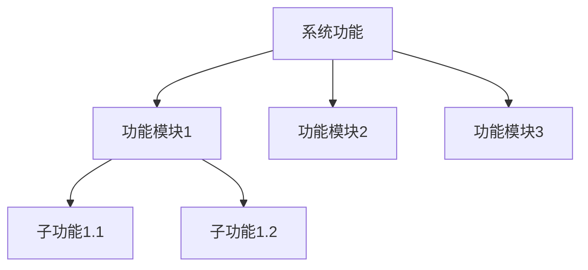
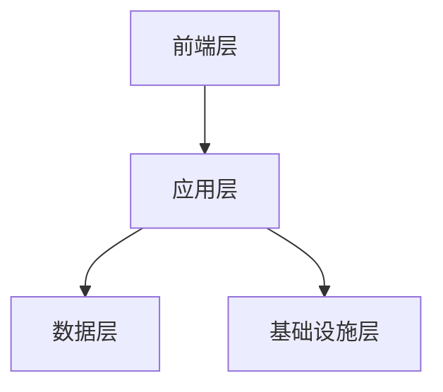
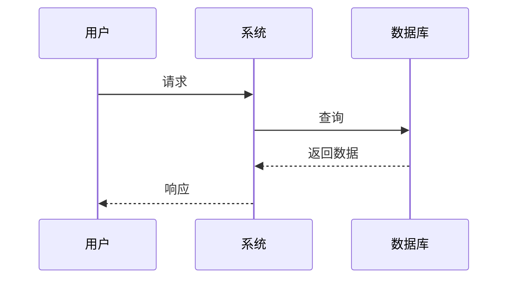
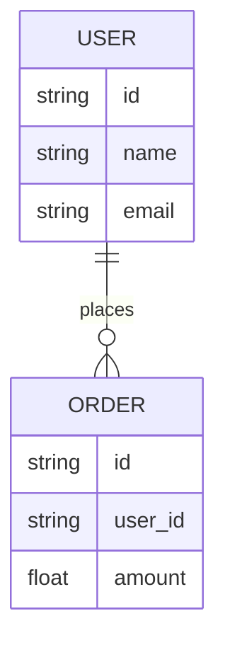
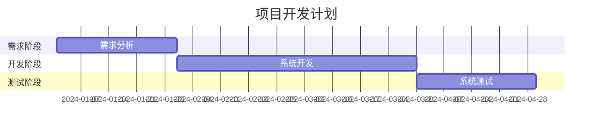

# 技术设计文档（TDD）模板

**版本**：v1.0  
**作者**：{作者/架构师姓名}  
**项目名称**：{项目/产品名称}  
**日期**：{YYYY-MM-DD}

## 0. 修订记录（Revision History）

| 版本号 | 修订日期 | 修订人 | 修订内容 |
|--------|----------|--------|----------|
| v1.0 | 2025-01-27 | {作者/架构师} | 初始版本 |
| v1.1 | {YYYY-MM-DD} | {修订人} | 优化架构设计、完善安全策略 |

> 说明：该表可追踪文档的版本演进、修改时间、修改人、修改内容等信息。

## 1. 目录（Table of Contents）

1. [文档介绍（Document Introduction）](#2-文档介绍document-introduction)
2. [系统概述（System Overview）](#3-系统概述system-overview)
3. [需求背景（Requirements Background）](#4-需求背景requirements-background)
4. [设计约束与假设（Constraints & Assumptions）](#5-设计约束与假设constraints--assumptions)
5. [总体架构设计（High-Level Architecture）](#6-总体架构设计high-level-architecture)
6. [详细设计（Detailed Design）](#7-详细设计detailed-design)
   1. [功能模块设计（Module Design）](#71-功能模块设计module-design)
   2. [接口与集成（Interfaces & Integration）](#72-接口与集成interfaces--integration)
   3. [数据库与数据模型（Database & Data Models）](#73-数据库与数据模型database--data-models)
   4. [技术选型（Technology Stack）](#74-技术选型technology-stack)
7. [非功能需求（Non-Functional Requirements）](#8-非功能需求non-functional-requirements)
8. [安全与合规（Security & Compliance）](#9-安全与合规security--compliance)
9. [性能与扩展性（Performance & Scalability）](#10-性能与扩展性performance--scalability)
10. [部署与运维（Deployment & Operations）](#11-部署与运维deployment--operations)
11. [监控与日志（Monitoring & Logging）](#12-监控与日志monitoring--logging)
12. [测试策略（Testing Strategy）](#13-测试策略testing-strategy)
13. [风险与应对（Risks & Mitigations）](#14-风险与应对risks--mitigations)
14. [项目排期与资源（Timeline & Resource Estimation）](#15-项目排期与资源timeline--resource-estimation)
15. [附录（Appendices）](#16-附录appendices)

## 2. 文档介绍（Document Introduction）

### 目的（Purpose）
简要说明撰写本技术设计文档的目标和期望。

**示例**：本技术设计文档旨在阐述 {项目名称} 的整体技术方案，包括架构设计、模块划分、接口规范以及非功能需求等，为开发与测试团队提供详实的参考。

### 范围（Scope）
说明本技术设计文档涵盖的范围，以及对不在本范围内的内容做适当声明。

**示例**：本文档覆盖前端、后端、数据库、第三方服务集成等技术方面的设计；但不包括具体的用户界面（UI）视觉稿或市场运营策略等。

### 目标读者（Intended Audience）
指明哪些团队或角色（架构师、开发、测试、运维、安全、产品等）会使用该文档。

### 参考文档（References）
罗列与本技术设计文档相关的其他文档或资料，如 BRD、PRD、架构原则文档等。

**示例**：
- [BRD v1.0 - 业务需求文档]
- [PRD v2.3 - 产品需求文档]

## 3. 系统概述（System Overview）

### 系统背景（Background）
为什么要构建该系统、系统在业务或产品中的地位和意义。

### 系统功能概览（Key Features）
简要介绍系统提供的主要功能模块。可使用要点或简易的功能结构图。



### 主要干系人（Stakeholders）
说明主要涉及的内部/外部干系人或使用者。

## 4. 需求背景（Requirements Background）

### 业务需求（Business Requirements）
从 BRD 获取的核心业务目标或KPI，以及在本系统中需要实现的关键业务逻辑。

### 产品需求（Product Requirements）
参照 PRD，列出产品层面对功能、用户交互、使用场景等方面的要求。

> 该部分可与 BRD/PRD 的编号或章节进行对照，确保技术实现与需求对应。

## 5. 设计约束与假设（Constraints & Assumptions）

### 系统/技术限制（System Constraints）
包含可用框架、语言版本、部署环境（云供应商、操作系统、网络限制等）。

### 业务/时间限制（Business/Time Constraints）
如必须在特定期限内上线、必须兼容某些已有系统、预算限制等。

### 假设（Assumptions）
在设计过程中所做的默认假设，以及这些假设如何影响后续方案。

## 6. 总体架构设计（High-Level Architecture）

### 架构原则（Architecture Principles）
说明整体技术选择遵循的原则，如微服务、分层架构、领域驱动等。

### 架构图（Architecture Diagram）
使用 UML 或其他工具绘制系统整体的组件划分与交互方式。

### 层次划分（Layers）
- 前端层（客户端/Web端/移动端）
- 应用/服务层（服务网关、业务服务、第三方服务适配层等）
- 数据层（数据库、缓存、消息队列等）
- 基础设施层（服务器、云服务、负载均衡、CDN等）



## 7. 详细设计（Detailed Design）

### 7.1 功能模块设计（Module Design）

#### 模块概述
逐一列出模块名称、职责范围、与其他模块的关系。

#### 模块流程图
为每个功能模块提供示意性的流程图，如用序列图或活动图展示业务逻辑。



### 7.2 接口与集成（Interfaces & Integration）

#### 内部接口（Internal APIs）
- 接口名称、请求方式、路径、入参与出参示例、错误码说明。

#### 外部接口（External APIs / 第三方服务）
- 调用第三方服务的方式、鉴权方式、超时重试策略等。

#### 集成方式（Integration Approaches）
- HTTP/REST、gRPC、消息队列事件驱动等
- 接口容错与重试机制、幂等性设计等

```yaml
POST /api/v1/users
Request:
  username: string
  email: string
Response:
  id: string
  status: string
```

### 7.3 数据库与数据模型（Database & Data Models）

#### 数据库概述
- 选用的数据库类型（关系型、NoSQL、时序库等）及理由。

#### 逻辑/物理模型（ER 图 / Schema）
- 数据库表结构、字段含义、主外键关系等。

#### 索引与查询优化（Index & Query Optimization）
- 对关键表的索引策略及常用查询的性能考虑。

#### 数据生命周期管理（Data Lifecycle Management）
- 存档、清理、备份策略等。



### 7.4 技术选型（Technology Stack）

#### 编程语言与框架
- 例如：Java/Spring Boot，Go/Gin，Node.js/Express，Python/Django 等
- 选择理由与对比分析（性能、社区成熟度、团队经验等）

#### 中间件
- 消息队列（Kafka、RabbitMQ）
- 缓存（Redis）
- API 网关（Kong、Nginx）等

#### 第三方服务/SDK
- 支付、短信、地图、机器学习平台等

#### 版本管理与工具链
- 源码管理（Git/GitLab/GitHub）
- CI/CD（Jenkins、GitLab CI 等）
- 质量检测（SonarQube 等）

## 8. 非功能需求（Non-Functional Requirements）

### 可用性（Availability）
- SLA 目标、故障转移机制、容灾策略等

### 可维护性（Maintainability）
- 代码结构、模块化、文档及注释规范等

### 可测试性（Testability）
- 如何保证单元测试、集成测试、自动化测试的可实施性

### 可观察性（Observability）
- 指标监控、日志收集、追踪系统等

## 9. 安全与合规（Security & Compliance）

### 访问控制（Access Control）
- 身份认证、授权策略、权限模型

### 数据安全（Data Security）
- 数据加密（传输层、存储层）
- 数据脱敏策略等

### 合规要求（Regulatory Compliance）
- 若涉及个人隐私数据或金融数据，需符合GDPR、PCI-DSS、ISO27001等

### 审计与日志（Audit & Logging）
- 关键操作的审计需求
- 日志留存期
- 安全告警等

## 10. 性能与扩展性（Performance & Scalability）

### 性能目标（Performance Targets）
- 吞吐量、响应时间、并发用户数等指标

### 扩展性策略（Scalability Strategy）
- 水平扩容 vs. 垂直扩容
- 无状态服务设计
- 缓存策略等

### 容量规划（Capacity Planning）
- 对数据库、存储、网络带宽等的初步预测

### 压力测试方案（Load/Stress Testing）
- 如何进行压力测试
- 性能瓶颈分析方式

## 11. 部署与运维（Deployment & Operations）

### 部署拓扑（Deployment Topology）
- 生产环境、测试环境、预发布环境等
- 物理/云端/容器化（Docker、Kubernetes）方案

### CI/CD 流程
- 构建、测试、部署自动化流程

### 版本管理（Release Management）
- 版本发布节奏
- 回滚策略
- 热升级与兼容性考虑

### 日常运维（Day-to-Day Operations）
- 安全补丁更新
- 监控报警处理
- 故障排查流程

## 12. 监控与日志（Monitoring & Logging）

### 日志方案（Logging Strategy）
- 日志格式
- 级别（DEBUG、INFO、ERROR）
- 日志聚合服务（ELK、Splunk 等）

### 监控指标（Key Metrics）
- CPU、内存、磁盘、网络流量
- 服务响应时间
- 错误率等

### 报警策略（Alerting & Notifications）
- 告警阈值设置
- 多渠道通知（邮件、短信、企业微信等）

### 可视化平台（Dashboards）
- Grafana、Kibana 等

## 13. 测试策略（Testing Strategy）

### 测试范围（Scope）
- 单元测试
- 集成测试
- 系统测试
- 验收测试等

### 测试环境（Environment Setup）
- 测试环境与生产环境的差异
- 数据准备
- Mock/Stub 依赖

### 自动化测试（Automation Tests）
- CI 集成
- Smoke Test
- 回归测试等

### 性能/安全测试（Performance/Security Testing）
- 压力测试
- 渗透测试
- 漏洞扫描工具及方法

## 14. 风险与应对（Risks & Mitigations）

### 风险识别（Risk Identification）
- 技术难点
- 资源不足
- 关键人员依赖
- 第三方服务不稳定等

### 风险等级（Risk Severity）
- 可能性（Probability）+ 影响度（Impact）评估

### 应对策略（Mitigation Plans）
- 预案
- 替代方案
- 监控预警等

| 风险项 | 可能性 | 影响度 | 风险等级 | 应对策略 |
|--------|--------|--------|----------|----------|
| 第三方支付接口波动 | 高 | 高 | 红色 | 缓存支付结果、预留容错 & 重试 |
| 核心开发人员离职 | 中 | 高 | 橙色 | 知识传递、核心文档和流程固化 |
| 需求变更导致开发周期延长 | 高 | 中 | 橙色 | 需求冻结机制，紧急变更评审 |

## 15. 项目排期与资源（Timeline & Resource Estimation）

### 关键里程碑（Milestones）
- 需求确认
- 开发启动
- 功能验收
- 上线时间点等

### 人力资源计划（Human Resource Plan）
- 团队结构
- 主要角色与职责分配

### 硬件/软件预算（Budget Estimation）
- 服务器
- 带宽
- 云服务
- 第三方 API 成本等

### 整体开发计划（Gantt / Roadmap）



## 16. 附录（Appendices）

### 术语表（Glossary）
定义专业术语或缩写，保证各方理解一致。

### 参考链接（Further Readings）
与项目相关的外部参考资料或技术文档链接。

### 补充文档（Additional Documents）
如原型设计、详细用例文档、参考代码片段等。

---

## 结语

通过该模板，你可以快速搭建**技术设计文档（TDD）**的整体框架，并依据项目需求进行细化和补充。一个清晰、详实的技术设计文档能大幅度提升团队沟通效率、降低实现与运营风险。同时，持续的版本迭代和审阅也非常必要，确保在项目周期内文档始终与实际实现保持一致。祝你的项目一切顺利！

### 温馨提示：
- 在企业实际环境中，保证与 BRD、PRD、架构原则等上层文档的一致性尤为关键。
- 定期组织评审会议（Design Review），让开发、测试、运维、安全、产品等多方共同审阅并提出改进意见。
- 紧密结合 CI/CD 流程，保持文档与代码演进同步更新。

---

**版权所有（©）{公司/组织名称}**  
仅限内部使用，未经许可不得对外发布。 