# Dove 登录系统 - 技术设计文档（TDD）

**版本**：v1.0  
**作者**：Dove 技术架构团队  
**项目名称**：Dove 登录系统  
**日期**：2024-03-21

## 0. 修订记录（Revision History）

| 版本号 | 修订日期 | 修订人 | 修订内容 |
|--------|----------|--------|----------|
| v1.0 | 2024-03-21 | Dove 技术架构团队 | 初始版本 |

## 1. 文档介绍（Document Introduction）

### 目的（Purpose）
本技术设计文档旨在详细阐述 Dove 登录系统的技术实现方案，包括系统架构、模块设计、接口规范、数据模型以及非功能性需求等内容。本文档将作为开发团队实施的主要技术依据，同时也为测试、运维、安全等相关团队提供必要的技术支持。

### 范围（Scope）
本文档涵盖：
- 登录系统的整体技术架构设计
- 微服务划分与实现方案
- 数据库设计与存储方案
- 安全策略与防护机制
- 高可用性与扩展性方案
- 国际化实现方案
- 运维监控与日志方案

不包含：
- 具体的UI设计与视觉规范
- 运营策略与市场推广方案
- 具体的业务规则实现代码

### 目标读者（Intended Audience）
- 开发团队：了解技术实现细节和开发规范
- 架构团队：评审技术方案的合理性和可行性
- 测试团队：制定测试策略和测试用例
- 运维团队：了解部署架构和运维要求
- 安全团队：评估安全风险和防护措施
- 产品团队：了解技术约束和实现可能性

### 参考文档（References）
- [BRD v1.0 - Dove 登录系统商业需求文档]
- [PRD v1.0 - Dove 登录系统产品需求文档]
- [Architecture v1.0 - 系统架构设计文档]
- Spring Cloud 官方文档
- Spring Cloud Alibaba 官方文档

## 2. 系统概述（System Overview）

### 系统背景（Background）
Dove 登录系统是一个面向全球用户的企业级 SaaS 登录认证平台，需要支持：
- 2亿用户规模
- 8000万并发在线用户
- 多语言多时区
- 高安全性要求
- 企业级 SSO 集成

系统将采用微服务架构，基于 Spring Cloud + Spring Cloud Alibaba 技术栈构建，确保系统的高可用性、可扩展性和安全性。

### 系统功能概览（Key Features）

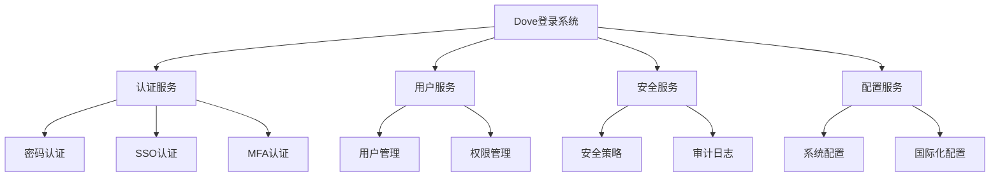

### 主要干系人（Stakeholders）
- 终端用户：使用系统进行登录认证
- 企业管理员：配置企业SSO和安全策略
- 系统运维人员：负责系统部署和维护
- 安全团队：负责系统安全审计
- 客服团队：处理用户登录问题 

## 3. 需求背景（Requirements Background）

### 业务需求（Business Requirements）
根据 BRD 文档，系统需要满足以下核心业务目标：

1. **规模要求**
   - 支持 2 亿用户总量
   - 支持 8000 万并发在线用户
   - 工作时间为主要访问高峰，非工作时间约为工作时间流量的 30%

2. **性能指标**
   - 登录响应时间 < 500ms（P95）
   - 系统可用性 99.999%
   - 登录成功率 > 99.9%

3. **安全要求**
   - 账号安全事件发生率 < 0.001%
   - 验证码识别准确率 > 99%
   - 符合 GDPR、ISO 27001 等安全标准

### 产品需求（Product Requirements）
参照 PRD 文档，系统需要实现以下核心功能：

1. **认证功能**
   - 用户名/密码登录
   - 企业 SSO（SAML 2.0/OAuth 2.0/OpenID Connect）
   - 多因素认证（MFA）
   - 记住登录状态

2. **安全功能**
   - 密码策略管理
   - 登录保护（IP限制、时间限制）
   - 异常检测与防护
   - 审计日志

3. **用户体验**
   - 多语言支持（20+ 语言）
   - 多时区适配
   - 响应式界面设计
   - 友好的错误提示

## 4. 设计约束与假设（Constraints & Assumptions）

### 系统/技术限制（System Constraints）

1. **技术栈约束**
   - 后端框架：Spring Cloud + Spring Cloud Alibaba
   - 数据库：MariaDB 企业版 10.11 LTS
   - 缓存：Redis 企业版
   - 消息队列：Apache Kafka
   - 注册中心：Nacos
   - 网关：Spring Cloud Gateway

2. **部署环境约束**
   - 容器化部署：Kubernetes
   - 多可用区部署要求
   - 跨地域数据同步要求
   - CDN 全球加速要求

3. **安全合规约束**
   - GDPR 合规要求
   - ISO 27001 认证要求
   - 数据本地化存储要求
   - 密码加密传输与存储要求

### 业务/时间限制（Business/Time Constraints）

1. **业务限制**
   - 系统必须支持现有 JIRA Web 登录功能
   - 支持多租户隔离
   - 支持企业 SSO 无缝对接
   - 满足不同时区用户的访问需求

2. **时间限制**
   - 总体开发周期：5个月
   - 分阶段上线要求
   - 需要在业务高峰前完成性能优化

### 假设（Assumptions）

1. **业务假设**
   - 用户量增长符合预期，不会出现暴增
   - 各地区访问量分布相对均衡
   - 企业客户的 SSO 系统稳定可靠

2. **技术假设**
   - 基础设施满足扩展需求
   - 第三方服务（短信、邮件等）可用性符合 SLA
   - 网络带宽和延迟满足要求
   - 具备足够的容器集群资源

3. **团队假设**
   - 开发团队具备相关技术栈经验
   - 运维团队具备容器化部署经验
   - 安全团队具备安全审计能力 

## 5. 总体架构设计（High-Level Architecture）

### 5.1 登录认证模块（Authentication Module）

#### 5.1.1 JIRA 登录功能分析（JIRA Login Features Analysis）

##### A. 标准登录流程（Standard Login Flow）
1. **登录入口（Login Entry）**
   - 支持用户名/邮箱 + 密码登录
   - 登录表单验证（前端 + 后端双重验证）
   - 验证码防护机制（连续失败触发）
   - "记住我"选项（默认 30 天）

2. **认证流程（Authentication Process）**
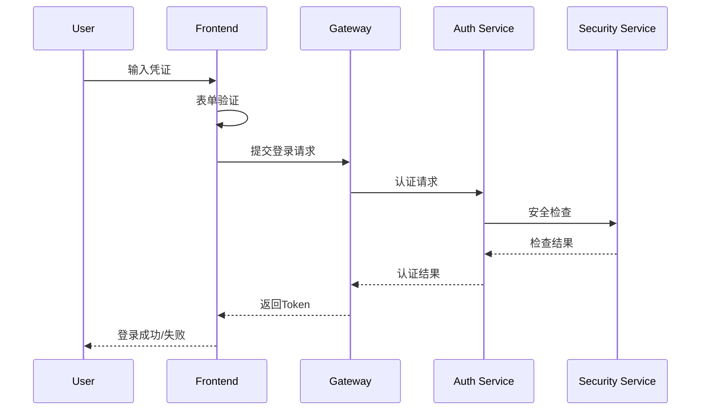

3. **安全机制（Security Mechanisms）**
   - 密码强度要求：至少8位，包含大小写字母、数字和特殊字符
   - 登录失败处理：
     * 5次失败触发验证码
     * 10次失败锁定账号30分钟
   - 异地登录检测：非常用地点登录需要邮件验证
   - 会话管理：支持多端登录，可查看和管理所有活动会话

##### B. 企业 SSO 集成（Enterprise SSO Integration）
1. **支持的协议（Supported Protocols）**
   - SAML 2.0
   - OAuth 2.0
   - OpenID Connect
   - Atlassian Crowd SSO

2. **SSO 配置（SSO Configuration）**
   - IdP 元数据配置
   - SP 证书管理
   - 属性映射规则
   - 登录流程定制

3. **实现方案（Implementation Plan）**
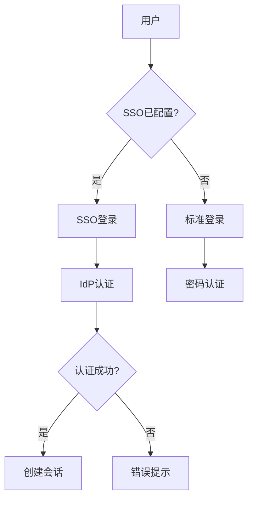

##### C. 多因素认证（Multi-Factor Authentication）
1. **MFA 方式（MFA Methods）**
   - 邮件验证码（默认）
   - 短信验证码（需绑定手机）
   - TOTP（Google Authenticator）
   - 生物识别（指纹/面部）

2. **触发场景（Trigger Scenarios）**
   - 异地登录
   - 敏感操作
   - 管理员强制要求
   - 用户自主开启

3. **配置选项（Configuration Options）**
   - MFA 强制策略
   - 信任设备管理
   - 备用验证方式
   - 恢复码机制

##### D. 会话管理（Session Management）
1. **会话控制（Session Control）**
   - Token 基于 JWT，包含必要的用户信息
   - 支持会话续期（Refresh Token 机制）
   - 可设置会话有效期（默认 8 小时）
   - 支持会话并发控制

2. **分布式会话（Distributed Session）**
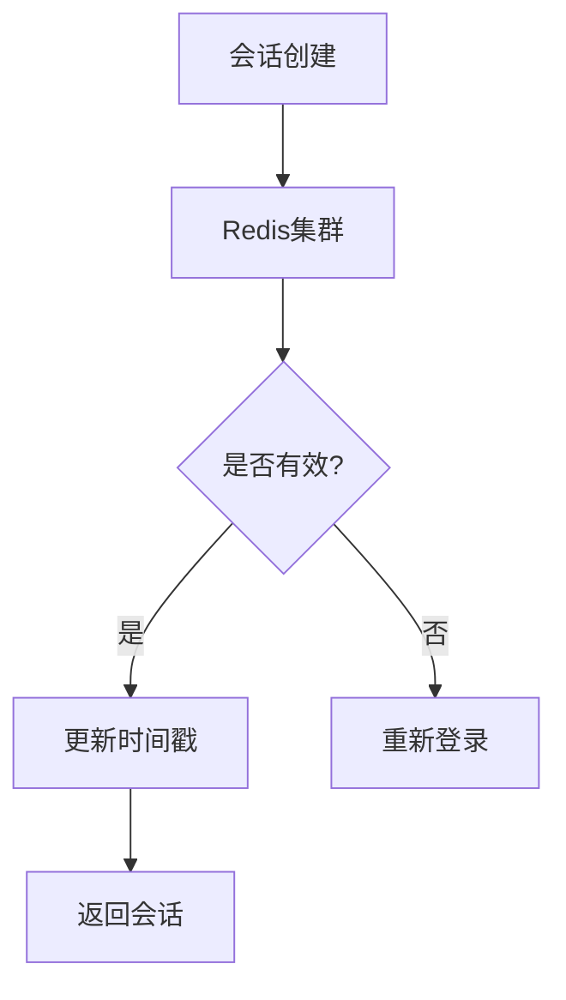

3. **会话安全（Session Security）**
   - 会话劫持防护
   - 会话固定攻击防护
   - 闲置超时自动登出
   - 异常检测与终止

##### E. 密码管理（Password Management）
1. **密码策略（Password Policy）**
   - 复杂度要求
   - 历史密码检查
   - 定期更换提醒
   - 密码过期机制

2. **找回流程（Recovery Process）**
   - 邮件验证找回
   - 安全问题验证
   - 管理员重置
   - 临时密码机制

3. **存储安全（Storage Security）**
   - PBKDF2 加密算法
   - 加密盐值随机生成
   - 密码哈希不可逆
   - 定期加密算法升级

##### F. 审计日志（Audit Logging）
1. **日志内容（Log Content）**
   - 登录尝试记录
   - 密码修改记录
   - MFA 操作记录
   - 会话操作记录

2. **日志处理（Log Processing）**
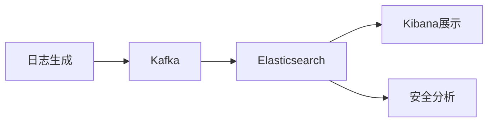

3. **合规要求（Compliance Requirements）**
   - 日志保存 180 天
   - 支持导出审计
   - 敏感信息脱敏
   - 访问权限控制

### 架构原则（Architecture Principles）

1. **微服务架构**
   - 服务高内聚、低耦合
   - 单一职责原则
   - 服务自治原则
   - 独立部署与扩展

2. **分布式设计**
   - 无状态服务设计
   - 分布式缓存
   - 分布式会话
   - 最终一致性

3. **安全性设计**
   - 纵深防御
   - 最小权限原则
   - 安全审计
   - 数据加密

4. **高可用设计**
   - 多活架构
   - 故障隔离
   - 服务降级
   - 限流熔断

### 架构图（Architecture Diagram）

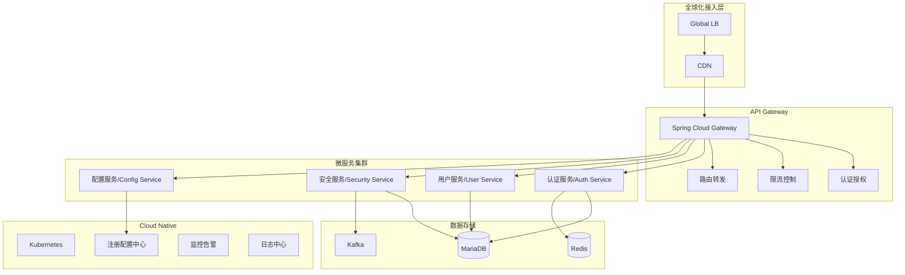

### 层次划分（Layers）

1. **全球化接入层**
   - Global Load Balancer：实现就近接入
   - CDN：静态资源加速，防护DDoS
   - 智能DNS：区域负载均衡

2. **网关层**
   - 流量控制：限流、熔断
   - 安全防护：WAF、认证
   - 请求路由：动态路由、灰度发布
   - 协议转换：统一接口规范

3. **应用服务层**
   - 认证服务（Auth Service）
     - 账号密码认证
     - SSO集成
     - Token管理
     - 会话管理
   
   - 用户服务（User Service）
     - 用户信息管理
     - 权限管理
     - 偏好设置
   
   - 安全服务（Security Service）
     - 安全策略
     - 风险控制
     - 审计日志
   
   - 配置服务（Config Service）
     - 系统配置
     - 国际化配置
     - 动态配置

4. **数据存储层**
   - 关系型数据库：MariaDB集群
   - 缓存：Redis集群
   - 消息队列：Kafka集群
   - 日志存储：Elasticsearch

5. **基础设施层**
   - 容器编排：Kubernetes
   - 服务治理：Nacos
   - 监控告警：Prometheus + Grafana
   - 日志中心：ELK Stack

### 关键技术选型（Key Technology Choices）

| 技术/组件 | 选型 | 说明 |
|----------|------|------|
| 微服务框架 | Spring Cloud Alibaba | 成熟稳定，社区活跃 |
| 网关 | Spring Cloud Gateway | 性能好，功能丰富 |
| 注册中心 | Nacos | 配置管理与服务发现 |
| 数据库 | MariaDB 10.11 | 开源可商用，性能优秀 |
| 缓存 | Redis Enterprise | 高可用，集群支持 |
| 消息队列 | Apache Kafka | 高吞吐，低延迟 |
| 容器编排 | Kubernetes | 容器编排标准 |
| 监控系统 | Prometheus + Grafana | 开源监控标准 |
| 日志系统 | ELK Stack | 成熟的日志解决方案 |

### 系统部署架构（Deployment Architecture）

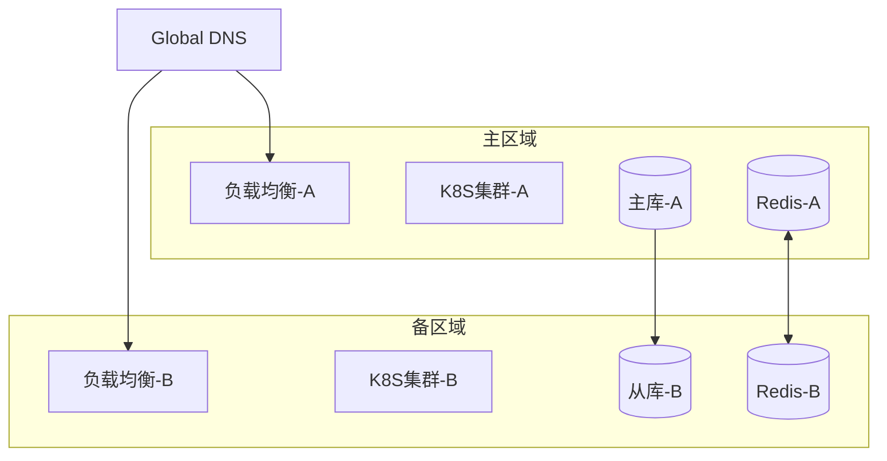

## 6. 详细设计（Detailed Design）

### 6.1 功能模块设计（Module Design）

#### 认证服务（Auth Service）

1. **模块职责**
   - 处理所有认证相关请求
   - 管理用户会话
   - 集成第三方认证
   - Token 的签发与验证

2. **核心流程**

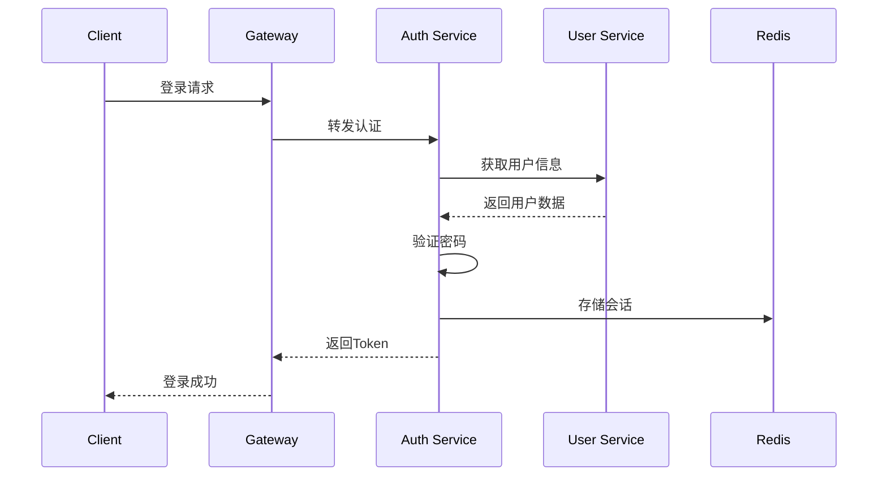

3. **关键接口**
```yaml
# 1. 密码登录
POST /api/v1/auth/login
Request:
  username: string
  password: string
  captcha: string
Response:
  token: string
  expires_in: number
  user_info: object

# 2. SSO登录
GET /api/v1/auth/sso/{provider}
Response:
  redirect_url: string

# 3. MFA验证
POST /api/v1/auth/mfa/verify
Request:
  token: string
  code: string
Response:
  status: boolean
  message: string
```

#### 用户服务（User Service）

1. **模块职责**
   - 用户信息管理
   - 用户偏好设置
   - 权限管理
   - 用户数据同步

2. **核心流程**

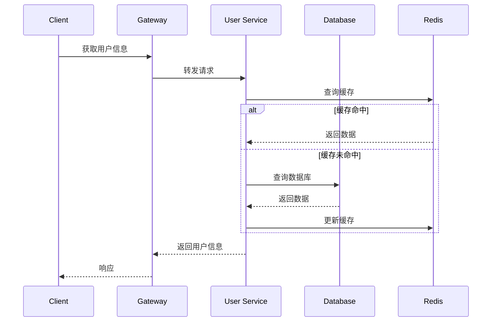

3. **关键接口**
```yaml
# 1. 获取用户信息
GET /api/v1/users/{userId}
Response:
  id: string
  username: string
  email: string
  preferences: object

# 2. 更新用户设置
PUT /api/v1/users/{userId}/preferences
Request:
  language: string
  timezone: string
  theme: string
Response:
  status: boolean
  message: string
```

#### 安全服务（Security Service）

1. **模块职责**
   - 安全策略管理
   - 风险控制
   - 审计日志
   - 异常检测

2. **核心流程**

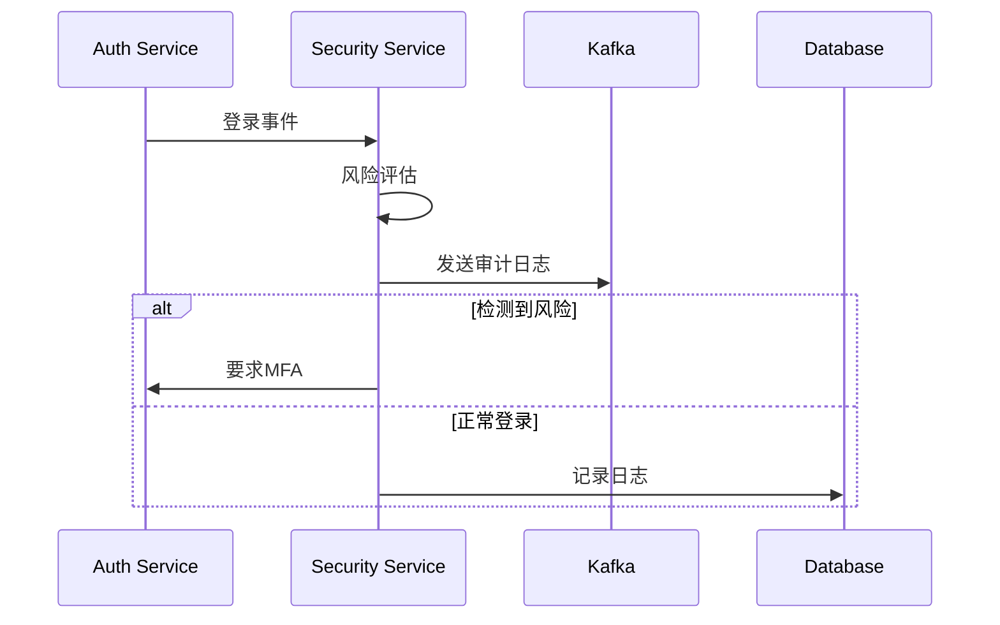

3. **关键接口**
```yaml
# 1. 风险评估
POST /api/v1/security/risk/assess
Request:
  user_id: string
  ip: string
  device: string
  location: string
Response:
  risk_level: enum
  required_actions: array

# 2. 安全策略配置
PUT /api/v1/security/policies
Request:
  password_policy: object
  mfa_policy: object
  ip_policy: object
Response:
  status: boolean
  message: string
```

#### 配置服务（Config Service）

1. **模块职责**
   - 系统配置管理
   - 国际化资源管理
   - 动态配置更新
   - 配置版本控制

2. **核心流程**

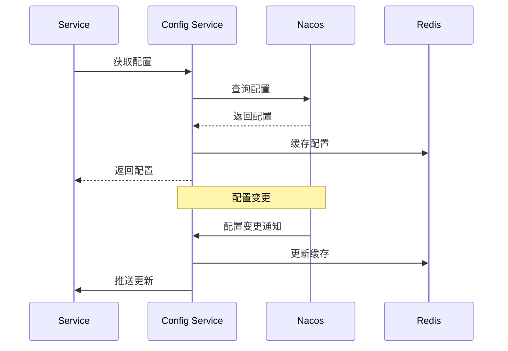

3. **关键接口**
```yaml
# 1. 获取国际化资源
GET /api/v1/config/i18n/{lang}
Response:
  version: string
  resources: object

# 2. 获取系统配置
GET /api/v1/config/system
Response:
  version: string
  configs: object
```

### 6.2 接口与集成（Interfaces & Integration）

#### API 网关配置

```yaml
spring:
  cloud:
    gateway:
      routes:
        - id: auth-service
          uri: lb://auth-service
          predicates:
            - Path=/api/v1/auth/**
          filters:
            - name: RequestRateLimiter
              args:
                redis-rate-limiter.replenishRate: 10
                redis-rate-limiter.burstCapacity: 20
            
        - id: user-service
          uri: lb://user-service
          predicates:
            - Path=/api/v1/users/**
          filters:
            - name: CircuitBreaker
              args:
                name: userServiceBreaker
                fallbackUri: forward:/fallback
```

#### 服务间通信

1. **同步调用**
   - REST API：服务间HTTP/HTTPS调用
   - gRPC：高性能RPC调用（预留）

2. **异步消息**
   - Kafka Topics：
     - audit-logs：审计日志
     - user-events：用户事件
     - security-alerts：安全告警

3. **分布式事务**
   - Seata：分布式事务框架
   - 最终一致性模式

#### 第三方服务集成

1. **SSO 提供商**
```yaml
sso:
  providers:
    google:
      client-id: ${GOOGLE_CLIENT_ID}
      client-secret: ${GOOGLE_CLIENT_SECRET}
      redirect-uri: https://auth.dove.com/callback/google
    
    azure:
      tenant-id: ${AZURE_TENANT_ID}
      client-id: ${AZURE_CLIENT_ID}
      client-secret: ${AZURE_CLIENT_SECRET}
```

2. **短信服务**
```yaml
sms:
  provider: aliyun
  access-key: ${SMS_ACCESS_KEY}
  secret-key: ${SMS_SECRET_KEY}
  templates:
    verification: SMS_TEMPLATE_ID
```

3. **邮件服务**
```yaml
mail:
  provider: aws-ses
  region: ${AWS_REGION}
  access-key: ${AWS_ACCESS_KEY}
  secret-key: ${AWS_SECRET_KEY}
``` 

### 6.3 数据库与数据模型（Database & Data Models）

#### 数据库选型与架构

1. **数据库类型**
   - 主数据库：MariaDB 10.11 企业版
   - 缓存数据库：Redis Enterprise
   - 时序数据库：Prometheus TSDB（监控数据）
   - 搜索引擎：Elasticsearch（日志和审计）

2. **分库分表策略**
   - 分库：按租户ID进行物理分库
   - 分表：用户表按用户ID范围分片
   - 分片键：user_id, tenant_id
   - 路由规则：
     - 用户表：user_id % 256
     - 日志表：时间范围分表

3. **读写分离**
   - 主库：处理写入和重要查询
   - 从库：处理读取请求
   - 复制方式：半同步复制
   - 延迟监控：延迟超过500ms告警

#### 数据模型（ER图）

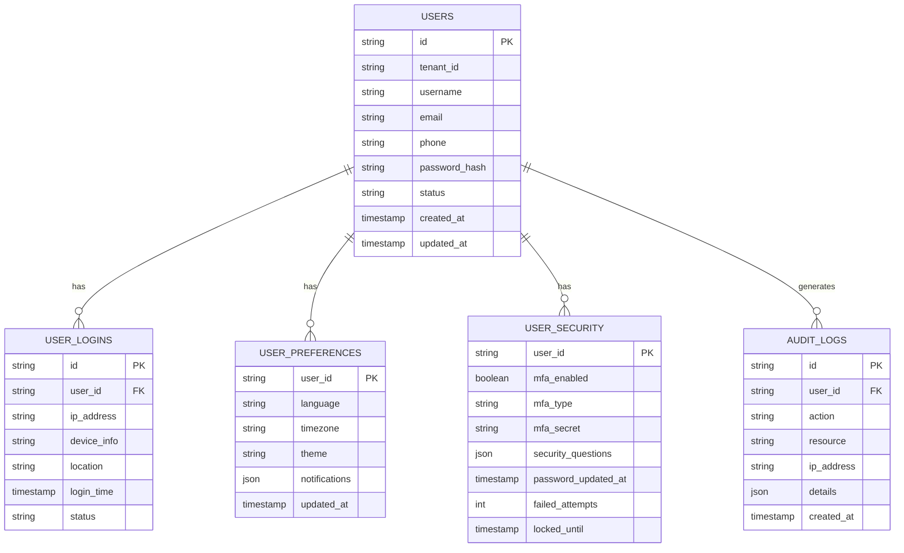

#### 表结构设计

1. **Users 表**
```sql
CREATE TABLE users (
    id VARCHAR(32) NOT NULL,
    tenant_id VARCHAR(32) NOT NULL,
    username VARCHAR(64) NOT NULL,
    email VARCHAR(128),
    phone VARCHAR(32),
    password_hash VARCHAR(256) NOT NULL,
    status ENUM('active', 'inactive', 'locked') NOT NULL,
    created_at TIMESTAMP NOT NULL DEFAULT CURRENT_TIMESTAMP,
    updated_at TIMESTAMP NOT NULL DEFAULT CURRENT_TIMESTAMP ON UPDATE CURRENT_TIMESTAMP,
    PRIMARY KEY (id),
    UNIQUE KEY uk_username (username),
    UNIQUE KEY uk_email (email),
    UNIQUE KEY uk_phone (phone),
    KEY idx_tenant (tenant_id),
    KEY idx_status (status)
) ENGINE=InnoDB DEFAULT CHARSET=utf8mb4 COLLATE=utf8mb4_unicode_ci;
```

2. **User_Logins 表**
```sql
CREATE TABLE user_logins (
    id VARCHAR(32) NOT NULL,
    user_id VARCHAR(32) NOT NULL,
    ip_address VARCHAR(64) NOT NULL,
    device_info TEXT,
    location VARCHAR(256),
    login_time TIMESTAMP NOT NULL DEFAULT CURRENT_TIMESTAMP,
    status ENUM('success', 'failed') NOT NULL,
    PRIMARY KEY (id),
    KEY idx_user_time (user_id, login_time),
    KEY idx_ip (ip_address)
) ENGINE=InnoDB DEFAULT CHARSET=utf8mb4 COLLATE=utf8mb4_unicode_ci
PARTITION BY RANGE (UNIX_TIMESTAMP(login_time)) (
    PARTITION p_2024_01 VALUES LESS THAN (UNIX_TIMESTAMP('2024-02-01 00:00:00')),
    PARTITION p_2024_02 VALUES LESS THAN (UNIX_TIMESTAMP('2024-03-01 00:00:00')),
    PARTITION p_max VALUES LESS THAN MAXVALUE
);
```

3. **User_Preferences 表**
```sql
CREATE TABLE user_preferences (
    user_id VARCHAR(32) NOT NULL,
    language VARCHAR(10) DEFAULT 'en-US',
    timezone VARCHAR(64) DEFAULT 'UTC',
    theme VARCHAR(32) DEFAULT 'light',
    notifications JSON,
    updated_at TIMESTAMP NOT NULL DEFAULT CURRENT_TIMESTAMP ON UPDATE CURRENT_TIMESTAMP,
    PRIMARY KEY (user_id)
) ENGINE=InnoDB DEFAULT CHARSET=utf8mb4 COLLATE=utf8mb4_unicode_ci;
```

4. **User_Security 表**
```sql
CREATE TABLE user_security (
    user_id VARCHAR(32) NOT NULL,
    mfa_enabled BOOLEAN DEFAULT FALSE,
    mfa_type ENUM('totp', 'sms', 'email') NULL,
    mfa_secret VARCHAR(128),
    security_questions JSON,
    password_updated_at TIMESTAMP NOT NULL DEFAULT CURRENT_TIMESTAMP,
    failed_attempts INT DEFAULT 0,
    locked_until TIMESTAMP NULL,
    PRIMARY KEY (user_id)
) ENGINE=InnoDB DEFAULT CHARSET=utf8mb4 COLLATE=utf8mb4_unicode_ci;
```

5. **Audit_Logs 表**
```sql
CREATE TABLE audit_logs (
    id VARCHAR(32) NOT NULL,
    user_id VARCHAR(32) NOT NULL,
    action VARCHAR(64) NOT NULL,
    resource VARCHAR(64) NOT NULL,
    ip_address VARCHAR(64) NOT NULL,
    details JSON,
    created_at TIMESTAMP NOT NULL DEFAULT CURRENT_TIMESTAMP,
    PRIMARY KEY (id),
    KEY idx_user (user_id),
    KEY idx_action (action),
    KEY idx_created (created_at)
) ENGINE=InnoDB DEFAULT CHARSET=utf8mb4 COLLATE=utf8mb4_unicode_ci
PARTITION BY RANGE (UNIX_TIMESTAMP(created_at)) (
    PARTITION p_2024_01 VALUES LESS THAN (UNIX_TIMESTAMP('2024-02-01 00:00:00')),
    PARTITION p_2024_02 VALUES LESS THAN (UNIX_TIMESTAMP('2024-03-01 00:00:00')),
    PARTITION p_max VALUES LESS THAN MAXVALUE
);
```

#### 缓存设计

1. **缓存键设计**
```yaml
# 用户信息缓存
user:info:{userId}:
  type: hash
  ttl: 30m
  fields:
    - username
    - email
    - status
    - preferences

# 登录会话缓存
user:session:{sessionId}:
  type: string
  ttl: 24h
  value: {userId}_{timestamp}_{deviceInfo}

# 登录失败计数
user:login:fail:{userId}:
  type: string
  ttl: 30m
  value: {failCount}

# 验证码缓存
captcha:{captchaId}:
  type: string
  ttl: 5m
  value: {code}
```

2. **缓存策略**
   - 写入策略：Write Through
   - 过期策略：LRU
   - 一致性：最终一致性
   - 更新机制：异步更新

3. **缓存预热**
   - 系统启动时预热热点用户数据
   - 定时更新活跃用户缓存
   - 智能预加载常用配置

4. **缓存监控**
   - 命中率监控
   - 内存使用监控
   - 过期key监控
   - 慢查询监控 

### 6.4 技术选型（Technology Stack）

#### 开发框架与语言

1. **后端技术栈**
   - 开发语言：Java 17 LTS
   - 微服务框架：Spring Cloud 2023.0.0 + Spring Cloud Alibaba 2022.0.0.0
   - 核心框架：Spring Boot 3.2.0
   - ORM框架：Spring Data JPA 3.2.0
   - 安全框架：Spring Security 6.2.0

2. **前端技术栈**
   - 框架：React 18.2.0
   - 状态管理：Redux Toolkit 2.0.0
   - UI组件：Ant Design 5.12.0
   - 国际化：react-i18next 13.5.0
   - HTTP客户端：Axios 1.6.2

#### 中间件与存储

1. **数据库**
```yaml
# 主数据库
database:
  type: MariaDB Enterprise
  version: 10.11 LTS
  features:
    - 主从复制
    - 读写分离
    - 分库分表
    - 监控管理

# 缓存数据库
cache:
  type: Redis Enterprise
  version: 7.2
  features:
    - 集群模式
    - 持久化
    - 哨兵机制
    - 数据分片

# 消息队列
mq:
  type: Apache Kafka
  version: 3.6.0
  features:
    - 高可用集群
    - 消息持久化
    - 消息压缩
    - 多副本机制
```

2. **搜索引擎**
```yaml
elasticsearch:
  version: 8.11.0
  features:
    - 日志存储
    - 全文检索
    - 数据分析
    - 审计查询
```

#### 基础设施与部署

1. **容器化**
```yaml
# 容器运行时
container:
  runtime: containerd
  version: 1.7.0
  
# 容器编排
orchestration:
  platform: Kubernetes
  version: 1.28 LTS
  components:
    - kube-proxy
    - CoreDNS
    - metrics-server
```

2. **服务网格**
```yaml
# 服务网格
istio:
  version: 1.20
  features:
    - 流量管理
    - 安全通信
    - 可观测性
    - 策略执行
```

3. **CI/CD**
```yaml
# 持续集成
ci:
  platform: Jenkins
  version: 2.426.1 LTS
  plugins:
    - Pipeline
    - Kubernetes
    - SonarQube
    - Docker Build

# 制品仓库
artifact:
  type: Harbor
  version: 2.9.0
  features:
    - 镜像管理
    - 漏洞扫描
    - RBAC权限
```

#### 监控与日志

1. **监控系统**
```yaml
# 系统监控
prometheus:
  version: 2.45.0
  exporters:
    - node-exporter
    - jmx-exporter
    - redis-exporter
    - mysql-exporter

# 可视化
grafana:
  version: 10.2.0
  features:
    - 自定义面板
    - 告警规则
    - 团队协作
```

2. **日志系统**
```yaml
# 日志收集
filebeat:
  version: 8.11.0
  features:
    - 多源采集
    - 数据转换
    - 自动重试

# 日志聚合
elasticsearch:
  version: 8.11.0
  features:
    - 数据分片
    - 高可用
    - 数据压缩

# 日志展示
kibana:
  version: 8.11.0
  features:
    - 日志检索
    - 可视化
    - 仪表板
```

#### 开发工具与规范

1. **开发工具**
   - IDE：IntelliJ IDEA 2023.3
   - 版本控制：Git 2.43.0
   - API文档：Swagger/OpenAPI 3.0
   - 代码质量：SonarQube 10.3

2. **代码规范**
```yaml
# Java代码规范
java:
  style: Google Java Style
  tools:
    - checkstyle
    - spotless
    - pmd
  
# TypeScript代码规范
typescript:
  style: Airbnb
  tools:
    - eslint
    - prettier
    - husky
```

3. **测试框架**
```yaml
# 单元测试
unit-test:
  - JUnit 5
  - Mockito
  - Jest
  - React Testing Library

# 集成测试
integration-test:
  - Testcontainers
  - REST Assured
  - Cypress

# 性能测试
performance-test:
  - JMeter
  - K6
  - Gatling
```

#### 安全组件

1. **认证授权**
```yaml
# 认证框架
authentication:
  - Spring Security
  - OAuth2/OIDC
  - JWT
  - SAML 2.0

# 密码加密
encryption:
  - BCrypt
  - PBKDF2
  - AES-256
```

2. **安全防护**
```yaml
# Web安全
security:
  - WAF
  - Anti-DDoS
  - Rate Limiting
  - XSS Protection
  - CSRF Protection
```

#### 依赖管理

1. **构建工具**
```yaml
# Maven配置
maven:
  version: 3.9.5
  features:
    - 依赖管理
    - 多模块构建
    - 版本控制
    - 插件扩展
```

2. **前端包管理**
```yaml
# NPM配置
npm:
  version: 10.2.4
  features:
    - 依赖管理
    - 脚本管理
    - 版本锁定
    - 私有仓库
``` 

### 6.5 项目结构设计（Project Structure）

#### 6.5.1 整体项目结构
```
dove-project/                                      # 项目根目录
├── .github/                              # GitHub配置目录
│   ├── workflows/                        # GitHub Actions工作流
│   │   ├── build.yml                    # 构建流程
│   │   ├── deploy.yml                   # 部署流程
│   │   └── test.yml                     # 测试流程
│   └── ISSUE_TEMPLATE/                  # Issue模板
│
├── dove-parent/                         # 依赖管理项目
│   ├── checkstyle/                     # 代码风格检查配置
│   │   └── checkstyle.xml             # Checkstyle规则
│   ├── pmd/                           # PMD静态代码分析配置
│   │   └── ruleset.xml               # PMD规则集
│   └── pom.xml                       # 统一依赖管理
│
├── dove-common/                          # 公共模块项目
│   ├── dove-common-core/                # 核心工具模块
│   │   ├── src/main/java/com/dove/common/core/
│   │   │   ├── annotation/             # 注解类
│   │   │   ├── constant/              # 常量定义
│   │   │   ├── context/              # 上下文
│   │   │   ├── exception/            # 异常类
│   │   │   ├── utils/               # 工具类
│   │   │   └── validation/          # 验证工具
│   │   └── pom.xml
│   │
│   ├── dove-common-redis/              # Redis工具模块
│   │   ├── src/main/java/com/dove/common/redis/
│   │   │   ├── config/              # Redis配置
│   │   │   ├── service/            # Redis服务
│   │   │   └── utils/             # Redis工具
│   │   └── pom.xml
│   │
│   ├── dove-common-security/           # 安全工具模块
│   │   ├── src/main/java/com/dove/common/security/
│   │   │   ├── annotation/         # 安全注解
│   │   │   ├── config/            # 安全配置
│   │   │   ├── handler/          # 处理器
│   │   │   └── utils/           # 安全工具
│   │   └── pom.xml
│   │
│   ├── dove-common-log/               # 日志模块
│   │   ├── src/main/java/com/dove/common/log/
│   │   │   ├── annotation/        # 日志注解
│   │   │   ├── aspect/          # 日志切面
│   │   │   ├── event/          # 日志事件
│   │   │   └── service/       # 日志服务
│   │   └── pom.xml
│   │
│   ├── dove-common-swagger/          # Swagger文档模块
│   │   ├── src/main/java/com/dove/common/swagger/
│   │   │   ├── config/           # Swagger配置
│   │   │   └── plugins/         # Swagger插件
│   │   └── pom.xml
│   │
│   └── pom.xml                      # Common父POM
│
├── dove-auth/                         # 认证服务项目
│   ├── src/main/java/com/dove/auth/
│   │   ├── config/                   # 配置类
│   │   ├── controller/              # 控制器
│   │   │   ├── LoginController.java # 登录控制器
│   │   │   ├── OAuth2Controller.java # OAuth2控制器
│   │   │   └── SSOController.java   # SSO控制器
│   │   ├── service/                # 服务层
│   │   │   ├── impl/             # 服务实现
│   │   │   └── AuthService.java  # 认证服务接口
│   │   ├── repository/           # 数据访问层
│   │   └── model/               # 数据模型
│   ├── src/main/resources/
│   │   ├── application.yml     # 应用配置
│   │   ├── bootstrap.yml      # 启动配置
│   │   └── i18n/             # 国际化资源
│   └── pom.xml
│
├── dove-gateway/                    # 网关服务项目
│   ├── src/main/java/com/dove/gateway/
│   │   ├── config/               # 配置类
│   │   ├── filter/              # 过滤器
│   │   │   ├── AuthFilter.java # 认证过滤器
│   │   │   ├── RateLimitFilter.java # 限流过滤器
│   │   │   └── LoggingFilter.java # 日志过滤器
│   │   ├── handler/           # 处理器
│   │   │   ├── ErrorHandler.java # 错误处理
│   │   │   └── FallbackHandler.java # 降级处理
│   │   └── security/         # 安全配置
│   └── pom.xml
│
├── dove-user/                    # 用户服务项目
│   ├── src/main/java/com/dove/user/
│   │   ├── controller/        # 控制器
│   │   │   ├── UserController.java
│   │   │   └── ProfileController.java
│   │   ├── service/          # 服务层
│   │   │   ├── UserService.java
│   │   │   └── impl/
│   │   ├── repository/      # 数据访问层
│   │   └── model/          # 数据模型
│   └── pom.xml
│
├── dove-security/              # 安全服务项目
│   ├── src/main/java/com/dove/security/
│   │   ├── controller/      # 控制器
│   │   ├── service/        # 服务层
│   │   │   ├── MFAService.java # 多因素认证服务
│   │   │   ├── CaptchaService.java # 验证码服务
│   │   │   └── impl/
│   │   ├── repository/    # 数据访问层
│   │   └── model/        # 数据模型
│   └── pom.xml
│
├── dove-monitor/              # 监控服务项目
│   ├── src/main/java/com/dove/monitor/
│   │   ├── config/         # 配置类
│   │   ├── endpoint/      # 监控端点
│   │   │   ├── MetricsEndpoint.java
│   │   │   └── HealthEndpoint.java
│   │   └── metrics/      # 指标收集
│   │       ├── LoginMetrics.java
│   │       └── UserMetrics.java
│   └── pom.xml
│
├── dove-web/                 # 前端项目
│   ├── src/
│   │   ├── api/            # API接口
│   │   │   ├── auth/      # 认证相关API
│   │   │   ├── user/     # 用户相关API
│   │   │   └── system/   # 系统相关API
│   │   ├── assets/        # 静态资源
│   │   │   ├── images/   # 图片资源
│   │   │   ├── styles/  # 样式文件
│   │   │   └── icons/   # 图标资源
│   │   ├── components/   # 组件
│   │   │   ├── login/   # 登录相关组件
│   │   │   │   ├── LoginForm.tsx
│   │   │   │   ├── MFAVerification.tsx
│   │   │   │   └── SSOLogin.tsx
│   │   │   └── common/  # 通用组件
│   │   ├── hooks/      # 自定义hooks
│   │   ├── layouts/    # 布局
│   │   ├── locales/   # 国际化资源
│   │   │   ├── en-US/
│   │   │   ├── zh-CN/
│   │   │   └── ja-JP/
│   │   ├── pages/    # 页面
│   │   │   ├── login/
│   │   │   ├── sso/
│   │   │   └── error/
│   │   ├── stores/   # 状态管理
│   │   ├── styles/  # 样式
│   │   ├── types/   # TypeScript类型
│   │   └── utils/   # 工具类
│   ├── public/     # 公共资源
│   ├── tests/     # 测试文件
│   │   ├── unit/
│   │   └── e2e/
│   ├── .env      # 环境变量
│   ├── package.json
│   └── tsconfig.json
│
├── dove-i18n/                # 国际化资源项目
│   ├── messages/           # 多语言消息
│   │   ├── en_US/        # 英文
│   │   ├── zh_CN/       # 简体中文
│   │   └── ja_JP/      # 日文
│   └── pom.xml
│
├── dove-cache/              # 缓存服务项目
│   ├── src/main/java/com/dove/cache/
│   │   ├── config/       # 缓存配置
│   │   ├── service/     # 缓存服务
│   │   └── utils/      # 缓存工具
│   └── pom.xml
│
├── docker/                # Docker配置
│   ├── auth/            # 认证服务Docker
│   ├── gateway/        # 网关服务Docker
│   └── nginx/         # Nginx配置
│
├── k8s/                # Kubernetes配置
│   ├── auth/         # 认证服务K8s
│   ├── gateway/     # 网关服务K8s
│   └── ingress/    # Ingress配置
│
├── scripts/         # 脚本文件
│   ├── build/     # 构建脚本
│   ├── deploy/   # 部署脚本
│   └── test/    # 测试脚本
│
├── docs/          # 项目文档
│   ├── api/     # API文档
│   ├── design/ # 设计文档
│   └── guide/  # 使用指南
│
├── .gitignore    # Git忽略文件
├── README.md    # 项目说明
└── LICENSE     # 开源协议
```

项目结构说明：

1. **核心服务模块**
   - `dove-parent`: 它是 统一依赖管理，包含代码质量检查配置, 它 是maven  项目的 父项目，其他项目为子项目，其他子项目要继承 dove-parent项目，
   - `dove-common`: 公共功能模块，包含核心工具、Redis、安全等，继承 `dove-parent`
   - `dove-auth`: 认证服务，处理用户登录、OAuth2和SSO，继承 `dove-parent`
   - `dove-gateway`: API网关，负责路由、认证、限流等，继承 `dove-parent`
   - `dove-user`: 用户服务，管理用户信息和配置，继承 `dove-parent`
   - `dove-security`: 安全服务，处理MFA、验证码等，继承 `dove-parent`
   - `dove-monitor`: 监控服务，收集系统指标，继承 `dove-parent`

2. **前端模块**
   - `dove-web`: React前端项目，采用TypeScript开发
   - 支持国际化、主题定制、响应式设计

3. **部署配置**
   - `docker`: 容器化配置文件
   - `k8s`: Kubernetes部署配置
   - `scripts`: 自动化脚本

4. **文档与规范**
   - `docs`: 项目文档
   - `.github`: CI/CD和Issue模板

## 7. 非功能需求（Non-Functional Requirements）

### 7.1 性能需求（Performance Requirements）

1. **响应时间**
   - 登录请求响应时间：P95 < 500ms
   - 页面加载时间：P95 < 2s
   - API 接口响应时间：P95 < 300ms
   - 数据库查询时间：P95 < 100ms

2. **并发能力**
   - 支持 8000 万用户同时在线
   - 单机支持 10000 QPS
   - 集群整体支持 100 万 QPS
   - 数据库连接池：最大 2000 连接/实例

3. **吞吐量**
   - 日活跃用户：5000 万
   - 日登录请求：2 亿次
   - 日志存储：10TB/天
   - 数据增长：50GB/天

### 7.2 可用性需求（Availability Requirements）

1. **系统可用性**
   - 整体可用性：99.999%
   - 年度停机时间 < 5.26 分钟
   - 计划内维护时间不计入
   - 关键业务 0 中断

2. **故障恢复**
   - RTO（Recovery Time Objective）< 30s
   - RPO（Recovery Point Objective）< 1s
   - 自动故障转移时间 < 10s
   - 数据库故障恢复时间 < 1min

3. **灾备策略**
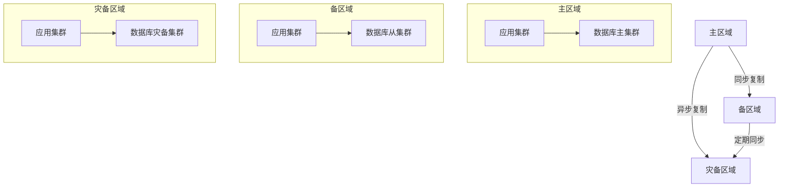

### 7.3 可扩展性需求（Scalability Requirements）

1. **水平扩展**
   - 应用服务无状态设计
   - 支持动态扩缩容
   - 按区域就近部署
   - 多集群联邦管理

2. **垂直扩展**
   - 支持资源动态调整
   - CPU/内存按需分配
   - 存储容量在线扩容
   - 网络带宽弹性伸缩

3. **数据扩展**
   - 分库分表自动化
   - 冷热数据分离
   - 多级缓存扩展
   - 数据自动归档

### 7.4 可维护性需求（Maintainability Requirements）

1. **监控告警**
```yaml
# 系统监控
monitoring:
  metrics:
    - CPU使用率 > 70%
    - 内存使用率 > 80%
    - 磁盘使用率 > 85%
    - 连接数 > 1000
  
  alerts:
    - 错误率 > 1%
    - 响应时间 > 1s
    - 队列堆积 > 1000
    - 服务不可用

# 业务监控
business:
  metrics:
    - 登录成功率
    - 验证码通过率
    - MFA完成率
    - 会话活跃度
```

2. **日志管理**
```yaml
# 日志级别
logging:
  levels:
    - ERROR: 系统错误
    - WARN: 业务警告
    - INFO: 操作信息
    - DEBUG: 调试信息

# 日志内容
content:
  fields:
    - timestamp: 时间戳
    - trace_id: 追踪ID
    - user_id: 用户ID
    - action: 操作
    - status: 状态
    - details: 详情
```

3. **运维工具**
   - 配置管理：Nacos
   - 服务治理：Spring Cloud
   - 容器编排：Kubernetes
   - 监控平台：Prometheus + Grafana

### 7.5 安全性需求（Security Requirements）

1. **访问控制**
   - 基于 RBAC 的权限模型
   - 细粒度的资源访问控制
   - 多因素认证（MFA）
   - IP 白名单机制

2. **数据安全**
   - 传输加密：TLS 1.3
   - 存储加密：AES-256
   - 密码加密：PBKDF2
   - 敏感数据脱敏

3. **安全防护**
   - WAF 防护
   - DDoS 防护
   - 入侵检测
   - 漏洞扫描

4. **审计日志**
   - 操作审计
   - 安全审计
   - 访问审计
   - 合规审计

### 7.6 国际化需求（Internationalization Requirements）

1. **多语言支持**
   - 支持 20+ 主流语言
   - Unicode 字符集支持
   - 本地化资源管理
   - 动态语言切换

2. **时区处理**
   - 多时区支持
   - 自动时区检测
   - 时间格式本地化
   - 夏令时处理

3. **本地化适配**
   - 货币格式
   - 数字格式
   - 日期格式
   - 文化习惯

### 7.7 合规性需求（Compliance Requirements）

1. **数据保护**
   - GDPR 合规
   - 数据本地化存储
   - 用户隐私保护
   - 数据跨境传输

2. **安全标准**
   - ISO 27001
   - SOC 2
   - PCI DSS
   - NIST

3. **审计要求**
   - 定期安全审计
   - 合规性检查
   - 漏洞评估
   - 风险评估 

## 8. 安全与合规（Security & Compliance）

### 8.1 安全架构（Security Architecture）

1. **安全分层**
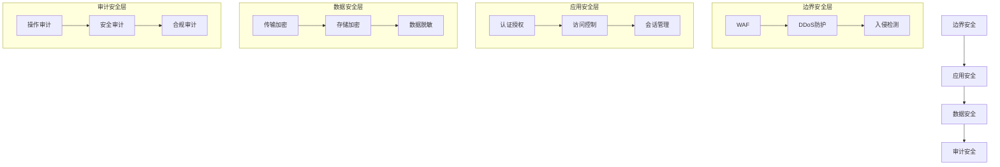

2. **认证机制**
```yaml
# 多因素认证
mfa:
  types:
    - TOTP (Google Authenticator)
    - SMS验证码
    - 邮件验证码
    - 生物识别
  
  policies:
    - 首次登录强制开启
    - 异地登录要求验证
    - 敏感操作二次认证
    - 定期重新认证

# 密码策略
password:
  rules:
    - 最小长度: 12位
    - 复杂度: 大小写+数字+特殊字符
    - 历史记录: 不可重复最近5次
    - 有效期: 90天强制更新
```

3. **访问控制**
```yaml
# RBAC模型
rbac:
  roles:
    - 系统管理员
    - 安全管理员
    - 审计管理员
    - 普通用户
  
  permissions:
    - 用户管理
    - 角色管理
    - 权限配置
    - 安全策略
    - 审计日志

# 资源访问控制
resources:
  types:
    - API接口
    - 菜单功能
    - 数据对象
    - 操作按钮
```

### 8.2 数据安全（Data Security）

1. **数据分类**
```yaml
# 数据分级
classification:
  level_1:
    name: 公开数据
    examples:
      - 产品信息
      - 公告通知
    controls:
      - 基本访问控制
  
  level_2:
    name: 内部数据
    examples:
      - 用户基本信息
      - 操作日志
    controls:
      - 身份认证
      - 访问审计
  
  level_3:
    name: 敏感数据
    examples:
      - 密码哈希
      - 安全答案
    controls:
      - 加密存储
      - 访问控制
      - 全程审计
```

2. **加密方案**
```yaml
# 传输加密
transport:
  protocol: TLS 1.3
  cipher_suites:
    - TLS_AES_256_GCM_SHA384
    - TLS_CHACHA20_POLY1305_SHA256
  key_exchange: ECDHE
  
# 存储加密
storage:
  algorithm: AES-256-GCM
  key_management: KMS
  rotation: 每90天
  
# 密码哈希
password:
  algorithm: PBKDF2WithHmacSHA256
  iterations: 310000
  salt_length: 32bytes
```

3. **数据脱敏**
```yaml
# 脱敏规则
masking:
  phone: 133****8888
  email: a***@example.com
  id_card: 110***********1234
  address: 北京市海淀区****
```

### 8.3 安全监控（Security Monitoring）

1. **实时监控**
```yaml
# 安全事件
security_events:
  high:
    - 暴力破解
    - 异常登录
    - 权限提升
    - 数据泄露
  
  medium:
    - 密码过期
    - 证书过期
    - 配置变更
    - 策略修改
  
  low:
    - 登录失败
    - 会话超时
    - 验证码错误

# 告警策略
alerts:
  channels:
    - 邮件
    - 短信
    - 企业微信
    - 电话
  
  rules:
    - 连续登录失败5次
    - 1分钟内100次请求
    - 敏感数据访问异常
    - 系统配置变更
```

2. **安全分析**
```yaml
# 威胁分析
threat_analysis:
  patterns:
    - 异常IP访问
    - 异常时间登录
    - 异常地理位置
    - 异常操作行为
  
  responses:
    - 自动封禁IP
    - 要求二次认证
    - 降低访问权限
    - 通知安全团队
```

### 8.4 合规要求（Compliance Requirements）

1. **GDPR合规**
```yaml
# 数据保护
gdpr:
  user_rights:
    - 知情权
    - 访问权
    - 更正权
    - 删除权
    - 数据可携权
  
  technical_measures:
    - 数据最小化
    - 存储限制
    - 访问控制
    - 数据加密
```

2. **ISO 27001**
```yaml
# 安全控制
iso27001:
  domains:
    - 安全策略
    - 组织安全
    - 人员安全
    - 资产管理
    - 访问控制
    - 密码学
    - 物理安全
    - 运营安全
    - 通信安全
    - 系统开发
    - 供应商管理
    - 事件管理
    - 业务连续性
    - 合规性
```

3. **安全合规检查清单**
```yaml
# 定期检查
compliance_checklist:
  daily:
    - 安全事件审查
    - 访问日志检查
    - 系统状态监控
  
  weekly:
    - 漏洞扫描
    - 配置审查
    - 权限复查
  
  monthly:
    - 安全策略评估
    - 风险评估
    - 合规性审计
  
  quarterly:
    - 渗透测试
    - 灾备演练
    - 应急预案更新
```

### 8.5 安全开发生命周期（Security Development Lifecycle）

1. **设计阶段**
   - 威胁建模
   - 安全架构评审
   - 加密方案设计
   - 访问控制设计

2. **开发阶段**
   - 安全编码规范
   - 代码安全审查
   - 依赖包安全检查
   - 单元测试覆盖

3. **测试阶段**
   - 安全功能测试
   - 渗透测试
   - 漏洞扫描
   - 性能安全测试

4. **部署阶段**
   - 安全配置核查
   - 环境隔离验证
   - 密钥管理检查
   - 应急预案演练 

## 9. 性能与扩展性（Performance & Scalability）

### 9.1 性能目标（Performance Targets）

1. **关键指标**
```yaml
# 响应时间
response_time:
  login: P95 < 500ms
  api: P95 < 300ms
  page_load: P95 < 2s
  database: P95 < 100ms

# 并发能力
concurrency:
  online_users: 8000万
  peak_qps: 100万
  single_node_qps: 10000
  db_connections: 2000/实例

# 吞吐量
throughput:
  daily_active_users: 5000万
  daily_login_requests: 2亿
  log_storage: 10TB/天
  data_growth: 50GB/天
```

2. **性能监控**
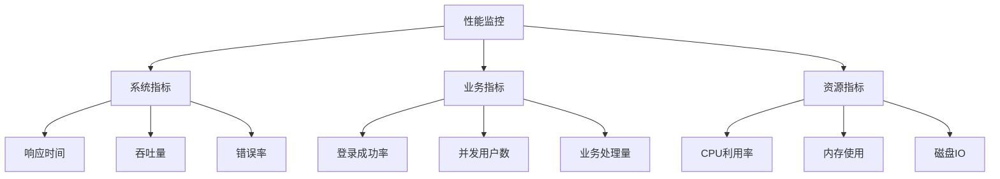

### 9.2 性能优化策略（Performance Optimization）

1. **应用层优化**
```yaml
# 代码优化
code_optimization:
  - 异步处理非关键路径
  - 批量处理数据操作
  - 本地缓存热点数据
  - 优化对象创建和销毁

# 缓存策略
caching:
  local_cache:
    - 验证码结果
    - 用户会话信息
    - 系统配置
  
  distributed_cache:
    - 用户信息
    - 权限数据
    - 登录态
```

2. **数据库优化**
```yaml
# 查询优化
query_optimization:
  - 索引优化
  - SQL调优
  - 分库分表
  - 读写分离

# 连接池配置
connection_pool:
  initial_size: 50
  min_idle: 50
  max_active: 2000
  max_wait: 1000ms
```

3. **网络优化**
```yaml
# CDN加速
cdn:
  - 静态资源
  - 图片资源
  - API就近接入

# 协议优化
protocol:
  - HTTP/2
  - TLS 1.3
  - 长连接
  - 压缩传输
```

### 9.3 扩展性设计（Scalability Design）

1. **架构扩展**
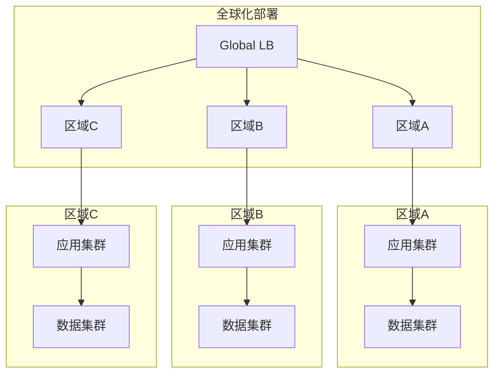

2. **服务扩展**
```yaml
# 微服务扩展
service_scaling:
  strategies:
    - 服务水平扩展
    - 功能垂直拆分
    - 数据分片
    - 多集群部署

# 自动扩缩容
auto_scaling:
  metrics:
    - CPU利用率 > 70%
    - 内存使用率 > 80%
    - 请求队列 > 1000
    - 响应时间 > 500ms
```

3. **数据扩展**
```yaml
# 分库分表
sharding:
  database:
    - 按租户ID分库
    - 物理分库数量: 32
    - 每库容量上限: 1TB
  
  table:
    - 用户表按ID范围分片
    - 日志表按时间分片
    - 每表分片数量: 256

# 数据同步
replication:
  - 主从复制
  - 双向同步
  - 跨区域复制
  - 数据一致性保证
```

### 9.4 性能测试（Performance Testing）

1. **测试类型**
```yaml
# 负载测试
load_test:
  scenarios:
    - 正常负载（50%容量）
    - 高峰负载（80%容量）
    - 极限负载（100%容量）
  
  metrics:
    - 响应时间
    - 吞吐量
    - 错误率
    - 资源使用率

# 压力测试
stress_test:
  scenarios:
    - 超出设计容量（120%）
    - 突发流量（150%）
    - 持续高负载（24小时）
  
  focus:
    - 系统稳定性
    - 资源泄露
    - 错误处理
    - 恢复能力
```

2. **测试工具**
```yaml
# 性能测试工具
tools:
  - JMeter: 功能测试和负载测试
  - K6: API性能测试
  - Gatling: 压力测试
  - Artillery: 实时性能测试

# 监控工具
monitoring:
  - Prometheus: 指标收集
  - Grafana: 可视化展示
  - ELK: 日志分析
  - Skywalking: 链路追踪
```

3. **测试环境**
```yaml
# 环境配置
environment:
  hardware:
    - 应用服务器: 32核128G
    - 数据库服务器: 64核256G
    - 缓存服务器: 16核64G
    - 负载均衡器: 16核32G
  
  network:
    - 内网带宽: 10Gbps
    - 外网带宽: 1Gbps
    - 网络延迟: < 1ms
```

### 9.5 容量规划（Capacity Planning）

1. **资源预估**
```yaml
# 计算资源
compute:
  application:
    - CPU: 1000核
    - 内存: 4TB
    - 实例数: 200
  
  database:
    - CPU: 2000核
    - 内存: 8TB
    - 存储: 100TB

# 网络资源
network:
  bandwidth:
    - 内网: 100Gbps
    - 外网: 10Gbps
    - CDN: 1Tbps
```

2. **增长预测**
```yaml
# 业务增长
growth:
  users:
    - 现有: 2亿
    - 年增长: 50%
    - 3年目标: 5亿
  
  traffic:
    - 现有: 100万QPS
    - 年增长: 100%
    - 3年目标: 400万QPS

# 资源扩展
expansion:
  compute: 每季度评估
  storage: 每月评估
  network: 每半年评估
``` 

## 10. 部署与运维（Deployment & Operations）

### 10.1 部署架构（Deployment Architecture）

1. **环境规划**
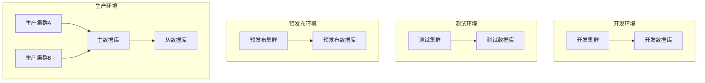

2. **部署拓扑**
```yaml
# 多区域部署
regions:
  asia_east:
    zones:
      - zone_a
      - zone_b
      - zone_c
    resources:
      - 应用集群
      - 数据库主集群
      - 缓存集群
  
  asia_southeast:
    zones:
      - zone_a
      - zone_b
    resources:
      - 应用集群
      - 数据库从集群
      - 缓存集群

  europe_central:
    zones:
      - zone_a
      - zone_b
    resources:
      - 应用集群
      - 数据库从集群
      - 缓存集群
```

3. **网络规划**
```yaml
# 网络架构
network:
  public_zone:
    - WAF
    - CDN
    - API Gateway
  
  app_zone:
    - 应用服务器
    - 缓存服务器
    - 消息队列
  
  data_zone:
    - 数据库服务器
    - 存储服务器
    - 备份服务器

# 安全域划分
security_zones:
  - DMZ区
  - 应用区
  - 数据区
  - 管理区
```

### 10.2 部署流程（Deployment Process）

1. **CI/CD流水线**


2. **发布策略**
```yaml
# 发布方式
deployment:
  strategies:
    - 蓝绿部署
    - 金丝雀发布
    - 灰度发布
    - 分批发布

# 发布流程
process:
  steps:
    - 预发布验证
    - 数据库变更
    - 服务发布
    - 配置更新
    - 健康检查
```

3. **回滚机制**
```yaml
# 回滚策略
rollback:
  triggers:
    - 服务异常
    - 性能劣化
    - 业务异常
    - 安全风险
  
  methods:
    - 版本回滚
    - 配置回滚
    - 数据回滚
```

### 10.3 运维管理（Operations Management）

1. **监控体系**
```yaml
# 监控维度
monitoring:
  infrastructure:
    - 服务器监控
    - 网络监控
    - 存储监控
  
  application:
    - 服务监控
    - 接口监控
    - 性能监控
  
  business:
    - 业务监控
    - 用户监控
    - 安全监控

# 告警策略
alerting:
  levels:
    p0:
      - 服务不可用
      - 数据丢失
      - 安全事件
    p1:
      - 服务降级
      - 性能下降
      - 容量预警
    p2:
      - 非核心故障
      - 功能告警
      - 资源告警
```

2. **日志管理**
```yaml
# 日志架构
logging:
  collection:
    - Filebeat: 日志采集
    - Fluentd: 日志转发
    - Kafka: 日志队列
  
  storage:
    - Elasticsearch: 日志存储
    - S3: 日志归档
  
  visualization:
    - Kibana: 日志查询
    - Grafana: 监控面板

# 日志策略
retention:
  hot_data: 7天
  warm_data: 30天
  cold_data: 180天
```

3. **变更管理**
```yaml
# 变更类型
change_types:
  - 常规变更
  - 紧急变更
  - 标准变更
  - 重大变更

# 变更流程
change_process:
  - 变更申请
  - 风险评估
  - 变更评审
  - 实施计划
  - 实施验证
  - 结果确认
```

### 10.4 运维自动化（Operations Automation）

1. **自动化工具**
```yaml
# 自动化范围
automation:
  deployment:
    - Jenkins: CI/CD
    - ArgoCD: GitOps
    - Ansible: 配置管理
  
  operation:
    - Terraform: 基础设施
    - Puppet: 配置管理
    - Chef: 应用部署
  
  monitoring:
    - Prometheus: 监控
    - Grafana: 可视化
    - Alertmanager: 告警
```

2. **自动化脚本**
```yaml
# 运维脚本
scripts:
  deployment:
    - 服务部署脚本
    - 配置更新脚本
    - 数据迁移脚本
  
  maintenance:
    - 日志清理脚本
    - 备份恢复脚本
    - 健康检查脚本
  
  emergency:
    - 故障恢复脚本
    - 服务重启脚本
    - 数据修复脚本
```

### 10.5 灾备方案（Disaster Recovery）

1. **灾备策略**
```yaml
# 灾备方案
dr_strategy:
  - 同城双活
  - 异地灾备
  - 多活部署
  - 数据备份

# 恢复目标
recovery_objectives:
  rto: 30分钟
  rpo: 1分钟
  mto: 4小时
```

2. **应急预案**
```yaml
# 故障等级
incident_levels:
  level_1:
    - 全局性故障
    - 核心服务中断
    - 数据丢失
  
  level_2:
    - 局部性故障
    - 服务性能下降
    - 功能部分可用
  
  level_3:
    - 单点故障
    - 非核心功能影响
    - 可临时替代

# 应急响应
emergency_response:
  - 故障发现
  - 初步评估
  - 应急处理
  - 原因分析
  - 问题解决
  - 复盘总结
```

### 10.6 运维安全（Operations Security）

1. **访问控制**
```yaml
# 权限管理
access_control:
  roles:
    - 系统管理员
    - 安全管理员
    - 运维工程师
    - 开发工程师
  
  permissions:
    - 服务器访问
    - 数据库访问
    - 监控访问
    - 日志访问
```

2. **操作审计**
```yaml
# 审计范围
audit:
  operations:
    - 登录操作
    - 配置变更
    - 权限变更
    - 数据操作
  
  records:
    - 操作人
    - 操作时间
    - 操作内容
    - 操作结果
``` 

## 11. 监控与日志（Monitoring & Logging）

### 11.1 监控系统（Monitoring System）

1. **监控架构**
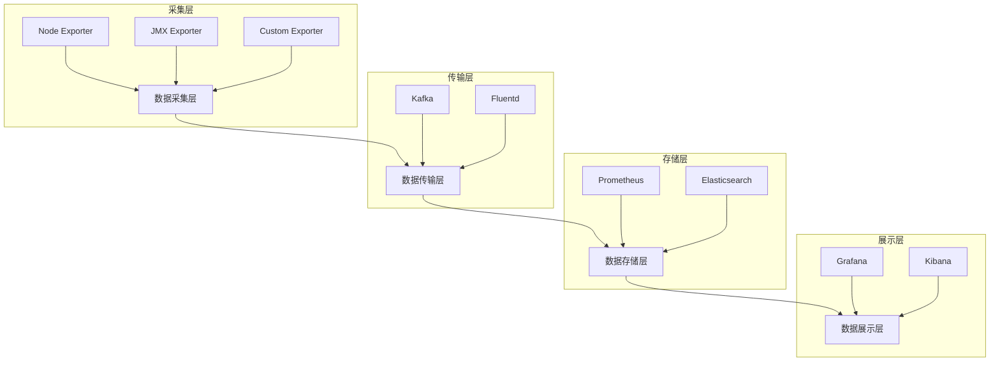

2. **监控指标**
```yaml
# 系统指标
system_metrics:
  host:
    - CPU使用率
    - 内存使用率
    - 磁盘使用率
    - 网络流量
  
  container:
    - 容器CPU使用率
    - 容器内存使用率
    - 容器网络IO
    - 容器状态

# 应用指标
application_metrics:
  jvm:
    - 堆内存使用
    - GC情况
    - 线程数
    - 类加载
  
  business:
    - QPS
    - 响应时间
    - 错误率
    - 并发数

# 业务指标
business_metrics:
  login:
    - 登录成功率
    - 登录响应时间
    - 验证码通过率
    - 会话数量
  
  security:
    - 异常登录次数
    - 密码错误次数
    - MFA验证率
    - 安全事件数
```

3. **告警配置**
```yaml
# 告警规则
alert_rules:
  critical:
    - name: 服务不可用
      condition: up == 0
      duration: 1m
    
    - name: 高错误率
      condition: error_rate > 10%
      duration: 5m
    
    - name: 响应时间过高
      condition: latency_p95 > 1s
      duration: 5m

# 告警通道
alert_channels:
  - type: 邮件
    recipients: [ops@dove.com]
    
  - type: 短信
    recipients: [1381234xxxx]
    
  - type: 企业微信
    webhook: https://qyapi.weixin.qq.com/...
```

### 11.2 日志系统（Logging System）

1. **日志架构**
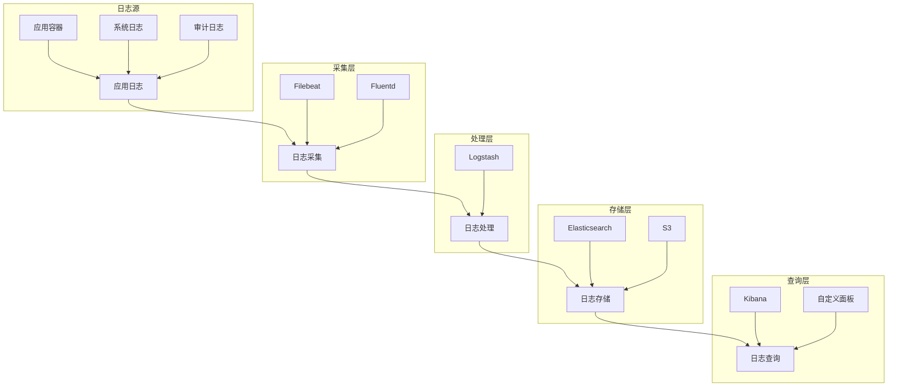

2. **日志规范**
```yaml
# 日志格式
log_format:
  common_fields:
    - timestamp: 时间戳
    - trace_id: 追踪ID
    - span_id: 跨度ID
    - level: 日志级别
    - service: 服务名称
    - instance: 实例标识
  
  business_fields:
    - user_id: 用户ID
    - tenant_id: 租户ID
    - action: 操作类型
    - result: 操作结果
    - details: 详细信息

# 日志级别
log_levels:
  - ERROR: 错误日志
  - WARN: 警告日志
  - INFO: 信息日志
  - DEBUG: 调试日志
```

3. **日志存储**
```yaml
# 存储策略
storage_policy:
  hot_storage:
    type: Elasticsearch
    retention: 7天
    shards: 5
    replicas: 1
  
  warm_storage:
    type: Elasticsearch
    retention: 30天
    shards: 3
    replicas: 1
  
  cold_storage:
    type: S3
    retention: 180天
    compression: true

# 索引策略
index_strategy:
  pattern: dove-logs-{service}-{yyyy.MM.dd}
  rollover:
    max_size: 50GB
    max_age: 1d
  lifecycle:
    hot_phase: 7d
    warm_phase: 30d
    delete_phase: 180d
```

### 11.3 链路追踪（Tracing）

1. **追踪架构**
```yaml
# 追踪组件
tracing:
  collector:
    - OpenTelemetry Collector
    - Jaeger Collector
  
  storage:
    - Elasticsearch
    - Cassandra
  
  visualization:
    - Jaeger UI
    - Zipkin UI

# 采样策略
sampling:
  type: 概率采样
  rate: 10%
  rules:
    - 错误请求: 100%
    - 慢请求: 100%
    - 关键业务: 100%
```

2. **追踪数据**
```yaml
# 链路数据
trace_data:
  basic:
    - trace_id: 追踪标识
    - span_id: 跨度标识
    - parent_id: 父跨度标识
    - service: 服务名称
  
  timing:
    - start_time: 开始时间
    - end_time: 结束时间
    - duration: 持续时间
  
  context:
    - user_id: 用户标识
    - request_id: 请求标识
    - session_id: 会话标识
```

### 11.4 监控大盘（Dashboards）

1. **业务监控面板**
```yaml
# 登录监控
login_dashboard:
  panels:
    - 登录量趋势图
    - 登录成功率
    - 登录响应时间
    - 地理分布图
  
  metrics:
    - 总登录次数
    - 成功登录数
    - 失败登录数
    - 平均响应时间

# 安全监控
security_dashboard:
  panels:
    - 异常登录分布
    - 密码错误趋势
    - MFA验证统计
    - 安全事件列表
  
  metrics:
    - 异常登录数
    - 密码错误率
    - MFA成功率
    - 安全事件数
```

2. **系统监控面板**
```yaml
# 资源监控
resource_dashboard:
  panels:
    - CPU使用率
    - 内存使用率
    - 磁盘使用率
    - 网络流量
  
  alerts:
    - CPU > 80%
    - 内存 > 85%
    - 磁盘 > 90%
    - 网络延迟 > 100ms

# 服务监控
service_dashboard:
  panels:
    - 服务状态
    - QPS趋势
    - 错误率统计
    - 响应时间分布
  
  alerts:
    - 服务不可用
    - QPS > 阈值
    - 错误率 > 1%
    - P95 > 500ms
```

### 11.5 运维报表（Operations Reports）

1. **日常报表**
```yaml
# 每日报表
daily_report:
  metrics:
    - 系统可用性
    - 平均响应时间
    - 登录成功率
    - 安全事件数
  
  statistics:
    - 峰值QPS
    - 活跃用户数
    - 资源使用率
    - 告警统计

# 周报月报
periodic_report:
  metrics:
    - 系统稳定性
    - 性能趋势
    - 容量分析
    - 问题统计
  
  analysis:
    - 性能瓶颈
    - 容量预测
    - 优化建议
    - 风险评估
```

2. **异常报表**
```yaml
# 故障报告
incident_report:
  content:
    - 故障现象
    - 影响范围
    - 原因分析
    - 解决方案
    - 改进措施
  
  statistics:
    - 故障等级
    - 故障时长
    - 恢复时间
    - 影响用户数
``` 

## 12. 测试策略（Testing Strategy）

### 12.1 测试范围（Testing Scope）

1. **测试类型**
```mermaid
graph TD
    A[测试策略] --> B[功能测试]
    A --> C[非功能测试]
    A --> D[安全测试]
    
    B --> B1[单元测试]
    B --> B2[集成测试]
    B --> B3[系统测试]
    B --> B4[验收测试]
    
    C --> C1[性能测试]
    C --> C2[可靠性测试]
    C --> C3[兼容性测试]
    
    D --> D1[安全扫描]
    D --> D2[渗透测试]
    D --> D3[安全审计]
```

2. **测试矩阵**
```yaml
# 功能测试
functional_testing:
  authentication:
    - 用户名密码登录
    - SSO登录
    - MFA验证
    - 记住登录状态
  
  authorization:
    - 权限验证
    - 角色管理
    - 访问控制
    - 会话管理
  
  security:
    - 密码策略
    - 登录保护
    - 安全审计
    - 风险控制

# 非功能测试
non_functional_testing:
  performance:
    - 响应时间
    - 并发能力
    - 资源使用
    - 系统容量
  
  reliability:
    - 高可用性
    - 故障恢复
    - 数据一致性
    - 系统稳定性
```

### 12.2 测试环境（Test Environment）

1. **环境规划**
```yaml
# 测试环境
test_environments:
  development:
    purpose: 开发自测
    scale: 单机部署
    data: 模拟数据
  
  integration:
    purpose: 集成测试
    scale: 小规模集群
    data: 测试数据集
  
  staging:
    purpose: 预发布测试
    scale: 生产规模
    data: 生产数据子集
  
  production:
    purpose: 生产验证
    scale: 完整规模
    data: 真实数据
```

2. **环境配置**
```yaml
# 硬件配置
hardware:
  application:
    cpu: 16核
    memory: 64GB
    disk: 500GB
  
  database:
    cpu: 32核
    memory: 128GB
    disk: 2TB
  
  cache:
    cpu: 8核
    memory: 32GB
    disk: 100GB

# 网络配置
network:
  bandwidth: 1Gbps
  latency: < 1ms
  isolation: VLAN隔离
```

### 12.3 测试用例（Test Cases）

1. **功能测试用例**
```yaml
# 登录测试
login_test_cases:
  normal_scenarios:
    - 正确用户名密码登录
    - 记住密码登录
    - SSO登录
    - MFA验证登录
  
  exception_scenarios:
    - 错误密码登录
    - 账号锁定
    - 验证码错误
    - 会话超时

# 安全测试用例
security_test_cases:
  authentication:
    - 密码强度校验
    - 登录失败次数限制
    - IP限制验证
    - 设备指纹验证
  
  authorization:
    - 越权访问测试
    - 角色权限验证
    - 敏感操作校验
    - 会话劫持测试
```

2. **性能测试用例**
```yaml
# 性能测试
performance_test_cases:
  load_testing:
    - 标准负载测试
    - 峰值负载测试
    - 持续负载测试
    - 突发负载测试
  
  stress_testing:
    - 超限压力测试
    - 长期压力测试
    - 资源耗尽测试
    - 故障恢复测试
```

### 12.4 自动化测试（Test Automation）

1. **自动化框架**
```yaml
# 测试框架
test_frameworks:
  unit_testing:
    - JUnit 5
    - Mockito
    - PowerMock
    - AssertJ
  
  api_testing:
    - REST Assured
    - Postman
    - JMeter
    - Karate
  
  ui_testing:
    - Selenium
    - Cypress
    - Playwright
    - TestCafe
```

2. **持续测试**
```yaml
# CI/CD集成
ci_integration:
  triggers:
    - 代码提交
    - 合并请求
    - 定时任务
    - 手动触发
  
  pipelines:
    - 单元测试
    - 集成测试
    - 性能测试
    - 安全测试

# 测试报告
test_reports:
  coverage:
    - 代码覆盖率
    - 用例覆盖率
    - 接口覆盖率
    - 功能覆盖率
  
  quality:
    - 代码质量
    - 测试通过率
    - 缺陷密度
    - 性能指标
```

### 12.5 测试数据（Test Data）

1. **数据管理**
```yaml
# 测试数据
test_data:
  types:
    - 模拟数据
    - 真实数据子集
    - 边界数据
    - 异常数据
  
  generation:
    - 随机生成
    - 数据抽取
    - 规则构造
    - 组合生成

# 数据维护
data_maintenance:
  refresh:
    - 定期更新
    - 按需刷新
    - 自动清理
    - 版本控制
```

2. **数据安全**
```yaml
# 数据保护
data_protection:
  sensitive_data:
    - 脱敏处理
    - 访问控制
    - 加密存储
    - 安全传输
  
  compliance:
    - GDPR合规
    - 数据分级
    - 审计跟踪
    - 销毁机制
```

### 12.6 缺陷管理（Defect Management）

1. **缺陷流程**
```yaml
# 缺陷生命周期
defect_lifecycle:
  states:
    - 新建
    - 分配
    - 修复中
    - 验证中
    - 关闭
  
  priorities:
    - P0: 阻塞问题
    - P1: 严重问题
    - P2: 普通问题
    - P3: 轻微问题

# 缺陷跟踪
defect_tracking:
  metrics:
    - 缺陷数量
    - 修复率
    - 重开率
    - 遗留率
  
  analysis:
    - 根因分析
    - 趋势分析
    - 分布分析
    - 影响评估
```

2. **质量度量**
```yaml
# 质量指标
quality_metrics:
  reliability:
    - MTBF: 平均故障间隔时间
    - MTTR: 平均修复时间
    - 可用性: 系统可用率
    - 稳定性: 系统稳定性
  
  performance:
    - 响应时间
    - 吞吐量
    - 并发数
    - 资源利用率
``` 

## 13. 风险与应对（Risks & Mitigations）

### 13.1 风险评估（Risk Assessment）

1. **风险矩阵**
```mermaid
graph TD
    subgraph 风险等级
    H[高风险]
    M[中风险]
    L[低风险]
    end
    
    subgraph 影响范围
    B[业务风险]
    T[技术风险]
    S[安全风险]
    O[运营风险]
    end
    
    H --> B
    H --> T
    M --> S
    M --> O
```

2. **风险清单**
```yaml
# 技术风险
technical_risks:
  performance:
    risk: 系统无法支撑高并发
    impact: 高
    probability: 中
    level: P0
    
  scalability:
    risk: 扩展性无法满足增长需求
    impact: 高
    probability: 中
    level: P1
    
  reliability:
    risk: 系统稳定性不足
    impact: 高
    probability: 低
    level: P1

# 安全风险
security_risks:
  authentication:
    risk: 身份认证被绕过
    impact: 高
    probability: 低
    level: P0
    
  data_leak:
    risk: 敏感数据泄露
    impact: 高
    probability: 低
    level: P0
    
  attack:
    risk: 遭受外部攻击
    impact: 高
    probability: 中
    level: P1

# 运营风险
operational_risks:
  maintenance:
    risk: 运维复杂度高
    impact: 中
    probability: 高
    level: P1
    
  monitoring:
    risk: 监控覆盖不全
    impact: 中
    probability: 中
    level: P2
    
  cost:
    risk: 运营成本超预期
    impact: 中
    probability: 中
    level: P2
```

### 13.2 应对策略（Mitigation Strategies）

1. **技术风险应对**
```yaml
# 性能风险应对
performance_mitigation:
  strategies:
    - 分层缓存策略
    - 异步处理机制
    - 限流熔断机制
    - 资源弹性扩展
  
  monitoring:
    - 性能指标监控
    - 容量预警
    - 瓶颈分析
    - 性能优化

# 可靠性风险应对
reliability_mitigation:
  strategies:
    - 多活架构
    - 故障隔离
    - 服务降级
    - 灾备切换
  
  measures:
    - 可用性监控
    - 故障演练
    - 应急预案
    - 自动恢复
```

2. **安全风险应对**
```yaml
# 安全防护
security_mitigation:
  authentication:
    - 多因素认证
    - 动态令牌
    - 生物识别
    - 行为分析
  
  data_protection:
    - 传输加密
    - 存储加密
    - 访问控制
    - 数据脱敏
  
  attack_prevention:
    - WAF防护
    - DDoS防护
    - 入侵检测
    - 漏洞扫描

# 合规保障
compliance_mitigation:
  measures:
    - 安全审计
    - 合规检查
    - 隐私保护
    - 数据治理
```

3. **运营风险应对**
```yaml
# 运维保障
operation_mitigation:
  automation:
    - 自动化部署
    - 自动化测试
    - 自动化运维
    - 自动化监控
  
  optimization:
    - 流程优化
    - 工具改进
    - 成本控制
    - 效率提升

# 应急响应
emergency_response:
  process:
    - 问题发现
    - 快速响应
    - 根因分析
    - 解决方案
    - 经验总结
  
  team:
    - 应急小组
    - 技术支持
    - 运维团队
    - 管理层
```

### 13.3 风险跟踪（Risk Tracking）

1. **跟踪机制**
```yaml
# 风险监控
risk_monitoring:
  metrics:
    - 风险发生频率
    - 影响范围
    - 解决时间
    - 损失评估
  
  reporting:
    - 日常报告
    - 周期评估
    - 趋势分析
    - 改进建议

# 持续改进
continuous_improvement:
  process:
    - 风险识别
    - 风险评估
    - 方案制定
    - 效果验证
    - 经验总结
  
  feedback:
    - 问题反馈
    - 方案优化
    - 流程改进
    - 预案更新
```

2. **应急预案**
```yaml
# 应急处理
emergency_plan:
  levels:
    p0:
      description: 严重事故
      response_time: 15分钟
      notification: 所有相关方
      
    p1:
      description: 重要事故
      response_time: 30分钟
      notification: 主要负责人
      
    p2:
      description: 一般事故
      response_time: 2小时
      notification: 直接负责人

# 恢复流程
recovery_process:
  steps:
    - 问题确认
    - 影响评估
    - 方案制定
    - 实施恢复
    - 效果验证
    - 复盘总结
```

### 13.4 经验教训（Lessons Learned）

1. **最佳实践**
```yaml
# 技术实践
technical_practices:
  architecture:
    - 合理的服务拆分
    - 正确的技术选型
    - 完善的监控体系
    - 有效的性能优化
  
  development:
    - 规范的编码标准
    - 完整的测试覆盖
    - 自动化的部署流程
    - 有效的代码审查

# 管理实践
management_practices:
  process:
    - 敏捷开发流程
    - 持续集成部署
    - 有效的沟通机制
    - 及时的风险响应
  
  team:
    - 技能培训
    - 知识共享
    - 团队协作
    - 责任明确
```

2. **改进建议**
```yaml
# 短期改进
short_term:
  technical:
    - 性能优化
    - 监控完善
    - 自动化提升
    - 文档更新
  
  process:
    - 流程优化
    - 工具改进
    - 培训强化
    - 反馈机制

# 长期规划
long_term:
  strategic:
    - 架构演进
    - 技术创新
    - 平台化建设
    - 智能化运维
  
  organizational:
    - 团队建设
    - 文化塑造
    - 能力提升
    - 管理优化
```

## 14. 项目排期与资源（Timeline & Resource Estimation）

### 14.1 项目里程碑（Project Milestones）

1. **总体进度**
```mermaid
gantt
    title Dove登录系统项目进度
    dateFormat  YYYY-MM-DD
    section 规划阶段
    需求分析    :2024-01-01, 15d
    架构设计    :2024-01-16, 15d
    技术方案    :2024-02-01, 15d
    
    section 开发阶段
    核心功能    :2024-02-16, 30d
    安全功能    :2024-03-16, 20d
    运维功能    :2024-04-05, 15d
    
    section 测试阶段
    单元测试    :2024-04-20, 10d
    集成测试    :2024-04-30, 15d
    性能测试    :2024-05-15, 15d
    
    section 发布阶段
    预发布     :2024-06-01, 10d
    灰度发布    :2024-06-11, 10d
    全量发布    :2024-06-21, 5d
```

2. **阶段目标**
```yaml
# 规划阶段
planning_phase:
  duration: 45天
  deliverables:
    - PRD文档
    - 架构设计文档
    - 技术方案文档
    - 项目计划书
  
  milestones:
    - 需求评审通过
    - 架构评审通过
    - 技术方案确认
    - 计划书批准

# 开发阶段
development_phase:
  duration: 65天
  deliverables:
    - 核心登录功能
    - 安全防护功能
    - 运维管理功能
    - 单元测试代码
  
  milestones:
    - 核心功能完成
    - 安全功能完成
    - 运维功能完成
    - 代码评审通过

# 测试阶段
testing_phase:
  duration: 40天
  deliverables:
    - 测试计划
    - 测试用例
    - 测试报告
    - 性能测试报告
  
  milestones:
    - 功能测试通过
    - 性能测试达标
    - 安全测试通过
    - 验收测试通过

# 发布阶段
release_phase:
  duration: 25天
  deliverables:
    - 部署文档
    - 运维手册
    - 用户手册
    - 培训材料
  
  milestones:
    - 预发布完成
    - 灰度发布完成
    - 全量发布完成
    - 项目验收通过
```

### 14.2 资源规划（Resource Planning）

1. **人力资源**
```yaml
# 团队组织
team_structure:
  management:
    - 项目经理: 1人
    - 技术负责人: 1人
    - 产品经理: 1人
  
  development:
    - 架构师: 2人
    - 后端开发: 8人
    - 前端开发: 4人
    - DevOps: 3人
  
  quality:
    - 测试负责人: 1人
    - 功能测试: 4人
    - 性能测试: 2人
    - 安全测试: 2人
  
  operation:
    - 运维负责人: 1人
    - 运维工程师: 4人
    - 安全工程师: 2人
    - DBA: 2人

# 技能要求
skill_requirements:
  backend:
    - Java开发: 5年+
    - Spring Cloud: 3年+
    - 微服务架构: 3年+
    - 数据库设计: 3年+
  
  frontend:
    - React开发: 3年+
    - TypeScript: 2年+
    - 前端工程化: 2年+
    - UI/UX设计: 2年+
  
  devops:
    - Kubernetes: 3年+
    - CI/CD: 3年+
    - 监控运维: 3年+
    - 自动化运维: 2年+
```

2. **硬件资源**
```yaml
# 开发环境
development_environment:
  compute:
    - 应用服务器: 4台
    - 开发机器: 20台
    - 测试服务器: 6台
  
  storage:
    - 数据库服务器: 2台
    - 存储服务器: 2台
    - 备份服务器: 2台

# 生产环境
production_environment:
  compute:
    - 应用服务器: 20台
    - 负载均衡器: 4台
    - 缓存服务器: 8台
  
  storage:
    - 主数据库: 4台
    - 从数据库: 8台
    - 存储服务器: 6台
    - 备份服务器: 4台
```

3. **软件资源**
```yaml
# 开发工具
development_tools:
  ide:
    - IntelliJ IDEA: 企业版
    - VS Code: 企业版
    - Git: 企业版
  
  collaboration:
    - JIRA: 项目管理
    - Confluence: 文档管理
    - GitLab: 代码管理
    - Jenkins: CI/CD

# 运维工具
operation_tools:
  monitoring:
    - Prometheus: 监控系统
    - Grafana: 可视化
    - ELK: 日志分析
    - Skywalking: 链路追踪
  
  security:
    - WAF: 应用防火墙
    - IDS/IPS: 入侵检测
    - Scanner: 漏洞扫描
    - SIEM: 安全管理
```

### 14.3 成本估算（Cost Estimation）

1. **人力成本**
```yaml
# 人员成本
personnel_cost:
  development:
    - 架构师: 50万/年/人
    - 高级开发: 40万/年/人
    - 中级开发: 30万/年/人
    - 初级开发: 20万/年/人
  
  operation:
    - 运维专家: 45万/年/人
    - 安全专家: 45万/年/人
    - DBA: 40万/年/人
    - 运维工程师: 30万/年/人

# 外部服务
external_service:
  cloud:
    - 云服务器: 100万/年
    - CDN: 50万/年
    - 对象存储: 30万/年
  
  security:
    - 证书服务: 10万/年
    - 安全服务: 20万/年
    - 渗透测试: 15万/年
```

2. **硬件成本**
```yaml
# 基础设施
infrastructure_cost:
  hardware:
    - 服务器: 200万
    - 网络设备: 100万
    - 安全设备: 80万
  
  software:
    - 操作系统: 50万
    - 数据库: 100万
    - 中间件: 80万
    - 监控工具: 50万
```

### 14.4 风险预算（Risk Budget）

1. **应急预算**
```yaml
# 风险储备
risk_reserve:
  technical:
    - 性能优化: 50万
    - 安全加固: 30万
    - 架构调整: 50万
  
  business:
    - 需求变更: 100万
    - 进度延期: 50万
    - 人员流失: 50万

# 质量保证
quality_assurance:
  testing:
    - 第三方测试: 30万
    - 性能测试: 20万
    - 安全测试: 20万
  
  consulting:
    - 技术咨询: 30万
    - 安全咨询: 20万
    - 法律咨询: 20万
```

### 14.5 项目管理（Project Management）

1. **管理流程**
```yaml
# 项目管理
project_management:
  methodology:
    - 敏捷开发
    - Scrum流程
    - 持续集成
    - 持续部署
  
  tracking:
    - 每日站会
    - 周进度review
    - 月度总结
    - 里程碑检查

# 质量管理
quality_management:
  metrics:
    - 代码质量
    - 测试覆盖率
    - 缺陷密度
    - 性能指标
  
  reviews:
    - 代码评审
    - 架构评审
    - 安全评审
    - 发布评审
```

2. **沟通计划**
```yaml
# 内部沟通
internal_communication:
  daily:
    - 晨会: 15分钟
    - 技术研讨: 1小时
    - 问题同步: 随时
  
  weekly:
    - 进度汇报: 1小时
    - 架构研讨: 2小时
    - 评审会议: 2小时

# 外部沟通
external_communication:
  stakeholders:
    - 产品评审: 每周
    - 进度汇报: 每周
    - 管理层汇报: 每月
  
  vendors:
    - 供应商对接: 每周
    - 技术支持: 随时
    - 服务评估: 每月
```

## 15. 附录（Appendices）

### 15.1 术语表（Glossary）

```yaml
# 业务术语
business_terms:
  SSO:
    name: Single Sign-On
    description: 单点登录，用户只需登录一次就可以访问所有相关系统
    
  MFA:
    name: Multi-Factor Authentication
    description: 多因素认证，通过两个或以上的认证方式验证用户身份
    
  RBAC:
    name: Role-Based Access Control
    description: 基于角色的访问控制，通过角色来管理用户权限

# 技术术语
technical_terms:
  JWT:
    name: JSON Web Token
    description: 基于JSON的开放标准，用于在网络应用间传递信息
    
  OAuth:
    name: Open Authorization
    description: 开放授权标准，允许用户授权第三方应用访问其资源
    
  SAML:
    name: Security Assertion Markup Language
    description: 安全断言标记语言，用于在身份提供者和服务提供者之间交换认证和授权数据```

### 15.2 参考文档（References）

1. **标准规范**
```yaml
# 技术标准
technical_standards:
  authentication:
    - OAuth 2.0规范: https://oauth.net/2/
    - OpenID Connect: https://openid.net/connect/
    - SAML 2.0: http://docs.oasis-open.org/security/saml/v2.0/
  
  security:
    - OWASP安全指南: https://owasp.org/
    - NIST密码标准: https://nvlpubs.nist.gov/
    - ISO 27001: https://www.iso.org/isoiec-27001-information-security.html

# 最佳实践
best_practices:
  development:
    - Spring Cloud文档: https://spring.io/projects/spring-cloud
    - React最佳实践: https://reactjs.org/docs/best-practices.html
    - 微服务设计模式: https://microservices.io/patterns/
  
  operations:
    - Kubernetes文档: https://kubernetes.io/docs/
    - DevOps实践指南: https://devops.com/
    - SRE手册: https://sre.google/sre-book/table-of-contents/
```

2. **内部文档**
```yaml
# 相关文档
related_documents:
  requirements:
    - BRD: docs/brd/BRD_Dove_Login_System.md
    - PRD: docs/prd/PRD_Dove_Login_System.md
    - 架构文档: docs/architecture/Architecture.md
  
  guidelines:
    - 开发规范: docs/guidelines/Development_Guidelines.md
    - 安全规范: docs/guidelines/Security_Guidelines.md
    - API规范: docs/guidelines/API_Guidelines.md
```

### 15.3 工具与模板（Tools & Templates）

1. **开发模板**
```yaml
# 代码模板
code_templates:
  backend:
    - 微服务模板: templates/microservice/
    - 单元测试模板: templates/unit-test/
    - API文档模板: templates/api-doc/
  
  frontend:
    - 组件模板: templates/component/
    - 页面模板: templates/page/
    - 状态管理模板: templates/state/

# 文档模板
document_templates:
  design:
    - 概要设计模板: templates/design/hld/
    - 详细设计模板: templates/design/lld/
    - 评审文档模板: templates/design/review/
  
  operation:
    - 运维手册模板: templates/ops/manual/
    - 应急预案模板: templates/ops/emergency/
    - 变更申请模板: templates/ops/change/
```

2. **工具配置**
```yaml
# 开发工具配置
development_configs:
  ide:
    - IntelliJ IDEA配置: configs/idea/
    - VS Code配置: configs/vscode/
    - Git配置: configs/git/
  
  quality:
    - CheckStyle配置: configs/checkstyle/
    - ESLint配置: configs/eslint/
    - SonarQube配置: configs/sonarqube/

# 部署工具配置
deployment_configs:
  kubernetes:
    - 应用部署模板: configs/k8s/apps/
    - 服务配置模板: configs/k8s/services/
    - 监控配置模板: configs/k8s/monitoring/
  
  cicd:
    - Jenkins Pipeline: configs/jenkins/
    - GitLab CI: configs/gitlab-ci/
    - ArgoCD配置: configs/argocd/
```

### 15.4 变更记录（Change Log）

```yaml
# 文档变更记录
document_changes:
  v1.0:
    date: 2024-03-21
    author: Dove技术架构团队
    changes:
      - 初始版本创建
      - 完成所有核心章节
      - 评审通过并发布
  
  v1.1:
    date: 2024-03-28
    author: Dove技术架构团队
    changes:
      - 更新性能指标
      - 补充安全策略
      - 完善部署方案
  
  v1.2:
    date: 2024-04-05
    author: Dove技术架构团队
    changes:
      - 优化架构设计
      - 更新技术选型
      - 补充测试策略

# 评审记录
review_history:
  architecture_review:
    date: 2024-03-15
    reviewers:
      - 架构委员会
      - 技术负责人
      - 安全专家
    results:
      - 通过架构设计
      - 提出优化建议
      - 确认技术路线
  
  security_review:
    date: 2024-03-18
    reviewers:
      - 安全团队
      - 合规团队
      - 风控团队
    results:
      - 通过安全评审
      - 补充安全措施
      - 确认合规要求
```

### 15.5 联系信息（Contact Information）

```yaml
# 项目团队
project_team:
  management:
    project_manager:
      name: {项目经理}
      email: pm@dove.com
      phone: 138xxxxxxxx
    
    tech_lead:
      name: {技术负责人}
      email: tech.lead@dove.com
      phone: 139xxxxxxxx
  
  core_members:
    architect:
      name: {架构师}
      email: architect@dove.com
      phone: 137xxxxxxxx
    
    security_expert:
      name: {安全专家}
      email: security@dove.com
      phone: 136xxxxxxxx

# 支持团队
support_team:
  operations:
    name: 运维团队
    email: ops@dove.com
    phone: 400-xxx-xxxx
  
  security:
    name: 安全团队
    email: security@dove.com
    phone: 400-xxx-xxxx
  
  quality:
    name: 测试团队
    email: qa@dove.com
    phone: 400-xxx-xxxx
```

---

**版权所有 © 2024 Dove Team**  
本文档为内部机密文档，未经授权严禁对外分享
